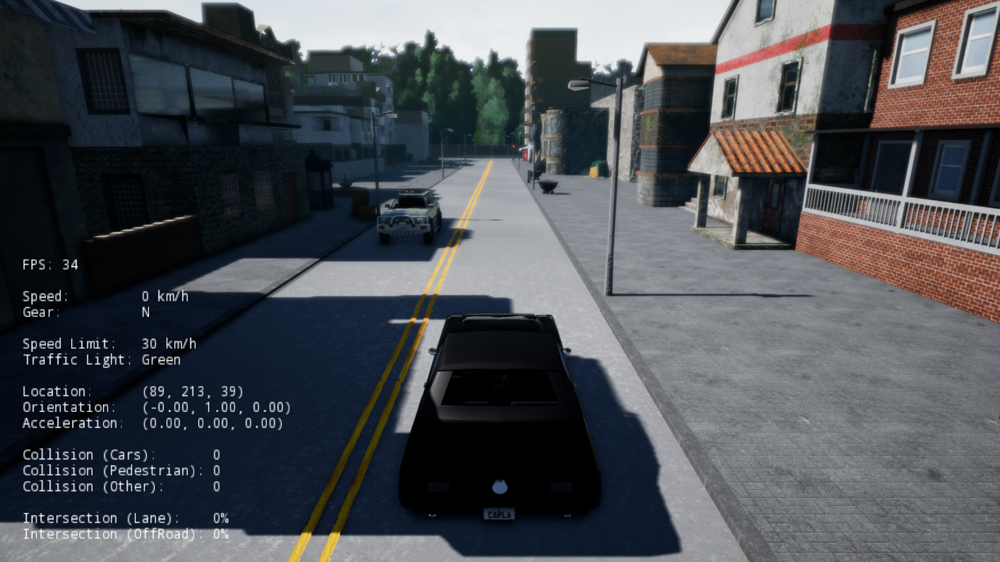

<h1>Running the CARLA simulator in standalone mode</h1>

Inside the downloaded package you should find a shell script called
`CarlaUE4.sh`, this script launches the CARLA simulator.

!!! tip
    Although this tutorial focuses on Linux, all the commands work as well in
    Windows. Just replace all the occurrences of `./CarlaUE4.sh` by
    `CarlaUE4.exe`.

Run this script without arguments to launch CARLA simulator in standalone mode
with default settings

    $ ./CarlaUE4.sh

This launches the simulator window in full-screen, and you should be able
now to drive around the city using the WASD keys, and Q for toggling reverse
gear. See ["Keyboard input"](simulator_keyboard_input.md) for the complete list
of key-bindings.



We have currently two scenarios available, _Town01_ and _Town02_. You may want
now to take a look at _Town02_, you can do so by running the script with

    $ ./CarlaUE4.sh /Game/Maps/Town02

All the parameters like number of other vehicles, pedestrians, and weather
conditions can be controlled when launching the simulation. These parameters are
set in a _"CarlaSettings.ini"_ file that is passed to the simulator either as a
command-line parameter or when connecting with a Python client. This file
controls all the variable of the CARLA simulator, from server settings to
attaching sensors to the vehicle, we will cover all these later, for now we will
just change some visible aspect in the standalone mode. For a detailed
description of how the settings work, see ["CARLA Settings"](carla_settings.md)
section.

Open the file _"Example.CarlaSettings.ini"_ in a text editor, search for the
following keys and modify their values

```ini
NumberOfVehicles=60
NumberOfPedestrians=60
WeatherId=3
```

Now run the simulator passing the settings file as argument with

    $ ./CarlaUE4.sh -carla-settings=Example.CarlaSettings.ini

Now the simulation should have more vehicles and pedestrians, and a
different weather preset.

!!! tip
    You can launch the simulator in windowed mode by using the argument
    `-windowed`, and control the window size with `-ResX=N` and `-ResY=N`.

In the next item of this tutorial we show how to control the simulator with a
Python client.
