# Add a new map

Users can create their own maps, and run CARLA using these. The creation of the map object is quite independent from CARLA. Nonetheless, the process to ingest it has been refined to be automatic. Thus, the new map can be used in CARLA almost out-of-the-box.  

*   [__Introduction__](#introduction)  
*   [__Create a map with RoadRunner__](#create-a-map-with-roadrunner)  
	*   [Export from RoadRunner](#export-from-roadrunner)  
*   [__Map ingestion in a CARLA package__](#map-ingestion-in-a-carla-package)  
*   [__Map ingestion in a build from source__](#map-ingestion-in-a-build-from-source)  
	*   [Modify pedestrian navigation](#modify-pedestrian-navigation)  
*   [__Deprecated ways to import a map__](#deprecated-ways-to-import-a-map)  

---
## Introduction

RoadRunner is the recommended software to create a map due to its simplicity. Some basic steps on how to do it are provided in [the next section](#create-a-map-with-roadrunner). The resulting map should consist of a `.fbx` and a `.xodr` with the mesh and road network informtion respectively.  

The process of the map ingestion has been simplified to minimize the users' intervention. For said reason, there are certains steps have been automatized.  

*   __Package `.json` file and folder structure__. Normally packages need a certain folder structure and a `.json` file describing them to be imported. However, as regards the map ingestion, this can be created automatically during the process. 
*   __Traffic signs and traffic lights.__ The simulator will generate the traffic lights, stops, and yields automatically when running. These will be creatd according to their `.xodr` definition. The rest of landmarks present in the road map will not be physically on scene, but they can be queried using the API.  
*   __Pedestrian navigation.__ The ingestion will generate a `.bin` file describing the pedestrian navigation. It is based on the sidewalks and crosswalks that appear in the OpenDRIVE map. This can only be modified if working in a build from source.  

!!! Important
    If a map contains additional elements besides the `.fbx` and `.xodr`, the package has to be [prepared manually](#prepare-the-package-manually).

The map ingestion process differs, depending if the package is destined to be in a CARLA package (e.g., 0.9.9) or a build from source. 

There are other ways to import a map into CARLA, which are now deprecated. They require the user to manually set the map ready. Nonetheless, as they may be useful for specific cases when the user wants to customize a specific setting, they are listed in the [last section](#deprecated-ways-to-import-a-map) of this tutorial.  

---
## Create a map with RoadRunner

RoadRunner is an accessible and powerful software from Vector Zero to create 3D scenes. Since the release of R2020b (16th September 2020), it has been added to the MATLAB Campus Wide Licenses, so many universities can provide unlimited academic access. [Check](https://www.mathworks.com/academia/tah-support-program/eligibility.html) if your university has access. Reach out to *automated-driving@mathworks.com* for any question or trouble regarding accessibility. Additionally, there is a [trial version](https://es.mathworks.com/products/roadrunner.html) available, and an [installation guide][rr_docs].   

[rr_docs]: https://tracetransit.atlassian.net/wiki/spaces/VS/pages/740622413/Getting+Started

The process is quite straightforward, but there are some things to take into account.  

*   __Center the map__ in (0,0).  
*   __Create the map definition.__ Take a look at the [official tutorials](https://www.youtube.com/channel/UCAIXf4TT8zFbzcFdozuFEDg/playlists).  
*   __Check the map validation.__ Take a close look at all connections and geometries.  


Once the map is ready, click on the `OpenDRIVE Preview Tool` button to visualize the OpenDRIVE road network. Give one last check to everything. Once the map is exported, it cannot be modified. 


!!! note
    _OpenDrive Preview Tool_ makes it easier to test the integrity of the map. If there is any error with junctions, click on `Maneuver Tool`, and `Rebuild Maneuver Roads`.
  
### Export from RoadRunner

__1. Export the scene using the CARLA option.__ `File/Export/CARLA(.fbx+.xml+.xodr)`

__2. Leave `Export individual Tiles` unchecked.__ This will generate only one _.fbx_ with all the pieces. It makes easier to keep track of the map.  

__3. Click `Export`.__  

This will generate a `mapname.fbx` and `mapname.xodr` files within others. There is more detailed information about how to export to CARLA in [VectorZero's documentation][exportlink].

[exportlink]: https://tracetransit.atlassian.net/wiki/spaces/VS/pages/752779356/Exporting+to+CARLA

!!! Warning
    Make sure that the .xodr and the .fbx files have the same name.  

---
## Map ingestion in a CARLA package

This is the recommended method to import a map into a CARLA package. It will run a Docker image of Unreal Engine to import the files, and export them as a standalone package. The Docker image takes 4h and 400GB to be built. However, this is only needed the first time.

__1. Build a Docker image of Unreal Engine.__ Follow [these instructions](https://github.com/carla-simulator/carla/tree/master/Util/Docker) to build the image. 

__2. Change permissions on the input folder.__ If no `.json` file is provided, the Docker will try to create it on the input folder. To be successful, said folder must have all permissions enabled for others.

```sh
#Go to the parent folder, where the input folder is contained
chmod 777 input_folder
```

!!! Note
    This is not necessary if the package is [prepared manually](#prepare-the-package-manually), and contains a `.json` file. 

__2. Run the script to cook the map.__ In the folder `~/carla/Util/Docker` there is a script that connects with the Docker image previously created, and makes the ingestion automatically. It only needs the path for the input and output files, and the name of the package to be ingested. If no `.json` is provided, the name must be `map_package`.

```sh
python3 docker_tools.py --input ~/path_to_input_folder --output ~/path_to_output_folder --packages map_package
```
!!! Warning
    If the argument `--package <package_name>` is not provided, the Docker will make a package of CARLA. 

__3. Locate the package__. The Docker should have generated the package `map_package.tar.gz` in the output path. This is the standalone package for the assets. 

__4. Import the package into CARLA.__  

*   __On Windows__ extract the package in the `WindowsNoEditor` folder. 

*   __On Linux__ move the package to the `Import` folder, and run the script to import it. 

```sh
cd Util
./ImportAssets.sh
```

__5. Change the name of the package folder__. Two packages cannot have the same name in CARLA. Go to `Content` and find the package. Change the name if necessary, to use one that identifies it.

---
## Map ingestion in a build from source 

This is method is meant to be used if working with the source version of CARLA. Place the maps to be imported in the `Import` folder. The script will make the ingestion, but the pedestrian navigation will have to be generated after that. Make sure that the name of the `.xodr` and `.fbx` files are the same for each of the maps being imported. Otherwise, the script will not recognize them as a map. 

There are two parameters to be set. 

*   __Name of the package.__ By default, the script ingest the map or maps in a package named `map_package`. This could lead to error the second time an ingestion is made, as two packages cannot have the same name. __It is highly recommended to change the name of the package__. 
```sh
ARGS="--package package_name"
```

*   __Usage of CARLA materials.__ By default, the maps imported will use CARLA materials, but this can be changed using a flag.  
```sh
ARGS="--no-carla-materials"
```

Check that there is an `.fbx` and a `.xodr` for each map in the `Import` folder, and make the ingestion. 

```sh
make import ARGS="--package package_name --no-carla-materials"
```

After the ingestion, only the pedestrian navigation is yet to be generated. However there is an optional step that can be done before that.  

*   __Create new spawning points.__ Place them a over the road, around 0.5/1m so the wheels do not collide with the ground. These will be used in scripts such as `spawn_npc.py`.  

### Generate pedestrian navigation

The pedestrian navigation is managed using a `.bin`. However, before generating it, there are two things to be done.  

*   __Add crosswalk meshes.__ Crosswalks defined inside the `.xodr` remain in the logic of the map, but are not visible. For each of them, create a plane mesh that extends a bit over both sidewalks connected. __Place it overlapping the ground, and disable its physics and rendering__. 

!!! Note
    To generate new crosswalks, change the name of the mesh to `Road_Crosswalk`. Avoid doing so if the crosswalk is in the `.xodr`. Otherwise, it will be duplicated. 

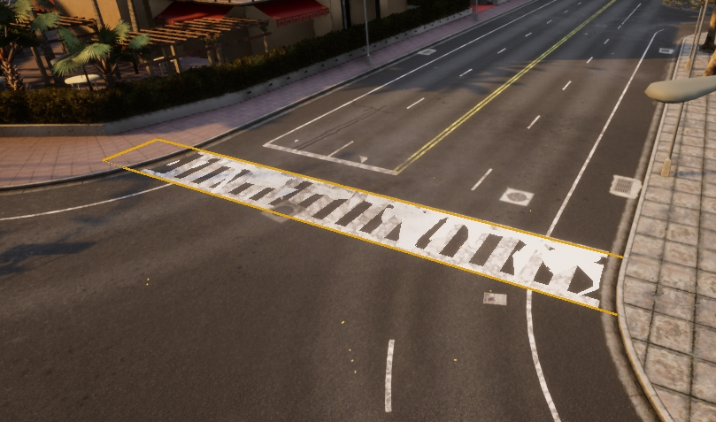  

*   __Customize the map.__ In is common to modify the map after the ingestion. Props such as trees, streetlights or grass zones are added, probably interfering with the pedestrian navigation. Make sure to have the desired result before generating the pedestrian navigation. Otherwise, it will have to be generated again.  

Now that the version of the map is final, it is time to generate the pedestrian navigation file.  

__1.__ Select the __Skybox object__ and add a tag `NoExport` to it. Otherwise, the map will not be exported, as the size would be too big. 

 

__2.__ Check the name of the meshes. By default, pedestrians will be able to walk over sidewalks, crosswalks, and grass (with minor influence over the rest).  

*   Sidewalk = `Road_Sidewalk`.  
*   Crosswalk = `Road_Crosswalk`.  
*   Grass = `Road_Grass`.  

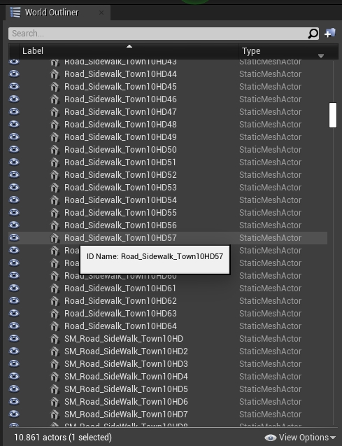 

__3.__ Name these planes following the common format `Road_Crosswalk_mapname`. 

__4.__ Press `G` to deselect everything, and export the map. `File > Export CARLA...`. A `map_file.obj` file will be created in `Unreal/CarlaUE4/Saved`.

__5.__ Move the `map_file.obj` and the `map_file.xodr` to `Util/DockerUtils/dist`.  

__6.__ Run the following command to generate the navigation file.  

*   __Windows__ 
```sh
build.bat map_file # map_file has no extension
```
*   __Linux__
```sh
./build.sh map_file # map_file has no extension
```

__7.__ Move the `.bin` into the `Nav` folder of the package that contains the map.  

---
## Deprecated ways to import a map

There are other ways to import a map used in previous CARLA releases. These required to manually cook the map and prepare everything, so they are now deprecated. However, they are explained below in case they are needed.  

### Prepare the package manually

A package needs to follow a certain folder structure and contain a `.json` file describing it. This steps can be saved under certains circumstances, but doing it manually will always work. 

  <details>
    <summary> Read how to prepare the folder structure and .json file
    </h4></summary>

#### Create the folder structure

__1. Create a folder inside `carla/Import`.__ The name of the folder is not relevant.  

__2. Create different subfolders__ for each map to import.

__3. Move the files of each map to the corresponding subfolder.__ A subfolder will contain a specific set of elements.  

*   The mesh of the map in a `.fbx`.  
*   The OpenDRIVE definition in a `.xodr`.  
*   Optionally, the textures required by the asset.  


For instance, an `Import` folder with one package containing two maps should have a structure similar to the one below.

```sh
Import
│
└── Package01
  ├── Package01.json
  ├── Map01
  │   ├── Asphalt1_Diff.jpg
  │   ├── Asphalt1_Norm.jpg
  │   ├── Asphalt1_Spec.jpg
  │   ├── Grass1_Diff.jpg
  │   ├── Grass1_Norm.jpg
  │   ├── Grass1_Spec.jpg
  │   ├── LaneMarking1_Diff.jpg
  │   ├── LaneMarking1_Norm.jpg
  │   ├── LaneMarking1_Spec.jpg
  │   ├── Map01.fbx
  │   └── Map01.xodr
  └── Map02
      └── Map02.fbx
```

#### Create the JSON description

Create a `.json` file in the root folder of the package. Name the file after the package. Note that this will be the distribution name. The content of the file will describe a JSON array of __maps__ and __props__ with basic information for each of them.  

__Maps__ need the following parameters.  

* __name__ of the map. This must be the same as the `.fbx` and `.xodr` files.  
* __source__ path to the `.fbx`.  
* __use_carla_materials__. If __True__, the map will use CARLA materials. Otherwise, it will use RoadRunner materials.  
* __xodr__ Path to the `.xodr`.  

__Props__ are not part of this tutorial. The field will be left empty. There is another tutorial on how to [add new props](tuto_A_add_props.md).  

In the end, the `.json` should look similar to the one below.

```json
{
  "maps": [
    {
      "name": "Map01",
      "source": "./Map01/Map01.fbx",
      "use_carla_materials": true,
      "xodr": "./Map01/Map01.xodr"
    },
    {
      "name": "Map02",
      "source": "./Map02/Map02.fbx",
      "use_carla_materials": false,
      "xodr": "./Map02/Map02.xodr"
    }
  ],
  "props": [
  ]
}
```
</details>
<br>

### RoadRunner plugin import

This software provides specific plugins for CARLA. Get those and follow some simple steps to get the map.  

  <details>
    <summary> Read RoadRunner plugin import guide
    </h4></summary>

!!! Warning
    These importing tutorials are deprecated. There are new ways to [ingest a map](#map-ingestion) to simplify the process.  

### Plugin installation

These plugins will set everything ready to be used in CARLA. It makes the import process more simple. 

__1. Locate the plugins__ in RoadRunner's installation folder  
`/usr/bin/VectorZero/Tools/Unreal/Plugins`.

__2. Copy those folders__ to the CarlaUE4 plugins directory `/carla/Unreal/CarlaUE4/Plugins/`.

__3. Rebuild the plugin__ following the instructions below.  

*   __a) Rebuild on Windows.__  
	* Right-click the `.uproject` file and `Generate Visual Studio project files`.  
	* Open the project and build the plugins.  

*   __b) Rebuild on Linux.__  
	* Run the following command.  
```sh
> UE4_ROOT/GenerateProjectFiles.sh -project="carla/Unreal/CarlaUE4/CarlaUE4.uproject" -game -engine
```

__4. Restart Unreal Engine.__ Make sure the checkbox is on for both plugins `Edit > Plugins`. 


### Import map

__1. Import the _mapname.fbx_ file__ to a new folder under `/Content/Carla/Maps` with the `Import` button.  

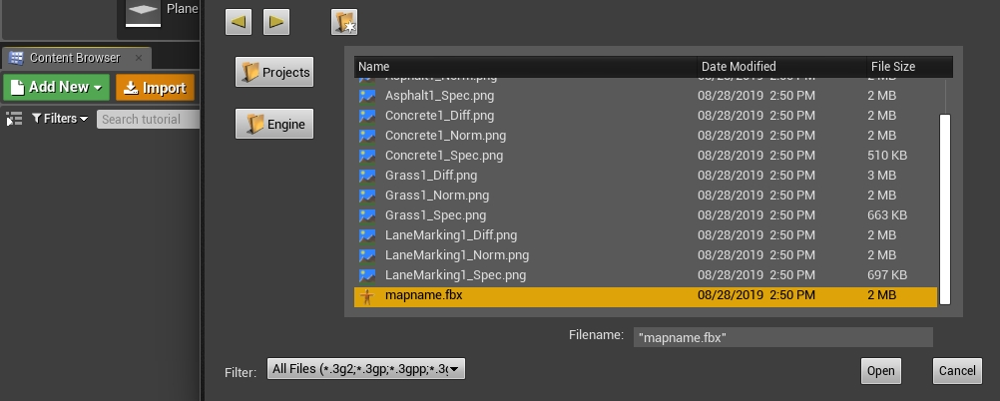

__2. Set `Scene > Hierarchy Type`__ to _Create One Blueprint Asset_ (selected by default).  
__3. Set `Static Meshes > Normal Import Method`__ to _Import Normals_.  


__4. Click `Import`.__  
__5. Save the current level__ `File > Save Current As...` > _mapname_.  

The new map should now appear next to the others in the Unreal Engine _Content Browser_.

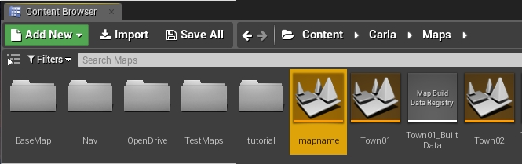
</details>

!!! Note
    The tags for semantic segmentation will be assigned by the name of the asset. And the asset moved to the corresponding folder in `Content/Carla/PackageName/Static`. To change these, move them manually after imported. 


### Manual import

This process requires to go through all the process manually. From importing _.fbx_ and _.xodr_ to setting the static meshes.  

  <details>
    <summary>  Read manual import guide
    </summary>

!!! Warning
    These importing tutorials are deprecated. There are new ways to [ingest a map](#map-ingestion) to simplify the process.  

This is the generic way to import maps into Unreal Engine using any _.fbx_ and _.xodr_ files. As there is no plugin to ease the process, there are many settings to be done before the map is available in CARLA.  

__1. Create a new level__ with the **Map** name in Unreal `Add New > Level` under `Content/Carla/Maps`.  
__2. Copy the illumination folder and its content__ from the BaseMap `Content/Carla/Maps/BaseMap`, and paste it in the new level. Otherwise, the map will be in the dark.


### Import binaries

__1. Import the _mapname.fbx_ file__ to a new folder under `/Content/Carla/Maps` with the `Import` button. __Make sure the following options are unchecked.__

*   Auto Generate Collision  
*   Combine Meshes  
*   Force Front xAxis  
*   Normal Import Method - _To import normals_  

__2. Check the following options.__  

*   Convert Scene Unit
*   _To import materials and textures._
    *   Material Import Method - _To create new materials_
    *   Import Textures


__3. Check that the static meshes have appeared__ in the chosen folder.

__4. Drag the meshes__ into the level.

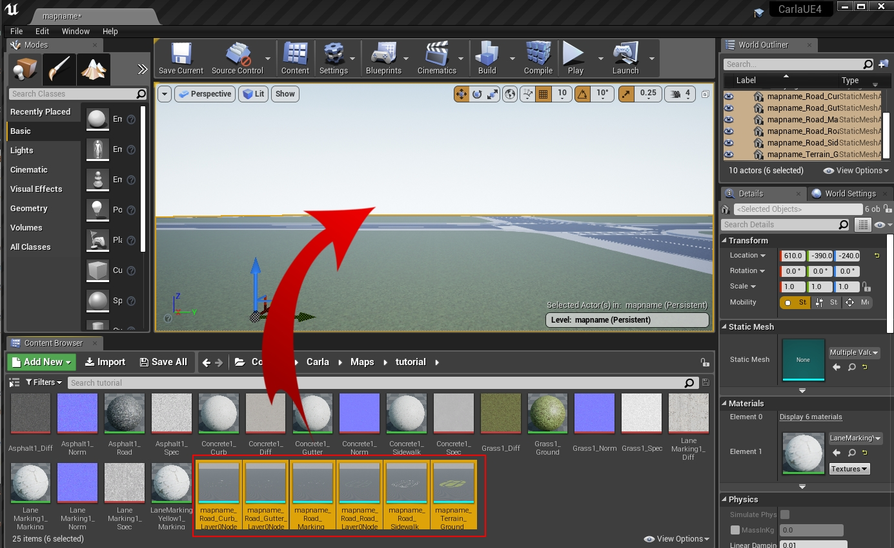

__5. Center the meshes at point (0,0,0)__ when Unreal finishes loading. 


__6. Generate collisions__. Otherwise, pedestrians and vehicles will fall into the abyss.

*   Select the meshes meant to have colliders.
*   Right-click `Asset Actions > Bulk Edit via Property Matrix...`.

  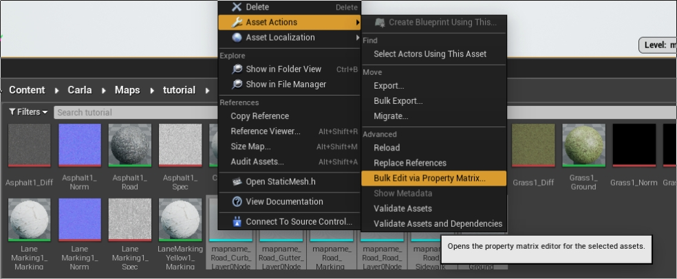

*   Search for _collision_ in Property's Matrix search box.
*   Change `Collision complexity` from `Project Default` to `Use Complex Collision As Simple`.

  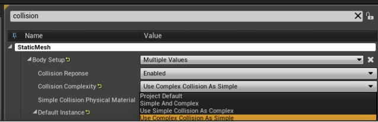

*   Go to `File > Save All`.

__7. Move the static meshes__ from `Content/Carla/Maps/mapfolder` to the corresponding `Carla/Static` subsequent folder. This will be meaningful for the semantic segmentation ground truth.  

  *   `Terrain/mapname`
  *   `Road/mapname`
  *   `RoadLines/mapname`

```sh
Content
└── Carla
    ├── Blueprints
    ├── Config
    ├── Exported Maps
    ├── HDMaps
    ├── Maps
    └── Static
        ├── Terrain
        │   └── mapname
        │       └── Static Meshes
        │
        ├── Road
        │   └── mapname
        │       └── Static Meshes
        │
        ├── RoadLines  
        |   └── mapname
        |       └── Static Meshes
        └── Sidewalks  
            └── mapname
                └── Static Meshes
```


### Import OpenDRIVE files

__1. Copy the `.xodr` file__ inside the `Content/Carla/Maps/OpenDrive` folder.  
__2. Open the Unreal level.__ Drag the _Open Drive Actor_ inside the level. It will read the level's name. Search the Opendrive file with the same name and load it.

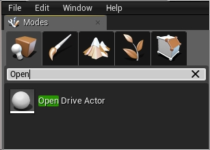

</details>
<br>


### Set traffic and pedestrian behaviour

This software provides specific plugins for CARLA. Get those and follow some simple steps to get the map.  

  <details>
    <summary>Read traffic and pedestrian setting guide</summary>

!!! Warning
    These importing tutorials are deprecated. There are new ways to [ingest a map](#map-ingestion) to simplify the process.  

### Set traffic behavior

Once everything is loaded into the level, it is time to create traffic behavior.  

__1. Click on the _Open Drive Actor_.__  
__2. Check the following boxes in the same order.__  

*   Add Spawners.  
*   _(Optional for more spawn points)_ On Intersections.  
*   Generate Routes.  

This will generate a series of _RoutePlanner_ and _VehicleSpawnPoint_ actors. These are used for vehicle spawning and navigation.

### Traffic lights and signs

Traffic lights and signs must be placed all over the map.

__1. Drag traffic light/sign actors__ into the level and place them.  
__2. Adjust the [`trigger volume`][triggerlink]__ for each of them. This will determine their area of influence.  
  [triggerlink]: python_api.md#carla.TrafficSign.trigger_volume

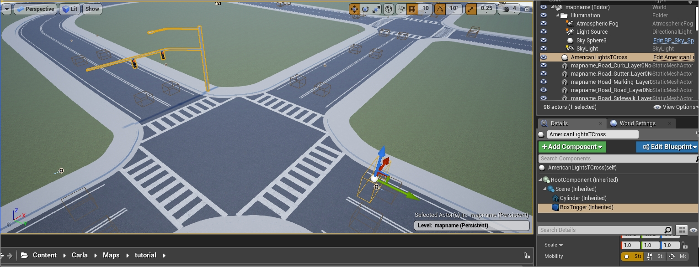

__3. In junctions, drag a traffic light group actor__ into the level. Assign to it all the traffic lights involved and configure their timing. Make sure to understand [how do traffic lights work](http://127.0.0.1:8000/core_actors/#traffic-signs-and-traffic-lights).  

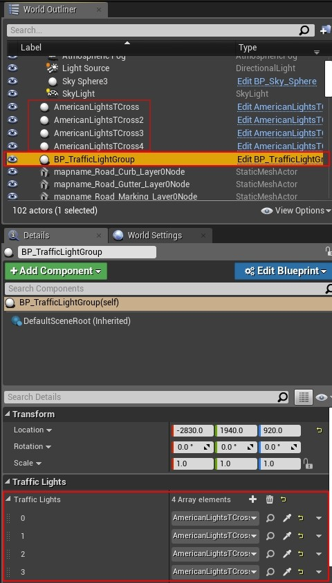

__4. Test traffic light timing and traffic trigger volumes.__ This may need trial and error to fit perfectly.

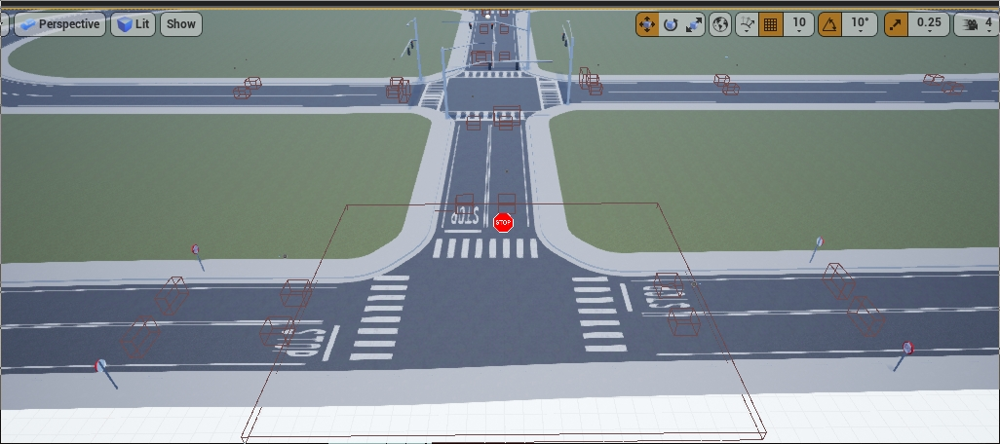

> _Example: Traffic Signs, Traffic lights and Turn based stop._

---
### Add pedestrian navigation

In order to prepare the map for pedestrian navigation, there are some settings to be done before exporting it.  

__1.__ Select the __Skybox object__ and add a tag `NoExport` to it. Otherwise, the map will not be exported, as the size would be too big. Any geometry that is not involved or interfering in the pedestrian navigation can be tagged also as `NoExport`.

 

__2.__ Check the name of the meshes. By default, pedestrians will be able to walk over sidewalks, crosswalks, and grass (with minor influence over the rest).

 

__3.__ Crosswalks have to be manually created. For each of them, create a plane mesh that extends a bit over both sidewalks connected. __Place it overlapping the ground, and disable its physics and rendering__. 

 

__4.__ Name these planes following the common format `Road_Crosswalk_mapname`. 

__5.__ Press `G` to deselect everything, and export the map. `File > Export CARLA...`.  
__6.__ Run RecastDemo `./RecastDemo`.  

  * Select `Solo Mesh` from the `Sample` parameter's box.
  * Select the _mapname.obj_ file from the `Input Mesh` parameter's box.


__7.__ Click on the `Build` button.  
__8.__ Once the build has finished, click on the `Save` button.  
__9.__ Change the **filename** of the binary file generated at `RecastDemo/Bin` to `mapname.bin`.  
__10.__ Drag the _mapname.bin_ file into the `Nav` folder under `Content/Carla/Maps`.  

</details>
<br>

---

That comprises the process to create and import a new map into CARLA. If during the process any doubts arise, feel free to post these in the forum. 

<div class="build-buttons">
<p>
<a href="https://forum.carla.org/" target="_blank" class="btn btn-neutral" title="Go to the CARLA forum">
CARLA forum</a>
</p>
</div>