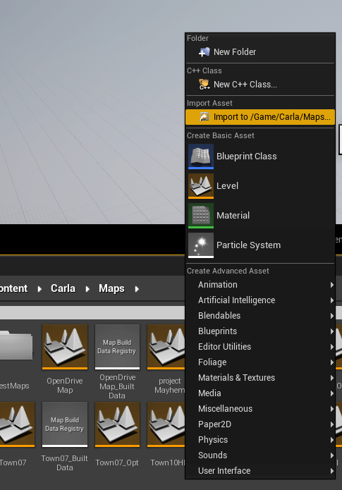
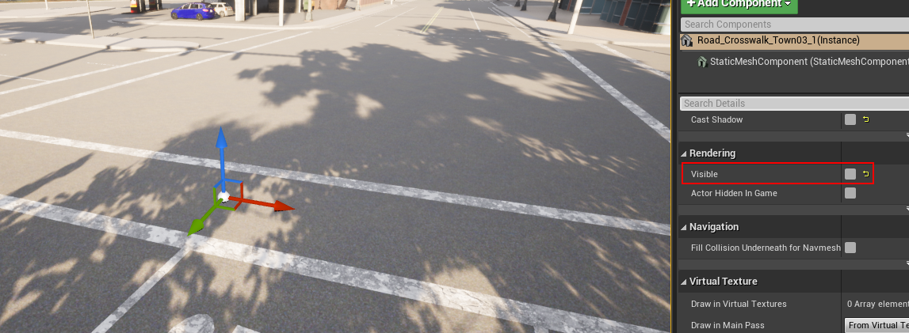

# Alternative methods to import maps

This section describes how to prepare a map package manually and details methods to import maps alternative to the processes described in the guides [__Import into source build version of CARLA__](add_map_source.md) and [__Import into package version of CARLA__](add_map_package.md). The methods described in this section involve more manual steps than the processes explained in those guides. 

- [__RoadRunner plugin import__](#roadrunner-plugin-import)
- [__Manual import__](#manual-import)
- [__Set traffic and pedestrian behaviour__](#set-traffic-and-pedestrian-behaviour)
- [__Manual package preparation__](#manual-package-preparation)

---

## RoadRunner plugin import

The RoadRunner software from MathWorks provides plugins for Unreal Engine to help ease the import process of maps into CARLA. 

#### Plugin installation

__1.__ The plugins are available for download from the [MathWorks website](https://www.mathworks.com/help/roadrunner/ug/Downloading-Plugins.html). MathWorks also has a [full tutorial](https://www.mathworks.com/help/roadrunner/ug/Exporting-to-CARLA.html), similar to this one, on how to import maps to CARLA using the plugins.

__2.__ Extract the contents of the downloaded folder and move the folders `RoadRunnerImporter`, `RoadRunnerCarlaIntegration` and `RoadRunnerMaterials` to `<carla>/Unreal/CarlaUE4/Plugins/`.

__3.__ Rebuild the plugin following the instructions below:  

*   __On Windows.__  
	* Right-click the `.uproject` file in `<carla>/Unreal/CarlaUE4` and select `Generate Visual Studio project files`.  
	* In the root folder of CARLA, run the command:

```sh
        make launch
```

*   __On Linux.__  
	* Run the following command:  
```sh
        UE4_ROOT/GenerateProjectFiles.sh -project="carla/Unreal/CarlaUE4/CarlaUE4.uproject" -game -engine
```

__4.__ In the Unreal Engine window, make sure the checkbox is selected for both plugins `Edit > Plugins`. 


### Import map

__1.__ Import the `<mapName>.fbx` file to a new folder under `/Content/Carla/Maps` with the `Import` button.  


__2.__ Set `Scene > Hierarchy Type` to _Create One Blueprint Asset_ (selected by default).  
__3.__ Set `Static Meshes > Normal Import Method` to _Import Normals_.  


__4.__ Click `Import`.  
__5.__ Save the current level `File` -> `Save Current As...` -> `<mapname>`.  

The new map should now appear next to the others in the Unreal Engine _Content Browser_.


</details>

!!! Note
    The tags for semantic segmentation will be assigned according to the name of the asset. The asset will be moved to the corresponding folder in `Content/Carla/PackageName/Static`. To change these, move them manually after importing. 

__6.__ The pedestrian navigation will still need to be generated. See the section ["Add pedestrian navigation"](#add-pedestrian-navigation) for more information.

---

## Manual import 

This method of importing maps can be used with generic `.fbx` and `.xodr` files. If you are using RoadRunner, you should use the export method `Firebox (.fbx)`, `OpenDRIVE (.xodr)` or `Unreal (.fbx + .xml)`. Do not use the `Carla Exporter` option because you will run into compatibility issues with the `.fbx` file. 

To import a map manually to Unreal Engine:

__1.__ In your system's file explorer, copy the `.xodr` file to `<carla-root>/Unreal/CarlaUE4/Content/Carla/Maps/OpenDrive`.

__2.__ Open the Unreal Engine editor by running `make launch` in the carla root directory. In the _Content Browser_ of the editor, navigate to `Content/Carla/Maps/BaseMap` and duplicate the `BaseMap`. This will provide a blank map with the default sky and lighting objects.

>>

__3.__ Create a new folder with the name of your map package in the `Content/Carla/Maps` directory and save the duplicated map there with the same name as your `.fbx` and `.xodr` files.

__4.__ In the _Content Browser_ of the Unreal Engine editor, navigate back to `Content/Carla/Maps`. Right click in the grey area and select `Import to /Game/Carla/Maps...` under the heading _Import Asset_.

>>

__5.__ In the configuration window that pops up, make sure:

>- These options are unchecked:
    *   Auto Generate Collision  
    *   Combine Meshes  
    *   Force Front xAxis
- In the following drop downs, the corresponding options are selected:
    *   Normal Import Method - _Import Normals_  
    *   Material Import Method - _Create New Materials_
- These options are checked:
    *   Convert Scene Unit
    *   Import Textures

>>

__6.__ Click `Import`.

__7.__ The meshes will appear in the _Content Browser_. Select the meshes and drag them into the scene.

>>

__8.__ Center the meshes at 0,0,0.

>>

__9.__ In the _Content Browser_, select all the meshes that need to have colliders. This refers to any meshes that will interact with pedestrians or vehicles. The colliders prevent them from falling into the abyss. Right-click the selected meshes and select `Asset Actions > Bulk Edit via Property Matrix...`.

>>

__10.__ Search for _collision_ in the search box.

__11.__ Change `Collision Complexity` from `Project Default` to `Use Complex Collision As Simple` and close the window.

>>

__12.__ Confirm the collision setting has been applied correctly by pressing `Alt + c`. You will see a black web over the meshes.

__13.__ To create the ground truth for the semantic segmentation sensor, move the static meshes to the corresponding `Carla/Static/<segment>` folder following the structure below:

        Content
        └── Carla
            ├── Blueprints
            ├── Config
            ├── Exported Maps
            ├── HDMaps
            ├── Maps
            └── Static
                ├── Terrain
                │   └── mapname
                │       └── Static Meshes
                │
                ├── Road
                │   └── mapname
                │       └── Static Meshes
                │
                ├── RoadLines  
                |   └── mapname
                |       └── Static Meshes
                └── Sidewalks  
                    └── mapname
                        └── Static Meshes

__14.__ In the _Modes_ panel, search for the __Open Drive Actor__ and drag it into the scene.

>>

__15.__ In the _Details_ panel, check `Add Spawners` and then click on the box beside `Generate Routes`. This will find the `.xodr` file with the same map name in the `<carla-root>/Unreal/CarlaUE4/Content/Carla/Maps/OpenDrive` directory and use it to generate a series of _RoutePlanner_ and _VehicleSpawnPoint_ actors.

>>

__18.__ To add pedestrian navigation capabilities, see the section [Add pedestrian navigation](#add-pedestrian-navigation).

__17.__ Save your map and press _Play_ to run a simulation on your new map.

#### Traffic lights and signs

To add traffic lights and signs to your new map:

__1.__ From the _Content Browser_, navigate to `Content/Carla/Static` to find the folders that contain traffic lights and traffic signs.

__2.__ Drag the signs and/or lights into the scene. 

__3.__ Adjust the [`trigger volume`][triggerlink] for each of them by selecting the _BoxTrigger_ component and adjusting the values of _Scale_ in the _Transform_ section of the _Details_ menu. This will determine their area of influence.  

>>

__4.__ For junctions, drag a traffic light group actor into the level. Assign all the traffic lights involved to it and configure their timing. Make sure to understand [how traffic lights work](../core_actors.md#traffic-signs-and-traffic-lights).  

>>

__5.__ Test traffic light timing and traffic trigger volumes. This may require some trial and error to get right.

>>

> _Example: Traffic Signs, Traffic lights and Turn based stop._

[triggerlink]: ../python_api.md#carla.TrafficSign.trigger_volume

#### Add pedestrian navigation

To allow pedestrians to navigate the new map, you will need to generate a pedestrian navigation file. Follow the steps below to generate the file:  

__1.__ Generate new crosswalks if needed. Avoid doing this if the crosswalk is already defined in the `.xodr` file as this will lead to duplication:

- Create a plane mesh that extends a bit over two sidewalks that you want to connect.
- Place the mesh overlapping the ground and disable it's physics and rendering.

>>

- Change the name of the mesh to `Road_Crosswalk` or `Roads_Crosswalk`.

__2.__ To prevent the map being too large to export, select the __BP_Sky object__ and add a tag `NoExport` to it. If you have any other particularly large meshes that are not involved in the pedestrian navigation, add the `NoExport` tag to them as well. 

>> 

__3.__ Double check your mesh names. Mesh names should start with any of the appropriate formats listed below in order to be recognized as areas where pedestrians can walk. By default, pedestrians will be able to walk over sidewalks, crosswalks, and grass (with minor influence over the rest):  

*   Sidewalk = `Road_Sidewalk` or `Roads_Sidewalk` 
*   Crosswalk = `Road_Crosswalk` or `Roads_Crosswalk` 
*   Grass = `Road_Grass` or `Roads_Grass`

>> 

__4.__ Press `ctrl + A` to select everything and export the map by selecting `File` -> `Carla Exporter`. A `<mapName>.obj` file will be created in `Unreal/CarlaUE4/Saved`.

__5.__ Copy the `<mapName>.obj` and the `<mapName>.xodr` to `Util/DockerUtils/dist`.  

__6.__ Run the following command to generate the navigation file:  

*   __Windows__ 
```sh
build.bat <mapName> # <mapName> has no extension
```
*   __Linux__
```sh
./build.sh <mapName> # <mapName> has no extension
```

__7.__ A `<mapName>.bin` file will be created. This file contains the information for pedestrian navigation on your map. Move this file to the `Nav` folder of the package that contains your map.  

---

## Manual package preparation

A map package needs to follow a certain folder structure and must contain a `.json` file describing that folder structure. These steps can be saved under certain circumstances, but doing it manually will always work. 
#### Create the folder structure

__1. Create a folder inside `carla/Import`.__ The name of the folder is not important.  

__2. Create different subfolders__ for each map to be imported.

__3. Move the files of each map to the corresponding subfolder.__ A subfolder will contain a specific set of elements: 

*   The mesh of the map in a `.fbx` file.  
*   The OpenDRIVE definition in a `.xodr` file.  
*   Optionally, the textures required by the asset.  

For instance, an `Import` folder with one package containing two maps should have a structure similar to the one below.

```sh
Import
│
└── Package01
  ├── Package01.json
  ├── Map01
  │   ├── Asphalt1_Diff.jpg
  │   ├── Asphalt1_Norm.jpg
  │   ├── Asphalt1_Spec.jpg
  │   ├── Grass1_Diff.jpg
  │   ├── Grass1_Norm.jpg
  │   ├── Grass1_Spec.jpg
  │   ├── LaneMarking1_Diff.jpg
  │   ├── LaneMarking1_Norm.jpg
  │   ├── LaneMarking1_Spec.jpg
  │   ├── Map01.fbx
  │   └── Map01.xodr
  └── Map02
      └── Map02.fbx
```

#### Create the JSON description

Create a `.json` file in the root folder of the package. Name the file after the package. Note that this will be the distribution name. The content of the file will describe a JSON array of __maps__ and __props__ with basic information for each of them.  

__Maps__ need the following parameters:  

* __name__ of the map. This must be the same as the `.fbx` and `.xodr` files.  
* __source__ path to the `.fbx` file.  
* __use_carla_materials__. If __True__, the map will use CARLA materials. Otherwise, it will use RoadRunner materials.  
* __xodr__ Path to the `.xodr` file.  

__Props__ are not part of this tutorial. The field will be left empty. There is another tutorial on how to [add new props](../tuto_A_add_props.md).  

The resulting `.json` file should resemble the following:

```json
{
  "maps": [
    {
      "name": "Map01",
      "source": "./Map01/Map01.fbx",
      "use_carla_materials": true,
      "xodr": "./Map01/Map01.xodr"
    },
    {
      "name": "Map02",
      "source": "./Map02/Map02.fbx",
      "use_carla_materials": false,
      "xodr": "./Map02/Map02.xodr"
    }
  ],
  "props": [
  ]
}
```
</details>
<br>

---

It is recommended to use the automated processes for importing maps detailed in the guides for [CARLA packages](add_map_package.md) and [CARLA source build](add_map_source.md), however the methods listed in this section can be used if required. If you encounter any issues with the alternative methods, feel free to post in the [forum](https://forum.carla.org/).
