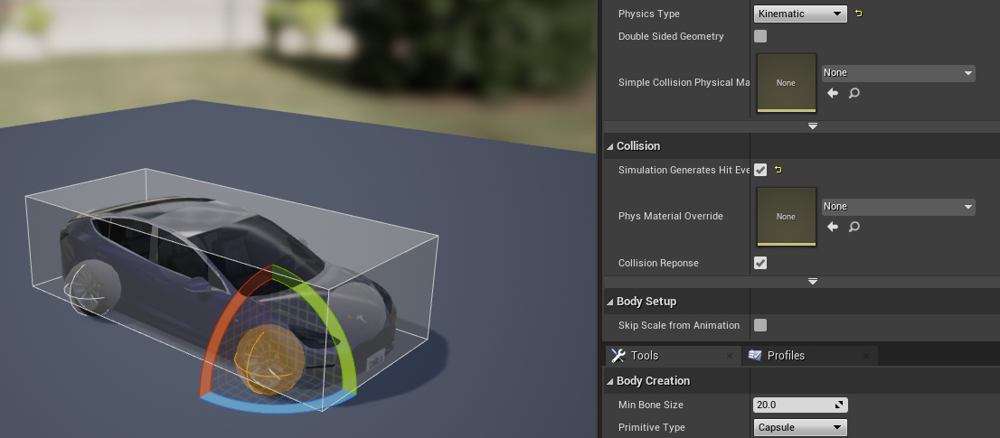
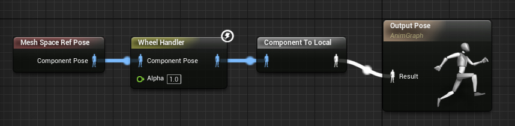
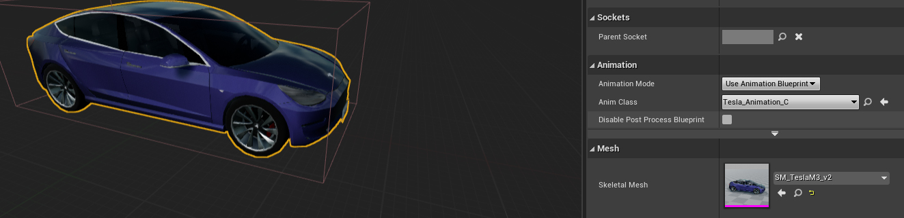
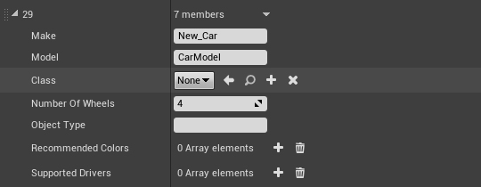

# Add a new vehicle

This tutorial covers step by step the process to add a new vehicle model. From the very moment the model is finished, to a simple test in CARLA.  

*   [__Add a 4 wheeled vehicle__](#add-a-4-wheeled-vehicle)  
	*   [Bind the skeleton](#bind-the-skeleton)  
	*   [Import and prepare the vehicle](#import-and-prepare-the-vehicle)  
*   [__Add a 2 wheeled vehicle__](#add-a-2-wheeled-vehicle)  

!!! Important
    This tutorial only applies to users that work with a build from source, and have access to the Unreal Editor. 

---
## Add a 4 wheeled vehicle

### Bind the skeleton

CARLA provides a general skeleton for 4-wheeled vehicles that must be used by all of them. The position of the bones can be changed, but rotating them, adding new ones or changing the hierarchy will lead to errors.  

__1.   Download the skeleton__ from the CARLA repositories. [Here](https://carla-assets.s3.eu-west-3.amazonaws.com/fbx/VehicleSkeleton.rar) is the link to `General4WheeledVehicleSkeleton`, the reference skeleton for 4 wheeled vehicles.  

__2.   Import the skeleton__ into the 3D project of the new vehicle. This could be in Maya, Blender or whichever software used for modelling.  

__3.   Bind the bones__ to the corresponding portions of the mesh. Make sure to center the wheels' bones within the mesh.  

*   __Front left wheel__ — `Wheel_Front_Left`.  
*   __Front right wheel__ — `Wheel_Front_Right`.  
*   __Rear left wheel__ — `Wheel_Rear_Left`.  
*   __Rear right wheel__ — `Wheel_Rear_Right`.  
*   __Rest of the mesh__ — `VehicleBase`.  

!!! Warning
    Do not add new bones, change their names or the hierarchy.  

__4.   Export the result__. Select all the meshes and the base of the skeleton and export as `.fbx`.  


### Import and prepare the vehicle

*   __1. Create a new folder__ named `<vehicle_name>` in `Content/Carla/Static/Vehicle`.  
<br>

*   __2. Import the `.fbx`__ in its folder. The Skelletal Mesh will appear along with two new files, `<vehicle_name>_PhysicsAssets` and `<vehicle_name>_Skeleton`.  
	*   __2.1 - *Import Content Type*__ — `Geometry and Skinning Weights`.  
	*   __2.2 - *Normal Import Method*__ — `Import Normals`.  
	*   __2.3 - *Material import method*__ — Optionally choose `Do not create materials` and uncheck `Import Textures` to avoid Unreal creating its own default materials.  

!!! Note
    If Unreal does not create the vehicle materials, these will have to be created manually.  

*   __3. Open `<vehicle_name>_PhysicsAssets`__ to set the vehicle colliders.  
	*   __3.1 - Change the wheels' colliders__ — Select a sphere and adjust it to the shape of the wheel.  
	*   __3.2 - Change the wheels' *Physics Type*__ — Select `Kinematic` for all of them.  
	*   __3.3 - Change the general collider__ — Select a box and adjust it to the shape of the vehicle.  
	*   __3.4 - Enable *Simulation Generates Hit Event*__ — Check it for all of the physics' bodies.  


<div style="text-align: right"><i>Step 3, set colliders.</i></div>

*   __4. Create the Animation Blueprint__. In the new vehicle folder, click right and go to `Create advanced asset/Animation/Animation blueprint`.  
	*   __4.1 - *Parent Class*__ — `VehicleAnimInstance`.  
	*   __4.2 - *Skeleton*__ — `<vehicle_name>_Skeleton`.  
	*   __4.3 - Rename the blueprint__ — `BP_<vehicle_name>_anim`.  
	*   __4.4 - Copy an existing Animation Blueprint__ — Go to `Content/Carla/Static/Vehicle` and choose any vehicle folder. Open its Animation Blueprint and copy the content from the *AnimGraph*.  
	*   __4.5 - Compile the Animation Blueprint__ — Connect the content in the blueprint and click the button `Compile` on the top left corner.  


<div style="text-align: right"><i>Step 4.5, connect the blueprint.</i></div>

*   __5. Create a folder for the vehicle blueprints__. Go to `Content/Carla/Blueprints/Vehicles` and create a new folder `<vehicle_name>`.  
<br>
*   __6. Create blueprints for the wheels__. Inside the folder, right-click and go to `Created advanced assets/Blueprints class`. Create two blueprints derived from `VehicleWheel`, one named `<vehicle_name>_FrontWheel` and the other `<vehicle_name>_RearWheel`.  
	*   __6.1 - *Shape radius*__ — Exactly the radius, not diameter, of the wheel mesh.  
	*   __6.2 - *Rig Config*__ — `CommonTireConfig`.  
	*   __6.3 - On the front wheel__ — Set `Steer Angle`, default is `70`. Uncheck `Affected by Handbrake`.  
	*   __6.4 - On the rear wheel__ — Set `Steer Angle` to `0`. Check `Affected by Handbrake`.  


<div style="text-align: right"><i>Step 6.3, front wheel setup.</i></div>

*   __7. Create a blueprint for the vehicle__. Inside the folder, create another blueprint derived from `BaseVehiclePawn` and named `BP_<vehicle_name>`.  
	*   __7.1 - *Mesh*__ — Choose the skelletal mesh of the vehicle.  
	*   __7.2 - *Anim class*__ — Choose the Animation blueprint created in *step 4*.  
	*   __7.3 - *Vehicle bound*__ — Adjust it to include the whole volume of the vehicle.  

!!! Note
    These options appear in the menu *Components* on the left side of the window. 


<div style="text-align: right"><i>Step 6.3, create the blueprint.</i></div>

*   __8. Pair the wheels with their blueprint__. In `Vehicle Movement/Wheel Setups` expand the menu and prepare each wheel.  
	*   __8.1 - *Wheel_Front_Left*__ — `<vehicle_model>_FrontWheel`  
	*   __8.2 - *Wheel_Front_Right*__ — `<vehicle_model>_FrontWheel`  
	*   __8.3 - *Wheel_Rear_Left*__ — `<vehicle_model>_RearWheel`  
	*   __8.4 - *Wheel_Rear_Right*__ — `<vehicle_model>_RearWheel`  


<div style="text-align: right"><i>Step 8, pair the wheels.</i></div>

*   __9 - Compile the blueprint__ — Click the button `Compile` on the top left corner.  
<br>
*   __10 - Add the vehicle__. In `Content/Carla/Blueprint/Vehicle`, open the `VehicleFactory` and add a new element to the array of vehicles.  
	*   __10.1 - *Make*__ — Choose a name to be used in Unreal.  
	*   __10.2 - *Model*__ — Choose the name to be used in the blueprint library in CARLA.  
	*   __10.3 - *Class*__ — `BP_<vehicle_name>`.  
	*   __10.4 - *Recommended colours*__ — Optionally, provide a set of recommended colours for the vehicle.  


<div style="text-align: right"><i>Step 10, add the new vehicle.</i></div>

*   __11. Test the vehicle__. Launch CARLA, open a terminal in `PythonAPI/examples` and run the following command.  
```sh
python3 manual_control.py --filter <model_name> # The name used in step 10.2
```

---
## Add a 2 wheeled vehicle

Adding 2 wheeled vehicles is similar to adding a 4 wheeled one but due to the complexity of the animation you'll need to set up aditional bones to guide the driver's animation. [Here](https://carla-assets.s3.eu-west-3.amazonaws.com/fbx/BikeSkeleton.rar) is the link to the reference skeleton for 2 wheeled vehicles.

As with the 4 wheeled vehicles, orient the model towards positive "x" and every bone axis towards
positive x and with the z axis facing upwards.

```yaml
Bone Setup:
  - Bike_Rig:                   # The origin point of the mesh. Place it in the point 0 of the scenecomment
    - BikeBody:                 # The model's body centre.
      - Pedals:                 # If the vehicle is a bike bind the pedalier to this bone, will rotate with the bike acceleration.
        - RightPedal:           # Sets the driver's feet position and rotates with the pedalier if the vehicle is a bike.
        - LeftPedal:            # ^
      - RearWheel:              # Rear Wheel of the vehicle
      - Handler:                # Rotates with the frontal wheel of the vehicle bind the vehicle handler to it.
        - HandlerMidBone:       # Positioned over the front wheel bone to orient the handler with the wheel
        - HandlerRight:         # Sets the position of the driver's hand, no need to bind it to anything.
        - HandlerLeft:          # ^
      - Frontwheel:             # Frontal wheel of the vehicle.
      - RightHelperRotator:     # This four additional bones are here for an obsolete system of making the bike stable by using aditional invisible wheels
        - RightHelprWheel:      # ^
      - LeftHelperRotator:      # ^
        - LeftHelperWheel:      # ^
      - Seat:                   # Sets the position of the drivers hip bone. No need to bind it to anything but place it carefully.
```

__1.__ Import fbx as Skelletal Mesh to its own folder inside `Content/Carla/Static/Vehicles/2Wheeled`. When importing select "General2WheeledVehicleSkeleton" as skelleton A Physics asset should be automatically created and linked.  

__2.__ Tune the Physics asset. Delete the automatically created ones and add boxes to the `BikeBody` bone trying to match the shape as possible, make sure generate hit events is enabled. 
  Add a sphere for each wheel and set their "Physics Type" to "Kinematic".  

__3.__ Create folder `Content/Blueprints/Vehicles/<vehicle-model>`  

__4.__ Inside that folder create two blueprint classes derived from "VehicleWheel" class. Call them `<vehicle-model>_FrontWheel` and `<vehicle-model>_RearWheel`. Set their "Shape Radius" to exactly match the mesh wheel radius (careful, radius not diameter). Set their "Tire Config" to "CommonTireConfig". On the front wheel uncheck "Affected by Handbrake" and on the rear wheel set "Steer Angle" to zero.  

__5.__ Inside the same folder create a blueprint class derived from `Base2WheeledVehicle` call it `<vehicle-model>`. Open it for edit and select component "Mesh", setup the "Skeletal Mesh"
  and the "Anim Class" to the corresponding ones. Then select the VehicleBounds component and set the size to cover vehicle's area as seen from above.

__6.__ Select component "VehicleMovement", under "Vehicle Setup" expand "Wheel Setups", setup each wheel.  

*   __0:__ Wheel Class=`<vehicle-model>_FrontWheel`, Bone Name=`FrontWheel`  
*   __1:__ Wheel Class=`<vehicle-model>_FrontWheel`, Bone Name=`FrontWheel`  
*   __2:__ Wheel Class=`<vehicle-model>_RearWheel`, Bone Name=`RearWheel`  
*   __3:__ Wheel Class=`<vehicle-model>_RearWheel`, Bone Name=`RearWheel`  
(You'll notice that we are basically placing two wheels in each bone. The vehicle class unreal provides does not support vehicles with wheel numbers different from 4 so we had to make it believe the vehicle has 4 wheels)

__7.__ Select the variable "is bike" and tick it if your model is a bike. This will activate the
  pedalier rotation. Leave unmarked if you are setting up a motorbike.

__8.__ Find the variable back Rotation and set it as it fit better select the component SkeletalMesh
  (The driver) and move it along x axis until its in the seat position.  

__9.__ Test it, go to CarlaGameMode blueprint and change "Default Pawn Class" to the newly
  created bike blueprint.