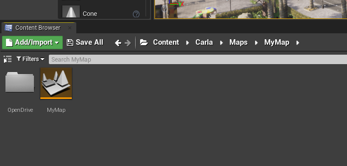
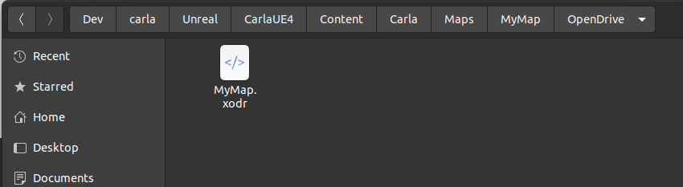

# Create distribution packages for assets 

It is a common practice in CARLA to manage assets with standalone packages. Keeping them aside allows to reduce the size of the build. These asset packages can be easily imported into a CARLA package anytime. They also become really useful to easily distribute assets in an organized way. 

- [__Export a package in a CARLA build from source__](#export-a-package-in-a-carla-build-from-source)  
- [__Export a package using Docker__](#export-a-package-using-docker)
- [__Import assets into a CARLA package__](#import-assets-into-a-carla-package)  

---
## Export a package in a CARLA build from source

Once assets are imported into Unreal, users can generate a __standalone package__ for them. This will be used to distribute the content to CARLA packages such as 0.9.8.

To export packages, simply run the command below.

```sh
make package ARGS="--packages=Package1,Package2"
```

This will create a standalone package compressed in a `.tar.gz` file for each of the packages listed. 

## Exporting a specific map as a package

To export a custom map as an independent content package, we use the `make package` command. Identify your custom map's location in the CARLA content directory through the Unreal content browser. We recommend creating your custom maps in with the existing CARLA maps in the `Content > Carla > Maps` directory. In this case, we are storing the map in its own folder named *MyMap*.



Remember that the map needs an associated OpenDRIVE file stored inside a directory named `OpenDrive` at the same level as the map asset (`.umap` file). The OpenDRIVE file should have the same name as the map itself with the `.xodr` extension. In this example I have named the map *MyMap* (the file will appear as `MyMap.umap` in a file browser), therefore my OpenDRIVE file is named `MyMap.xodr`. 



Now we need to create a package config JSON file for the export process. In a file browser (not the Unreal content browser) navigate to `CARLA_ROOT/Unreal/CarlaUE4/Content/Carla/Config`. Inside this directory, you will see a number of JSON config files. Open a new one with a name corresponding to your map and the suffix `.Package.json`. In this case we name the file `exportMyMap.Package.json`.


The JSON file should have the following structure:

```json
{
    "props": [],
    "maps": [
        {
            "name": "MyMap",
            "path": "/Game/Carla/Maps/MyMap",
            "use_carla_materials": true
        }
    ]
}
```

The `name` parameter should be the same as the name of your map asset file (without the `.umap` suffix). Ensure that the `path` parameter points to the correct directory location of your map asset (`.umap` file). The first part of the path `CARLA_ROOT/Unreal/CarlaUE4/Content/` should be replaced with `/Game/`. 

Now we call the `make package` command from a terminal in the `CARLA_ROOT` directory, with the following argument:

```sh
make package ARGS="--packages=exportMyMap"
```

The value of the argument `--packages` should match the name of the JSON configuration file without the `.Package.json` suffix. The package may take some time to build, depending on the size of the map. 

When the export process is finished, the exported map package will be saved as a compressed archive:

* **Linux**: `.tar.gz` archive in the `CARLA_ROOT/Dist` directory
* **Windows**: `.zip` archive in the `CARLA_ROOT/Build/UE4Carla` directory

The map package must be built using the target operating system. I.e. a map package built in Linux cannot be imported into a CARLA package for Windows. 

To import the packaged map into a packaged version of CARLA, place the `.tar.gz` or `.zip` archive into the `CARLA_ROOT/Import` directory of an extracted CARLA package then run the `ImportAssets.bin/.sh` script. Once this is finished, launch CARLA and you will find the new custom map in the list of available maps. 
---

## Export a package using Docker

Unreal Engine and CARLA can be built in a Docker image which can then be used to create a package or export assets for use in a package.

To create the Docker image, follow the tutorial [here](build_docker_unreal.md).

When you have the image ready:

1. Navigate to `Util/Docker`.
2. Create a CARLA package or prepare assets for use in a package by running one of the following commands:

```sh
# To create a standalone package
./docker_tools.py --output /output/path

#To cook assets to be consumed in a CARLA package
./docker_tools.py --input /assets/to/import/path --output /output/path --packages PkgeName1,PkgeName2
```

---
## Import assets into a CARLA package

A standalone package is contained in a `.tar.gz` file. The way this is extracted depends on the platform.  

*   __On Windows__ extract the compressed file in the main root CARLA folder.  
*   __On Linux__ move the compressed file to the `Import` folder and run the following script.  

```sh
cd Import
./ImportAssets.sh
```

!!! Note
    Standalone packages cannot be directly imported into a CARLA build. Follow the tutorials to import [props](tuto_A_add_props.md), [maps](tuto_M_custom_map_overview.md) or [vehicles](tuto_A_add_vehicle.md).

---

That sumps up how to create and use standalone packages in CARLA. If there is any unexpected issue, feel free to post in the forum. 

<div class="build-buttons">
<p>
<a href="https://github.com/carla-simulator/carla/discussions/" target="_blank" class="btn btn-neutral" title="Go to the CARLA forum">
CARLA forum</a>
</p>
</div>
