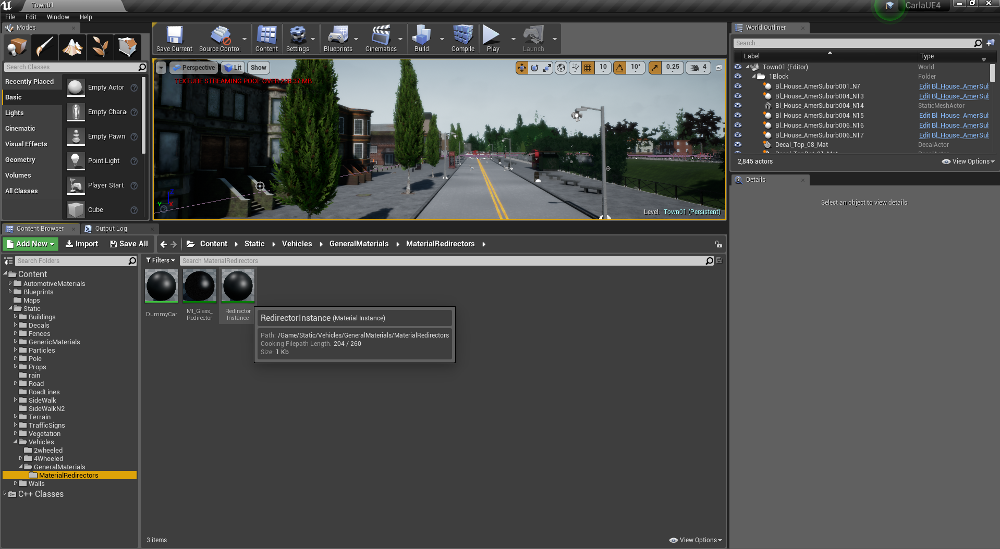
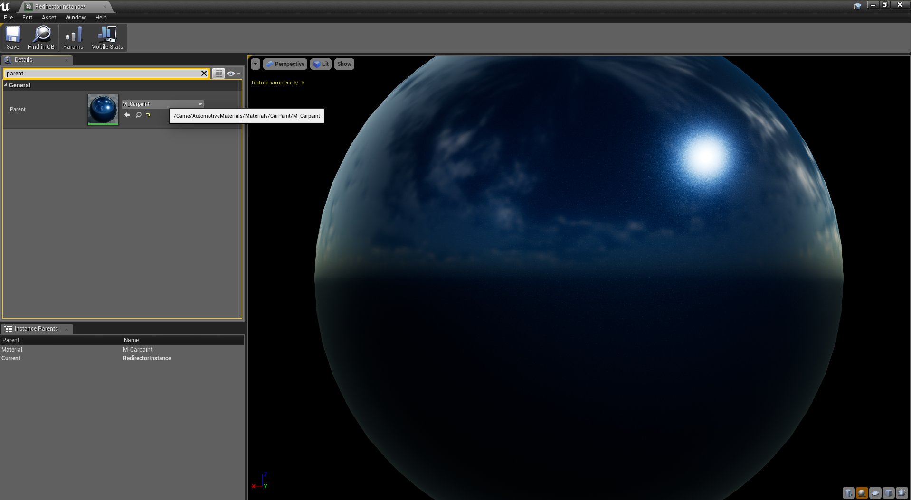

# How to link Epic's Automotive Materials

!!! important
    Since version 0.8.0 CARLA does not use Epic's _Automotive Materials_ by
    default. However, you can still enable them if you compile from source.

Epic Game's provides a set of realistic _Automotive Materials_ free to use. In
this document we explain how to download and link these materials to our
vehicles for a more realistic car paint.

---
## Download from Marketplace

Epic Games' [Automotive Materials][automatlink] package can be downloaded for
free from the Unreal Engine Marketplace.

!!! note
    Unfortunately Linux based machines don't have official support for Epic Game Store / Unreal Marketplace. In order to access the purchased assets download [this Java Package](https://github.com/neutrino-steak/UE4LinuxLauncher).

  1. Install Epic Games Launcher from [www.unrealengine.com](https://www.unrealengine.com).
  2. Buy the [Automotive Materials][automatlink] package for $0.
  3. Create a new dummy project and add the Automotive Materials package to it.
  4. Inside the "Content" folder of the newly created project, you can find the 
  "AutomotiveMaterials" folder. Copy this folder to the CARLA project
    - `{NewProject}/Content/AutomotiveMaterials` --> `{CARLA}/Unreal/CarlaUE4/Content/AutomotiveMaterials`

[automatlink]: https://www.unrealengine.com/marketplace/automotive-material-pack

---
## Manually link the materials

Right after opening the project, you should link the automotive materials you
just downloaded.

In the content browser, go to
"Content/Static/Vehicles/GeneralMaterials/MaterialRedirectors" and open
"RedirectorInstance".

Under the "Details" pane, search for the "Parent" material, and replace
"DummyCar" material by "M_Carpaint" material.

Now save "RedirectorInstance", and you are ready to go.
