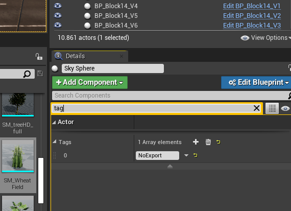
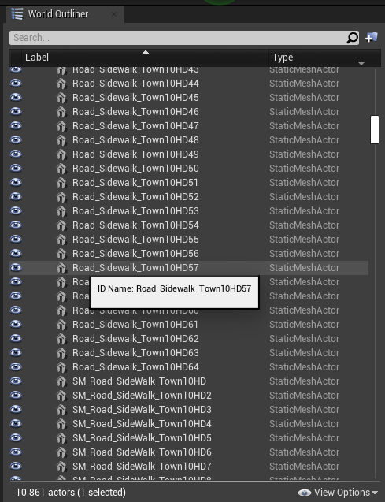
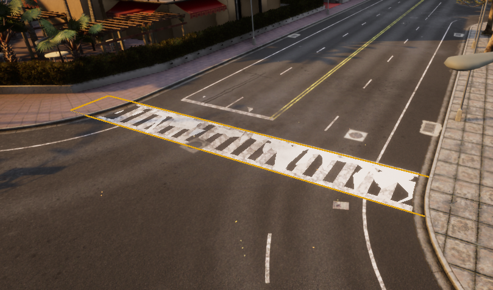

# Import new assets

Assets in CARLA is an umbrella term that includes both maps, and props. The simulator can ingest new assets anytime in a simple process. This not only includes different distribution packages, but also assets developed by the users. 

* [__Prepare the package__](#prepare-the-package)  
	*   [Create the folder structure](#create-the-folder-structure)  
	*   [Create the JSON description](#create-the-json-description)  
* [__Import into CARLA__](#import-into-carla)  
	*   [Via Docker](#via-docker)  
	*   [Via terminal](#via-terminal)  
* [__Additional steps to import a map__](#additional-steps-to-import-a-map)  
	*   [Generate pedestrian navigation](#generate-pedestrian-navigation)  
	*   [Generate collisions](#generate-collisions)  
	*   [Final tips](#final-tips)  

---
## Prepare the package

### Create the folder structure

__1. Create a folder inside `carla/Import`.__ The name of the folder is not relevant.  

__2. Create different subfolders__ for each map to import, and one subfolder for the rest of props.  
&nbsp;&nbsp;&nbsp;__2.1__ Inside the props subfolder, create as many subfolders as props to import. 

__3. Move the files of each asset to the corresponding subfolder.__ A subfolder will contain a specific set of elements.  

*   The mesh of the asset in a `.fbx`.  
*   If the asset is a map, the OpenDRIVE definition in a `.xodr`.  
*   Optionally, the textures required by the asset.  


For instance, an `Import` folder with two separate packages should have a structure similar to the one below.

```sh
Import
│
├── Package01
│   ├── Package01.json
│   ├── Map01
│   │   ├── Asphalt1_Diff.png
│   │   ├── Asphalt1_Norm.png
│   │   ├── Asphalt1_Spec.png
│   │   ├── Grass1_Diff.png
│   │   ├── Grass1_Norm.png
│   │   ├── Grass1_Spec.png
│   │   ├── LaneMarking1_Diff.png
│   │   ├── LaneMarking1_Norm.png
│   │   ├── LaneMarking1_Spec.png
│   │   ├── Map01.fbx
│   │   └── Map01.xodr
│   ├── Map02
│   │   ├── Map02.fbx
│   │   └── Map02.xodr
│   └── Props
│       ├── Prop01
│       │   ├── Prop01_Diff.png
│       │   ├── Prop01_Norm.png
│       │   ├── Prop01_Spec.png
│       │   └── Prop01.fbx
│       └── Prop02
│           └── Prop02.fbx
└── Package02
    ├── Packag02.json
    └── Props
        └── Prop03
            └── Prop03.fbx
```

### Create the JSON description

Create a `.json` file in the root folder of the package. Name the file after the package. Note that this will be the distribution name. The content of the file will describe a JSON array of __maps__ and __props__ with basic information for each of them.  

__Maps__ need the following parameters.  

* __name__ of the map. This must be the same as the `.fbx` and `.xodr` files.  
* __source__ path to the `.fbx`.  
* __use_carla_materials__. If __True__, the map will use CARLA materials. Otherwise, it will use RoadRunner materials.  
* __xodr__ Path to the `.xodr`.  

__Props__ need the following parameters.  

*   __name__ of the prop. This must be the same as the `.fbx`.  
*   __source__ path to the `.fbx`.  
*   __size__ estimation of the prop. The possible values are listed here.  
	*   `tiny`  
	*   `small`  
	*   `medium`  
	*   `big`  
	*   `huge`  
*   __tag__ value for the semantic segmentation. If the tag is misspelled, it will be read as `None`. 
	*   `None`
	*   `Buildings`
	*   `Fences`
	*   `Pedestrians`
	*   `Pole`
	*   `Props`
	*   `RailTrack`
	*   `Road`
	*   `RoadLines`
	*   `Sidewalk`
	*   `Terrain`
	*   `TrafficSigns`
	*   `Vegetation`
	*   `Vehicles`
	*   `Walls`

In the end, the `.json` should look similar to the one below.

```json
{
  "maps": [
    {
      "name": "Map01",
      "source": "./Map01/Map01.fbx",
      "use_carla_materials": true,
      "xodr": "./Map01/Map01.xodr"
    },
    {
      "name": "Map02",
      "source": "./Map02/Map02.fbx",
      "use_carla_materials": false,
      "xodr": "./Map02/Map02.xodr"
    }
  ],
  "props": [
    {
      "name": "MyProp01",
      "size": "medium",
      "source": "./Props/Prop01/Prop01.fbx",
      "tag": "SemanticSegmentationTag01"
    },
    {
      "name": "MyProp02",
      "size": "small",
      "source": "./Props/Prop02/Prop02.fbx",
      "tag": "SemanticSegmentationTag02"
    }
  ]
}
```
---
## Import into CARLA

!!! Warning
    Packages with the same name will produce an error.  

### Via Docker

This is the recommended option. The package will be ingested from start to finish. That means that not only will the package be imported the same way the terminal method would do. 
A [standalone package](tuto_A_standalone_packages.md) will be exported, to facilitate distribution. Besides that, __pedestrian navigation will be generated automatically__.  

That means that importing assets, specially maps, will become and out-of-the-box process.  

__1. Build a Docker image of Unreal Engine.__ Follow [these instructions](https://github.com/carla-simulator/carla/tree/master/Util/Docker). 

__2. Run the script to cook the map.__ In the folder `~/carla/Util/Docker` there is a script that connects with the Docker image previously created, and makes the ingestion automatically. It only needs the path for the input and output files.  

```sh
python docker_tools.py --input ~/path_to_package --output ~/path_for_output_assets
```

__3. Check the output files__. They should be in `Content/Carla/type_of_asset`. Move them in case they are not already there. 

!!! Note
    The Docker image takes 4h and 400GB to be built. However, this is only needed the first time. 

### Via terminal 

This option will read the JSON file, and place the assets inside the `Content` in Unreal Engine. Furthermore, it will create a `Package1.Package.json` file inside the package's
`Config` folder. This will be used to define the props in the blueprint library, expose them in the Python API, and also to export them in a [standalone package](tuto_A_standalone_packages.md) if needed.

When everything is ready, run the command. 

```sh
make import
```

Not using the Docker has some disadvantages when importing maps. There will be a few things to do after the import.  

---
## Additional steps to import a map

The process to import a new map into CARLA is more straightforward than ever. Traffic lights and traffic lights will be created by the simulator when running the simulation using the information in the `.xodr`, so now users don't have to create and set these manually. However, there are still some additional steps to make sure that everything is set properly.  


### Generate pedestrian navigation

!!! Important
    __After a Docker import, only step 3 is needed__, to generate the meshes of the crosswalks. The pedestrian navigation is automatically generated.  

In order to prepare the map for pedestrian navigation, a `.bin` file must be generated. This needs. some settings to be done.  

__1.__ Select the __Skybox object__ and add a tag `NoExport` to it. Otherwise, the map will not be exported, as the size would be too big. 

 

__2.__ Check the name of the meshes. By default, pedestrians will be able to walk over sidewalks, crosswalks, and grass (with minor influence over the rest).  

*   Sidewalk = `Road_Sidewalk`.  
*   Grass = `Road_Grass`.  

 

__3.__ Crosswalks defined inside the `.xodr` remain in the logic of the map, but are not visible. For each of them, create a plane mesh that extends a bit over both sidewalks connected. __Place it overlapping the ground, and disable its physics and rendering__. 

 

!!! Note
    To generate new crosswalks, change the name of the mesh to `Road_Crosswalk`. Avoid doing so if the crosswalk is in the `.xodr`. Otherwise, it will be duplicated. 

__4.__ Name these planes following the common format `Road_Crosswalk_mapname`. 

__5.__ Press `G` to deselect everything, and export the map. `File > Export CARLA...`.  
__6.__ Run RecastDemo `./RecastDemo`.  
__7.__ Change the name of the `.bin` file to be the same as the `mapname.fbx`. Move it into `Content/Carla/Maps/Nav`.  

### Generate map collisions

This is mandatory, otherwise, pedestrians and vehicles will fall into the abyss.

* Select the meshes meant to have colliders.
* Right-click `Asset Actions > Bulk Edit via Property Matrix...`.

  

* Search for _collision_ in Property's Matrix search box.
* Change `Collision complexity` from `Project Default` to `Use Complex Collision As Simple`.

  

* Go to `File > Save All`.


### Final tips

There are a few settings to be done. 

*   __Add and test traffic light timing.__ This are not set automatically, and will need trial and error to fit perfectly with the city.


> _Example: Traffic Signs, Traffic lights and Turn based stop._


*   __Place vehicle spawn points__ 2 to 3 meters above a Route Planner's trigger box, and oriented in the same direction. When the vehicle falls into the trigger box, the autopilot takes control of it.

  

*   __Add the map to the Unreal packaging system.__ Go to the following path and add the level. 
`Edit > Project Settings > Project > Packaging > Show Advanced > List of maps to include...` <br>

  

---

That is all there is to know about the different ways to import new assets into CARLA. If there are any doubts, feel free to post these in the forum. 

<div class="build-buttons">
<p>
<a href="https://forum.carla.org/" target="_blank" class="btn btn-neutral" title="Go to the CARLA forum">
CARLA forum</a>
</p>
</div>


