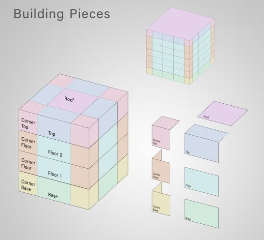

# Map customization tools

There are several tools provided by the CARLA team that allow users to edit maps at will from the Unreal Editor. This tutorial introduces the most relevant tools, according to their purpose. 

*   [__Serial meshes__](#add-serial-meshes)  
	*   [BP_RepSpline](#bp_repspline)  
	*   [BP_Spline](#bp_spline)  
	*   [BP_Wall](#bp_wall)  
	*   [BP_SplinePowerLine](#bp_splinepowerline)  
*   [__Procedural buildings__](#add-serial-meshes)  
	*   [Building structure](#building-structure)  
	*   [Structure modifications](#structure-modifications)  

!!! Important
    This tutorial only applies to users that work with a build from source, and have access to the Unreal Editor. 

---
## Add serial meshes

There is a series of blueprints in `Carla/Blueprints/LevelDesign` that are useful to add props aligned in one direction. All of them use a series of meshes, and a Bezier curve that establishes the path where the props are placed.  

There are differences between them, that make them fit specific purposes. However, the all work the same way. Only the parametrization presents differences.  

* __Initialize the series__. The blueprints need a __Static Mesh__ that will be repeated. Initially, only one element will appear, standing on the starting point of a Bezier curve with two nodes, beginning and ending.  
* __Define the path__. Press __Alt__ over one of the nodes, to create a new one and modify the curve. A new mesh will appear on every node of the curve, and the space between nodes will be filled with elements __separated by a distance__ measure. Adjust the curve using the weights on every node.  
* __Customize the pattern__. This is where the blueprints present differences between each other.  

!!! Warning
    New props will probably interfere with the mesh navigation. If necessary, rebuild that as explained [here](tuto_A_add_map.md#generate-pedestrian-navigation) after doing these changes.

### BP_RepSpline

The blueprint __BP_RepSpline__ adds __individual__ elements along the path defined by a Bezier curve. There are some specificic parameters that change the serialization.  

*   __Distance between__ — Set the distance between elements.  
*   __Offset rotation__ — Set a fixed rotation for the different axis.  
*   __Random rotation__ — Set a range of random rotations for the different axis.  
*   __Offset translation__ — Set a range of random locations along the different axis.  
*   __Max Number of Meshes__ — Set the maximum amount of elements that will be place between nodes of the curve.  
*   __World aligned ZY__ — If selected, the elements will be vertically aligned regarding the world axis.  
*   __Place Mesheson Points__ — If selected, an element will be added in the ending node of the curve.  
*   __Consecutive__ — If selected, ???.  
*   __Collision enabled__ — Set the type of collisions enabled for the meshes.  

### BP_Spline

The blueprint __BP_Spline__ adds __connected__ elements __strictly__ following the path defined by a Bezier curve. The mesh will be warped to fit the path created.  

*   __Gap distance__ — Add a separation between elements.  

### BP_Wall

The blueprint __BP_Wall__ adds __connected__ elements along the path defined by a Bezier curve. The mesh will not be warped to fit the curve, but the nodes will be respected.  

*   __Distance between__ — Set the distance between elements.  
*   __Vertically aligned__ — If selected, the elements will be vertically aligned regarding the world axis.  
*   __Scale offset__ — Scale the length of the mesh to round out the connection between elements.  

### BP_SplinePowerLine

The blueprint __BP_SplinePowerLine__ adds __electricity poles__ along the path defined by a Bezier curve, and __connects them with power lines__.  

This blueprint can be found in `Carla/Static/Pole`. This blueprint allows to set an __array of meshes__ to repeat, to provide variety.  

The power line that connects the pole meshes can be customized.  

*   __Choose the mesh__ that will be used as wire.  
*   __Edit the tension__ value. If `0`, the power lines will be staight. The bigger the value, the looser the connection.  
*   __Set the sockets__. Sockets are empty meshes that represent the connection points of the power line. A wire is created form socket to socket between poles. The amount of sockets can be changed inside the pole meshes.  

!!! Important
    The amount of sockets and their names should be consistent between poles. Otherwise, visualization issues may arise. 

---
## Procedural buildings

The blueprint __BP_Procedural_Building__ in `Content/Carla/Blueprints/LevelDesign` creates a realistic building using key meshes that are repeated along the structure. For each of them, the user can provide an array of meshes that will be used at random for variety. The meshes are only created once, and the repetitions will be instances of the same to save up costs.  

!!! Note
    Blueprints can be used instead of meshes, to allow more variety and customization for the building. Blueprints can use behaviour trees to set illumination inside the building, change the materials used, and much more.  

### Building structure

The key meshes will be updated everytime a change is made, and the building will disappear. Enable __Create automatically__ or click on __Create Building__ to see the new result. 

These key meshes can be percieved as pieces of the building's structure. They can be grouped in four categories.  

*   __Base__ — The ground floor of the building.  
*   __Body__ — The middle floors of the building.  
*   __Roof__ — The highest floor of the building.  

For each of them, there is a __Corner__ mesh that will be placed on the sides of the floor, and a __???__ mesh to fill center. Additionally, the __Roof__ mesh will be the center piece on top of the building.  

The following picture represents the global structure. 

> *The picture above but only most basic structure with result side to side.*  

The __Base parameters__ set the dimensions of the building.  

*   ___Num Floors__ — Floors of the building. Repetitions of the __Body__ meshes.  
*   __Length X and Length Y__ — Area of the building. Repetitions of the central meshes for each side of the building.  

> *Picture as above but with more complex structure. With several floors and repetitions. Cube scheme and final result side to side.*  

### Structure modifications

There are some additional options to modify the general structure of the building.  

*   __Disable corners__ — If selected, no corner meshes will be used.  
*   __Doors__ — Meshes that appear in the ground floor, right in front of the central meshes. The amount of dloors and their location can be set. `0` is the initial position, `1` the next base repetition, and so on.  
*   __Walls__ — Meshes that substitute one or more sides of the building. For example, a plane mesh can be used to paint one side of the building. 

> *Picture for the three of them side to side?*  

---

That is all there is so far, regarding for the PTV-Vissim co-simulation with CARLA. 

Open CARLA and mess around for a while. If there are any doubts, feel free to post these in the forum. 

<a href="https://forum.carla.org/" target="_blank" class="btn btn-neutral" title="Go to the CARLA forum">
CARLA forum</a>

