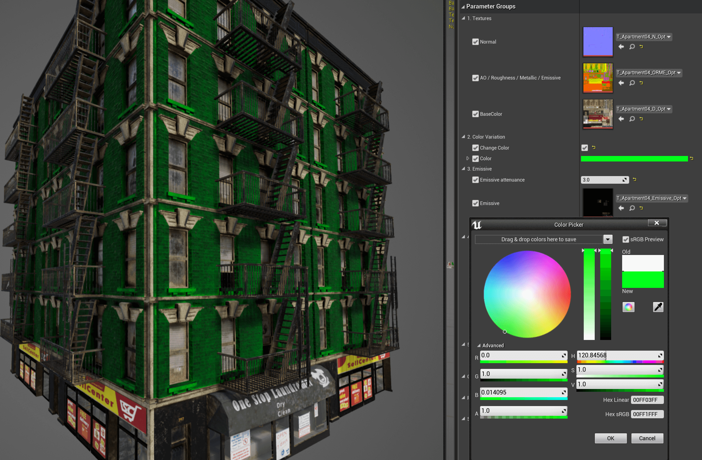
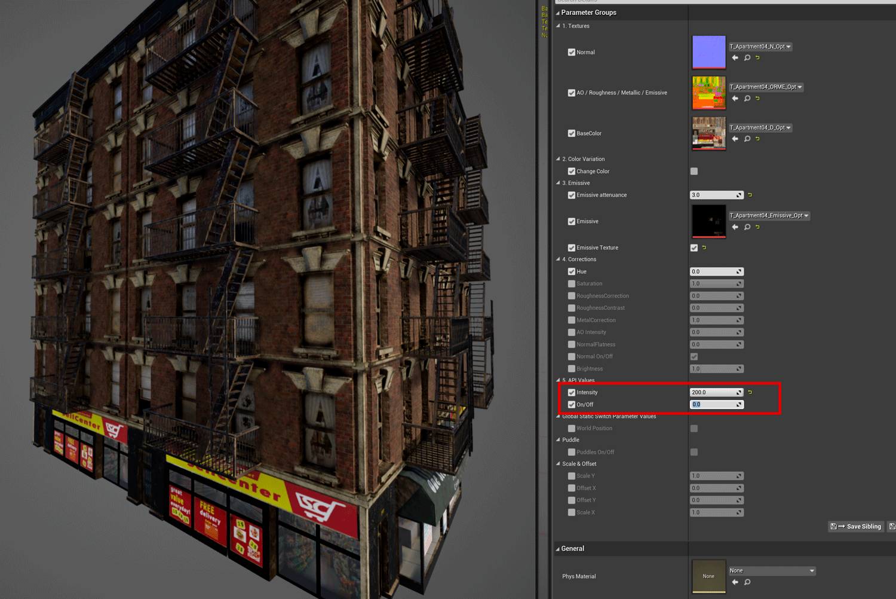
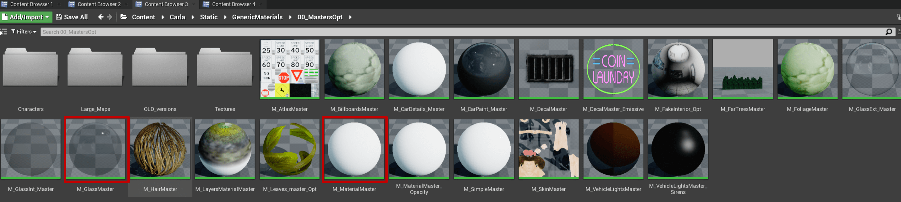

# Material customization

The CARLA team prepares every asset to run under certain default settings. However, users that work in a build from source can modify these to best suit their needs.  

*   [__Car materials__](#car-materials)  
*   [__Customize car materials__](#customize-car-materials)  
	*   [Exterior properties](#exterior-properties)  
*   [__Building materials__](#building-materials)  
*   [__Customize a building material__](#customize-a-building-material)  

!!! Important
    This tutorial only applies to users that work with a build from source, and have access to the Unreal Editor.  

---
## Car materials

In CARLA, there is a set of master materials that are used as templates for the different parts of the vehicle. An instance of these is created for each vehicle model, and then changed to the desired result.  The master materials can be found in `Content/Carla/Static/GenericMaterials/Vehicles`, and these are the following.  

<i>Master materials applied to cars.</i>

*   __M_CarExterior_Master__ — Material applied to the body of the car.  
*   __M_CarInterior_Master__ — Material applied to the inside of the car.  
*   __M_CarLightsGlass_Master__ — Material applied to the glass covering car lights.  
*   __M_CarWindows_Master__ — Material applied to the windows.  
*   __M_CarLicensePlate_Master__ — Material applied to the license plate.  
*   __M_CarVehicleLights_Master__ — Material applied to the car lights as an emissive texure.  
*   __M_CarVehicleLigthsSirens_Master__ — Material applied to the sirens, if applicable.  

---
## Customize car materials

Create instances of the master materials and store them in the corresponding folder for the new model. Here is an example of the instances created for the police car available in the blueprint library, *vehicle.dodge_charger.police*. 

<i>Instanced materials for the police car blueprint.</i>

Generic documentation for materials and how to work with them can be found in the [UE Docs](https://docs.unrealengine.com/en-US/Engine/Rendering/Materials/index.html). All the materials can be modified to a great extent, but only the exterior one has properties worth mentioning. Others have certain properties that can be changed, such as opacity and color in glass materials, but it is not recommended to do so, except for specific purposes.  

### Exterior properties  

The exterior material is applied to the body of the car, and it is the one that can be customized the most. 

*   __Base color__ — Base color of the bodywork.  
*   __Tint shade__ — Tint color which visibility varies depending on the angle of visualization.  

<i>Red car with pink tint. On the left, tint is disabled, on the right, enabled.</i>

*   __Dust__ — A texture of dirt applied to the car. Dust is meant to pile on top of the geometry, and it is barely noticeable in the bottom parts. If the geometry is rotated, the dust will appear on the parts of the vehicle that are on top. 
	*   `Amount` — Opacity of the texture.  
	*   `Color` — Base color of the dust texture.  
	*   `Tiling` — Size and repetition of the dust texture pattern.  
	*   `Thickness` — Density of the dust.  
	*   `Roughness` — Decrease of the car's metallic reflections due to dust.  

<i>Dust property in a car's material.</i>

*   __Flakes__ — Sparkling flakes to the metallic paint of the car.  
	*   `On/Off` — Enables or disables the feature.  
	*   `Scale` — Size of the flakes. 
	*   `Brightness` — Intensity of the sparkle.  
	*   `Color` — Base color of the particles.  

<i>Flakes property in a car's material.</i>

*   __Gain__ — Noise to the base paint of the car. 
	*   __On/Off__ — Enables or disables the feature.  
	*   __Scale__ — Size of the gain.  
	*   __Color__ — Base color of the gain.  

<i>Gain property in a car's material.</i>

*   __Mud__ — A texture of mud applied to the car. Mud appears from the bottom to top of the car.  
	*   `Height` — Portion of the car where mud appears.  
	*   `Mud_Color` — Base color of the mud texture.  
	*   `Mud_Tiling` — Size and repetition of the mud texture pattern.  
	*   `Mud_Thickness` — Density of the mud. 

<i>Mud property in a car's material.</i>

*   __Noise__ — Noise applied to the normal of the material. Creates an orange peel effect.  
	*   `On/Off` — Enables or disables the feature.  
	*   `Scale` — Size of the bumps created by the alteration of the normal map.  

<i>Noise property in a car's material.</i>

*   __Surface__ — Gloss and transparent coating applied to the vehicle's paint. This last step in [automotive paint](https://en.wikipedia.org/wiki/Automotive_paint).  
	*   `ClearCoat` — Opacity of the coating.  
	*   `ClearCoat_Brightness` — Glossiness of the resulting material.  
	*   `ClearCoat_Metallic` — Reflection of the resulting material.  

<i>Visualization of the Surface coating applied to a material.</i>

---
## Building materials

The materials applied to buildings are made of four basic textures that are combined to determine the basic properties of the material.  

*   __Diffuse__ — Contains the basic painting of the material.  
	*   `RGB` — Channels with the base colors.  
	*   `Alpha` — This channel defines a mask that allows to modify the color of the portions in white. This is useful to create some variations from the same material.  

*   __ORME__ — Maps different properties of the material using specific channels.  
	*   `Ambient occlusion` — Contained in the `R` channel.  
	*   `Roughness` — Contained in the `G` channel.  
	*   `Metallic map` — Contained in the `B` channel.  
	*   `Emissive mask` — Contained in the `Alpha` channel. This mask allows to change the emissive color and intensity of the portions in white.  

*   __Normal__ — Contains the normal map of the material.  
	*   `RGB` — The normal map information.  

*   __Emissive__ — If applicable, this texture is used to set the emissive base colors of the texture.  
	*   `RGB` — Color information for the emissive elements in the texture.  

---
## Customize a building material

Similarly to car materials, a building material can be greatly changed if desired, but it is only recommended if the user has some expertise with Unreal Engine. However, there is some customization available for the two main shaders that buildings use.  

*   __Glass shader__ — `M_GlassMaster`.  
	*   `Opacity` — Enable color changes on the white area on the __Diffuse__ `Alpha` texture.  
	*   `Color` — Tint to be applied based on the white area on the __Diffuse__ `Alpha` texture.  

*   __Building shader__ — `M_MaterialMaster`  
	*   `Change Color` — Enable color changes on the white area on the __Diffuse__ `Alpha` texture.  
	*   `Color` — Tint to be applied based on the white area on the __Diffuse__ `Alpha` texture.  
	*   `Emissive Texture` — Enable the usage of an __Emissive__ texture.  
	*   `EmissiveColor` — Tint to be applied based on the white area on the __ORME__ `Emissive mask` texture.
	*   `Emissive atenuance` — Factor that divides the intensity stated in __BP_Lights__ to obtain proper emissive values.  
	*   `RoughnessCorrection` — Changes the intensity of the roughness map.  
	*   `MetallicCorrection` — Changes the intensity of the metallic map.  
	*   `NormalFlatness` — Changes the intensity of the normal map.  

---

That is a wrap on the most remarkable ways users can customize the materials of vehicles and buildings. 

Any doubts that may arise are more than welcomed in the forum.

<a href="https://github.com/carla-simulator/carla/discussions/" target="_blank" class="btn btn-neutral" title="Go to the CARLA forum">
CARLA forum</a>

