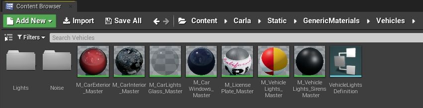
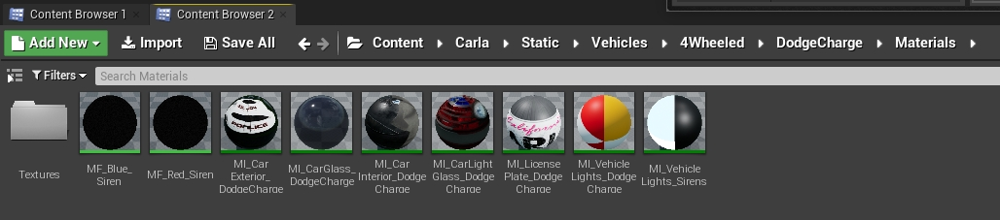
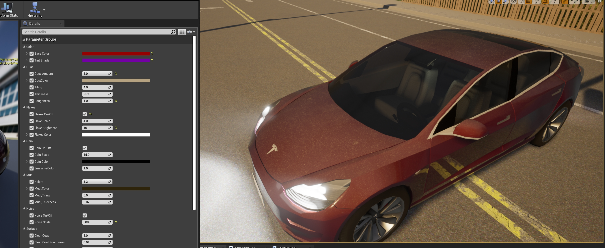
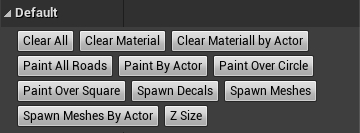
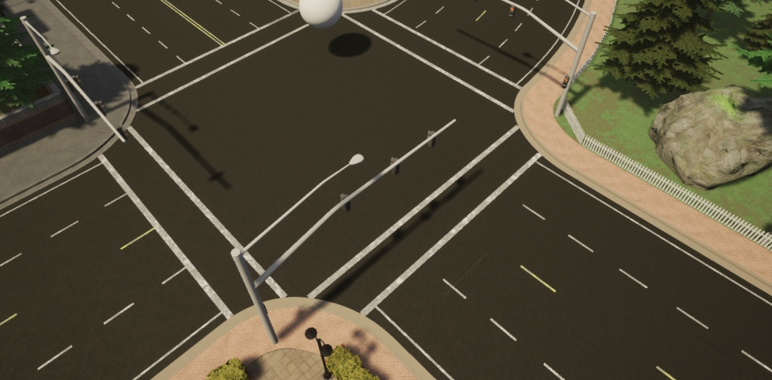
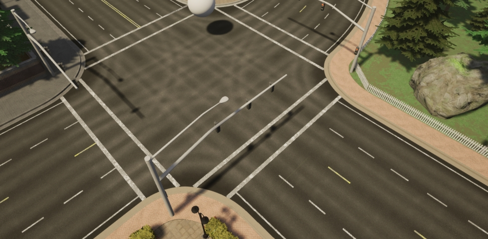
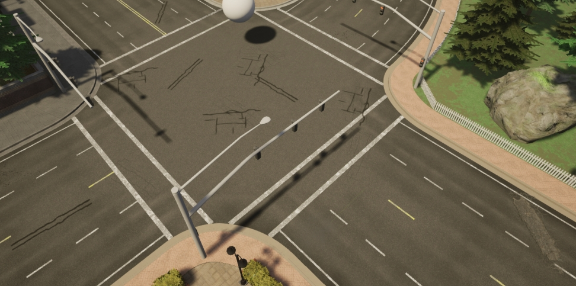

# Material customization

The CARLA team prepares every asset to run under certain default settings. However, users that work in a build from source can modify these to best suit their needs.  

*   [__Car materials__](#car-materials)  
*   [__Customize car materials__](#customize-car-materials)  
	*   [Exterior properties](#exterior-properties)  
*   [__Building material__](#building-material)  
*   [__Customize a building material__](#customize-a-building-material)  
*   [__Customize the road__](#customize-the-road)  
	*   [Create a group material](#create-a-group-material)  
	*   [Change the appearance of the road](#change-the-appearance-of-the-road)  
	*   [Update the appearance of lane markings](#update-the-appearance-of-lane-markings)  

!!! Important
    This tutorial only applies to users that work with a build from source, and have access to the Unreal Editor.  

---
## Car materials

In CARLA, there is a set of master materials that are used as templates for the different parts of the vehicle. An instance of these is created for each vehicle model, and then changed to the desired result.  The master materials can be found in `Content/Carla/Static/GenericMaterials/Vehicles`, and these are the following.  

<i>Master materials applied to cars.</i>

*   __M_CarExterior_Master__ — Material applied to the body of the car.  
*   __M_CarInterior_Master__ — Material applied to the inside of the car.  
*   __M_CarLightsGlass_Master__ — Material applied to the glass covering car lights.  
*   __M_CarWindows_Master__ — Material applied to the windows.  
*   __M_CarLicensePlate_Master__ — Material applied to the license plate.  
*   __M_CarVehicleLights_Master__ — Material applied to the car lights as an emissive texure.  
*   __M_CarVehicleLigthsSirens_Master__ — Material applied to the sirens, if applicable.  

---
## Customize car materials

Create instances of the master materials and store them in the corresponding folder for the new model. Here is an example of the instances created for the police car available in the blueprint library, *vehicle.dodge_charger.police*. 

<i>Instanced materials for the police car blueprint.</i>

Generic documentation for materials and how to work with them can be found in the [UE Docs](https://docs.unrealengine.com/en-US/Engine/Rendering/Materials/index.html). All the materials can be modified to a great extent, but only the exterior one has properties worth mentioning. Others have certain properties that can be changed, such as opacity and color in glass materials, but it is not recommended to do so, except for specific purposes.  

### Exterior properties  

The exterior material is applied to the body of the car, and it is the one that can be customized the most. 

*   __Base color__ — Base color of the bodywork.  
*   __Tint shade__ — Tint color which visibility varies depending on the angle of visualization.  

<i>Red car with pink tint. On the left, tint is disabled, on the right, enabled.</i>

*   __Dust__ — A texture of dirt applied to the car. Dust is meant to pile on top of the geometry, and it is barely noticeable in the bottom parts. If the geometry is rotated, the dust will appear on the parts of the vehicle that are on top. 
	*   `Amount` — Opacity of the texture.  
	*   `Color` — Base color of the dust texture.  
	*   `Tiling` — Size and repetition of the dust texture pattern.  
	*   `Thickness` — Density of the dust.  
	*   `Roughness` — Decrease of the car's metallic reflections due to dust.  

<i>Dust property in a car's material.</i>

*   __Flakes__ — Sparkling flakes to the metallic paint of the car.  
	*   `On/Off` — Enables or disables the feature.  
	*   `Scale` — Size of the flakes. 
	*   `Brightness` — Intensity of the sparkle.  
	*   `Color` — Base color of the particles.  

<i>Flakes property in a car's material.</i>

*   __Gain__ — Noise to the base paint of the car. 
	*   __On/Off__ — Enables or disables the feature.  
	*   __Scale__ — Size of the gain.  
	*   __Color__ — Base color of the gain.  

<i>Gain property in a car's material.</i>

*   __Mud__ — A texture of mud applied to the car. Mud appears from the bottom to top of the car.  
	*   `Height` — Portion of the car where mud appears.  
	*   `Mud_Color` — Base color of the mud texture.  
	*   `Mud_Tiling` — Size and repetition of the mud texture pattern.  
	*   `Mud_Thickness` — Density of the mud. 

<i>Mud property in a car's material.</i>

*   __Noise__ — Noise applied to the normal of the material. Creates an orange peel effect.  
	*   `On/Off` — Enables or disables the feature.  
	*   `Scale` — Size of the bumps created by the alteration of the normal map.  

<i>Noise property in a car's material.</i>

*   __Surface__ — Gloss and transparent coating applied to the vehicle's paint. This last step in [automotive paint](https://en.wikipedia.org/wiki/Automotive_paint).  
	*   `ClearCoat` — Opacity of the coating.  
	*   `ClearCoat_Brightness` — Glossiness of the resulting material.  
	*   `ClearCoat_Metallic` — Reflection of the resulting material.  

<i>Visualization of the Surface coating applied to a material.</i>

---
## Building materials

The materials applied to buildings are made of four basic textures that are combined to determine the basic properties of the material.  

*   __Diffuse__ — Contains the basic painting of the material.  
	*   `RGB` — Channels with the base colors.  
	*   `Alpha` — This channel defines a mask that allows to modify the color of the portions in white. This is useful to create some variations from the same material.  

*   __ORME__ — Maps different properties of the material using specific channels.  
	*   `Ambient occlusion` — Contained in the `R` channel.  
	*   `Roughness` — Contained in the `G` channel.  
	*   `Metallic map` — Contained in the `B` channel.  
	*   `Emissive mask` — Contained in the `Alpha` channel. This mask allows to change the emissive color and intensity of the portions in white.  

*   __Normal__ — Contains the normal map of the material.  
	*   `RGB` — The normal map information.  

*   __Emissive__ — If applicable, this texture is used to set the emissive base colors of the texture.  
	*   `RGB` — Color information for the emissive elements in the texture.  

---
## Customize a building material

Similarly to car materials, a building material can be greatly changed if desired, but it is only recommended if the user has some expertise with Unreal Engine. However, there is some customization available for the two main shaders that buildings use.  

*   __Glass shader__ — `M_CarWindows_Master`.  
	*   `Opacity` — Enable color changes on the white area on the __Diffuse__ `Alpha` texture.  
	*   `Color` — Tint to be applied based on the white area on the __Diffuse__ `Alpha` texture.  

*   __Building shader__ — `M_Building_Master`  
	*   `Change Color` — Enable color changes on the white area on the __Diffuse__ `Alpha` texture.  
	*   `Color` — Tint to be applied based on the white area on the __Diffuse__ `Alpha` texture.  
	*   `Emissive Texture` — Enable the usage of an __Emissive__ texture.  
	*   `EmissiveColor` — Tint to be applied based on the white area on the __ORME__ `Emissive mask` texture.
	*   `Emissive atenuance` — Factor that divides the intensity stated in __BP_Lights__ to obtain proper emissive values.  
	*   `RoughnessCorrection` — Changes the intensity of the roughness map.  
	*   `MetallicCorrection` — Changes the intensity of the metallic map.  
	*   `NormalFlatness` — Changes the intensity of the normal map.  

---
## Customize the road

__RoadPainter__ is a tool that uses OpenDRIVE information to paint roads. To be able to do so, a blueprint is used, which uses a master material, a render target of the road as canvas, and additional decals and meshes. The master material grous a collection of materials that will be used by the blueprint, using brushes to blend their application.  
This makes for an easy way to change drastically the appearence of the road. The initial geometry of the road is painted like a canvas. There is no need to apply photometry techniques nor consider the UVs of the geometry. The result is achieved simply by blending textures and creating masks.  

### Create a group material

First of all, a group material will be created. This will contain the instances of the materials the road will be painted with.  

__1. Create an instance of the RoadMaster material.__ It can be found in `Game/Carla/Static/GenericMaterials/RoadPainterMaterials`.  

<i>Panel to set materials to be applied on the road.</i>

__2. Set the `RenderTarget`.__ [Create a render target](https://docs.unrealengine.com/en-US/Engine/Rendering/RenderTargets/BlueprintRenderTargets/HowTo/CreatingTextures/index.html) for the road map that is being used. In `Texture Parameter Values` enable `Texture mask` and add the texture.  

<i>Panel where the Render Target should be set.</i>

__3. Set the map size.__ In `Scalar Parameter Values` the field `Map units (CM)`. If the size is not known, use a temporary value. The real size of the map can be retrieved later, when using the blueprint. 
__4. Choose the materials to be applied.__ There is space for one base material and three additional materils that will be used to paint over the base one. The painting information will be stored in the RGB channels of a RenderTarget, one channel per material. Add them to the fields `Base Material`, `Material 1`, `Material 2`, and `Material 3`.  

### Change the appearance of the road

The appearence of the road is changed using a blueprint provided by CARLA. The blueprint will paint the road using the materials passed, combined with some brush settings. Additionally, decals and meshes can be added so that the final result is more detailed. This tool takes into account road information and will paint the elements using the orientation of the lane, unless an offset is stated.  

!!! Note 
    This tool does not interfere with the weather settings that change the road's appearence, such as wetness or precipitation.  

__1. Create an instance of the RoadPainter blueprint.__ It can be found in `Carla/Blueprints/LevelDesign`. This blueprint determines how is the road being painted, and how are the materials in `RoadMaster` being used.  
__2. Set the `RenderTarget` and the `Map size`.__ In the `Paint` category. These must be the same as in the __RoadMaster__ material.  

<i>Panels in group material and road blueprint where  the Render Target and Map Size values should match.</i>

!!! Note 
    The `Z-size` option in the `Default` panel will give you the exact size of the map. Increase this by a little and make sure both, the blueprint and the master material have the same value.  

__3. Apply the group material.__ Select all the road meshes and apply the instance.

__4. For each material, set the brush to be used.__ There are different brushes available in `GenericMaterials/RoadStencil/Alphas`. The materials will be applied over the road using the brush and parameters stated here.  

* `Stencil size` — Size of the brush. 
* `Brush strength` — Roughness of the outline.  
* `Spacebeween Brushes` — Distance between strokes.  
* `Max Jitter` — Size variation of the brush between strokes.  
* `Stencil` — The brush to be used.  
* `Rotation` — Rotation applied to the stroke.  

<i>Brush panel.</i>

<i>Different types of brushes.</i>

__5. For each material, apply it to the desired portions of the road.__ In the `Default` section, there is a series of buttons to choose how materials are applied.  

* `Paint all roads` — Applies the brush to all the road.  
* `Paint by actor` — Paints a specific actor being selected.  
* `Paint over circle` — Paints using a circular pattern, useful to provide variation.  
* `Paint over square` — Paints using a square pattern, useful to provide variation.  

This section also contains options to erase the changes applied.  

* `Clear all` — Erases all the painting applied by the blueprint.  
* `Clear materials` — Remove the materials currently active.  
* `Clear material by actor` — Removes material closest to the actor selected.  

<i>Different painting and erasing options.</i>

!!! Note 
    Move the editor view a little for the changes to be visible.  

__5. Add decals and meshes.__ Add the elements to the corresponding array and set some basic parameters for how should these be spawned over the road.  

* `Decal/Mesh Scale` — Scale of the decal/mesh per axis.  
* `Fixed Decal/Mesh Offset` — Deviation from the center of the lane per axis.  
* `Decal/Mesh Random Offset` — Max deviation from the center of the lane per axis.  
* `Decal/Mesh Random Yaw` — Max random yaw rotation.  
* `Decal/Mesh Min Scale` — Minimum random scale applied to the decal/mesh.  
* `Decal/Mesh Max Scale` — Max random scale applied to the decal/mesh.  

<i>Decals and Meshes panels.</i>

__6. Spawn the decals and meshes.__ Use the buttons `Spawn decals` and `Spawn meshes` to do so. 

__7. Play around.__ Try different settings, materials and brushes to obtain completely different results. This tool allows to create different presets for the road appearence and changing between them simply by changing the group material and updating a few settings.  

Here is an example of the how the appearence of the road changes along the previous steps. 

<i>Example of base road material.</i>

<i>Example after material 1 is applied.</i>

<i>Example after material 2 is applied.</i>

<i>Example after material 3 is applied.</i>

<i>Example after decals are applied.</i>

<i>Example after meshes are applied.</i>

### Update the appearance of lane markings

After the road's appearance has been customized, the lane markings should be updated accordingly to get a realistic look. The process to do so, is really simple.  

__1. Create a copy of the group material.__ This has be the same as it was for the road.  
__2. Select the lane marking meshes.__ 
__3. Mark them as lane markings.__ In `Static Switch Parameter Values` enable `LaneMark`. This will update the lane markings to be consistent to the painting applied to the road.  
__4. Choose the color of the lane marking.__ In `Texture` set the `LaneColor` to the value desired. This will set the lane markings selected to have a base paint of the stated color.  

---

That is a wrap on the most remarkable ways users can customize the materials of vehicles and buildings. 

Any doubts that may arise are more than welcomed in the forum.

<a href="https://forum.carla.org/" target="_blank" class="btn btn-neutral" title="Go to the CARLA forum">
CARLA forum</a>

