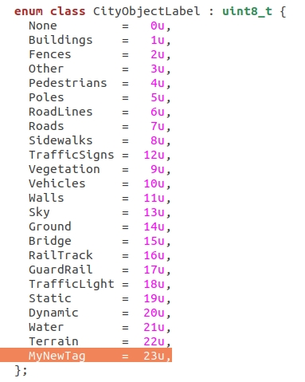
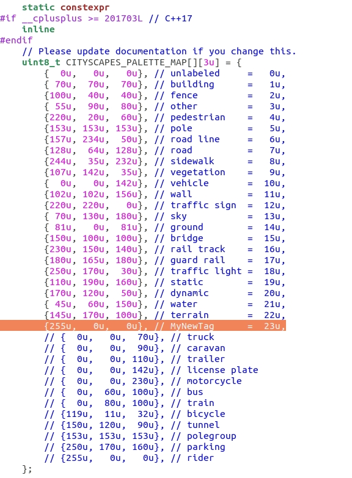

# Create semantic tags

Learn how to define customized tags for semantic segmentation. These can additionally be added to [carla.CityObjectLabel](python_api.md#carla.CityObjectLabel) to filter the bounding boxes that [carla.World](python_api.md#carla.World) retrieves.  

*   [__Create a new semantic tag__](#create-a-new-semantic-tag)  
	*   [1. Create the tag ID](#1-create-the-tag-id)  
	*   [2. Create the UE folder for assets](#2-create-the-ue-folder-for-assets)  
	*   [3. Create two-way correspondence between UE and the code tag](#3-create-two-way-correspondence-between-ue-and-the-code-tag)  
	*   [4. Define a color code](#4-define-a-color-code)  
	*   [5. Add the tagged elements](#5-add-the-tagged-elements)  
*   [__Add a tag to carla.CityObjectLabel__](#add-a-tag-to-carlacityobjectlabel)  

---

## Create a new semantic tag

### 1. Create the tag ID

__Open `ObjectLabel.h`__ in `LibCarla/source/carla/rpc`. Add your new tag by the end of the enum using the same formatting as the rest.  

!!! Note
    Tags do not have to appear in order. However, it is good practice to list them in order. 

### 2. Create the UE folder for assets

__Open the Unreal Engine Editor__ and go to `Carla/Static`. Create a new folder named as your tag. 

!!! Note
    The UE folder and the tag do not necessarily have to be named the same. However, it is good practice to do so.  

### 3. Create two-way correspondence between UE and the code tag

__3.1. Open `Tagger.cpp`__ in `Unreal/CarlaUE4/Plugins/Carla/Source/Carla/Game`. Go to __`GetLabelByFolderName`__ Add the your tag by the end of the list. The string being compared is the name of the UE folder used in [__2.__](#2-create-the-ue-folder-for-assets), so use the exact same name here.  

__3.2. Go to `GetTagAsString`__ in the same `Tagger.cpp`. Add the new tag by the end of the switch.  

### 4. Define a color code

__Open `CityScapesPalette.h`__ in `LibCarla/source/carla/image`. Add the color code of your new tag by the end of the array. 

!!! Warning
    The position in the array must correspond with the tag ID, in this case, `23u`. 

### 5. Add the tagged meshes

The new semantic tag is ready to be used. Only the meshes stored inside the UE folder of a tag are tagged as such. Move or import the corresponding meshes to the new folder, in order for the to be tagged properly. 

---

## Add a tag to [carla.CityObjectLabel](python_api.md#carla.CityObjectLabel)

This step is not directly related with semantic segmentation. However, these tags can be used to filter the bounding box query in [carla.World](python_api.md#carla.World). In order to do this, the tag must be added to the [carla.CityObjectLabel](python_api.md#carla.CityObjectLabel) enum in the PythonAPI.  

__Open `World.cpp`__ in `carla/PythonAPI/carla/sourc/libcarla` and add the new tag by the end of the enum.  

---

Read the **[F.A.Q.](build_faq.md)** page or post in the [CARLA forum](https://forum.carla.org/c/installation-issues/linux) for any issues, doubts or suggestions.  

What's next?

<a href="../ref_sensors" target="_blank" class="btn btn-neutral" title="Learn all about sensors in CARLA">
Sensors reference</a>

<a href="../tuto_A_add_props" target="_blank" class="btn btn-neutral" title="Learn how to import your custom into CARLA">
Add new props</a>

