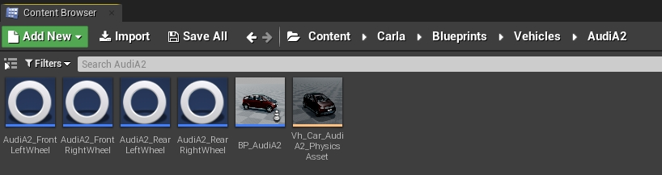

# Customize vehicle suspension

This tutorial covers the basics of the suspension system for CARLA vehicles, and how are these implemented for the different vehicles available. Use this information to access the suspension parameterization of a vehicle in Unreal Engine, and customize it at will.  

*   [__Basics of the suspension system__](#basics-of-the-suspension-system)  
*   [__Suspension groups__](#suspension-groups)  
	*   [Coupe](#coupe)  
	*   [Off-road](#off-road)  
	*   [Truck](#truck)  
	*   [Urban](#urban)  
	*   [Van](#van)  

---
## Basics of the suspension system

The suspension system of a vehicle is defined by the wheels of said vehicle. Each wheel has an independent blueprint with some parameterization, which includes the suspension system. 

These blueprints can be found in `Content/Carla/Blueprints/Vehicles/<vehicle_name>`. They are named such as: `BP_<vehicle_name>_<F/R><R/L>W`.  

*   `F` or `R` is used for front or rear wheels correspondingly.  
*   `R` or `L` is used for right or left wheels correspondingly.  

<i>In this example, the blueprint of the front left wheel of the Audi A2 is named as <code>BP_AudiA2_FLW</code>.</i>

`shape_radius` for the wheel to rest over the road, neither hovering nor inside of it. 

Inside the blueprint, there is a section with some parameterization regarding the suspension of the wheel. Here are their definitions as described in Unreal Engine.  

*   `Suspension Force Offset` — Vertical offset from where suspension forces are applied (along Z axis). 
*   `Suspension Max Raise` — How far the wheel can go above the resting position. 
*   `Suspension Max Drop` — How far the wheel can drop below the resting position. 
*   `Suspension Natural Frequency` — Oscillation frequency of the suspension. Standard cars have values between `5` and `10`. 
*   `Suspension Damping Ratio` — The rate at which energy is dissipated from the spring. Standard cars have values between `0.8` and `1.2`. Values `<1` are more sluggish, values `>1` are more twitchy.  
*   `Sweep Type` — Wether wheel suspension considers simple, complex or both.  

<i>The Suspension panel inside a wheel blueprint.</i>

!!! Note
    By default, all the wheels of a vehicle have the same parameterization in CARLA. The following explanations will be covered per vehicle, instead of per wheel.  

---
## Suspension groups

According to their system suspension, vehicles in CARLA can be classified in five groups. All the vehicles in a group have the same parameterization, as they are expected to have a similar behaviour on the road. The suspension of a vehicle can be modified at will, and is no subject to these five groups. However understanding these, and observing their behaviour in the simulation can be of great use to define a custom suspension.  

The five groups are: *Coupe*, *Off-road*, *Truck*, *Urban*, and *Van*. In closer observation, the parameterization of these groups follows a specific pattern.  

| Stiff suspension | Coupe            | Urban            | Van              | Off-road         | Truck            | Soft suspension  |
| ---------------- | ---------------- | ---------------- | ---------------- | ---------------- | ---------------- | ---------------- |

 

When moving from a soft to a stiff suspension, there are some clear tendencies in the parameterization.  

*   __Decrease__ of `Suspension Max Raise` and `Suspension Max Drop` — Stiff vehicles are meant to drive over plane roads with no bumps. For the sake of aerodynamics, the chassis is not supposed to move greatly, but remain constantly close to the ground.  
*   __Increase__ of `Suspension Damping Ratio` — The absortion of the bouncing by the dampers is greater for stiff vehicles.  

### Coupe

Vehicles with the stiffest suspension.  

| Parameterization   | Vehicles       |
| -------------------------------------------------------------------------------------------------- | -------------------------------------------------------------------------------------------------- |
| `Suspension Force Offset` — `0.0` `Suspension Max Raise` — `7.5` `Suspension Max Drop` — `7.5` `Suspension Natural Frequency` — `9.5` `Suspension Damping Ratio` — `1.0` `Sweep Type` — `SimpleAndComplex`  | `vehicle.audi.tt` `vehicle.lincoln.mkz2017` `vehicle.mercedes-benz.coupe` `vehicle.seat.leon` `vehicle.tesla.model3`                                                                                             |

### Off-road

Vehicles with a soft suspension.  

| Parameterization    | Vehicles     |
| ----------------------------------------------------------------------------------------------------- | ----------------------------------------------------------------------------------------------------- |
| `Suspension Force Offset` — `0.0` `Suspension Max Raise` — `15.0` `Suspension Max Drop` — `15.0` `Suspension Natural Frequency` — `7.0` `Suspension Damping Ratio` — `0.5` `Sweep Type` — `SimpleAndComplex`  | `vehicle.audi.etron` `vehicle.jeep.wrangler_rubicon` `vehicle.nissan.patrol` `vehicle.tesla.cybertruck`      |

### Truck

Vehicles with the softest suspension.  

| Parameterization                                                                                                                                                                                                                          | Vehicles                                                                                                                                                                                                                                  |
| ----------------------------------------------------------------------------------------------------------------------------------------------------------------------------------------------------------------------------------------- | ----------------------------------------------------------------------------------------------------------------------------------------------------------------------------------------------------------------------------------------- |
| `Suspension Force Offset` — `0.0` `Suspension Max Raise` — `17.0` `Suspension Max Drop` — `17.0` `Suspension Natural Frequency` — `6.0` `Suspension Damping Ratio` — `0.4` `Sweep Type` — `SimpleAndComplex`  | `vehicle.carlamotors.carlacola`                                                                                                                                                                                                        |
 

### Urban

Vehicles with a soft suspension.  

| Parameterization                                                                                                                                                                                                                                                       | Vehicles                                                                                                                                                                                                                                                               |
| ---------------------------------------------------------------------------------------------------------------------------------------------------------------------------------------------------------------------------------------------------------------------- | ---------------------------------------------------------------------------------------------------------------------------------------------------------------------------------------------------------------------------------------------------------------------- |
| `Suspension Force Offset` — `0.0` `Suspension Max Raise` — `8.0` `Suspension Max Drop` — `8.0` `Suspension Natural Frequency` — `9.0` `Suspension Damping Ratio` — `0.8` `Sweep Type` — `SimpleAndComplex`                                 | `vehicle.audi.a2` `vehicle.bmw.grandtourer` `vehicle.chevrolet.impala` `vehicle.citroen.c3` `vehicle.dodge_charger.police` `vehicle.mini.cooperst` `vehicle.mustang.mustang` `vehicle.nissan.micra` `vehicle.toyota.prius`  |

 

### Van

Vehicles with a middle-ground suspension.  

| Parameterization    | Vehicles    |
| -------------------------------------------------------------------- | -------------------------------------------------------------------- |
| `Suspension Force Offset` — `0.0` `Suspension Max Raise` — `9.0` `Suspension Max Drop` — `9.0` `Suspension Natural Frequency` — `8.0` `Suspension Damping Ratio` — `0.8` `Sweep Type` — `SimpleAndComplex`  |  `vehicle.volkswagen.t2`     |

---

Use the forum to post any doubts, issues or suggestions regarding this topic.  

<a href="https://github.com/carla-simulator/carla/discussions/" target="_blank" class="btn btn-neutral" title="Go to the CARLA forum">
CARLA forum</a>

Here are some advised readings after this one.  

<a href="../tuto_G_control_vehicle_physics" target="_blank" class="btn btn-neutral" title= "Set runtime changes on a vehicle physics.">
Control vehicle physics</a>

<a href="../tuto_G_add_friction_triggers" target="_blank" class="btn btn-neutral" title= "Define dynamic box triggers for wheels.">
Add friction triggers</a>

<a href="../tuto_D_generate_colliders" target="_blank" class="btn btn-neutral" title="Create detailed colliders for vehicles">
Generate detailed colliders</a>

