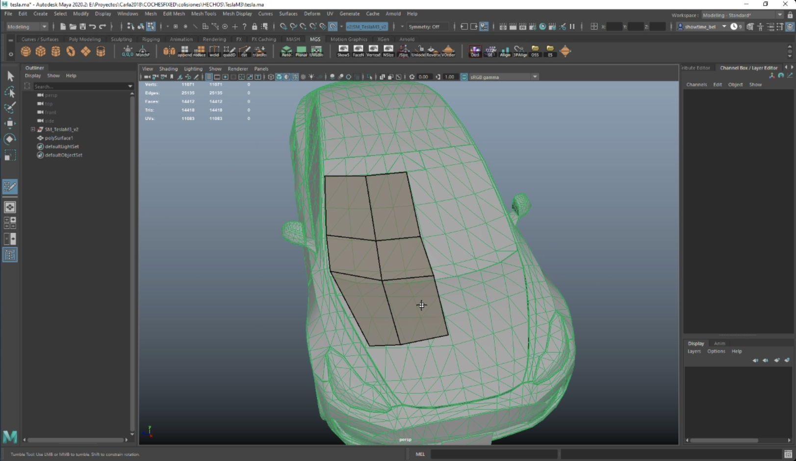
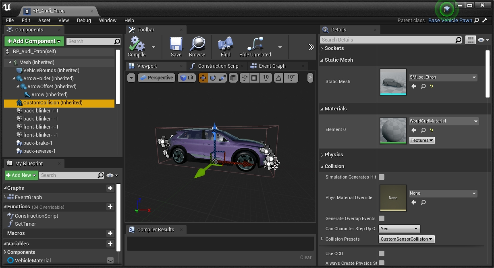
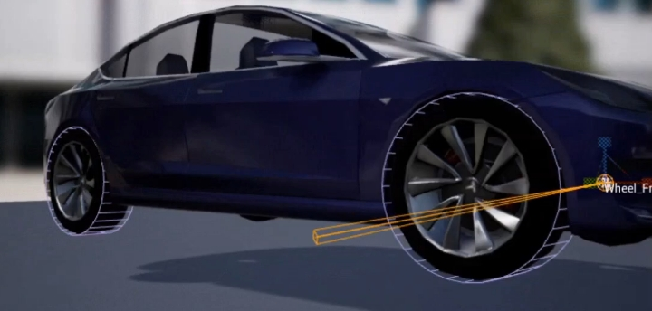
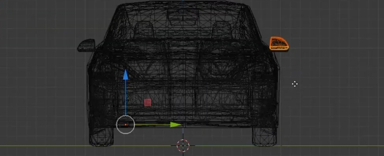
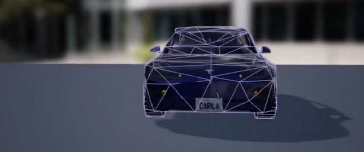

# 상세 콜라이더 생성하기

이 튜토리얼에서는 차량의 원래 형태에 더 가깝고 정확한 충돌 경계를 생성하는 방법을 설명합니다. 이러한 콜라이더는 물리적 충돌 감지에 사용되거나, LIDAR와 같은 레이캐스트 기반 센서에서 더 정확한 데이터를 얻기 위한 보조 콜라이더로 활용될 수 있습니다. 새로운 콜라이더는 CARLA에 통합되어 커뮤니티 전체가 혜택을 받을 수 있습니다. 콘텐츠 저장소에 기여하는 방법에 대해 자세히 알아보려면 [여기](cont_contribution_guidelines.md)를 참조하세요.

새로운 콜라이더를 만드는 데는 두 가지 접근 방식이 있으며, 각각의 특성이 다릅니다.

* __레이캐스트 콜라이더__ — 이 방식은 기본적인 3D 모델링 기술이 필요합니다. 차량에 보조 콜라이더를 추가하여 LIDAR와 같은 레이캐스트 기반 센서가 더 정확한 데이터를 얻을 수 있게 합니다.
* __물리 콜라이더__ — 이 방식은 기여자 __[Yan Kaganovsky / yankagan](https://github.com/yankagan)__ 이 작성한 [튜토리얼](https://bitbucket.org/yankagan/carla-content/wiki/Home)을 따라 수동 모델링 없이 메시를 생성합니다. 이 메시는 차량의 주 콜라이더로 사용되어 물리 및 센서 감지에 활용됩니다(보조 콜라이더가 추가되지 않은 경우).

---

* [__레이캐스트 콜라이더__](#raycast-colliders)
  * [1-차량 FBX 내보내기](#1-export-the-vehicle-fbx)
  * [2-저밀도 메시 생성](#2-generate-a-low-density-mesh) 
  * [3-UE에 메시 가져오기](#3-import-the-mesh-into-ue)
  * [4-메시를 콜라이더로 추가](#4-add-the-mesh-as-collider)

---

* [__물리 콜라이더__](#physics-colliders)
  * [0-사전 준비사항](#0-prerequisites)
  * [1-언리얼 에디터에서 휠의 커스텀 충돌 정의](#1-define-custom-collision-for-wheels-in-unreal-editor)
  * [2-차량을 FBX로 내보내기](#2-export-the-vehicle-as-fbx)
  * [3~4-Blender로 가져오기 및 커스텀 경계 생성](#3-to-4-import-to-blender-and-create-custom-boundary)
  * [5-Blender에서 FBX로 내보내기](#5-export-from-blender-to-fbx)
  * [6~8-콜라이더 가져오기 및 물리 정의](#6-to-8-import-collider-and-define-physics)
## 레이캐스트 콜라이더

### 1-차량 FBX 내보내기

우선 원본 차량 메시가 참조용으로 필요합니다. 이 튜토리얼에서는 학습을 위해 CARLA 차량의 메시를 내보내보겠습니다.
__1.1__ CARLA를 UE에서 열고 `Content/Carla/Static/Vehicles/4Wheeled/<차량_모델>`로 이동합니다.
__1.2__ `SM_<차량_모델>`을 `우클릭`하여 차량 메시를 FBX로 내보냅니다.

### 2-저밀도 메시 생성

__2.1__ 3D 모델링 소프트웨어를 열고 원본 메시를 참조하여 원형을 충실히 반영하면서도 저밀도인 메시를 모델링합니다.

__2.2__ 새로운 메시를 FBX로 저장합니다. 메시 이름은 `sm_sc_<차량_모델>.fbx` 형식으로 지정합니다. 예: `sm_sc_audiTT.fbx`

!!! 참고
    휠과 루프, 머드가드 등의 추가 요소의 경우 새로운 메시가 원래 형상을 상당히 정확하게 따라야 합니다. 단순한 큐브를 배치하는 것만으로는 충분하지 않습니다.

### 3-UE에 메시 가져오기

__3.1__ CARLA를 UE에서 열고 `Content/Carla/Static/Vehicles/4Wheeled/<차량_모델>`로 이동합니다.
__3.2__ `우클릭`하여 새로 만든 메시 `SM_sc_<차량_모델>.fbx`를 가져옵니다.

### 4-메시를 콜라이더로 추가

__4.1__ `Content/Carla/Blueprints/Vehicles/<차량_모델>`로 이동하여 `BP_<차량_모델>`이라는 이름의 차량 블루프린트를 엽니다.

__4.2__ `CustomCollision` 요소를 선택하고 `Static mesh` 속성에 `SM_sc_<차량_모델>.fbx`를 추가합니다.

__4.3__ 상단 툴바에서 `Compile`을 누르고 변경사항을 저장합니다.

!!! 참고
    오토바이와 자전거 같은 차량의 경우, 동일한 `CustomCollision` 컴포넌트를 사용하여 차량 자체의 콜라이더 메시를 변경합니다.
## 물리 콜라이더

!!! 중요
    이 튜토리얼은 __[yankagan](https://github.com/yankagan)__의 [기여](https://bitbucket.org/yankagan/carla-content/wiki/Home)를 기반으로 합니다! 기여자는 UE에서 커스텀 충돌을 가져오는 방법에 대한 [튜토리얼](https://www.youtube.com/watch?v=SEH4f0HrCDM)을 제공한 __Francisco E__에게도 감사의 뜻을 전합니다.

[이 비디오](https://www.youtube.com/watch?v=CXK2M2cNQ4Y)는 이 튜토리얼을 따라 얻을 수 있는 결과를 보여줍니다.

### 0-사전 준비사항

* [Linux](build_linux.md) 또는 [Windows](build_windows.md)에서 __CARLA 소스 빌드하기__
* [공식 사이트](https://www.blender.org/download/)에서 무료로 제공되는 __Blender 2.80 이상__ (오픈소스 3D 모델링 소프트웨어)
* [여기](https://github.com/andyp123/blender_vhacd)의 지침에 따라 __Blender용 VHACD 플러그인__ 설치. 이 플러그인은 선택한 객체의 근사치를 볼록 껍질(convex hull) 집합을 사용하여 자동으로 생성합니다. [자세히 보기](https://github.com/kmammou/v-hacd)

!!! 참고
    Blender 입문자의 경우 이 [시리즈](https://www.youtube.com/watch?v=ppASl6yaguU)와 [Udemy 강좌](https://www.udemy.com/course/blender-3d-from-zero-to-hero/?pmtag=MRY1010)가 좋은 시작점이 될 수 있습니다.

### 1-언리얼 에디터에서 휠의 커스텀 충돌 정의

__단계 1.__ *(UE에서)* — 휠에 충돌 경계를 추가합니다. 자세한 단계는 다음 비디오에서 확인할 수 있습니다.

### 2-차량을 FBX로 내보내기

__단계 2.__ *(UE에서)* — 차량의 스켈레탈 메시를 FBX 파일로 내보냅니다.
__2.1__ `Content/Carla/Static/Vehicles/4Wheeled/<차량_모델>`로 이동합니다.
__2.2__ `SM_<차량_모델>`을 `우클릭`하여 차량 메시를 FBX로 내보냅니다.
### 3~4-Blender로 가져오기 및 커스텀 경계 생성

__단계 3.__ *(Blender에서)* — FBX 파일을 Blender로 가져옵니다.
__단계 4.__ *(Blender에서)* — 볼록 껍질 메시를 추가하여 새로운 충돌 경계를 형성합니다(UE의 계산 효율성 요구사항). 이는 가장 까다로운 단계입니다. 차량 전체를 선택하면 VHACD가 생성하는 충돌 경계가 부정확하고 복잡해집니다. 도로 주행에 문제를 일으킬 수 있는 날카로운 모서리가 생길 것입니다. 휠 주변은 부드러운 경계를 가져야 합니다. 차량 본체에 볼록 분해를 사용하더라도 미러가 제대로 표현되지 않을 것입니다. 컴퓨터 비전에서는 차량의 세부 사항이 중요하기 때문에, 이 단계를 두 부분으로 나누었습니다.

__4.1__ VHACD 도구를 사용하여 첫 번째 경계를 만들기 위해 휠의 하단 부분, 사이드 미러, 차체 상단 부분을 잘라냅니다. 두 번째 경계(차량 상단 부분)를 만들기 위해 차량의 하단 절반을 잘라냅니다.

__4.2__ VHACD 도구를 사용하여 사이드 미러용 별도의 경계를 만듭니다.

!!! 경고
    객체 이름 지정에 매우 주의해야 합니다. 각 경계는 `UCX_`로 시작해야 하며, 나머지 이름은 원본 메시의 이름과 __정확히__ 동일해야 합니다.

### 5-Blender에서 FBX로 내보내기

__단계 5.__ *(Blender에서)* — 커스텀 충돌 경계를 FBX 파일로 내보냅니다.
__5.1__ 원본 차량과 새로 추가된 충돌용 객체만 선택합니다.
__5.2__ 내보내기 메뉴에서 `selected objects`를 체크하고 "Mesh"만 선택합니다.

### 6~8-콜라이더 가져오기 및 물리 정의

__단계 6.__ *(UE에서)* — 새로운 FBX를 언리얼 에셋 파일(정적 메시)로 CARLA에 가져옵니다.
__단계 7.__ *(UE에서)* — 해당 차량의 물리 에셋에 커스텀 콜라이더를 가져와 계산에 사용되도록 합니다.
__단계 8.__ *(UE에서)* — 서로 다른 조인트를 연결하는 제약 조건을 만들고 모든 부분의 물리를 정의합니다.

---

이것으로 CARLA에서 차량의 기본 콜라이더를 변경하는 방법에 대한 설명을 마치겠습니다.

CARLA를 열고 잠시 실험해보세요. 궁금한 점이 있다면 포럼에 자유롭게 게시하시기 바랍니다.

<a href="https://github.com/carla-simulator/carla/discussions/" target="_blank" class="btn btn-neutral" title="CARLA 포럼으로 이동">
CARLA 포럼</a>

