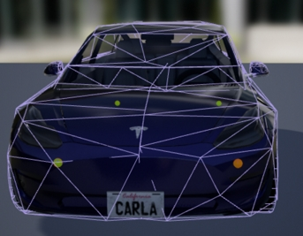

# Generate detailed colliders

This tutorial explains how to create more accurate collision boundaries for vehicles (relative to the original shape of the object). These are used not only to detect collisions between elements in the scenes, but also for sensors such as the LIDAR. These colliders can be integrated into CARLA so that all the community can benefit from these. Details on how to contribute are explained in the last section of the tutorial.  

*   [__Motivation__](#motivation)  
*   [__Prerequisites__](#prerequisites)  
*   [__Create custom colliders for a Skeletal Mesh__](#create-custom-colliders-for-a-skeletal-mesh)  
	*   [1-Define custom collision for wheels in Unreal Editor](#1-define-custom-collision-for-wheels-in-unreal-editor)  
	*   [2-Export the vehicle as FBX](#export-the-vehicle-as-fbx)  
	*   [3-Import to Blender and create custom boundary](#import-to-blender-and-create-custom-boundary)  
	*   [4-Export from Blender to FBX](#export-from-blender-to-fbx)  
	*   [5-Import collider and define physics](#Import-collider-and-define-physics)  
*   [__Submit new colliders__](#submit-new-colliders)  

!!! Important
    This tutorial is based on a [contribution](https://bitbucket.org/yankagan/carla-content/wiki/Home) made by __yankagan__! The contributor also wants to aknowledge __Francisco E__ for the tutorial on [how to import custom collisions in UE](https://www.youtube.com/watch?v=SEH4f0HrCDM).  

---
## Motivation

CARLA uses [Skeletal meshes](https://docs.unrealengine.com/en-US/Engine/Content/Types/SkeletalMeshes/index.html) to create create vehicle animations in UE. Unfortunately, UE does not allow using the original mesh as collider for these objects, due to computational costs. Instead, the vehicle is approximated as a box with for spherical wheels. Hereunder there is an image of the original collider created by UE. 

<i>Original collider for vehicle.</i>

There are two ways to improve these colliders. 

__1. Use a collection of static meshes__ and move them around as if they were part of the vehicle. This requires significant redesign of CARLA and creates new problems such as how certain features such as suspension or wheels should be animated.  
__2. Create a custom collision boundary__ that describes the mesh more accurately and can be used with skeletal meshes.  

The later method will be discussed in this tutorial. It requires some knowledge of 3D modelling, but it is accessible for newcomers. The following image shows a more detailed collider created with this tutorial.  

<i>Detailed collider for vehicle.</i>

---
## Prerequisites

*   __Build CARLA from source__ on [Linux](build_linux.md) or [Windows](build_windows.md).  
*   __Blender 2.80 or newer__ from the [official site](https://www.blender.org/download/) for free (open-source 3D modelling software).  
*   __VHACD Plugin for Blender__ following the using the instructions in [here](https://github.com/andyp123/blender_vhacd). This plugin automatically creates an approximation of a selected object using a collection of convex hulls. [Read more](https://github.com/kmammou/v-hacd).  

!!! Note
    This [series](https://www.youtube.com/watch?v=ppASl6yaguU) and [Udemy course](https://www.udemy.com/course/blender-3d-from-zero-to-hero/?pmtag=MRY1010) may be a good introduction to Blender for newcomers. 

---
## Create custom colliders for a Skeletal Mesh

Here is a brief summary of the steps to follow. 

__Step 1.__ *(UE)* — Add collision boundaries for the wheels.  
__Step 2.__ *(UE)* — Export the skeletal mesh asset of a vehicle to an FBX file.  
__Step 3.__ — Import the FBX file into Blender.  
__Step 4.__ *(Blender)* — Add convex hull meshes to form the new collision boundary (UE requirement for computational efficiency). This is the hardest step.  
__Step 5.__ *(Blender)* — Export the custom collision boundaries into an FBX file.  
__Step 6.__ *(UE)* — Import the new FBX into CARLA as an Unreal asset file (static mesh).  
__Step 7.__ *(UE)* — Import the custom collider into the physics asset for the specific vehicle, so that it is used for computations.  
__Step 8.__ *(UE)* — Create constraints that connect the different joints and define the physics of all parts.  

### Step 1-Define custom collision for wheels in Unreal Editor

https://www.youtube.com/watch?v=bECnsTw6ehI

### Step 2-Export the vehicle as FBX

https://www.youtube.com/watch?v=fDmxIRV-j5g

### Steps 3 to 4-Import to Blender and create custom boundary

Below you will find 2 clips that gives an example of this process but before you watch it let me explain a bit about the logic that goes into this process:

    If you select the entire car and create the collision boundary with the VHACD Plugin you will get a very ugly approximation and the wheels will contains sharp edges which will mess-up the drive on the road (it will make them collide with the road every time it's not straight). It's important that the wheels have smooth boundaries around them. If you used convex decomposition on the car's body the mirror would still not look right.

    For computer vision applications, we need some important features of the vehicles, such as side mirrors, wheels that look right, etc. It is with this in mind that I break down the vehicle into several parts.

Generally the steps are:

    Cut out the bottom parts of the wheels, the side mirrors and the top part of the car's body to create the first boundary using the VHACD tool
    Cut out the bottom half of the car to create the second boundary (top part of the car) using the VHACD tool
    Create separate boundaries for side mirrors using the VHACD tool

Be very careful about naming the objects!! Each boundary should have "UCX_" at the beginning and the rest of the name has to be EXACTLY the same as the original mesh

The full example is shown in these two clips:

https://www.youtube.com/watch?v=oROkK3OCuOA

https://www.youtube.com/watch?v=L3upzdC602s 

### Step 5-Export from Blender to FBX

This clip: https://youtu.be/aJPyskYjzWo explains this simple step. Follow it exactly. Select only the original car object + all the newly added objects for collision. Make sure that in the export menu you check "selected objects" and select only "Mesh".

### Steps 6 to 8-Import collider and define physics

https://www.youtube.com/watch?v=aqFNwAyj2CA

---
## Submit new colliders

It is worth pointing out that the goal of this repo is to collect all the unreal physics asset files with custom collisions in one place, so other people can use it!

Please consider submitting your creations so that everyone can benefit. The process is very simple:

    Create a branch with the name "dev/<user_name>" and upload the new physics asset you created.
    Create a pull request to let us know you submitted it
    We will occasionally test the newly submitted physics assets and copy them to the master branch

---

That is all there is so far, regarding the different map customization tools available in CARLA.

Open CARLA and mess around for a while. If there are any doubts, feel free to post these in the forum. 

<a href="https://forum.carla.org/" target="_blank" class="btn btn-neutral" title="Go to the CARLA forum">
CARLA forum</a>

