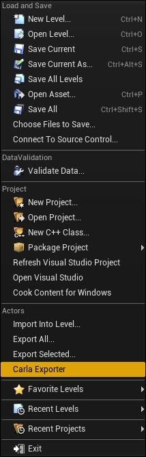

# How to generate the pedestrian navigation info

---
## Introduction

The pedestrians to walk need information about the map in a specific format. That file that describes the map for navigation is a binary file with extension `.BIN`, and they are saved in the **Nav** folder of the map. Each map needs a `.BIN` file with the same name that the map, so automatically can be loaded with the map.

This `.BIN` file is generated from the Recast & Detour library and has all the information that allows pathfinding and crow management.

If we need to generate this `.BIN` file for a custom map, we need to follow this process:

* Export the map meshes
* Rebuild the `.BIN` file with RecastBuilder
* Copy the `.BIN` file in a `Nav/` folder with the map

---
## Export meshes

We have several types of meshes for navigation. The meshes need to be identified as one of those types, using specific nomenclature.

| Type      | Start with | Description |
|-----------|------------|-------------|
| Ground    | `Road_Sidewalk` | Pedestrians can walk over these meshes freely (sidewalks...). |
| Grass     | `Road_Crosswalk` | Pedestrians can walk over these meshes but as a second option if no ground is found. |
| Road      | `Road_Grass` | Pedestrians won't be allowed to walk on it unless we specify some percentage of pedestrians that will be allowed. |
| Crosswalk | `Road_Road`, `Road_Curb`, `Road_Gutter` or `Road_Marking` | Pedestrians can cross the roads only through these meshes. |
| Block     | any other name | Pedestrians will avoid these meshes always (are obstacles like traffic lights, trees, houses...). |  

<br>

For instance, all road meshes need to start with `Road_Road` e.g: `Road_Road_Mesh_1`, `Road_Road_Mesh_2`...

This nomenclature is used by RoadRunner when it exports the map, so we are just following the same.

Also, we don't need to export meshes that are not of interest by the navigation system, like landscapes where pedestrians will not walk, or UE4's _sky domes_, rivers, lakes and so on.
We can **tag** any mesh with the name **NoExport** and then the exporter will ignore that mesh.

Once we have all meshes with the proper nomenclature and tagged the ones that we want to ignore, we can call the Carla Exporter that is found under the `File > Actors > Carla Exporter`:



The `.OBJ` file will be saved with the name of the map with extension OBJ in the **CarlaUE4/Saved** folder of UE4.

---
## Rebuild the navigation binary

With Recast & Detour library comes an executable file that needs to be used to generate the final `.BIN` file.
The executable uses by default the parameters to work on Carla, and you only need to pass as parameter the `.OBJ` you exported above, and the `.BIN` will be created.

You can find the executable, on the `Carla/Build/recast-{version}-install/bin/` folder, already compiled when Carla was installed.

Run:

```sh
$ RecastBuilder test.object
```

And it will create a `test.bin` file, that needs to be copied to the map folder, inside the `Nav/` folder.

For example, this would be the structure of files of a Test map:

```
Test/
  ├─ Test.umap
  ├─ Nav/
  │   └─ Test.bin
  └─ OpenDrive/
      └─ Test.xodr
```
