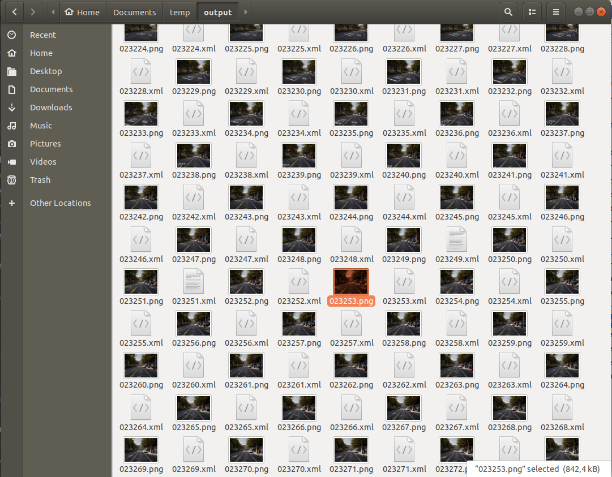

# Bounding boxes

A significant factor in the problem of enabling autonomous vehicles to understand their environments lies in estimating the position and orientation of objects surrounding the vehicle. For this purpose, it is necessary to infer the position of the object's bounding box. 

Objects within the CARLA simulation all have a bounding box and the CARLA Python API provides functions to access the bounding box of each object. This tutorial shows how to access bounding boxes and then project them into the camera plane.

## Set up the simulator

Let's lay down the standard CARLA boilerplate code, set up the client and world objects, spawn a vehicle and attach a camera to it:

```py
import carla
import math
import random
import time
import queue
import numpy as np
import cv2

client = carla.Client('localhost', 2000)
world  = client.get_world()
bp_lib = world.get_blueprint_library()

# spawn vehicle
vehicle_bp =bp_lib.find('vehicle.lincoln.mkz_2020')
vehicle = world.try_spawn_actor(vehicle_bp, random.choice(spawn_points))

# spawn camera
camera_bp = bp_lib.find('sensor.camera.rgb')
camera_init_trans = carla.Transform(carla.Location(z=2))
camera = world.spawn_actor(camera_bp, camera_init_trans, attach_to=vehicle)
vehicle.set_autopilot(True)

# Set up the simulator in synchronous mode
settings = world.get_settings()
settings.synchronous_mode = True # Enables synchronous mode
settings.fixed_delta_seconds = 0.05
world.apply_settings(settings)

# Get the map spawn points
spawn_points = world.get_map().get_spawn_points()

# Create a queue to store and retrieve the sensor data
image_queue = queue.Queue()
camera.listen(image_queue.put)
```

## Geometric transformations

We want to take 3D points from the simulation and project them into the 2D plane of the camera. Firstly, we need to construct the camera projection matrix:

```py
def build_projection_matrix(w, h, fov):
    focal = w / (2.0 * np.tan(fov * np.pi / 360.0))
    K = np.identity(3)
    K[0, 0] = K[1, 1] = focal
    K[0, 2] = w / 2.0
    K[1, 2] = h / 2.0
    return K
```

We want to use the camera projection matrix to project 3D to 2D points. The first step is to transform the 3D coordinates in world coordinates into camera coordinates, using the inverse camera transform that can be retrieved using `camera.get_transform().get_inverse_matrix()`. Following this, we use the camera projection matrix to project the 3D points in camera coordinates into the 2D camera plane:

```py

def get_image_point(loc, K, w2c):
        # Calculate 2D projection of 3D coordinate

        # Format the input coordinate (loc is a carla.Position object)
        point = np.array([loc.x, loc.y, loc.z, 1])
        # transform to camera coordinates
        point_camera = np.dot(w2c, point)

        # New we must change from UE4's coordinate system to an "standard"
        # (x, y ,z) -> (y, -z, x)
        # and we remove the fourth componebonent also
        point_camera = [point_camera[1], -point_camera[2], point_camera[0]]

        # now project 3D->2D using the camera matrix
        point_img = np.dot(K, point_camera)
        # normalize
        point_img[0] /= point_img[2]
        point_img[1] /= point_img[2]

        return point_img[0:2]
```

Now that we have the functions to project 3D -> 2D we retrieve the camera specifications:

```py

# Get the world to camera matrix
world_2_camera = np.array(camera.get_transform().get_inverse_matrix())

# Get the attributes from the camera
image_w = camera_bp.get_attribute("image_size_x").as_int()
image_h = camera_bp.get_attribute("image_size_y").as_int()
fov = camera_bp.get_attribute("fov").as_float()

# Calculate the camera projection matrix to project from 3D -> 2D
K = build_projection_matrix(image_w, image_h, fov)
```

## Bounding boxes

CARLA objects all have an associated bounding box. CARLA [actors](python_api.md#carla.Actor) have a `bounding_box` attribute which has a [carla.BoundingBox](python_api.md#carla.BoundingBox) object type. The vertices for a bounding box can be retrieved through one of the getter functions `.get_world_vertices()` or `get_local_vertices()`. 

It is important to note that to get the 3D coordinates of the bounding box in world coordinates, you need to include the transform of the actor as an argument to the `get_world_vertices()` method like so:

```py
actor.get_world_vertices(actor.get_transform())

```

For objects in the map like buildings, traffic lights and road signs, the bounding box can be retrieved through the [carla.World]((python_api.md#carla.World)) method `get_level_bbs()`. A [carla.CityObjectLabel]((python_api.md#carla.CityObjectLabel)) can be used as an argument to filter the bounding box list to relevant objects:

```py
# Retrieve all bounding boxes for traffic lights within the level
bounding_box_set = world.get_level_bbs(carla.CityObjectLabel.TrafficLight)

# Filter the list to extract bounding boxes within a 50m radius
nearby_bboxes = []
for bbox in bounding_box_set:
    if bbox.location.distance(actor.get_transform().location) < 50:
        nearby_bboxes
```

This list can be further filtered using actor location to identify objects that are nearby and therefore likely to be within the field of view of a camera attached to an actor. 

In order to draw a bounding box onto the camera image, we will need to join the vertices in the appropriate order to create edges. To achieve this we need the following list of edge pairs:

```py
edges = [[0,1], [1,3], [3,2], [2,0], [0,4], [4,5], [5,1], [5,7], [7,6], [6,4], [6,2], [7,3]]

```

## Rendering the bounding boxes

Now that we have our geometric projections and our simulation set up, we can progress to creating the game loop and rendering the bounding boxes into a scene. 

```py
# Set up the set of bounding boxes from the level
# We filter for traffic lights and traffic signs
bounding_box_set = world.get_level_bbs(carla.CityObjectLabel.TrafficLight)
bounding_box_set.extend(world.get_level_bbs(carla.CityObjectLabel.TrafficSigns))

# Remember the edge pairs
edges = [[0,1], [1,3], [3,2], [2,0], [0,4], [4,5], [5,1], [5,7], [7,6], [6,4], [6,2], [7,3]]

```

To see the bounding boxes, we will use an OpenCV window to display the camera output.

```py
# Retrieve the first image
world.tick()
image = image_queue.get()

# Reshape the raw data into an RGB array
img = np.reshape(np.copy(image.raw_data), (image.height, image.width, 4)) 

# Display the image in an OpenCV display window
cv2.namedWindow('ImageWindowName', cv2.WINDOW_AUTOSIZE)
cv2.imshow('ImageWindowName',img)
cv2.waitKey(1)
```

Now we will start the game loop:

```py

while True:
    # Retrieve and reshape the image
    world.tick()
    image = image_queue.get()

    img = np.reshape(np.copy(image.raw_data), (image.height, image.width, 4))

    # Get the camera matrix 
    world_2_camera = np.array(camera.get_transform().get_inverse_matrix())
    
    for bb in bounding_box_set:

        # Filter for distance from ego vehicle
        if bb.location.distance(vehicle.get_transform().location) < 50:

            # Calculate the dot product between the forward vector
            # of the vehicle and the vector between the vehicle
            # and the bounding box. We threshold this dot product
            # to limit to drawing bounding boxes IN FRONT OF THE CAMERA
            forward_vec = vehicle.get_transform().get_forward_vector()
            ray = bb.location - vehicle.get_transform().location

            if forward_vec.dot(ray) > 1:
                # Cycle through the vertices
                verts = [v for v in bb.get_world_vertices(carla.Transform())]
                for edge in edges:
                    # Join the vertices into edges
                    p1 = get_image_point(verts[edge[0]], K, world_2_camera)
                    p2 = get_image_point(verts[edge[1]],  K, world_2_camera)
                    # Draw the edges into the camera output
                    cv2.line(img, (int(p1[0]),int(p1[1])), (int(p2[0]),int(p2[1])), (0,0,255, 255), 1)

    # Now draw the image into the OpenCV display window
    cv2.imshow('ImageWindowName',img)
    # Break the loop if the user presses the Q key
    if cv2.waitKey(1) == ord('q'):
        break

# Close the OpenCV display window when the game loop stops
cv2.destroyAllWindows()
 
```

Now we are rendering 3D bounding boxes into the images so we can observe them in the camera sensor output.


## Vehicle bounding boxes

We may also want to render the bounding boxes for actors, particularly for vehicles. 

Firstly, let's add some other vehicles to our simulation:

```py
for i in range(50):
    vehicle_bp = random.choice(bp_lib.filter('vehicle'))
    npc = world.try_spawn_actor(vehicle_bp, random.choice(spawn_points))
    if npc:
        npc.set_autopilot(True)
```

Retrieve the first image and set up the OpenCV display window as before:

```py
# Retrieve the first image
world.tick()
image = image_queue.get()

# Reshape the raw data into an RGB array
img = np.reshape(np.copy(image.raw_data), (image.height, image.width, 4)) 

# Display the image in an OpenCV display window
cv2.namedWindow('ImageWindowName', cv2.WINDOW_AUTOSIZE)
cv2.imshow('ImageWindowName',img)
cv2.waitKey(1)
```

Now we use a modified game loop to draw the vehicle bounding boxes:

```py

while True:
    # Retrieve and reshape the image
    world.tick()
    image = image_queue.get()

    img = np.reshape(np.copy(image.raw_data), (image.height, image.width, 4))

    # Get the camera matrix 
    world_2_camera = np.array(camera.get_transform().get_inverse_matrix())

    
    for npc in world.get_actors().filter('*vehicle*'):

        # Filter out the ego vehicle
        if npc.id != vehicle.id:

            bb = npc.bounding_box
            dist = npc.get_transform().location.distance(vehicle.get_transform().location)

            # Filter for the vehicles within 50m
            if dist < 50:

            # Calculate the dot product between the forward vector
            # of the vehicle and the vector between the vehicle
            # and the other vehicle. We threshold this dot product
            # to limit to drawing bounding boxes IN FRONT OF THE CAMERA
                forward_vec = vehicle.get_transform().get_forward_vector()
                ray = npc.get_transform().location - vehicle.get_transform().location

                if forward_vec.dot(ray) > 1:
                    p1 = get_image_point(bb.location, K, world_2_camera)
                    verts = [v for v in bb.get_world_vertices(npc.get_transform())]
                    for edge in edges:
                        p1 = get_image_point(verts[edge[0]], K, world_2_camera)
                        p2 = get_image_point(verts[edge[1]],  K, world_2_camera)
                        cv2.line(img, (int(p1[0]),int(p1[1])), (int(p2[0]),int(p2[1])), (255,0,0, 255), 1)        
        
    cv2.imshow('ImageWindowName',img)
    if cv2.waitKey(1) == ord('q'):
        break
cv2.destroyAllWindows()
```


### 2D bounding boxes

It is common for neural networks to be trained to detect 2D bounding boxes rather than the 3D bounding boxes demonstrated above. The previous script can be easily extended to generate 2D bounding boxes. We simply need to use the extremities of the 3D bounding boxes. We find, for each bounding box we render, the leftmost, rightmost, highest and lowest projected vertex in image coordinates. 

```py

while True:
    
    # Retrieve and reshape the image
    world.tick()
    image = image_queue.get()

    img = np.reshape(np.copy(image.raw_data), (image.height, image.width, 4))

    # Get the camera matrix 
    world_2_camera = np.array(camera.get_transform().get_inverse_matrix())

    for npc in world.get_actors().filter('*vehicle*'):

        # Filter out the ego vehicle
        if npc.id != vehicle.id:

            bb = npc.bounding_box
            dist = npc.get_transform().location.distance(vehicle.get_transform().location)

            # Filter for the vehicles within 50m
            if dist < 50:

            # Calculate the dot product between the forward vector
            # of the vehicle and the vector between the vehicle
            # and the other vehicle. We threshold this dot product
            # to limit to drawing bounding boxes IN FRONT OF THE CAMERA
                forward_vec = vehicle.get_transform().get_forward_vector()
                ray = npc.get_transform().location - vehicle.get_transform().location

                if forward_vec.dot(ray) > 1:
                    p1 = get_image_point(bb.location, K, world_2_camera)http://host.robots.ox.ac.uk/pascal/VOC/
                    verts = [v for v in bb.get_world_vertices(npc.get_transform())]
                    x_max = -10000
                    x_min = 10000
                    y_max = -10000
                    y_min = 10000

                    for vert in verts:
                        p = get_image_point(vert, K, world_2_camera)
                        # Find the rightmost vertex
                        if p[0] > x_max:
                            x_max = p[0]
                        # Find the leftmost vertex
                        if p[0] < x_min:
                            x_min = p[0]
                        # Find the highest vertex
                        if p[1] > y_max:
                            y_max = p[1]
                        # Find the lowest  vertex
                        if p[1] < y_min:
                            y_min = p[1]

                    cv2.line(img, (int(x_min),int(y_min)), (int(x_max),int(y_min)), (0,0,255, 255), 1)
                    cv2.line(img, (int(x_min),int(y_max)), (int(x_max),int(y_max)), (0,0,255, 255), 1)
                    cv2.line(img, (int(x_min),int(y_min)), (int(x_min),int(y_max)), (0,0,255, 255), 1)
                    cv2.line(img, (int(x_max),int(y_min)), (int(x_max),int(y_max)), (0,0,255, 255), 1)


    cv2.imshow('ImageWindowName',img)
    if cv2.waitKey(1) == ord('q'):
        break
cv2.destroyAllWindows()

```


## Exporting bounding boxes

Rendering bounding boxes is useful for us to ensure the bounding boxes are correct for debugging purposes. However, if we wanted to use them practically in training a neural network, we will want to export them. There are a number of different formats used by the common data repositories used for autonomous driving and object detection, such as [__KITTI__](http://www.cvlibs.net/datasets/kitti/) or [__PASCAL VOC__](http://host.robots.ox.ac.uk/pascal/VOC/) or [__MicroSoft COCO__](https://cocodataset.org/#home).

### Pascal VOC format

These datasets commonly use JSON or XML formats to store annotations. There is a convenient Python library for the PASCAL VOC format. 

```py

from pascal_voc_writer import Writer

...
...
...


while True:
    # Retrieve the image
    world.tick()
    image = image_queue.get()

    # Get the camera matrix 
    world_2_camera = np.array(camera.get_transform().get_inverse_matrix())
    
    frame_path = 'output/%06d' % image.frame
    
    # Save the image
    image.save_to_disk(frame_path + '.png')
    
    # Initialize the exporter
    writer = Writer(frame_path + '.png', image_w, image_h)
    
    for npc in world.get_actors().filter('*vehicle*'):
        if npc.id != vehicle.id:
            bb = npc.bounding_box
            dist = npc.get_transform().location.distance(vehicle.get_transform().location)
            if dist < 50:
                forward_vec = vehicle.get_transform().get_forward_vector()
                ray = npc.get_transform().location - vehicle.get_transform().location
                if forward_vec.dot(ray) > 1:
                    p1 = get_image_point(bb.location, K, world_2_camera)
                    verts = [v for v in bb.get_world_vertices(npc.get_transform())]
                    x_max = -10000
                    x_min = 10000
                    y_max = -10000
                    y_min = 10000
                    for vert in verts:
                        p = get_image_point(vert, K, world_2_camera)
                        if p[0] > x_max:
                            x_max = p[0]
                        if p[0] < x_min:
                            x_min = p[0]
                        if p[1] > y_max:
                            y_max = p[1]
                        if p[1] < y_min:
                            y_min = p[1]
        
                    # Add the object to the frame (ensure it is inside the image)
                    if x_min > 0 and x_max < image_w and y_min > 0 and y_max < image_h: 
                        writer.addObject('vehicle', x_min, y_min, x_max, y_max)
    
    # Save the bounding boxes in the scene
    writer.save(frame_path + '.xml')
                            

```

For every rendered frame of your simulation, you will now export an accompanying XML file containing the details of the bounding boxes in the frame. 



In the PASCAL VOC format, the XML files contain information referring to the accompanying image file, the image dimensions and can include details such as vehicle type if needed. 

```xml
<!-- Example PASCAL VOC format file-->
<annotation>
    <folder>output</folder>
    <filename>023235.png</filename>
    <path>/home/matt/Documents/temp/output/023235.png</path>
    <source>
        <database>Unknown</database>
    </source>
    <size>
        <width>800</width>
        <height>600</height>
        <depth>3</depth>
    </size>
    <segmented>0</segmented>
    <object>
        <name>vehicle</name>
        <pose>Unspecified</pose>
        <truncated>0</truncated>
        <difficult>0</difficult>
        <bndbox>
            <xmin>503</xmin>
            <ymin>310</ymin>
            <xmax>511</xmax>
            <ymax>321</ymax>
        </bndbox>
    </object>    <object>
        <name>vehicle</name>
        <pose>Unspecified</pose>
        <truncated>0</truncated>
        <difficult>0</difficult>
        <bndbox>
            <xmin>490</xmin>
            <ymin>310</ymin>
            <xmax>498</xmax>
            <ymax>321</ymax>
        </bndbox>
    </object>
</annotation>

```

### MicroSoft COCO format

Another popular export format is [__MicroSoft COCO__](https://cocodataset.org/#home). The COCO format uses JSON files to save references to images and annotations. The format includes the images and annotations in the fields of a single JSON file, along with information on the dataset and licenses. In contrast to some other formats, references to all collected images and all associated annotations go in the same file.

You should create a JSON dictionary similar to the following example:

```py
simulation_dataset = {
    "info": {},

    "licenses": [
    {
        "url": "http://creativecommons.org/licenses/by-nc-sa/2.0/",
        "id": 1,
        "name": "Attribution-NonCommercial-ShareAlike License"
    }],

    "images": [...,
        {
        "license": 1,
        "file_name": "023235.png",
        "height": 600,
        "width": 800,
        "date_captured": "2022-04-14 17:02:52",
        "id": 23235
    },
        ...
    ],

    "categories": [...
        {"supercategory": "vehicle", "id": 10, "name": "vehicle" },
    ...],

    "annotations": [
        ...,
        {
            "segmentation": [],
            "area": 9262.89,
            "iscrowd": 0,
            "image_id": 23235,
            "bbox": [503.3, 310.4, 118.3, 78.3]
        },
        ...
    ]
}
```

The info and licenses sections should be filled accordingly or left empty. The images from your simulation should be stored in an array in the `images` field of the dictionary. The bounding boxes should be stored in the `annotations` field of the dictionary with the matching `image_id`. The bounding box is stored as `[x_min, y_min, width, height]`.

The Python JSON library can then be used to save the dictionary as a JSON file:

```py
import json

with open('simulation_data.json', 'w') as json_file:
    json.dump(simulation_dataset, json_file)
```

More details about the COCO data format can be found [__here__](https://www.immersivelimit.com/tutorials/create-coco-annotations-from-scratch/#create-custom-coco-dataset)


*It should be noted that in this tutorial we have not accounted for overlapping bounding boxes. Additional work would be required in order to identify foreground bounding boxes in the case where they overlap.*  