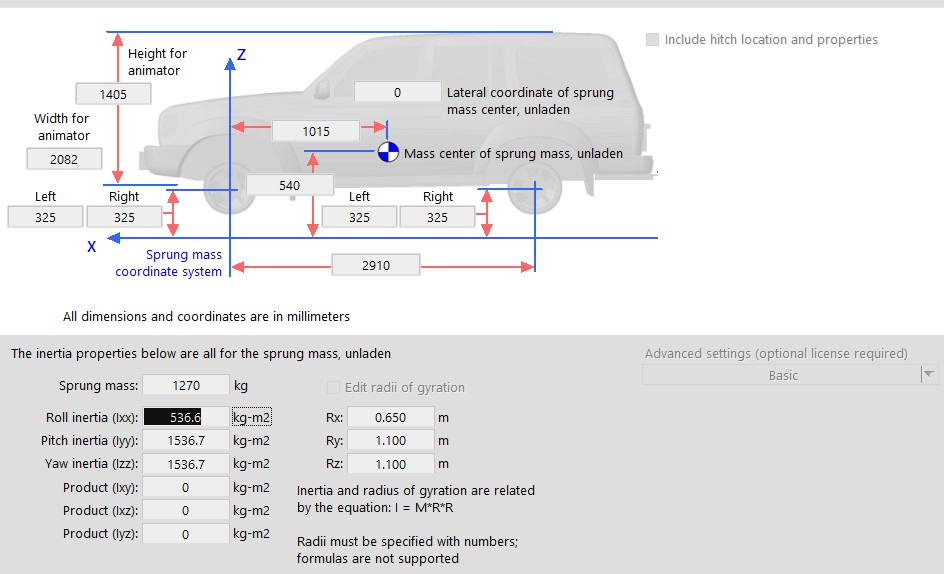

# CarSim Integration

CARLA's integration with CarSim allows vehicle controls in CARLA to be forwarded to CarSim. CarSim will do all required physics calculations of the vehicle and return the new state to CARLA. 

This page shows you how to generate a `.sim` file, explains how vehicle dimensions relate between CARLA and CarSim and how to run a simulation on CARLA using the CarSim integration.

*   [__Before you begin__](#before-you-begin)  
*   [__Set up CarSim__](#set-up-carsim)  
	*   [__Generate the .sim file__](#generate-the-sim-file)  
        * [__On Windows__](#on-windows)
        * [__On Ubuntu__](#on-ubuntu)
	*   [__Vehicle sizes__](#vehicle-sizes)  
*   [__Run the simulation__](#run-the-simulation)  

---
## Before you begin

1. You will need a license for CarSim and to have the software up and running. If you don't currently have a license for CarSim, you can contact the team [here](https://www.carsim.com/forms/additional_information.php) for information.
2. To allow communication with Unreal Engine you will need to install the VehicleSim Dynamics plugin (version 2020.0) for Unreal Engine 4.24. For information on finding specific versions of the plugin, check this [link](https://www.carsim.com/products/supporting/unreal/index.php). Installation of the plugin will depend on your operating system:
   
    __For Windows__:

    Get the plugin [here](https://www.unrealengine.com/marketplace/en-US/product/carsim-vehicle-dynamics).

    __For Ubuntu__:

    1. Download the plugin [here](https://www.carsim.com/users/unreal_plugin/unreal_plugin_2020_0.php).
    2. Replace the file `CarSim.Build.cs` with the file found [here](https://carla-releases.s3.eu-west-3.amazonaws.com/Backup/CarSim.Build.cs) in order to use the correct solver for Ubuntu.

3. This step can be skipped if you are using the packaged version of CARLA. The packaged version has already been compiled using this flag but if you are building CARLA from source then you will need to compile the server with the `--carsim` flag.  

    If you are building CARLA from source, run the following command in the root folder to compile the server with the `--carsim` flag:

```sh
    make launch ARGS="--carsim"
```

## Set up CarSim

The following section details how to generate the `.sim` file which is required to run the simulation. There is also important information detailed regarding the relationship of vehicle sizes between CARLA and CarSim. 

#### Generate the .sim file

The `.sim` file describes the simulation to be run in both CARLA and CarSim. This file is required by the plugin to run the simulation. There is currently no way to generate this file on Ubuntu, however we will describe below how to use a previously generated file to run the simulation on Ubuntu. 

##### On Windows

After you have configured all the parameters on CarSim, use the GUI to generate the `.sim` file as highlighted below:


The resulting `.sim` file should look something like this:

```
SIMFILE

SET_MACRO $(ROOT_FILE_NAME)$ Run_dd7a828d-4b14-4c77-9d09-1974401d6b25
SET_MACRO $(OUTPUT_PATH)$ D:\carsim\Data\Results
SET_MACRO $(WORK_DIR)$ D:\carsim\Data\
SET_MACRO $(OUTPUT_FILE_PREFIX)$ $(WORK_DIR)$Results\Run_dd7a828d-4b14-4c77-9d09-1974401d6b25\LastRun

FILEBASE $(OUTPUT_FILE_PREFIX)$
INPUT $(WORK_DIR)$Results\$(ROOT_FILE_NAME)$\Run_all.par
INPUTARCHIVE $(OUTPUT_FILE_PREFIX)$_all.par
ECHO $(OUTPUT_FILE_PREFIX)$_echo.par
FINAL $(OUTPUT_FILE_PREFIX)$_end.par
LOGFILE $(OUTPUT_FILE_PREFIX)$_log.txt
ERDFILE $(OUTPUT_FILE_PREFIX)$.vs
PROGDIR D:\carsim\
DATADIR D:\carsim\Data\
GUI_REFRESH_V CarSim_RefreshEvent_7760
RESOURCEDIR D:\carsim\\Resources\
PRODUCT_ID CarSim
PRODUCT_VER 2020.0
ANIFILE D:\carsim\Data\runs\animator.par
VEHICLE_CODE i_i
EXT_MODEL_STEP 0.00050000
PORTS_IMP 0
PORTS_EXP 0

DLLFILE D:\carsim\Programs\solvers\carsim_64.dll
END
```
##### On Ubuntu

There is no way to create the `.sim` file via GUI on Ubuntu. In order to proceed you will need to follow these steps:

1. Generate the `.sim` file in Windows or use the file template below.
2. Modify the `.sim` file so the variables `INPUT`, `INPUTARCHIVE`, `LOGFILE` and so on point towards the corresponding files in your Ubuntu 
system.
3. Replace the `DLLFILE` line to point towards the CarSim solver which, in the default installation, will be `SOFILE /opt/carsim_2020.0/lib64/libcarsim.so.2020.0`. 

The resulting file should be similar to this:

```
SIMFILE

FILEBASE /path/to/LastRun
INPUT /path/to/Run_all.par
INPUTARCHIVE /path/to/LastRun_all.par
ECHO /path/to/LastRun_echo.par
FINAL /path/to/LastRun_end.par
LOGFILE /path/to/LastRun_log.txt
ERDFILE /path/to/LastRun.vs
PROGDIR /opt/carsim_2020.0/lib64/
DATADIR .
PRODUCT_ID CarSim
PRODUCT_VER 2020.0
VEHICLE_CODE i_i

SOFILE /opt/carsim_2020.0/lib64/libcarsim.so.2020.0
END
```
#### Vehicle sizes

Although CarSim lets you specify the dimensions of the vehicle to use in the simulation, there is currently no correlation between a CarSim vehicle and a CARLA 
vehicle. This means that the vehicles in both programmes will have different dimensions. The role of the CARLA vehicle is only to act as a placeholder during the simulation.



!!! Note
    There is no correlation between vehicle size in CARLA and CarSim. The CARLA vehicle is only a simulation placeholder.

## Run the simulation

All that is needed when running the simulation is to enable CarSim when you spawn a vehicle. This can be done by passing the path to the `.sim` file to the following [method](https://carla.readthedocs.io/en/latest/python_api/#carla.Vehicle.enable_carsim) of the Python API:

```sh
vehicle.enable_carsim(<path_to_ue4simfile.sim>)
```

All input controls sent to the vehicle will be forwarded to CarSim. CarSim will update the 
physics and send back the status of the vehicle (the transform) to the CARLA vehicle. 

Once the simulation has finished you can analyze all the data in CarSim as usual. 


