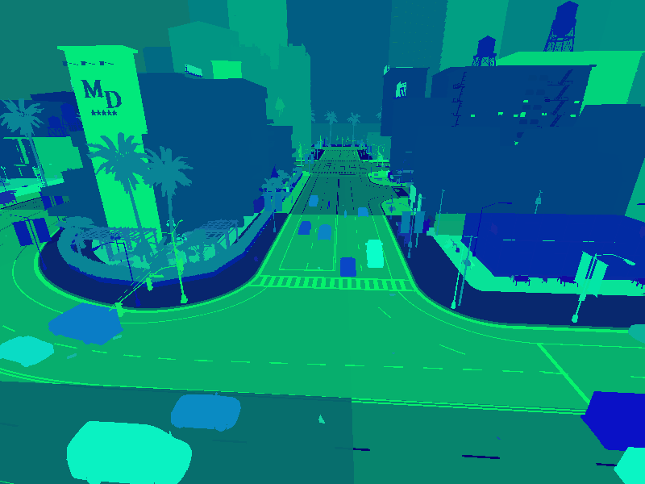

# Instance segmentation sensor

*Instance segmentation* is a new type of camera sensor that yields a unique pixel value for every object in a scene. This is in contrast to the semantic segmentation sensor that has the same ID for instances of the same object class, like for example vehicles. 

To spawn a semantic segmentation camera, we need the `sensor.camera.instance_segmentation` blueprint:

```py
instance_camera_bp = world.get_blueprint_library().find('sensor.camera.instance_segmentation')
```

# Example

We'll start by setting up a world with an instance segmentation camera and spawning numerous vehicles in the scene.

Connect to the server and set to synchronous mode.

```py
import carla
import random
import time
import queue

# Connect to client and set CARLA server to synchronous mode
client = carla.Client('localhost', 2000)
world = client.get_world()
settings = world.get_settings()
settings.synchronous_mode = True
world.apply_settings(settings) 

```

Set up the instance segmentation sensor and spawn it at the desired map location.

```py

# Get the map spawn points and the spectator
spawn_points = world.get_map().get_spawn_points()
spectator = world.get_spectator()

# Set the camera to some location in the map
cam_location = carla.Location(x=-46., y=152, z=18)
cam_rotation = carla.Rotation(pitch=-21, yaw=-93.4, roll=0)
camera_transform = carla.Transform(location=cam_location, rotation=cam_rotation)
spectator.set_transform(camera_transform)

# Retrieve the semantic camera blueprint and spawn the camera
instance_camera_bp = world.get_blueprint_library().find('sensor.camera.instance_segmentation')
instance_camera = world.try_spawn_actor(instance_camera_bp, camera_transform)

```

Spawn vehicles around the camera to populate the scene with numerous object instances.

```py

# Spawn vehicles in an 80m vicinity of the camera
vehicle_bp_library = world.get_blueprint_library().filter('*vehicle*')
radius = 80
for spawn_point in spawn_points:
    vec = [spawn_point.location.x - cam_location.x, spawn_point.location.y - cam_location.y]
    if vec[0]*vec[0] + vec[1]*vec[1] < radius*radius:
        world.try_spawn_actor(random.choice(vehicle_bp_library), spawn_point)
world.tick()
```

Now generate the image.

```py

# Save the image to disk
instance_image_queue = queue.Queue()
instance_camera.listen(instance_image_queue.put)
world.tick()
instance_image=instance_image_queue.get()
instance_image.save_to_disk('instance_segmentation.png')

```

## Image Output

The instance segmentation image saved to disk has the instance ID's encoded in the G and B channels of the RGB image file. The R channel contains the standard semantic ID.




