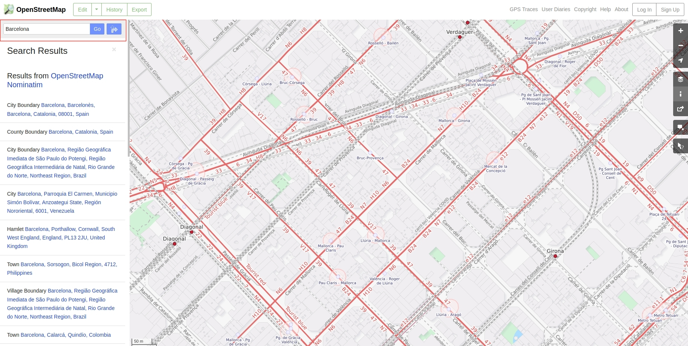
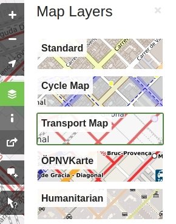
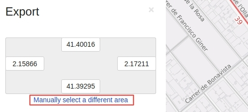
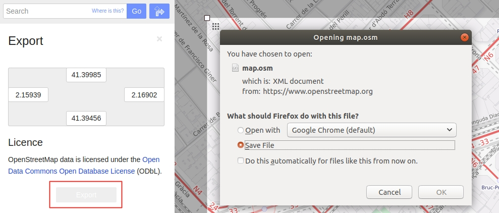

# Generate reality-based maps with OpenStreetMap

OpenStreetMap is an open license map of the world developed by contributors. Sections of these map can be exported to an XML file. CARLA can convert this file to XODR and automatically ingest it as any other CARLA map using the [OpenDRIVE Standalone Mode](#adv_opendrive.md). The process is quite straightforward.  

*   [__1- Create a map with OpenStreetMap__](#1-create-a-map-with-openstreetmap)  
*   [__2- Convert to XODR file__](#2-convert-to-xodr-file)  
*   [__3- Import into CARLA__](#3-import-into-carla)  

---
## 1- Create a map with OpenStreetMap

The first thing to do is using [OpenStreetMap](#openstreetmap.org) to generate an XML file containing the map information.  

__1.1. Go to [openstreetmap.org](openstreetmap.org)__.  

__1.2 Search for a desired location__ and zoom in to a specific area.  
  

!!! Important
    Maps larger than __Limit??__ will probably create issues when ingested in CARLA. Additionally, the bigger the map, the longer the conversion to XODR will take.  

If visualization is not proper, go to the pannel on the right and change between layers to update the map.  
  

__1.3.Click on `Export`__ in the upper left side of the window. The __Export__ pannel will open.  

__1.4. Click on `Manually select a different area`__ in the __Export__ pannel.  
  

__1.5. Select a custom area__ by dragging the corners of the square area in the viewport.  
  

__1.6. Click the `Export` button__ in the __Export__ pannel, and save the map information of the selected area as a XML file.  


---
## 2- Convert to XODR file

CARLA can take an XML file generated with OpenStreetMaps, and convert it to an XODR file that can be ingested as a CARLA map. In order to do so??...  

*   __`paramA`__ *(default )* — Description??...  
*   __`paramB`__ *(default )* — Description??...
*   __`paramC`__ *(default )* — Description??...  

---
## 3- Import into CARLA

The resulting XODR map can be easily ingested in CARLA using the [OpenDRIVE Standalone Mode](#adv_opendrive.md).  

__a) Using an example script__ — The `config.py` script in `PythonAPI/util/` has a new argument, `-x` or `--xodr-path`. This argument expects a string with the path to the `.xodr` file.

```sh
# Go to the folder containing the example scripts
cd PythonAPI/examples
# Run the script
python3 config.py -x opendrive/TownBig.xodr
```

!!! Important
    The ingestion of the map allows for some parameterization. However, using the `config.py`, parameters will always be the default ones.  

__b) Using your own script__ — Call for [`client.generate_opendrive_world()`](python_api.md#carla.Client.generate_opendrive_world) through the API. This will generate the new map, and block the simulation until it is ready. Use the [carla.OpendriveGenerationParameters](python_api.md#carla.OpendriveGenerationParameters) class to set the parameterization of the mesh generation. 

!!! Warning
    [client.generate_opendrive_world()](python_api.md#carla.Client.generate_opendrive_world) uses __content of the OpenDRIVE file parsed as string__. On the contrary, __`config.py`__ script needs __the path to the `.xodr` file__.

Either way, the map should be ingested automatically in CARLA and the result should be similar to this.  

<div style="text-align: right"><i>Outcome.</i></div>

---

That is all there is to know about how to use OpenStreetMap to generate CARLA maps.  

For issues and doubts related with this topic can be posted in the CARLA forum.  

<div class="build-buttons">
<p>
<a href="https://forum.carla.org/" target="_blank" class="btn btn-neutral" title="Go to the CARLA forum">
CARLA forum</a>
</p>
</div>
