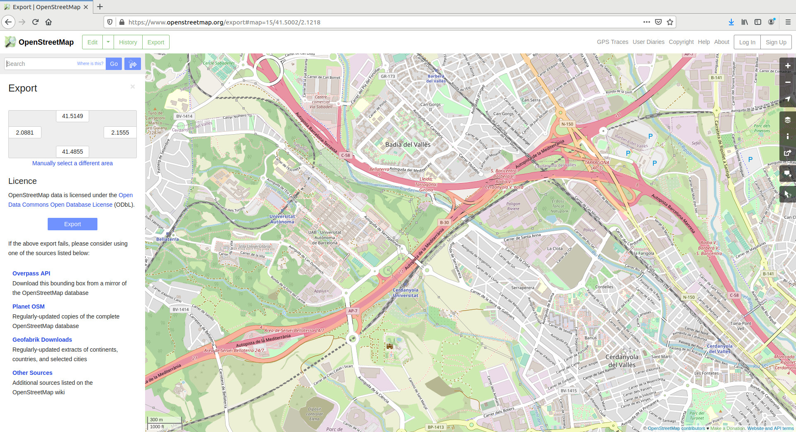
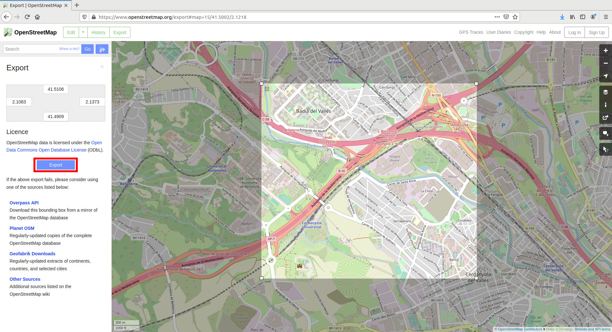
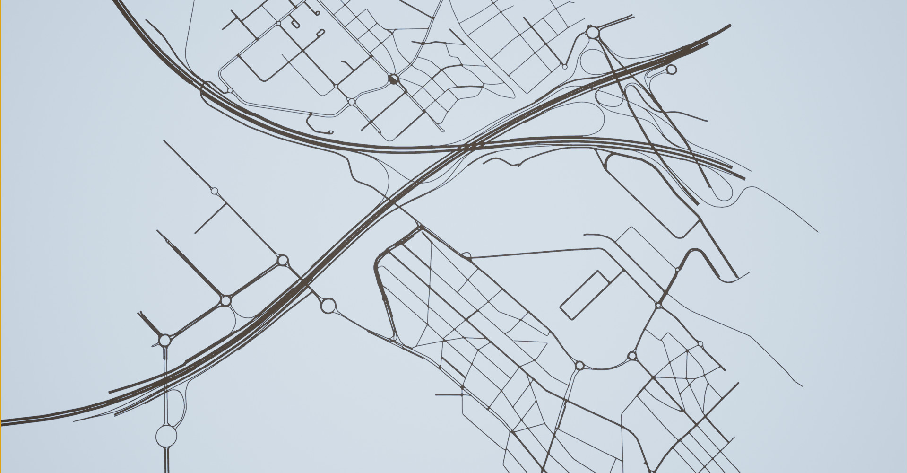

# Generate maps with OpenStreetMap

OpenStreetMap is an open license map of the world developed by contributors. Sections of these map can be exported to a `.osm` file, the OpenSreetMap format, which is essentially an XML. CARLA can convert this file to OpenDRIVE format and ingest it as any other OpenDRIVE map using the [OpenDRIVE Standalone Mode](#adv_opendrive.md). The process is quite straightforward.

*   [__1- Obtain a map with OpenStreetMap__](#1-obtain-a-map-with-openstreetmap)
*   [__2- Convert to OpenDRIVE format__](#2-convert-to-opendrive-format)
*   [__3- Import into CARLA__](#3-import-into-carla)

---
## 1- Obtain a map with OpenStreetMap

The first thing to do is use [OpenStreetMap](https://www.openstreetmap.org) to generate the file containing the map information.

__1.1. Go to [openstreetmap.org](https://www.openstreetmap.org)__. If the map is not properly visualized, try changing the layer in the righ pannel.

__1.2 Search for a desired location__ and zoom in to a specific area.


!!! Warning
    Due to the Unreal Engine limitations, CARLA can ingest maps of a limited size (large cities like Paris push the limits of the engine). Additionally, the bigger the map, the longer the conversion to OpenDRIVE will take.

__1.3.Click on `Export`__ in the upper left side of the window. The __Export__ pannel will open.

__1.4. Click on `Manually select a different area`__ in the __Export__ pannel.

__1.5. Select a custom area__ by dragging the corners of the square area in the viewport.

__1.6. Click the `Export` button__ in the __Export__ pannel, and save the map information of the selected area as a `.osm` file.



---
## 2- Convert to OpenDRIVE format

CARLA can read a the content in the `.osm` file generated with OpenStreetMap, and convert it to OpenDRIVE format so that it can be ingested as a CARLA map. This can be done using the following classes in the PythonAPI.  

*   __[carla.Osm2Odr](python_api.md#carla.Osm2Odr)__ – The class that does the conversion. It takes the content of the `.osm` parsed as strind, and returns a string containing the resulting `.xodr`.
	*   `osm_file` — The content of the initial `.osm` file parsed as string.
	*   `settings` — A [carla.Osm2OdrSettings](python_api.md#carla.Osm2OdrSettings) object containing the settings to parameterize the conversion.
*   __[carla.Osm2OdrSettings](python_api.md#carla.Osm2OdrSettings)__ – Helper class that contains different parameters used during the conversion.
	*   `use_offsets` *(default False)* — Determines whereas the map should be generated with an offset, thus moving the origin from the center according to that offset.
	*   `offset_x` *(default 0.0)* — Offset in the X axis.
	*   `offset_y` *(default 0.0)* — Offset in the Y axis.
	*   `default_lane_width` *(default 4.0)* — Determines the width that lanes should have in the resulting XODR file.
	*   `elevation_layer_height` *(default 0.0)* — Determines the height separating elements in different layers, used for overlapping elements. Read more on [layers](https://wiki.openstreetmap.org/wiki/Key:layer).

The input and output of the conversion are not the `.osm` and `.xodr` files itself, but their content. For said reason, the code should be similar to the following.
```py
# Read the .osm data
f = open("path/to/osm/file", 'r') # Windows will need to encode the file in UTF-8. Read the note below. 
osm_data = f.read()
f.close()

# Define the desired settings. In this case, default values.
settings = carla.Osm2OdrSettings()
# Convert to .xodr
xodr_data = carla.Osm2Odr.convert(osm_data, settings)

# save opendrive file
f = open("path/to/output/file", 'w')
f.write(xodr_data)
f.close()
```

!!! Note
    To read the OSM file in Windows, import `io` at the beginning of the script and change the open line to `f = io.open("test", mode="r", encoding="utf-8")`.


The resulting file contains the road information in OpenDRIVE format.

---
## 3- Import into CARLA

Finally, the OpenDRIVE file can be easily ingested in CARLA using the [OpenDRIVE Standalone Mode](adv_opendrive.md).

__a) Using your own script__ — Call for [`client.generate_opendrive_world()`](python_api.md#carla.Client.generate_opendrive_world) through the API. This will generate the new map, and block the simulation until it is ready.  
Use the [carla.OpendriveGenerationParameters](python_api.md#carla.OpendriveGenerationParameters) class to set the parameterization of the mesh generation.

```
vertex_distance = 2.0  # in meters
max_road_length = 500.0 # in meters
wall_height = 0.0      # in meters
extra_width = 0.6      # in meters
world = client.generate_opendrive_world(
    xodr_xml, carla.OpendriveGenerationParameters(
        vertex_distance=vertex_distance,
        max_road_length=max_road_length,
        wall_height=wall_height,
        additional_width=extra_width,
        smooth_junctions=True,
        enable_mesh_visibility=True))
```

!!! Note
    `wall_height = 0.0` is strongly recommended. OpenStreetMap defines lanes in opposing directions as different roads. If walls are generated, this result in wall overlapping and undesired collisions.

__b) Using `config.py`__ — The script can load an OpenStreetMap file directly into CARLA using a new argument.  
```
python3 config.py --osm-path=/path/to/OSM/file
```
!!! Important
    [client.generate_opendrive_world()](python_api.md#carla.Client.generate_opendrive_world) requires the __content of the OpenDRIVE file parsed as string__, and allows parameterization. On the contrary, __`config.py`__ script needs __the path to the `.xodr` file__ and always uses default parameters.

Either way, the map should be ingested automatically in CARLA and the result should be similar to this.

<div style="text-align: right"><i>Outcome of the CARLA map generation using OpenStreetMap.</i></div>

!!! Warning
    The roads generated end abruptly in the borders of the map. This will cause the TM to crash when vehicles are not able to find the next waypoint. To avoid this, the OSM mode is set to __True__ by default ([set_osm_mode()](python_api.md#carlatrafficmanager)). This will show a warning, and destroy vehicles when necessary.  

---

That is all there is to know about how to use OpenStreetMap to generate CARLA maps.

For issues and doubts related with this topic can be posted in the CARLA forum.

<div class="build-buttons">
<p>
<a href="https://forum.carla.org/" target="_blank" class="btn btn-neutral" title="Go to the CARLA forum">
CARLA forum</a>
</p>
</div>
