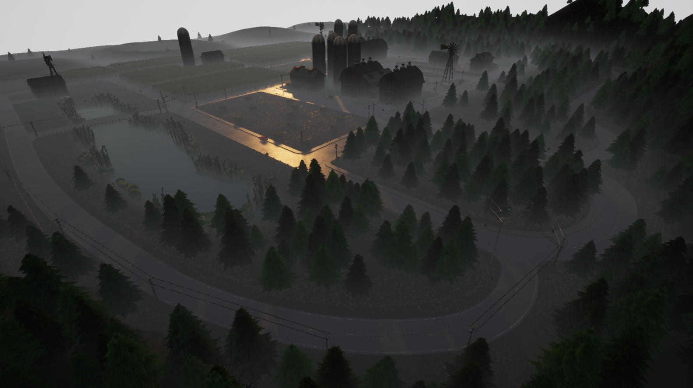
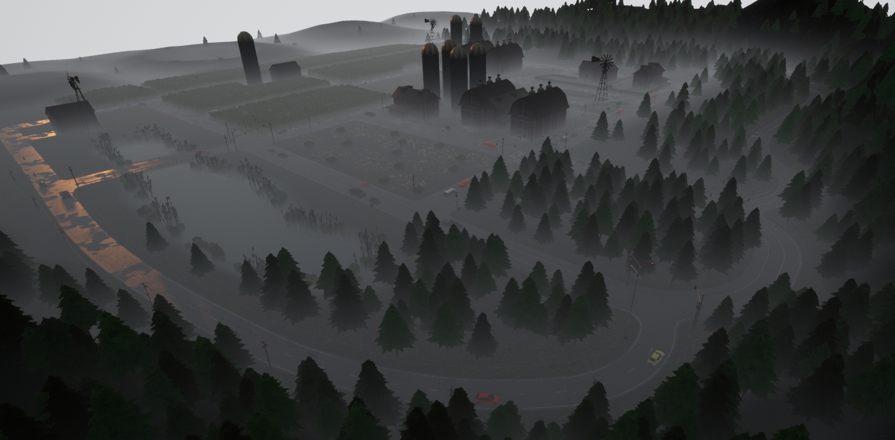
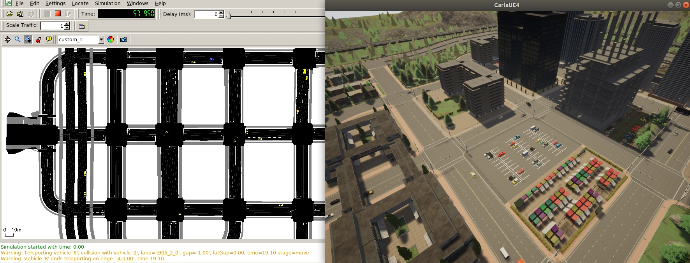
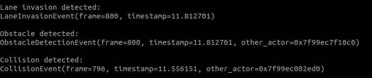
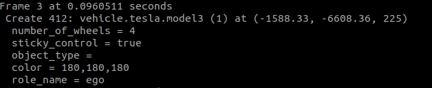
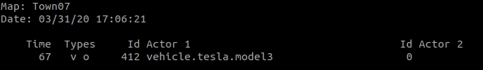

# Retrieve simulation data

Learning an efficient way to retrieve simulation data is essential in CARLA. This holistic tutorial is advised for both, newcomers and more experienced users. It starts from the very beginning, and gradually dives into the many options available in CARLA.  

First, the simulation is initialized with custom settings and traffic. An ego vehicle is set to roam around the city, optionally with some basic sensors. The simulation is recorded, so that later it can be queried to find the highlights. After that, the original simulation is played back, and exploited to the limit. New sensors can be added to retrieve consistent data. The weather conditions can be changed. The recorder can even be used to test specific scenarios with different outputs.  

*   [__Overview__](#overview)  
*   [__Set the simulation__](#set-the-simulation)  
	*   [Map setting](#map-setting)  
	*   [Weather setting](#weather-setting)  
*   [__Set traffic__](#set-traffic)  
	*   [CARLA traffic and pedestrians](#carla-traffic-and-pedestrians)  
	*   [SUMO co-simulation traffic](#sumo-co-simulation-traffic)  
*   [__Set the ego vehicle__](#set-the-ego-vehicle)  
	*   [Spawn the ego vehicle](#spawn-the-ego-vehicle)  
	*   [Place the spectator](#place-the-spectator)  
*   [__Set basic sensors__](#set-basic-sensors)  
	*   [RGB camera](#rgb-camera)  
	*   [Detectors](#detectors)  
	*   [Other sensors](#other-sensors)  
*   [__Set advanced sensors__](#set-advanced-sensors)  
	*   [Depth camera](#depth-camera)  
	*   [Semantic segmentation camera](#semantic-segmentation-camera)  
	*   [LIDAR raycast sensor](#lidar-raycast-sensor)  
	*   [Radar sensor](#radar-sensor)  
*   [__No-rendering-mode__](#no-rendering-mode)  
	*   [Simulate at a fast pace](#simulate-at-a-fast-pace)  
	*   [Manual control without rendering](#manual-control-without-rendering)  
*   [__Record and retrieve data__](#record-and-retrieve-data)  
	*   [Start recording](#start-recording)  
	*   [Capture and record](#capture-and-record)  
	*   [Stop recording](#stop-recording)  
*   [__Exploit the recording__](#exploit-the-recording)  
	*   [Query the events](#query-the-events)  
	*   [Choose a fragment](#choose-a-fragment)  
	*   [Retrieve more data](#retrieve-more-data)  
	*   [Change the weather](#change-the-weather)  
	*   [Try new outcomes](#try-new-outcomes)  
*   [__Tutorial scripts__](#tutorial-scripts)  

---
## Overview

There are some common mistakes in the process of retrieving simulation data. Flooding the simulator with sensors, storing useless data, or struggling to find a specific event are some examples. However, some outlines to this process can be provided. The goal is to ensure that data can be retrieved and replicated, and the simulation can be examined and altered at will.  

!!! Note
    This tutorial uses the [__CARLA 0.9.8 deb package__](start_quickstart.md). There may be minor changes depending on your CARLA version and installation, specially regarding paths.

The tutorial presents a wide set of options for the differents steps. All along, different scripts will be mentioned. Not all of them will be used, it depends on the specific use cases. Most of them are already provided in CARLA for generic purposes.  

* __config.py__ changes the simulation settings. Map, rendering options, set a fixed time-step...  
	* `carla/PythonAPI/util/config.py`
* __dynamic_weather.py__ creates interesting weather conditions.  
	* `carla/PythonAPI/examples/dynamic_weather.py`
* __spawn_npc.py__ spawns some AI controlled vehicles and walkers.  
	* `carla/PythonAPI/examples/spawn_npc.py`
* __manual_control.py__ spawns an ego vehicle, and provides control over it.  
	* `carla/PythonAPI/examples/manual_control.py`

However, there are two scripts mentioned along the tutorial that cannot be found in CARLA. They contain the fragments of code cited. This serves a twofold purpose. First of all, to encourage users to build their own scripts. It is important to have full understanding of what the code is doing. In addition to this, the tutorial is only an outline that may, and should, vary a lot depending on user preferences. These two scripts are just an example.  

* __tutorial_ego.py__ spawns an ego vehicle with some basic sensors, and enables autopilot. The spectator is placed at the spawning position. The recorder starts at the very beginning, and stops when the script is finished.  
* __tutorial_replay.py__ reenacts the simulation that __tutorial_ego.py__ recorded. There are different fragments of code to query the recording, spawn some advanced sensors, change weather conditions, and reenact fragments of the recording.  

The full code can be found in the last section of the tutorial. Remember these are not strict, but meant to be customized. Retrieving data in CARLA is as powerful as users want it to be. 

!!! Important
    This tutorial requires some knowledge of Python.

---
## Set the simulation

The first thing to do is set the simulation ready to a desired environment.  

Run CARLA. 

```sh
cd /opt/carla/bin
./CarlaUE.sh
```

### Map setting

Choose a map for the simulation to run. Take a look at the [map documentation](core_map.md#carla-maps) to learn more about their specific attributes. For the sake of this tutorial, __Town07__ is chosen. 

Open a new terminal. Change the map using the __config.py__ script. 

```
cd /opt/carla/PythonAPI/utils
python3 config.py --map Town01
```
This script can enable different settings. Some of them will be mentioned during the tutorial, others will not. Hereunder there is a brief summary.  

<details>
<summary> Optional arguments in <b>config.py</b> </summary>

```sh
  -h, --help            show this help message and exit
  --host H              IP of the host CARLA Simulator (default: localhost)
  -p P, --port P        TCP port of CARLA Simulator (default: 2000)
  -d, --default         set default settings
  -m MAP, --map MAP     load a new map, use --list to see available maps
  -r, --reload-map      reload current map
  --delta-seconds S     set fixed delta seconds, zero for variable frame rate
  --fps N               set fixed FPS, zero for variable FPS (similar to
                        --delta-seconds)
  --rendering           enable rendering
  --no-rendering        disable rendering
  --no-sync             disable synchronous mode
  --weather WEATHER     set weather preset, use --list to see available
                        presets
  -i, --inspect         inspect simulation
  -l, --list            list available options
  -b FILTER, --list-blueprints FILTER
                        list available blueprints matching FILTER (use '*' to
                        list them all)
  -x XODR_FILE_PATH, --xodr-path XODR_FILE_PATH
                        load a new map with a minimum physical road
                        representation of the provided OpenDRIVE
```
</details>
<br>


<div style="text-align: right"><i>Aerial view of Town07</i></div>

### Weather setting

Each town is loaded with a specific weather that fits it, however this can be set at will. There are two scripts that offer different approaches to the matter. The first one sets a dynamic weather that changes conditions over time. The other sets custom weather conditions. It is also possible to code weather conditions. This will be covered later when [changing weather conditions](#change-the-weather).  

* __To set a dynamic weather__. Open a new terminal and run __dynamic_weather.py__. This script allows to set the ratio at which the weather changes, being `1.0` the default setting. 

```sh
cd /opt/carla/PythonAPI/examples

python3 dynamic_weather.py --speed 1.0
```

* __To set custom conditions__. Use the script __environment.py__. There are quite a lot of possible settings. Take a look at the optional arguments, and the documentation for [carla.WeatherParameters](python_api.md#carla.WeatherParameters).

```sh
cd /opt/carla/PythonAPI/util
python3 environment.py --clouds 100 --rain 80 --wetness 100 --puddles 60 --wind 80 --fog 50

```
<details>
<summary> Optional arguments in <b>environment.py</b> </summary>

```sh
  -h, --help            show this help message and exit
  --host H              IP of the host server (default: 127.0.0.1)
  -p P, --port P        TCP port to listen to (default: 2000)
  --sun SUN             Sun position presets [sunset | day | night]
  --weather WEATHER     Weather condition presets [clear | overcast | rain]
  --altitude A, -alt A  Sun altitude [-90.0, 90.0]
  --azimuth A, -azm A   Sun azimuth [0.0, 360.0]
  --clouds C, -c C      Clouds amount [0.0, 100.0]
  --rain R, -r R        Rain amount [0.0, 100.0]
  --puddles Pd, -pd Pd  Puddles amount [0.0, 100.0]
  --wind W, -w W        Wind intensity [0.0, 100.0]
  --fog F, -f F         Fog intensity [0.0, 100.0]
  --fogdist Fd, -fd Fd  Fog Distance [0.0, inf)
  --wetness Wet, -wet Wet
                        Wetness intensity [0.0, 100.0]
```
</details>
<br>


<div style="text-align: right"><i>Weather changes applied</i></div>

---
## Set traffic

Simulating traffic is one of the best ways to bring the map to life. It is also necessary to retrieve data for urban environments. There are different options to do so in CARLA.  

### CARLA traffic and pedestrians

The CARLA traffic is managed by the [Traffic Manager](adv_traffic_manager.md) module. As for pedestrians, each of them has their own [carla.WalkerAIController](python_api.md#carla.WalkerAIController). 

Open a new terminal, and run __spawn_npc.py__ to spawn vehicles and walkers. Let's just spawn 50 vehicles and the same amount of walkers. 

```sh
cd /opt/carla/PythonAPI/examples
python3 spawn_npc.py -n 50 -w 50 --safe
```
<details>
<summary> Optional arguments in <b>spawn_npc.py</b> </summary>

```sh
  -h, --help            show this help message and exit
  --host H              IP of the host server (default: 127.0.0.1)
  -p P, --port P        TCP port to listen to (default: 2000)
  -n N, --number-of-vehicles N
                        number of vehicles (default: 10)
  -w W, --number-of-walkers W
                        number of walkers (default: 50)
  --safe                avoid spawning vehicles prone to accidents
  --filterv PATTERN     vehicles filter (default: "vehicle.*")
  --filterw PATTERN     pedestrians filter (default: "walker.pedestrian.*")
  -tm_p P, --tm-port P  port to communicate with TM (default: 8000)
  --async               Asynchronous mode execution
```
</details>
<br>

<div style="text-align: right"><i>Vehicles spawned to simulate traffic.</i></div>

### SUMO co-simulation traffic

CARLA can run a co-simulation with SUMO. This allows for creating traffic in SUMO that will be propagated to CARLA. This co-simulation is bidirectional. Spawning vehicles in CARLA will do so in SUMO. Specific docs on this feature can be found [here](adv_sumo.md).  

This feature is available for CARLA 0.9.8 and later, in __Town01__, __Town04__, and __Town05__. The first one is the most stable.  

!!! Note
    The co-simulation will enable synchronous mode in CARLA. Read the [documentation](adv_synchrony_timestep.md) to find out more about this. 

* First of all, install SUMO. 
```sh
sudo add-apt-repository ppa:sumo/stable
sudo apt-get update
sudo apt-get install sumo sumo-tools sumo-doc
```
* Set the environment variable SUMO_HOME.
```sh
echo "export SUMO_HOME=/usr/share/sumo" >> ~/.bashrc && source ~/.bashrc
```
* With the CARLA server on, run the [SUMO-CARLA synchrony script](https://github.com/carla-simulator/carla/blob/master/Co-Simulation/Sumo/run_synchronization.py). 
```sh
cd ~/carla/Co-Simulation/Sumo
python3 run_synchronization.py examples/Town01.sumocfg --sumo-gui
```
* A SUMO window should have opened. __Press Play__ in order to start traffic in both simulations. 
```
> "Play" on SUMO window.
```

The traffic generated by this script is an example created by the CARLA team. By default it spawns the same vehicles following the same routes. These can be changed by the user in SUMO. 


<div style="text-align: right"><i>SUMO and CARLA co-simulating traffic.</i></div>

!!! Warning
    Right now, SUMO co-simulation is a beta feature. Vehicles do not have physics nor take into account CARLA traffic lights. 

---
## Set the ego vehicle

From now up to the moment the recorder is stopped, there will be some fragments of code belonging to __tutorial_ego.py__. This script spawns the ego vehicle, optionally some sensors, and records the simulation until the user finishes the script. 

### Spawn the ego vehicle

Vehicles controlled by the user are commonly differenciated in CARLA by setting the attribute `role_name` to `ego`. Other attributes can be set, some with recommended values.  

Hereunder, a Tesla model is retrieved from the [blueprint library](bp_library.md), and spawned with a random recommended colour. One of the recommended spawn points by the map is chosen to place the ego vehicle.  

```py        
# --------------
# Spawn ego vehicle
# --------------
ego_bp = world.get_blueprint_library().find('vehicle.tesla.model3')
ego_bp.set_attribute('role_name','ego')
print('\nEgo role_name is set')
ego_color = random.choice(ego_bp.get_attribute('color').recommended_values)
ego_bp.set_attribute('color',ego_color)
print('\nEgo color is set')

spawn_points = world.get_map().get_spawn_points()
number_of_spawn_points = len(spawn_points)

if 0 < number_of_spawn_points:
    random.shuffle(spawn_points)
    ego_transform = spawn_points[0]
    ego_vehicle = world.spawn_actor(ego_bp,ego_transform)
    print('\nEgo is spawned')
else: 
    logging.warning('Could not found any spawn points')
```

### Place the spectator

The spectator actor controls the simulation view. Moving it via script is optional, but it may facilitate finding the ego vehicle. 

```py
# --------------
# Spectator on ego position
# --------------
spectator = world.get_spectator()
world_snapshot = world.wait_for_tick() 
spectator.set_transform(ego_vehicle.get_transform())
```

---
## Set basic sensors

The process to spawn any sensor is quite similar.  

__1.__ Use the library to find sensor blueprints.  
__2.__ Set specific attributes for the sensor. This is crucial. Attributes will shape the data retrieved.  
__3.__ Attach the sensor to the ego vehicle. __The transform is relative to its parent__. The [carla.AttachmentType](python_api.md#carlaattachmenttype) will determine how the position of the sensor is updated.  
__4.__ Add a `listen()` method. This is the key element. A [__lambda__](https://www.w3schools.com/python/python_lambda.asp) method that will be called each time the sensor listens for data. The argument is the sensor data retrieved.  

Having this basic guideline in mind, let's set some basic sensors for the ego vehicle. 

### RGB camera

The [RGB camera](ref_sensors.md#rgb-camera) generates realistic pictures of the scene. It is the sensor with more settable attributes of them all, but it is also a fundamental one. It should be understood as a real camera, with attributtes such as `focal_distance`, `shutter_speed` or `gamma` to determine how it would work internally. There is also a specific set of attributtes to define the lens distorsion, and lots of advanced attributes. For example, the `lens_circle_multiplier` can be used to achieve an effect similar to an eyefish lens. Learn more about them in the [documentation](ref_sensors.md#rgb-camera). 

For the sake of simplicity, the script only sets the most commonly used attributes of this sensor.  

* __`image_size_x` and `image_size_y`__ will change the resolution of the output image.  
* __`fov`__ is the horizontal field of view of the camera.  

After setting the attributes, it is time to spawn the sensor. The script places the camera in the hood of the car, and pointing forward. It will capture the front view of the car. 

The data is retrieved as a [carla.Image](python_api.md#carla.Image) on every step. The listen method saves these to disk. The path can be altered at will. The name of each image is coded to be based on the simulation frame where the shot was taken.  

```py
# --------------
# Spawn attached RGB camera
# --------------
cam_bp = None
cam_bp = world.get_blueprint_library().find('sensor.camera.rgb')
cam_bp.set_attribute("image_size_x",str(1920))
cam_bp.set_attribute("image_size_y",str(1080))
cam_bp.set_attribute("fov",str(105))
cam_location = carla.Location(2,0,1)
cam_rotation = carla.Rotation(0,180,0)
cam_transform = carla.Transform(cam_location,cam_rotation)
ego_cam = world.spawn_actor(cam_bp,cam_transform,attach_to=ego_vehicle, attachment_type=carla.AttachmentType.Rigid)
ego_cam.listen(lambda image: image.save_to_disk('tutorial/output/%.6d.jpg' % image.frame))
```

<div style="text-align: right"><i>RGB camera output</i></div>

### Detectors

These sensors retrieve data when the object they are attached to registers a specific event. There are three type of detector sensors, each one describing one type of event.  

* [__Collision detector.__](ref_sensors.md#collision-detector) Retrieves collisions between its parent and other actors.
* [__Lane invasion detector.__](ref_sensors.md#lane-invasion-detector) Registers when its parent crosses a lane marking.
* [__Obstacle detector.__](ref_sensors.md#obstacle-detector) Detects possible obstacles ahead of its parent.

The data they retrieve will be helpful later when deciding which part of the simulation is going to be reenacted. In fact, the collisions can be explicitely queried using the recorder. This is prepared to be printed.  

Only the obstacle detector blueprint has attributes to be set. Here are some important ones. 

* __`sensor_tick`__ sets the sensor to retrieve data only after `x` seconds pass. It is a common attribute for sensors that retrieve data on every step.  
* __`distance` and `hit-radius`__ shape the debug line used to detect obstacles ahead. 
* __`only_dynamics`__ determines if static objects should be taken into account or not. By default, any object is considered. 

The script sets the obstacle detector to only consider dynamic objects. If the vehicle collides with any static object, it will be detected by the collision sensor.  

```py
# --------------
# Add collision sensor to ego vehicle. 
# --------------

col_bp = world.get_blueprint_library().find('sensor.other.collision')
col_location = carla.Location(0,0,0)
col_rotation = carla.Rotation(0,0,0)
col_transform = carla.Transform(col_location,col_rotation)
ego_col = world.spawn_actor(col_bp,col_transform,attach_to=ego_vehicle, attachment_type=carla.AttachmentType.Rigid)
def col_callback(colli):
    print("Collision detected:\n"+str(colli)+'\n')
ego_col.listen(lambda colli: col_callback(colli))

# --------------
# Add Lane invasion sensor to ego vehicle. 
# --------------

lane_bp = world.get_blueprint_library().find('sensor.other.lane_invasion')
lane_location = carla.Location(0,0,0)
lane_rotation = carla.Rotation(0,0,0)
lane_transform = carla.Transform(lane_location,lane_rotation)
ego_lane = world.spawn_actor(lane_bp,lane_transform,attach_to=ego_vehicle, attachment_type=carla.AttachmentType.Rigid)
def lane_callback(lane):
    print("Lane invasion detected:\n"+str(lane)+'\n')
ego_lane.listen(lambda lane: lane_callback(lane))

# --------------
# Add Obstacle sensor to ego vehicle. 
# --------------

obs_bp = world.get_blueprint_library().find('sensor.other.obstacle')
obs_bp.set_attribute("only_dynamics",str(True))
obs_location = carla.Location(0,0,0)
obs_rotation = carla.Rotation(0,0,0)
obs_transform = carla.Transform(obs_location,obs_rotation)
ego_obs = world.spawn_actor(obs_bp,obs_transform,attach_to=ego_vehicle, attachment_type=carla.AttachmentType.Rigid)
def obs_callback(obs):
    print("Obstacle detected:\n"+str(obs)+'\n')
ego_obs.listen(lambda obs: obs_callback(obs))
```

<div style="text-align: right"><i>Output for detector sensors</i></div>

### Other sensors

Only two sensors of this category will be considered for the time being.  

* [__GNSS sensor.__](ref_sensors.md#gnss-sensor) Retrieves the geolocation of the sensor.
* [__IMU sensor.__](ref_sensors.md#imu-sensor) Comprises an accelerometer, a gyroscope, and a compass.

To get general measures for the vehicle object, these two sensors are spawned centered to it. 

The attributes available for these sensors mostly set the mean or standard deviation parameter in the noise model of the measure. This is useful to get more realistic measures. However, in __tutorial_ego.py__ only one attribute is set.  

* __`sensor_tick`__. As this measures are not supposed to vary significantly between steps, it is okay to retrieve the data every so often. In this case, it is set to be printed every three seconds.  

```py
# --------------
# Add GNSS sensor to ego vehicle. 
# --------------

gnss_bp = world.get_blueprint_library().find('sensor.other.gnss')
gnss_location = carla.Location(0,0,0)
gnss_rotation = carla.Rotation(0,0,0)
gnss_transform = carla.Transform(gnss_location,gnss_rotation)
gnss_bp.set_attribute("sensor_tick",str(3.0))
ego_gnss = world.spawn_actor(gnss_bp,gnss_transform,attach_to=ego_vehicle, attachment_type=carla.AttachmentType.Rigid)
def gnss_callback(gnss):
    print("GNSS measure:\n"+str(gnss)+'\n')
ego_gnss.listen(lambda gnss: gnss_callback(gnss))

# --------------
# Add IMU sensor to ego vehicle. 
# --------------

imu_bp = world.get_blueprint_library().find('sensor.other.imu')
imu_location = carla.Location(0,0,0)
imu_rotation = carla.Rotation(0,0,0)
imu_transform = carla.Transform(imu_location,imu_rotation)
imu_bp.set_attribute("sensor_tick",str(3.0))
ego_imu = world.spawn_actor(imu_bp,imu_transform,attach_to=ego_vehicle, attachment_type=carla.AttachmentType.Rigid)
def imu_callback(imu):
    print("IMU measure:\n"+str(imu)+'\n')
ego_imu.listen(lambda imu: imu_callback(imu))
```


<div style="text-align: right"><i>GNSS and IMU sensors output</i></div>

---
## Set advanced sensors

The script __tutorial_replay.py__, among other things, contains definitions for more sensors. They work in the same way as the basic ones, but their comprehension may be a bit harder.

### Depth camera

The [depth camera](ref_sensors.md#depth-camera) generates pictures of the scene that map every pixel in a grayscale depth map. However, the output is not straightforward. The depth buffer of the camera is mapped using a RGB color space. This has to be translated to grayscale to be comprehensible.  

In order to do this, simply save the image as with the RGB camera, but apply a [carla.ColorConverter](python_api.md#carla.ColorConverter) to it. There are two conversions available for depth cameras.  

* __carla.ColorConverter.Depth__ translates the original depth with milimetric precision.  
* __carla.ColorConverter.LogarithmicDepth__ also has milimetric granularity, but provides better results in close distances and a little worse for further elements.  

The attributes for the depth camera only set elements previously stated in the RGB camera: `fov`, `image_size_x`, `image_size_y` and `sensor_tick`. The script sets this sensor to match the previous RGB camera used. 

```py
# --------------
# Add a Depth camera to ego vehicle. 
# --------------
depth_cam = None
depth_bp = world.get_blueprint_library().find('sensor.camera.depth')
depth_location = carla.Location(2,0,1)
depth_rotation = carla.Rotation(0,180,0)
depth_transform = carla.Transform(depth_location,depth_rotation)
depth_cam = world.spawn_actor(depth_bp,depth_transform,attach_to=ego_vehicle, attachment_type=carla.AttachmentType.Rigid)
# This time, a color converter is applied to the image, to get the semantic segmentation view
depth_cam.listen(lambda image: image.save_to_disk('tutorial/new_depth_output/%.6d.jpg' % image.frame,carla.ColorConverter.LogarithmicDepth))
```


<div style="text-align: right"><i>Depth camera output. Simple conversion on the left, logarithmic on the right.</i></div>

### Semantic segmentation camera

The [semantic segmentation camera](ref_sensors.md#semantic-segmentation-camera) renders elements in scene with a different color depending on how these have been tagged. The tags are created by the simulator depending on the path of the asset used for spawning. For example, meshes tagged as `Pedestrians` are spawned with content stored in `Unreal/CarlaUE4/Content/Static/Pedestrians`.  

The output is an image, as any camera, but each pixel contains the tag encoded in the red channel. This original image must be converted using __ColorConverter.CityScapesPalette__. New tags can be created, read more in the [documentation](ref_sensors.md#semantic-segmentation-camera).  

The attributes available for this camera are exactly the same as the depth camera. The script also sets this to match the original RGB camera. 

```py
# --------------
# Add a new semantic segmentation camera to my ego
# --------------
sem_cam = None
sem_bp = world.get_blueprint_library().find('sensor.camera.semantic_segmentation')
sem_bp.set_attribute("image_size_x",str(1920))
sem_bp.set_attribute("image_size_y",str(1080))
sem_bp.set_attribute("fov",str(105))
sem_location = carla.Location(2,0,1)
sem_rotation = carla.Rotation(0,180,0)
sem_transform = carla.Transform(sem_location,sem_rotation)
sem_cam = world.spawn_actor(sem_bp,sem_transform,attach_to=ego_vehicle, attachment_type=carla.AttachmentType.Rigid)
# This time, a color converter is applied to the image, to get the semantic segmentation view
sem_cam.listen(lambda image: image.save_to_disk('tutorial/new_sem_output/%.6d.jpg' % image.frame,carla.ColorConverter.CityScapesPalette))
```


<div style="text-align: right"><i>Semantic segmentation camera output</i></div>

### LIDAR raycast sensor

The [LIDAR sensor](ref_sensors.md#lidar-raycast-sensor) simulates a rotating LIDAR. It creates a cloud of points that maps the scene in 3D. The LIDAR contains a set of lasers that rotate at a certain frequency. The lasers raycast the distance to impact, and store every shot as one single point.  

The way the array of lasers is disposed can be set using different sensor attributes. 

* __`upper_fov` and `lower_fov`__ the angle of the highest and the lowest laser respectively.
* __`channels`__ sets the amount of lasers to be used. These are distributed along the desired _fov_. 

Other attributes set the way this points are calculated. They determine the amount of points that each laser calculates every step: `points_per_second / (FPS * channels)`.  

* __`range`__ is the maximum distance to capture.  
* __`points_per_second`__ is the amount of points that will be obtained every second. This quantity is divided between the amount of `channels`.  
* __`rotation_frequency`__ is the amount of times the LIDAR will rotate every second. 

The point cloud output is described as a [carla.LidarMeasurement]. It can be iterated as a list of [carla.Location] or saved to a _.ply_ standart file format.  

```py
# --------------
# Add a new LIDAR sensor to my ego
# --------------
lidar_cam = None
lidar_bp = world.get_blueprint_library().find('sensor.lidar.ray_cast')
lidar_bp.set_attribute('channels',str(32))
lidar_bp.set_attribute('points_per_second',str(90000))
lidar_bp.set_attribute('rotation_frequency',str(40))
lidar_bp.set_attribute('range',str(20))
lidar_location = carla.Location(0,0,2)
lidar_rotation = carla.Rotation(0,0,0)
lidar_transform = carla.Transform(lidar_location,lidar_rotation)
lidar_sen = world.spawn_actor(lidar_bp,lidar_transform,attach_to=ego_vehicle)
lidar_sen.listen(lambda point_cloud: point_cloud.save_to_disk('tutorial/new_lidar_output/%.6d.ply' % point_cloud.frame))
```

The _.ply_ output can be visualized using __Meshlab__.  

__1.__ Install [Meshlab](http://www.meshlab.net/#download).
```sh
sudo apt-get update -y
sudo apt-get install -y meshlab
```
__2.__ Open Meshlab.
```sh
meshlab
```
__3.__ Open one of the _.ply_ files. `File > Import mesh...` 


<div style="text-align: right"><i>LIDAR output after being processed in Meshlab.</i></div>

### Radar sensor

The [radar sensor](ref_sensors.md#radar-sensor) is similar to de LIDAR. It creates a conic view, and shoots lasers inside to raycast their impacts. The output is a [carla.RadarMeasurement](python_api.md#carlaradarmeasurement). It contains a list of the [carla.RadarDetection](python_api.md#carlaradardetection) retrieved by the lasers. These are not points in space, but detections with data regarding the sensor: `azimuth`, `altitude`, `sensor` and `velocity`. 

The attributes of this sensor mostly set the way the lasers are located.

* __`horizontal_fov` and `vertical_fov`__ determine the amplitude of the conic view.
* __`channels`__ sets the amount of lasers to be used. These are distributed along the desired `fov`. 
* __`range`__ is the maximum distance for the lasers to raycast. 
* __`points_per_second`__ sets the the amount of points to be captured, that will be divided between the channels stated. 

The script places the sensor on the hood of the car, and rotated a bit upwards. That way, the output will map the front view of the car. The `horizontal_fov` is incremented, and the `vertical_fov` diminished. The area of interest is specially the height where vehicles and walkers usually move on. The `range` is also changed from 100m to 10m, in order to retrieve data only right ahead of the vehicle. 

The callback is a bit more complex this time, showing more of its capabilities. It will draw the points captured by the radar on the fly. The points will be colored depending on their velocity regarding the ego vehicle.  

* __Blue__ for points approaching the vehicle.  
* __Read__ for points moving away from it. 
* __White__ for points static regarding the ego vehicle. 

```py
# --------------
# Add a new radar sensor to my ego
# --------------
rad_cam = None
rad_bp = world.get_blueprint_library().find('sensor.other.radar')
rad_bp.set_attribute('horizontal_fov', str(35))
rad_bp.set_attribute('vertical_fov', str(20))
rad_bp.set_attribute('range', str(20))
rad_location = carla.Location(x=2.0, z=1.0)
rad_rotation = carla.Rotation(pitch=5)
rad_transform = carla.Transform(rad_location,rad_rotation)
rad_ego = world.spawn_actor(rad_bp,rad_transform,attach_to=ego_vehicle, attachment_type=carla.AttachmentType.Rigid)
def rad_callback(radar_data):
    velocity_range = 7.5 # m/s
    current_rot = radar_data.transform.rotation
    for detect in radar_data:
        azi = math.degrees(detect.azimuth)
        alt = math.degrees(detect.altitude)
        # The 0.25 adjusts a bit the distance so the dots can
        # be properly seen
        fw_vec = carla.Vector3D(x=detect.depth - 0.25)
        carla.Transform(
            carla.Location(),
            carla.Rotation(
                pitch=current_rot.pitch + alt,
                yaw=current_rot.yaw + azi,
                roll=current_rot.roll)).transform(fw_vec)

        def clamp(min_v, max_v, value):
            return max(min_v, min(value, max_v))

        norm_velocity = detect.velocity / velocity_range # range [-1, 1]
        r = int(clamp(0.0, 1.0, 1.0 - norm_velocity) * 255.0)
        g = int(clamp(0.0, 1.0, 1.0 - abs(norm_velocity)) * 255.0)
        b = int(abs(clamp(- 1.0, 0.0, - 1.0 - norm_velocity)) * 255.0)
        world.debug.draw_point(
            radar_data.transform.location + fw_vec,
            size=0.075,
            life_time=0.06,
            persistent_lines=False,
            color=carla.Color(r, g, b))
rad_ego.listen(lambda radar_data: rad_callback(radar_data))
```


<div style="text-align: right"><i>Radar output. The vehicle is stopped at a traffic light, so the static elements in front of it appear in white.</i></div>

---
## No-rendering mode

The [no-rendering mode](adv_rendering_options.md) can be useful to run an initial simulation that will be later played again to retrieve data. Especially if this simulation has some extreme conditions, such as dense traffic.  

### Simulate at a fast pace 

Disabling the rendering will save up a lot of work to the simulation. As the GPU is not used, the server can work at full speed. This could be useful to simulate complex conditions at a fast pace. The best way to do so would be by setting a fixed time-step. Running an asynchronous server with a fixed time-step and no rendering, the only limitation for the simulation would be the inner logic of the server.  

The same `config.py` used to [set the map](#map-setting) can disable rendering, and set a fixed time-step. 

```
cd /opt/carla/PythonAPI/utils
python3 config.py --no-rendering --delta-seconds 0.05 # Never greater than 0.1s
```

!!! Warning
    Read the [documentation](adv_synchrony_timestep.md) before messing around with with synchrony and time-step.

### Manual control without rendering

The script `PythonAPI/examples/no_rendering_mode.py` provides an overview of the simulation. It creates a minimalistic aerial view with Pygame, that will follow the ego vehicle. This could be used along with __manual_control.py__ to generate a route with barely no cost, record it, and then play it back and exploit it to gather data. 

```
cd /opt/carla/PythonAPI/examples
python3 manual_control.py
```

```
cd /opt/carla/PythonAPI/examples
python3 no_rendering_mode.py --no-rendering
```

<details>
<summary> Optional arguments in <b>no_rendering_mode.py</b> </summary>

```sh
  -h, --help           show this help message and exit
  -v, --verbose        print debug information
  --host H             IP of the host server (default: 127.0.0.1)
  -p P, --port P       TCP port to listen to (default: 2000)
  --res WIDTHxHEIGHT   window resolution (default: 1280x720)
  --filter PATTERN     actor filter (default: "vehicle.*")
  --map TOWN           start a new episode at the given TOWN
  --no-rendering       switch off server rendering
  --show-triggers      show trigger boxes of traffic signs
  --show-connections   show waypoint connections
  --show-spawn-points  show recommended spawn points
```
</details>
<br>


<div style="text-align: right"><i>no_rendering_mode.py working in Town07</i></div>

!!! Note
    In this mode, GPU-based sensors will retrieve empty data. Cameras are useless, but other sensors such as detectors will work properly. 

---
## Record and retrieve data

### Start recording

The [__recorder__](adv_recorder.md) can be started at anytime. The script does it at the very beginning, in order to capture everything, including the spawning of the first actors. If no path is detailed, the log will be saved into `CarlaUE4/Saved`. 

```py
# --------------
# Start recording
# --------------
client.start_recorder('~/tutorial/recorder/recording01.log')
```

### Capture and record

There are many different ways to do this. Mostly it goes down as either let it roam around or control it manually. The data for the sensors spawned will be retrieved on the fly. Make sure to check it while recording, to make sure everything is set properly.  

* __Enable the autopilot.__ This will register the vehicle to the [Traffic Manager](adv_traffic_manager.md). It will roam around the city endlessly. The script does this, and creates a loop to prevent the script from finishing. The recording will go on until the user finishes the script. Alternatively, a timer could be set to finish the script after a certain time.  

```py
# --------------
# Capture data
# --------------
ego_vehicle.set_autopilot(True)
print('\nEgo autopilot enabled')

while True:
    world_snapshot = world.wait_for_tick()
```

* __Manual control.__ Run the script `PythonAPI/examples/manual_control.py` in a client, and the recorder in another one. Drive the ego vehicle around to create the desired route, and stop the recorder when finished. The __tutorial_ego.py__ script can be used to manage the recorder, but make sure to comment other fragments of code.  

```
cd /opt/carla/PythonAPI/examples
python3 manual_control.py
```

!!! Note
    To avoid rendering and save up computational cost, enable [__no rendering mode__](adv_rendering_options.md#no-rendering-mode). The script `/PythonAPI/examples/no_rendering_mode.py` does this while creating a simple aerial view.  

### Stop recording 

The stop call is even simpler than the start call was. When the recorder is done, the recording will be saved in the path stated previously. 

```py
# --------------
# Stop recording
# --------------
client.stop_recorder()
```

---
## Exploit the recording

So far, a simulation has been recorded. Now, it is time to examine the recording, find the most remarkable moments, and work with them. These steps are gathered in the script, __tutorial_replay.py__.  The outline is structured in different segments of code commented.  

It is time to run a new simulation. 

```sh
./CarlaUE4.sh
```
To reenact the simulation, [choose a fragment](#choose-a-fragment) and run the script containing the code for the playback.  

```sh
python3 tuto_replay.py
```

### Query the events

The different queries are detailed in the [__recorder documentation__](adv_recorder.md). In summary, they retrieve data for specific events or frames. Use the queries to study the recording. Find the spotlight moments, and trace what can be of interest.  

```py
# --------------
# Query the recording
# --------------
# Show only the most important events in the recording.  
print(client.show_recorder_file_info("~/tutorial/recorder/recording01.log",False))
# Show actors not moving 1 meter in 10 seconds.  
print(client.show_recorder_actors_blocked("~/tutorial/recorder/recording01.log",10,1))
# Filter collisions between vehicles 'v' and 'a' any other type of actor.  
print(client.show_recorder_collisions("~/tutorial/recorder/recording01.log",'v','a'))
```

!!! Note
    The recorder does not need to be on, in order to do the queries.


<div style="text-align: right"><i>Query showing important events. This is the frame where the ego vehicle was spawned.</i></div>


<div style="text-align: right"><i>Query showing actors blocked. In this simulation, the ego vehicle remained blocked for 100 seconds.</i></div>


<div style="text-align: right"><i>Query showing a collision between the ego vehicle and an object of type "other".</i></div>

!!! Note
    Getting detailed file info for every frame can be overwhelming. Use it after other queries to know where to look at. 

### Choose a fragment

After the queries, it may be a good idea play some moments of the simulation back, before messing around. It is very simple to do so, and it could be really helpful. Know more about the simulation. It is the best way to save time later.  

The method allows to choose the beginning and ending point of the playback, and an actor to follow. 

```py
# --------------
# Reenact a fragment of the recording
# --------------
client.replay_file("~/tutorial/recorder/recording01.log",45,10,0)
```

Here is a list of possible things to do now. 

* __Use the information from the queries.__ Find out the moment and the actors involved in an event, and play that again. Start the recorder a few seconds before the event.  
* __Follow different actors.__ Different perspectives will show new events that are not included in the queries.  
* __Rom around with a free spectator view.__ Set the `actor_id` to `0`, and get a general view of the simulation. Be wherever and whenever wanted thanks to the recording.  

!!! Note
    When the recording stops, the simulation doesn't. Walkers will stand still, and vehicles will continue roaming around. This may happen either if the log ends, or the playback gets to the ending point stated. 

### Retrieve more data

The recorder will recreate in this simulation, the exact same conditions as the original. That ensures consistent data within different playbacks.  

Gather a list of the important moments, actors and events. Add sensors whenever needed and play the simulation back. The process is exactly the same as before. The script __tutorial_replay.py__ provides different examples that have been thoroughly explained in the [__Set advanced sensors__](#set-advanced-sensors) section. Others have been explained in the section [__Set basic sensors__](#set-basic-sensors). 

Add as many sensors as needed, wherever they are needed. Play the simulation back as many times as desired and retrieve as much data as desired.  

### Change the weather

The recording will recreate the original weather conditions. However, these can be altered at will. This may be interesting to compare how does it affect sensors, while mantaining the rest of events the same.  

Get the current weather and modify it freely. Remember that [carla.WeatherParameters](python_api.md#carla.WeatherParameters) has some presets available. The script will change the environment to a foggy sunset. 

```py
# --------------
# Change weather for playback
# --------------
weather = world.get_weather()
weather.sun_altitude_angle = -30
weather.fog_density = 65
weather.fog_distance = 10
world.set_weather(weather)
```

### Try new outcomes

The new simulation is not strictly linked to the recording. It can be modified anytime, and even when the recorder stops, the simulation goes on. 

This can be profitable for the user. For instance, collisions can be forced or avoided by playing back the simulation a few seconds before, and spawning or destroying an actor. Ending the recording at a specific moment can also be useful. Doing so, vehicles may take different paths. 

Change the conditions and mess with the simulation. There is nothing to lose, as the recorder grants that the initial simulation can always be reenacted. This is the key to exploit the full potential of CARLA. 

---
## Tutorial scripts

Hereunder are the two scripts gathering the fragments of code for this tutorial. Most of the code is commented, as it is meant to be modified to fit specific purposes.

<details>
<summary><b>tutorial_ego.py</b> </summary>

```py
import glob
import os
import sys
import time

try:
    sys.path.append(glob.glob('../carla/dist/carla-*%d.%d-%s.egg' % (
        sys.version_info.major,
        sys.version_info.minor,
        'win-amd64' if os.name == 'nt' else 'linux-x86_64'))[0])
except IndexError:
    pass

import carla

import argparse
import logging
import random


def main():
    argparser = argparse.ArgumentParser(
        description=__doc__)
    argparser.add_argument(
        '--host',
        metavar='H',
        default='127.0.0.1',
        help='IP of the host server (default: 127.0.0.1)')
    argparser.add_argument(
        '-p', '--port',
        metavar='P',
        default=2000,
        type=int,
        help='TCP port to listen to (default: 2000)')
    args = argparser.parse_args()

    logging.basicConfig(format='%(levelname)s: %(message)s', level=logging.INFO)

    client = carla.Client(args.host, args.port)
    client.set_timeout(10.0)

    try:

        world = client.get_world()
        ego_vehicle = None
        ego_cam = None
        ego_col = None
        ego_lane = None
        ego_obs = None
        ego_gnss = None
        ego_imu = None

        # --------------
        # Start recording
        # --------------
        """
        client.start_recorder('~/tutorial/recorder/recording01.log')
        """

        # --------------
        # Spawn ego vehicle
        # --------------
        """
        ego_bp = world.get_blueprint_library().find('vehicle.tesla.model3')
        ego_bp.set_attribute('role_name','ego')
        print('\nEgo role_name is set')
        ego_color = random.choice(ego_bp.get_attribute('color').recommended_values)
        ego_bp.set_attribute('color',ego_color)
        print('\nEgo color is set')

        spawn_points = world.get_map().get_spawn_points()
        number_of_spawn_points = len(spawn_points)

        if 0 < number_of_spawn_points:
            random.shuffle(spawn_points)
            ego_transform = spawn_points[0]
            ego_vehicle = world.spawn_actor(ego_bp,ego_transform)
            print('\nEgo is spawned')
        else: 
            logging.warning('Could not found any spawn points')
        """

        # --------------
        # Add a RGB camera sensor to ego vehicle. 
        # --------------
        """
        cam_bp = None
        cam_bp = world.get_blueprint_library().find('sensor.camera.rgb')
        cam_bp.set_attribute("image_size_x",str(1920))
        cam_bp.set_attribute("image_size_y",str(1080))
        cam_bp.set_attribute("fov",str(105))
        cam_location = carla.Location(2,0,1)
        cam_rotation = carla.Rotation(0,180,0)
        cam_transform = carla.Transform(cam_location,cam_rotation)
        ego_cam = world.spawn_actor(cam_bp,cam_transform,attach_to=ego_vehicle, attachment_type=carla.AttachmentType.Rigid)
        ego_cam.listen(lambda image: image.save_to_disk('~/tutorial/output/%.6d.jpg' % image.frame))
        """

        # --------------
        # Add collision sensor to ego vehicle. 
        # --------------
        """
        col_bp = world.get_blueprint_library().find('sensor.other.collision')
        col_location = carla.Location(0,0,0)
        col_rotation = carla.Rotation(0,0,0)
        col_transform = carla.Transform(col_location,col_rotation)
        ego_col = world.spawn_actor(col_bp,col_transform,attach_to=ego_vehicle, attachment_type=carla.AttachmentType.Rigid)
        def col_callback(colli):
            print("Collision detected:\n"+str(colli)+'\n')
        ego_col.listen(lambda colli: col_callback(colli))
        """

        # --------------
        # Add Lane invasion sensor to ego vehicle. 
        # --------------
        """
        lane_bp = world.get_blueprint_library().find('sensor.other.lane_invasion')
        lane_location = carla.Location(0,0,0)
        lane_rotation = carla.Rotation(0,0,0)
        lane_transform = carla.Transform(lane_location,lane_rotation)
        ego_lane = world.spawn_actor(lane_bp,lane_transform,attach_to=ego_vehicle, attachment_type=carla.AttachmentType.Rigid)
        def lane_callback(lane):
            print("Lane invasion detected:\n"+str(lane)+'\n')
        ego_lane.listen(lambda lane: lane_callback(lane))
        """
        
        # --------------
        # Add Obstacle sensor to ego vehicle. 
        # --------------
        """
        obs_bp = world.get_blueprint_library().find('sensor.other.obstacle')
        obs_bp.set_attribute("only_dynamics",str(True))
        obs_location = carla.Location(0,0,0)
        obs_rotation = carla.Rotation(0,0,0)
        obs_transform = carla.Transform(obs_location,obs_rotation)
        ego_obs = world.spawn_actor(obs_bp,obs_transform,attach_to=ego_vehicle, attachment_type=carla.AttachmentType.Rigid)
        def obs_callback(obs):
            print("Obstacle detected:\n"+str(obs)+'\n')
        ego_obs.listen(lambda obs: obs_callback(obs))
        """

        # --------------
        # Add GNSS sensor to ego vehicle. 
        # --------------
        """
        gnss_bp = world.get_blueprint_library().find('sensor.other.gnss')
        gnss_location = carla.Location(0,0,0)
        gnss_rotation = carla.Rotation(0,0,0)
        gnss_transform = carla.Transform(gnss_location,gnss_rotation)
        gnss_bp.set_attribute("sensor_tick",str(3.0))
        ego_gnss = world.spawn_actor(gnss_bp,gnss_transform,attach_to=ego_vehicle, attachment_type=carla.AttachmentType.Rigid)
        def gnss_callback(gnss):
            print("GNSS measure:\n"+str(gnss)+'\n')
        ego_gnss.listen(lambda gnss: gnss_callback(gnss))
        """

        # --------------
        # Add IMU sensor to ego vehicle. 
        # --------------
        """
        imu_bp = world.get_blueprint_library().find('sensor.other.imu')
        imu_location = carla.Location(0,0,0)
        imu_rotation = carla.Rotation(0,0,0)
        imu_transform = carla.Transform(imu_location,imu_rotation)
        imu_bp.set_attribute("sensor_tick",str(3.0))
        ego_imu = world.spawn_actor(imu_bp,imu_transform,attach_to=ego_vehicle, attachment_type=carla.AttachmentType.Rigid)
        def imu_callback(imu):
            print("IMU measure:\n"+str(imu)+'\n')
        ego_imu.listen(lambda imu: imu_callback(imu))
        """

        # --------------
        # Place spectator on ego spawning
        # --------------
        """
        spectator = world.get_spectator()
        world_snapshot = world.wait_for_tick() 
        spectator.set_transform(ego_vehicle.get_transform())
        """

        # --------------
        # Enable autopilot for ego vehicle
        # --------------
        """
        ego_vehicle.set_autopilot(True)
        """

        # --------------
        # Game loop. Prevents the script from finishing.
        # --------------
        while True:
            world_snapshot = world.wait_for_tick()

    finally:
        # --------------
        # Stop recording and destroy actors
        # --------------
        client.stop_recorder()
        if ego_vehicle is not None:
            if ego_cam is not None:
                ego_cam.stop()
                ego_cam.destroy()
            if ego_col is not None:
                ego_col.stop()
                ego_col.destroy()
            if ego_lane is not None:
                ego_lane.stop()
                ego_lane.destroy()
            if ego_obs is not None:
                ego_obs.stop()
                ego_obs.destroy()
            if ego_gnss is not None:
                ego_gnss.stop()
                ego_gnss.destroy()
            if ego_imu is not None:
                ego_imu.stop()
                ego_imu.destroy()
            ego_vehicle.destroy()

if __name__ == '__main__':

    try:
        main()
    except KeyboardInterrupt:
        pass
    finally:
        print('\nDone with tutorial_ego.')

```
</details>
<br>
<details>
<summary><b>tutorial_replay.py</b></summary>

```py
import glob
import os
import sys
import time
import math
import weakref

try:
    sys.path.append(glob.glob('../carla/dist/carla-*%d.%d-%s.egg' % (
        sys.version_info.major,
        sys.version_info.minor,
        'win-amd64' if os.name == 'nt' else 'linux-x86_64'))[0])
except IndexError:
    pass

import carla

import argparse
import logging
import random

def main():
    client = carla.Client('127.0.0.1', 2000)
    client.set_timeout(10.0)

    try:
        
        world = client.get_world() 
        ego_vehicle = None
        ego_cam = None
        depth_cam = None
        depth_cam02 = None
        sem_cam = None
        rad_ego = None
        lidar_sen = None

        # --------------
        # Query the recording
        # --------------
        """
        # Show the most important events in the recording.  
        print(client.show_recorder_file_info("~/tutorial/recorder/recording05.log",False))
        # Show actors not moving 1 meter in 10 seconds.  
        #print(client.show_recorder_actors_blocked("~/tutorial/recorder/recording04.log",10,1))
        # Show collisions between any type of actor.  
        #print(client.show_recorder_collisions("~/tutorial/recorder/recording04.log",'v','a'))
        """

        # --------------
        # Reenact a fragment of the recording
        # --------------
        """
        client.replay_file("~/tutorial/recorder/recording03.log",0,30,0)
        """

        # --------------
        # Set playback simulation conditions
        # --------------
        """
        ego_vehicle = world.get_actor(322) #Store the ID from the simulation or query the recording to find out
        """

        # --------------
        # Place spectator on ego spawning
        # --------------
        """
        spectator = world.get_spectator()
        world_snapshot = world.wait_for_tick() 
        spectator.set_transform(ego_vehicle.get_transform())
        """

        # --------------
        # Change weather conditions
        # --------------
        """
        weather = world.get_weather()
        weather.sun_altitude_angle = -30
        weather.fog_density = 65
        weather.fog_distance = 10
        world.set_weather(weather)
        """

        # --------------
        # Add a RGB camera to ego vehicle.
        # --------------
        """
        cam_bp = None
        cam_bp = world.get_blueprint_library().find('sensor.camera.rgb')
        cam_location = carla.Location(2,0,1)
        cam_rotation = carla.Rotation(0,180,0)
        cam_transform = carla.Transform(cam_location,cam_rotation)
        cam_bp.set_attribute("image_size_x",str(1920))
        cam_bp.set_attribute("image_size_y",str(1080))
        cam_bp.set_attribute("fov",str(105))
        ego_cam = world.spawn_actor(cam_bp,cam_transform,attach_to=ego_vehicle, attachment_type=carla.AttachmentType.Rigid)
        ego_cam.listen(lambda image: image.save_to_disk('~/tutorial/new_rgb_output/%.6d.jpg' % image.frame))
        """

        # --------------
        # Add a Logarithmic Depth camera to ego vehicle. 
        # --------------
        """
        depth_cam = None
        depth_bp = world.get_blueprint_library().find('sensor.camera.depth')
        depth_bp.set_attribute("image_size_x",str(1920))
        depth_bp.set_attribute("image_size_y",str(1080))
        depth_bp.set_attribute("fov",str(105))
        depth_location = carla.Location(2,0,1)
        depth_rotation = carla.Rotation(0,180,0)
        depth_transform = carla.Transform(depth_location,depth_rotation)
        depth_cam = world.spawn_actor(depth_bp,depth_transform,attach_to=ego_vehicle, attachment_type=carla.AttachmentType.Rigid)
        # This time, a color converter is applied to the image, to get the semantic segmentation view
        depth_cam.listen(lambda image: image.save_to_disk('~/tutorial/de_log/%.6d.jpg' % image.frame,carla.ColorConverter.LogarithmicDepth))
        """
        # --------------
        # Add a Depth camera to ego vehicle. 
        # --------------
        """
        depth_cam02 = None
        depth_bp02 = world.get_blueprint_library().find('sensor.camera.depth')
        depth_bp02.set_attribute("image_size_x",str(1920))
        depth_bp02.set_attribute("image_size_y",str(1080))
        depth_bp02.set_attribute("fov",str(105))
        depth_location02 = carla.Location(2,0,1)
        depth_rotation02 = carla.Rotation(0,180,0)
        depth_transform02 = carla.Transform(depth_location02,depth_rotation02)
        depth_cam02 = world.spawn_actor(depth_bp02,depth_transform02,attach_to=ego_vehicle, attachment_type=carla.AttachmentType.Rigid)
        # This time, a color converter is applied to the image, to get the semantic segmentation view
        depth_cam02.listen(lambda image: image.save_to_disk('~/tutorial/de/%.6d.jpg' % image.frame,carla.ColorConverter.Depth))
        """

        # --------------
        # Add a new semantic segmentation camera to ego vehicle
        # --------------
        """
        sem_cam = None
        sem_bp = world.get_blueprint_library().find('sensor.camera.semantic_segmentation')
        sem_bp.set_attribute("image_size_x",str(1920))
        sem_bp.set_attribute("image_size_y",str(1080))
        sem_bp.set_attribute("fov",str(105))
        sem_location = carla.Location(2,0,1)
        sem_rotation = carla.Rotation(0,180,0)
        sem_transform = carla.Transform(sem_location,sem_rotation)
        sem_cam = world.spawn_actor(sem_bp,sem_transform,attach_to=ego_vehicle, attachment_type=carla.AttachmentType.Rigid)
        # This time, a color converter is applied to the image, to get the semantic segmentation view
        sem_cam.listen(lambda image: image.save_to_disk('~/tutorial/new_sem_output/%.6d.jpg' % image.frame,carla.ColorConverter.CityScapesPalette))
        """
        
        # --------------
        # Add a new radar sensor to ego vehicle
        # --------------
        """
        rad_cam = None
        rad_bp = world.get_blueprint_library().find('sensor.other.radar')
        rad_bp.set_attribute('horizontal_fov', str(35))
        rad_bp.set_attribute('vertical_fov', str(20))
        rad_bp.set_attribute('range', str(20))
        rad_location = carla.Location(x=2.8, z=1.0)
        rad_rotation = carla.Rotation(pitch=5)
        rad_transform = carla.Transform(rad_location,rad_rotation)
        rad_ego = world.spawn_actor(rad_bp,rad_transform,attach_to=ego_vehicle, attachment_type=carla.AttachmentType.Rigid)
        def rad_callback(radar_data):
            velocity_range = 7.5 # m/s
            current_rot = radar_data.transform.rotation
            for detect in radar_data:
                azi = math.degrees(detect.azimuth)
                alt = math.degrees(detect.altitude)
                # The 0.25 adjusts a bit the distance so the dots can
                # be properly seen
                fw_vec = carla.Vector3D(x=detect.depth - 0.25)
                carla.Transform(
                    carla.Location(),
                    carla.Rotation(
                        pitch=current_rot.pitch + alt,
                        yaw=current_rot.yaw + azi,
                        roll=current_rot.roll)).transform(fw_vec)

                def clamp(min_v, max_v, value):
                    return max(min_v, min(value, max_v))

                norm_velocity = detect.velocity / velocity_range # range [-1, 1]
                r = int(clamp(0.0, 1.0, 1.0 - norm_velocity) * 255.0)
                g = int(clamp(0.0, 1.0, 1.0 - abs(norm_velocity)) * 255.0)
                b = int(abs(clamp(- 1.0, 0.0, - 1.0 - norm_velocity)) * 255.0)
                world.debug.draw_point(
                    radar_data.transform.location + fw_vec,
                    size=0.075,
                    life_time=0.06,
                    persistent_lines=False,
                    color=carla.Color(r, g, b))
        rad_ego.listen(lambda radar_data: rad_callback(radar_data))
        """

        # --------------
        # Add a new LIDAR sensor to ego vehicle
        # --------------
        """
        lidar_cam = None
        lidar_bp = world.get_blueprint_library().find('sensor.lidar.ray_cast')
        lidar_bp.set_attribute('channels',str(32))
        lidar_bp.set_attribute('points_per_second',str(90000))
        lidar_bp.set_attribute('rotation_frequency',str(40))
        lidar_bp.set_attribute('range',str(20))
        lidar_location = carla.Location(0,0,2)
        lidar_rotation = carla.Rotation(0,0,0)
        lidar_transform = carla.Transform(lidar_location,lidar_rotation)
        lidar_sen = world.spawn_actor(lidar_bp,lidar_transform,attach_to=ego_vehicle,attachment_type=carla.AttachmentType.Rigid)
        lidar_sen.listen(lambda point_cloud: point_cloud.save_to_disk('/home/adas/Desktop/tutorial/new_lidar_output/%.6d.ply' % point_cloud.frame))
        """

        # --------------
        # Game loop. Prevents the script from finishing.
        # --------------
        while True:
            world_snapshot = world.wait_for_tick()

    finally:
        # --------------
        # Destroy actors
        # --------------
        if ego_vehicle is not None:
            if ego_cam is not None:
                ego_cam.stop()
                ego_cam.destroy()
            if depth_cam is not None:
                depth_cam.stop()
                depth_cam.destroy()
            if sem_cam is not None:
                sem_cam.stop()
                sem_cam.destroy()
            if rad_ego is not None:
                rad_ego.stop()
                rad_ego.destroy()
            if lidar_sen is not None:
                lidar_sen.stop()
                lidar_sen.destroy()
            ego_vehicle.destroy()
        print('\nNothing to be done.')
        

if __name__ == '__main__':

    try:
        main()
    except KeyboardInterrupt:
        pass
    finally:
        print('\nDone with tutorial_replay.')
```
</details>
<br>

---
That is a wrap on how to properly retrieve data from the simulation. Make sure to play around, change the conditions of the simulator, experiment with sensor settings. The possibilities are endless. 


Visit the forum to post any doubts or suggestions that have come to mind during this reading.  

<div text-align: center>
<div class="build-buttons">
<p>
<a href="https://github.com/carla-simulator/carla/discussions/" target="_blank" class="btn btn-neutral" title="CARLA forum">
CARLA forum</a>
</p>
</div>
</div>
