# Content authoring - Maps

CARLA comes with a generous compliment of assets for creating driving simulations out of the box. However, the real power of CARLA comes in its comprehensive extensibility, allowing users to create entirely custom environments populated with bespoke assets like buildings, benches, trash cans, statues, street lights and bus stops. 

In this tutorial we will cover the process of creating a simple map for use with CARLA. We will use two software packages to create parts of the map. We will create the road network using [__RoadRunner__](https://es.mathworks.com/products/roadrunner.html) and then add assets to the map through the [__Unreal Editor__](https://www.unrealengine.com/en-US/features/the-unreal-editor).

* __[Prerequisites](#prerequisites)__  
* __[Large maps](#large-maps)__
* __[Digital Twin Tool](#digital-twin-tool)__
* __[RoadRunner](#create-a-road-network-using-roadrunner)__  
* __[Importing into CARLA](#importing-your-road-network-into-carla)__
* __[Importing assets](#importing-assets-and-adding-them-to-the-map)__
* __[Traffic lights](#traffic-lights)__
* __[Traffic signs](#traffic-signs)__ 
* __[Materials](#materials)__
* __[Road painter](#road-painter)__
    * [What is the road painter?](#what-is-the-road-painter)
    * [Road painter actor, master material and render target](#establish-the-road-painter-master-material-and-render-target)
    * [Prepare the master material](#prepare-the-master-material)
    * [Paint the road](#paint-the-road)
    * [Update the appearance of lane markings](#update-the-appearance-of-lane-markings)
    * [Next steps](#next-steps)
* __[Trees and vegetation](#trees-and-vegetation)__
    * [Foliage tool](#foliage-tool)

## Prerequisites

To follow this guide, you will need to build CARLA from source, so that you may use the Unreal Editor. Follow the [__build instructions__](build_carla.md) for your relevant operating system. You will also need a licensed copy of RoadRunner. You may also need a 3D modelling application such as Maya, 3DS Max or Blender to create 3D assets for your custom maps. You should ensure you have completed all the steps to build CARLA and ensure that the Unreal Editor is working, this could take some time to build the application. If you want to create 3D assets for your map, you should use an appropriate 3D design application such as Blender, Maya, 3DsMax or Modo. 

## Large Maps

The following text details the procedures for creating and decorating a standard map. From version 0.9.12, CARLA has the Large Maps functionality. Large maps are bigger in scale than standard maps, and can be up to 100 km2 in size. Large maps work in a slightly different way to standard maps, because of hardware limitations, even in high end graphics cards. Large maps are split up into tiles, and only the tiles needed immediately (i.e. those closest to the Ego vehicle) are loaded during the simulation. Other tiles sit dormant until the data is needed. This facilitates the highest performance for CARLA simulations. Most of the details that follow are similar when building a Large Map, but there are some additional steps. Please follow [this guide](content_authoring_large_maps.md) to build a Large Map for CARLA.

## Digital Twin Tool

CARLA offers a procedural map generation tool, which ingests road network data from OpenStreetMap and decorates the map procedurally with buildings and vegetation. Read about how to use the tool [here](adv_digital_twin.md).

## Create a road network using RoadRunner

Open RoadRunner and create a new scene. Choose the Road Plan Tool and right click in the workspace to drop the first control point for the road. Click and drag elsewhere in the workspace to extend the road. 

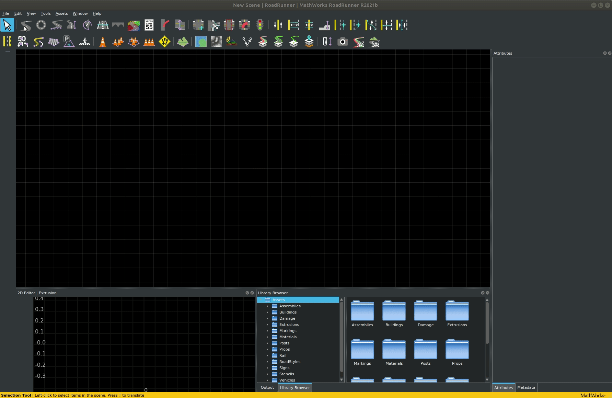

For the purpose of this tutorial we use a simple oval road with a junction in the middle. For building more advanced networks please refer to the [__roadrunner documentation__](https://es.mathworks.com/products/roadrunner.html).

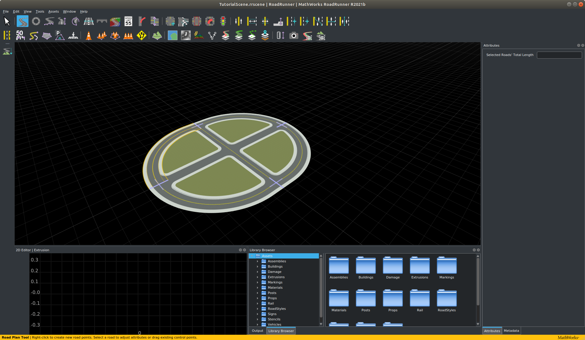

Once you have made your map in RoadRunner you will be able to export it. Be aware that __the road layout cannot be modified after it has been exported.__ Before exporting, ensure that:

- The map is centered at (0,0) to ensure the map can be visualized correctly in Unreal Engine.
- The map definition is correct.
- The map validation is correct, paying close attention to connections and geometries.

>>>>

Once the map is ready, click on the `OpenDRIVE Preview Tool` button to visualize the OpenDRIVE road network and give everything one last check.

>>>>

!!! note
    _OpenDrive Preview Tool_ makes it easier to test the integrity of the map. If there are any errors with junctions, click on `Maneuver Tool`, and `Rebuild Maneuver Roads`.

Once you have created your desired road network, in the RoadRunner menu bar choose `File > Export > Carla (.fbx, .xodr, .rrdata, .xml)` and export to an appropriate location. 

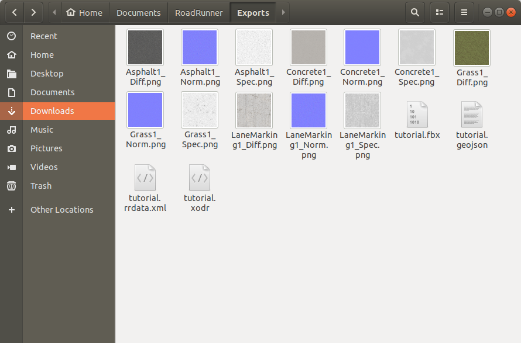

RoadRunner is the best application for creating custom maps. There are alternatives such as [__OpenStreetMap__](tuto_G_openstreetmap.md) that focus on generating maps from real road maps. 

## TrueVision designer

RoadRunner is a proprietary software that requires MATLAB. Some institutions like universities may have deals with MathWorks such that some users may be able to acquire a RoadRunner license. If you don't have budget for a license, a convenient open source alternative to RoadRunner is the [__TrueVision Designer__](https://www.truevision.ai/designer). This app has many of the same features as RoadRunner and is useful if you cannot acquire a license for RoadRunner. 

## Importing your road network into CARLA

The important export files needed for CARLA are the `.xodr` file and the `.fbx` file. Copy or move these files into the `Import` folder inside the root directory of the CARLA repository where you have built from source. 

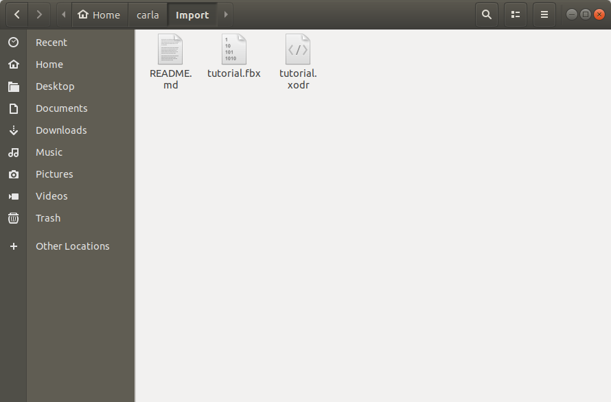

Now open a terminal at the root of the CARLA source directory and run `make import`. This will import the road network into CARLA.

You can now see your new map inside the Unreal Editor. Run `make launch` at the root of the CARLA source directory to launch the Unreal Editor. You will now see a new directory in the content browser named `map_package`. Within this directory in the location `Content > map_package > Maps > tutorial` you will now find your new map.

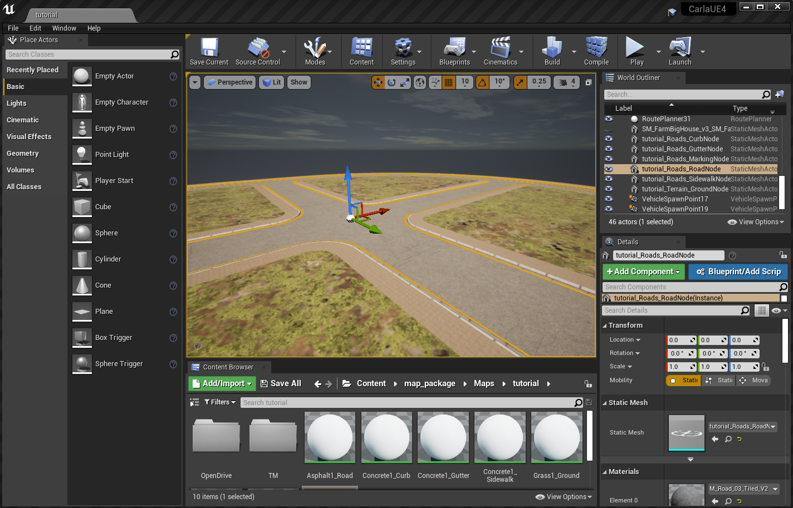

You have now created the road network, the basis of your map.

## Importing assets and adding them to the map

Now we have the road network as the basis for our map, we now want to create some content for the map, such as buildings. These assets can be created using a 3D modelling application such as Autodesk Maya, 3DS Max, Blender or any other 3D application with the appropriate export options. It is important that, at a minimum, the application is capable of `.fbx` export. 

There are several elements needed to create an asset in CARLA:

- [__Mesh__](https://en.wikipedia.org/wiki/Polygon_mesh) - a set of 3D coordinate vertices and the associated joining edges
- [__UV map__](https://en.wikipedia.org/wiki/UV_mapping) - a mapping of 3D vertices and edges to a 2D texture space to match textures with 3D locations
- [__Texture__](https://en.wikipedia.org/wiki/Texture_mapping) - a 2D image defining the colors and patterns to appear on the surface of the 3D object
- [__Normal map__](https://en.wikipedia.org/wiki/Normal_mapping) - a 2D image defining the directions of the normals on the surface of the object, to add 3D variations to the object's surface
- ORM map - a map defining the regions of metallicity, roughness and ambient occlusion

The ORM map utilizes the channels of a standard RGBA encoded image to encode the map of metallic regions, roughness and ambient occlusion. As we define the map here, the red channel defines the metallic map, the green channel the roughness and the blue channel is the ambient occlusion. These maps (as well as the diffuse and normal maps) can be created using an application such as [__Adobe Substance 3D painter__](https://www.adobe.com/products/substance3d-painter.html).

Create a new folder in some appropriate location using the Unreal content browser. Within this folder you can either right click and select `Import to PATH/TO/FOLDER` near the top of the context menu, or drag and drop files directly into the content browser. 

We will import an FBX file containing the base mesh and the UV map, that we have exported from Blender.

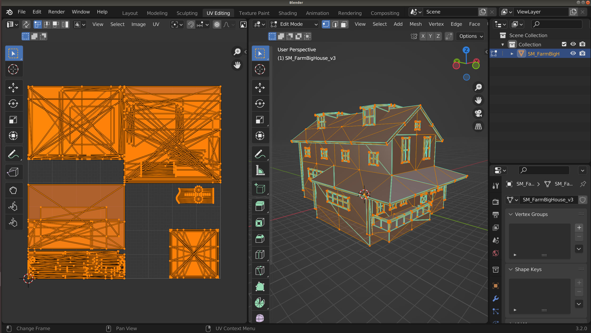

In the context menu, ensure that in the __Mesh__ section `Import Normals` is selected
 for `Normal Import Method` and that in the __Material__ section that `Do Not Create Material` is selected. Deselect `Import Textures` in the __Materials__ section since we will import them manually. These choices would differ if you wanted to use some textures already embedded in your FBX file. 

 Select `Import All`. Once the import has completed, double click on the imported asset that appears in the content browser to edit it. 

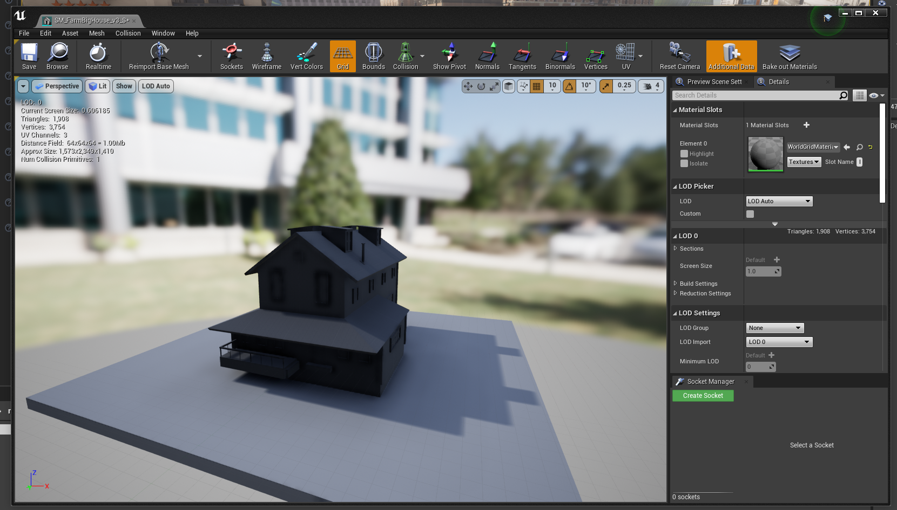

We should now import the textures, the diffuse texture for the diffuse colors, the normal map and the ORM map. 

Open the ORM map by double clicking and deselect the `sRGB` option, to ensure the texture is correctly applied. 

Right click in the content browser and select `Material` from the menu. A new material will be created in the content browser. Double click to edit it. Shift select the textures you imported and drag them into the material edit window, you will now get 3 new nodes in the material node editor. 

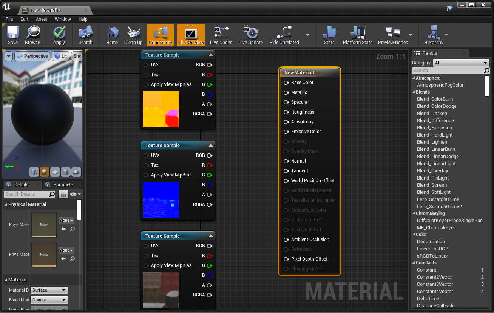

Now connect the nodes according to the following rules:

- Diffuse RGB --> Base Color
- Normal RGB --> Normal
- ORM R --> Ambient occlusion
- ORM G --> Roughness
- ORM B --> Metallic

Your material node graph should now look similar to this: 

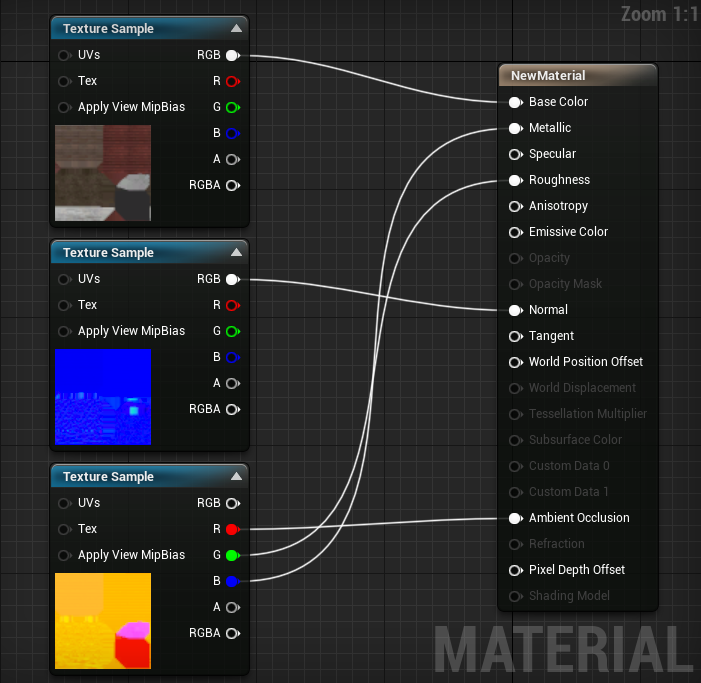

Save the material, then open the asset again and drag the material into the material slot. Your asset should now be fully textured.

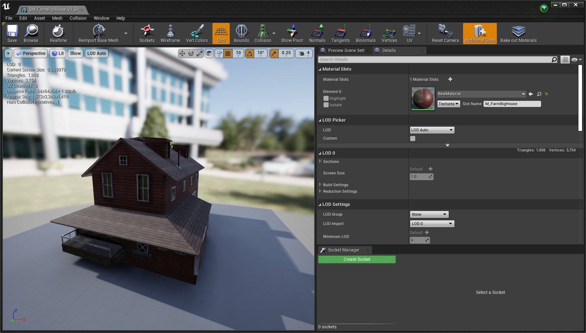

Now save the asset and it is ready for use in your map. You can now drag the asset from the content browser and place it into your map:

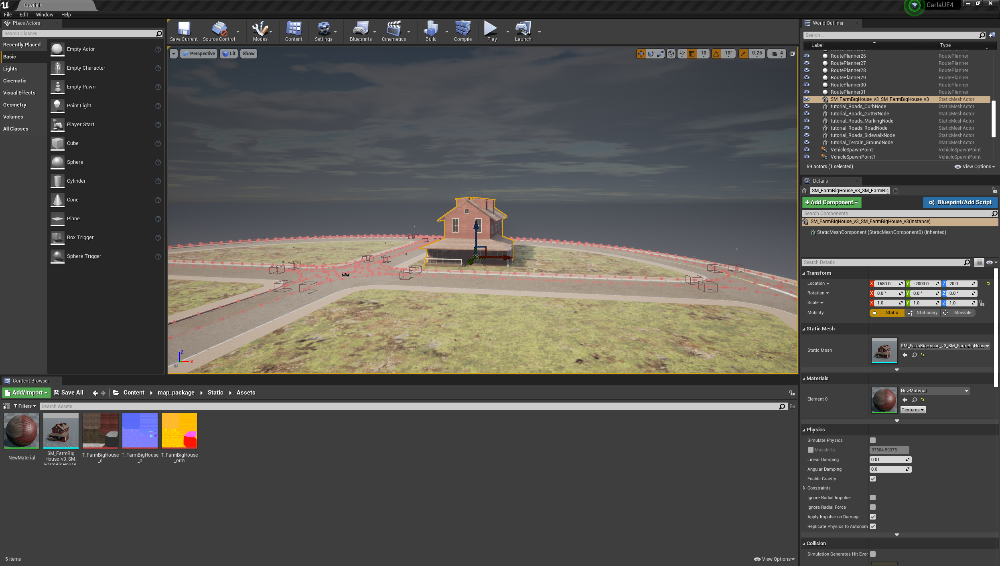

Now you can save the map, using the "Save Current" option in the top left of the workspace and it is ready to use. Play the simulation.

This concludes the Map authorship guide. Now you know how to create a road network and import 3D assets for use in CARLA. You may now read how to [__package a map for use in CARLA standalone version__](tuto_M_manual_map_package.md)

## Traffic lights

To add traffic lights to your new map:

__1.__ From the _Content Browser_, navigate to `Content > Carla > Static > TrafficLight > StreetLights_01`. You will find several different traffic light blueprints to choose from.

__2.__ Drag the traffic lights into the scene and position them in the desired location. Press the space bar on your keyboard to toggle between positioning, rotation, and scaling tools.

__3.__ Adjust the [`trigger volume`][triggerlink] for each traffic light by selecting the _BoxTrigger_ component in the _Details_ panel and adjusting the values in the _Transform_ section. This will determine the traffic light's area of influence.

>>

__4.__ For junctions, drag the `BP_TrafficLightGroup` actor into the level. Assign all the traffic lights in the junction to the traffic light group by adding them to the _Traffic Lights_ array in the _Details_ panel.

>>

__5.__ Traffic light timing is only configurable through the Python API. See the documentation [here](core_actors.md#traffic-signs-and-traffic-lights) for more information.

>>

> _Example: Traffic Signs, Traffic lights and Turn based stop._

[triggerlink]: python_api.md#carla.TrafficSign.trigger_volume

## Traffic signs

To add traffic signs to your new map:

__1.__ From the _Content Browser_, navigate to `Content > Carla > Static > TrafficSign`. You will find several different traffic light blueprints to choose from.

__2.__ Drag the traffic lights into the scene and position them in the desired location. Press the space bar on your keyboard to toggle between positioning, rotation, and scaling tools.

__3.__ Adjust the [`trigger volume`][triggerlink] for each traffic sign by selecting the _BoxTrigger_ component in the _Details_ panel and adjusting the values in the _Transform_ section. This will determine the traffic light's area of influence. Not all traffic signs have a trigger volume. Those that do, include the yield, stop and speed limit signs.

## Materials

The CARLA content library has a multitude of useful materials ready to use to change the look of your maps. In your content browser, navigate to `Carla > Static > GenericMaterials`. In here you will find numerous materials you can use to alter the appearance of your map. 

You can test the materials rapidly by drag and drop onto map elements:

# Road Painter

The road painter is a tool that can be used to customize the appearance of the road, adding extra realism with additional textures, decals and meshes.

## What is the road painter?

The Road Painter tool is a blueprint that uses OpenDRIVE information to paint roads quickly. It takes a master material and applies it to a render target of the road to use as a canvas. The master material is made up of a collection of materials that can be blended using brushes and applied as masks. There is no need to apply photometry techniques nor consider the UVs of the geometry.

The road painter uses the OpenDRIVE information to paint the roads. Make sure that your `.xodr` file has the same name as your map for this to work correctly.

## Establish the road painter, master material and render target

__1. Create the `RoadPainter` actor.__

1. In the _Content Browser_, navigate to `Content > Carla > Blueprints > LevelDesign`.
2. Drag the `RoadPainter` into the scene.

__2. Create the Render Target.__

1. In the _Content Browser_, navigate to `Content > Carla > Blueprints > LevelDesign > RoadPainterAssets`.
2. Right-click on the `RenderTarget` file and select `Duplicate`.
3. Rename to `Tutorial_RenderTarget`.

__3. Create the master material instance.__

1. In the _Content Browser_, navigate to `Game > Carla > Static > GenericMaterials > RoadPainterMaterials`.
2. Right-click on `M_RoadMaster` and select _Create Material Instance_.
3. Rename to `Tutorial_RoadMaster`.

__4. Re-calibrate the _Map Size (Cm)_ so that it is equal to the actual size of the map.__

1. Select the `RoadPainter` actor in the scene.
2. Go to the _Details_ panel and press the _Z-Size_ button. You will see the value in _Map Size (Cm)_ change.

>>>>>

__5. Synchronize the map size between the `RoadPainter` and `Tutorial_RoadMaster`.__

1. In the _Content Browser_, open `Tutorial_RoadMaster`.
2. Copy the value _Map Size (Cm)_ from the previous step and paste it to _Global Scalar Parameter Values -> Map units (CM)_ in the `Tutorial_RoadMaster` window.
3. Press save.

>>>>>>

__6. Create the communication link between the road painter and the master material.__

The `Tutorial_RenderTarget` will be the communication link between the road painter and `Tutorial_RoadMaster`.

1. In the `Tutorial_RoadMaster` window, apply the `Tutorial_RenderTarget` to _Global Texture Parameter Values -> Texture Mask_.
2. Save and close.
3. In the main editor window, select the road painter actor, go to the _Details_ panel and apply the `Tutorial_RenderTarget` to _Paint -> Render Target_.

---

## Prepare the master material

The `Tutorial_RoadMaster` material you created holds the base material, extra material information, and parameters that will be applied via your `Tutorial_RenderTarget`. You can configure one base material and up to three additional materials.

>>

To configure the materials, double-click the `Tutorial_RoadMaster` file. In the window that appears, you can select and adjust the following values for each material according to your needs:

- Brightness
- Hue
- Saturation
- AO Intensity
- NormalMap Intensity
- Roughness Contrast
- Roughness Intensity

You can change the textures for each material by selecting the following values and searching for a texture in the search box:

- Diffuse
- Normal
- ORMH

Explore some of the CARLA textures available in `Game > Carla > Static > GenericMaterials > Asphalt > Textures`.

---

### Paint the road

__1. Create the link between the road painter and the roads.__

1. In the main editor window, search for `Road_Road` in the _World Outliner_ search box.
2. Press `Ctrl + A` to select all the roads.
3. In the _Details_ panel, go to the _Materials_ section and apply `Tutorial_RoadMaster` to _Element 0_, _Element 1_, _Element 2_, and _Element 3_.

__2. Choose the material to customize.__

Each of the materials we added to `Tutorial_RoadMaster` are applied to the roads separately and application is configured with the _Brush_ tool. To apply and customize a material:

1. Select the road painter actor
2. In the _Details_ panel, select the material to work with in the _Mask Color_ dropdown menu.

>>>>>>

__3. Set the brush and stencil parameters.__

There are a variety of stencils to choose from in `GenericMaterials/RoadStencil/Alphas`. The stencil is used to paint the road according to your needs and can be adjusted using the following values:

- _Stencil size_ — Size of the brush.
- _Brush strength_ — Roughness of the outline.
- _Spacebeween Brushes_ — Distance between strokes.
- _Max Jitter_ — Size variation of the brush between strokes.
- _Stencil_ — The brush to use.
- _Rotation_ — Rotation applied to the stroke.

>>>>>>

<i>Brush panel.</i>

 

<i>Different types of brushes.</i>

 
__4. Apply each material to the desired portions of the road.__

Choose where to apply the selected material via the buttons in the _Default_ section of the _Details_ panel:

* _Paint all roads_ — Paint all the roads.
* _Paint by actor_ — Paint a specific, selected actor.
* _Paint over circle_ — Paint using a circular pattern, useful to provide variation.
* _Paint over square_ — Paint using a square pattern, useful to provide variation.

This section also contains options to erase the applied changes.

* _Clear all_ — Erase all the painted material.
* _Clear materials_ — Remove the currently active materials.
* _Clear material by actor_ — Remove the material closest to the selected actor.

>>>>>>

<i>Different painting and erasing options.</i>

 
__5. Add decals and meshes.__

You can explore the available decals and meshes in `Content > Carla Static > Decals` and `Content > Carla > Static`. Add them to road painter by extending and adding to the _Decals Spawn_ and _Meshes Spawn_ arrays. For each one you can configure the following parameters:

- _Number of Decals/Meshes_ - The amount of each decal or mesh to paint.
- _Decal/Mesh Scale_ — Scale of the decal/mesh per axis.
- _Fixed Decal/Mesh Offset_ — Deviation from the center of the lane per axis.
- _Random Offset_ — Max deviation from the center of the lane per axis.
- _Decal/Mesh Random Yaw_ — Max random yaw rotation.
- _Decal/Mesh Min Scale_ — Minimum random scale applied to the decal/mesh.
- _Decal/Mesh Max Scale_ — Max random scale applied to the decal/mesh.

>>>>>>

<i>Decals and Meshes panels.</i>

 

Once you have configured your meshes and decals, spawn them by pressing `Spawn decals` and `Spawn meshes`.

!!! Note
    Make sure that meshes and decals do not have collisions enabled that can interfere with cars on the road and lower any bounding boxes to the level of the road.

__7. Experiment to get your desired appearance.__ 

Experiment with different materials, textures, settings, decals, and meshes to get your desired look. Below are some example images of how the appearance of the road changes during the process of painting each material.

<i>Example of base road material.</i>

 

<i>Example after material 1 is applied.</i>

 

<i>Example after material 2 is applied.</i>

 

<i>Example after material 3 is applied.</i>

 

<i>Example after decals are applied.</i>

 

<i>Example after meshes are applied.</i>

 

---

## Update the appearance of lane markings

After you have painted the roads, you can update the appearance of the road markings by following these steps:

__1. Make a copy of the master material.__

1. In the _Content Browser_, navigate to `Game > Carla > Static > GenericMaterials > RoadPainterMaterials`.
2. Right-click on `Tutorial_RoadMaster` and select _Create Material Instance_.
3. Rename to `Tutorial_LaneMarkings`.

__2. Configure the lane marking material.__

1. In the _Content Browser_, double-click on `Tutorial_LaneMarkings`.
2. In the _Details_ panel, go to the _Global Static Switch Parameter Values_ section and check the boxes on the left and right of _LaneMark_.
3. Go to the _Texture_ section and check the boxes for _LaneColor_ and _Uv Size_.
4. Choose your preferred color for the lane markings in _LaneColor_.
5. _Save_ and close.

__3. Select the road marking meshes.__

Drag the material onto the lane markings you wish to color. Repeat the whole process for different colors of lane markings if required.

---

## Trees and Vegetation

The CARLA content library has a comprehensive set of vegetation blueprints for you to add further realism to the off-road areas of your maps like sidewalks, parks, hillsides, fields and forrest. 

Navigate to the vegetation folder in the CARLA content library: `Carla > Static > Visitation`. You will find blueprints for multiple types of trees, bushes, shrubs. You can drag these elements into your map from the content browser. 

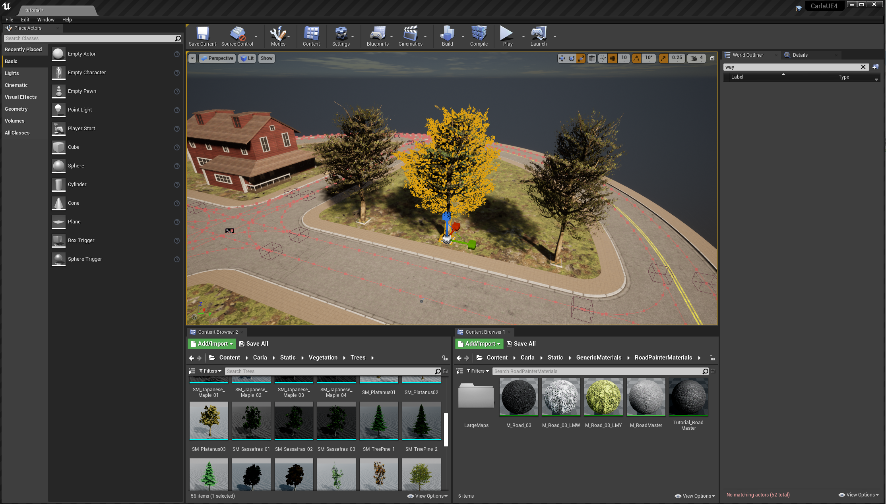

### Foliage tool

A useful tool for trees and vegetation is the [__Unreal Engine foliage tool__](https://docs.unrealengine.com/4.27/en-US/BuildingWorlds/Foliage/). Activate the tool by selecting the `mode` from the mode dropdown in the toolbar.

Drag your desired foliage item into the box labeled `+ Drop Foliage Here`. Set an appropriate density in the density field, then paint into the map with your foliage item. 

## Next steps

Continue customizing your map using the tools and guides below:

- [Implement sub-levels in your map.](tuto_M_custom_layers.md)
- [Add buildings with the procedural building tool.](tuto_M_custom_buildings.md)
- [Customize the weather](tuto_M_custom_weather_landscape.md#weather-customization)
- [Customize the landscape with serial meshes.](tuto_M_custom_weather_landscape.md#add-serial-meshes)
Once you have finished with the customization, you can [generate the pedestrian navigation information](tuto_M_generate_pedestrian_navigation.md).

---

If you have any questions about the process, then you can ask in the [forum](https://github.com/carla-simulator/carla/discussions).

<a href="https://github.com/carla-simulator/carla/discussions" target="_blank" class="btn btn-neutral" title="Go to the CARLA forum">
CARLA forum</a>

