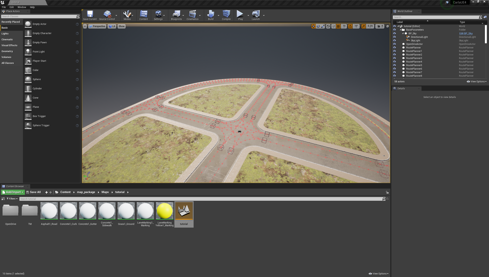
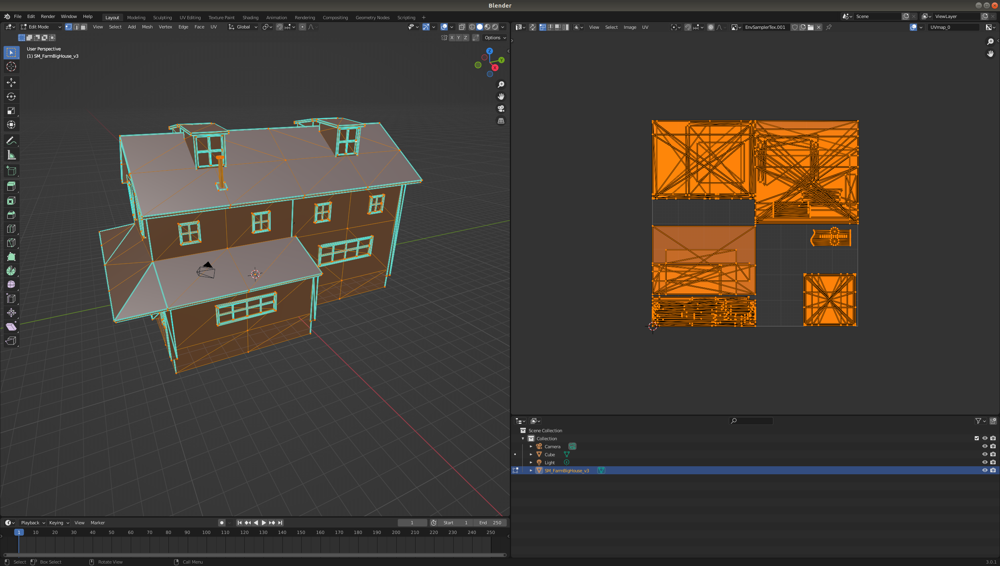
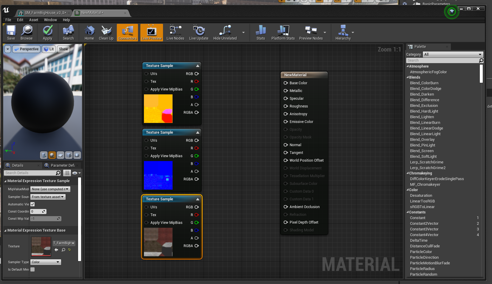
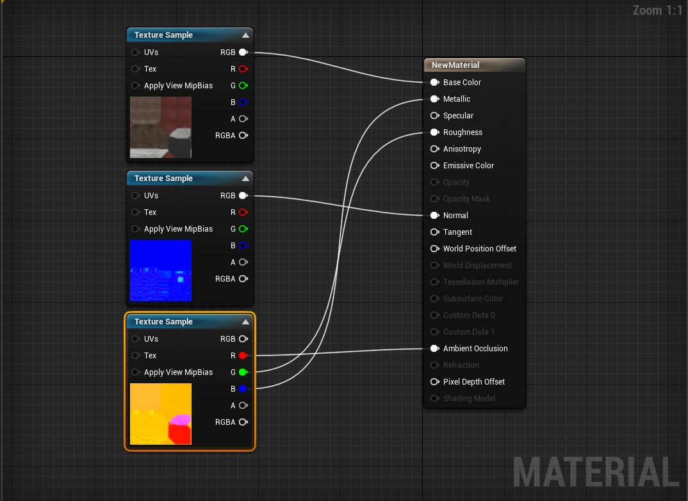

# Content authoring - Maps

CARLA comes with a generous compliment of assets for creating driving simulations out of the box. However, the real power of CARLA comes in its comprehensive extensibility, allowing users to create entirely custom environments populated with bespoke assets like buildings, benches, trash cans, statues, street lights and bus stops. 

In this tutorial we will cover the process of creating a simple map for use with CARLA. We will use two software packages to create parts of the map. We will create the road network using [__RoadRunner__](https://es.mathworks.com/products/roadrunner.html) and then add assets to the map through the [__Unreal Editor__](https://www.unrealengine.com/en-US/features/the-unreal-editor).

## Prerequisites

To follow this guide, you will need to build CARLA from source, so that you may use the unreal editor. Follow the [__build instructions__](build_carla.md) for your relevant operating system. You will also need a licensed copy of RoardRunner. You may also need a 3D modelling application such as Maya, 3DS Max or Blender to create 3D assets for your custom maps. You should ensure you have completed all the steps to build CARLA and ensure that the Unreal Editor is working, this could take some time to build the application. If you want to create 3D assets for your map, you need to  

## Create a road network using RoadRunner

Open RoadRunner and create a new scene. Choose the Road Plan Tool and right click in the workspace to drop the first control point for the road. Click and drag elswhere in the workspace to extend the road. 

For the purpose of this tutorial we use a simple oval road with a junction in the middle. For more building more advanced networks please refer to the [__roadrunner documentation__](https://es.mathworks.com/products/roadrunner.html).

Once you have created your desired road network, in the RoadRunner menu bar choose `File > Export > Carla (.fbx, .xodr, .rrdata, .xml)` and export to an appropriate location. 

## Importing your road network into CARLA

The important export files needed for CARLA are the `.xodr` file and the `.fbx` file. Copy or move these files into the *Import* folder inside the root directory of the CARLA repository where you have built from source. 

Now open a terminal at the root of the CARLA source directory and run `make import`. This will import the road network into CARLA.

You can now see your new map inside the Unreal Editor. Run `make launch` at the root of the CARLA source directory to launch the Unreal Editor. You will now see a new directory in the content browser named `map_package`. Within this directory in the location `Content > map_package > Maps > tutorial` you will now find your new map.

You have now created the road network, the basis of your map.

## Importing assets and adding them to the map

Now we have the road network as the basis for our map, we now want to create some content for the map, such as buildings. These assets can be created using a 3D modelling application such as Autodesk Maya, 3DS Max, Blender or any other 3D application with the appropriate export options. It is important that, at a minimum, the application is capable of `.fbx` export. 

There are several elements needed to create an asset in CARLA:

- [__Mesh__](https://en.wikipedia.org/wiki/Polygon_mesh) - a set of 3D coordinate vertices and the associated joining edges
- [__UV map__](https://en.wikipedia.org/wiki/UV_mapping) - a mapping of 3D vertices and edges to a 2D texture space to match textures with 3D locations
- [__Texture__](https://en.wikipedia.org/wiki/Texture_mapping) - a 2D image defining the colors and patterns to appear on the surface of the 3D object
- [__Normal map__](https://en.wikipedia.org/wiki/Normal_mapping) - a 2D image defining the directions of the normals on the surface of the object, to add 3D variations to the object's surface
- ORM map - a map defining the regions of metallicity, roughness and ambient oclussion

The ORM map utilises the channels of a standard RGBA encoded image to encode the map of metallic regions, roughness and ambient occlusion. As we define the map here, the red channel defines the metalic map, the green channel the roughness and the blue channels the ambient occlusion. These maps (as well as the diffuse and normal maps) can be created using an application such as [__Adobe Substance 3D painter__](https://www.adobe.com/products/substance3d-painter.html).

Create a new folder in some appropriate location using the Unreal content browser. Within this folder you can either right click and select `Import to folder_location` near the top of the context menu, or drag and drop files directly into the content browser. 

We will import an FBX file containing the base mesh and the UV map, that we have exported from Blender.

In the context menu, ensure that in the __Mesh__ section *Import Normals* is selected
 for *Normal Import Method* and that in the __Material__ section that *Do Not Create Material* is selected. Deselect *Import Textures* in the __Materials__ section since we will import them manually. These choices would differ if you wanted to use some textures already embedded in your FBX file. 

 Select *Import All*. Once the import has completed, double click on the imported asset that appears in the content browser to edit it. 

We should now import the textures, the diffuse texture for the diffuse colors, the normal map and the ORM map. 

Open the ORM map by double clicking and deselect the `sRGB` option, to ensure the texture is correctly applied. 

Right click in the content browser and select *Material* from the menu. A new matrial will be created in the content browser. Double click to edit it. Shift select the textures you imported and drag them into the material edit window, you will now get 3 new nodes in the material node editor. 

Now connect the nodes according to the following rules:

- Diffuse RGB --> Base Color
- Normal RBG --> Normal
- ORM R --> Ambient occlusion
- ORM G --> Roughness
- ORM B --> Metallic

Your material node graph should now look similar to this: 

Save the material, then open the asset again and drag the material into the material slot. Your asset should now be fully textured.

Now save the asset and it is ready for use in your map. You can now drag the asset from the content browser and place it into your map:

Now you can save the map, using the "Save Current" option in the top left of the workspace and it is ready to use. Play the simulation.

This concludes the Map authorship guide. Now you know how to create a road network and import 3D assets for use in CARLA. You may now read how to [__package a map for use in CARLA standalond version__](tuto_M_manual_map_package.md)

