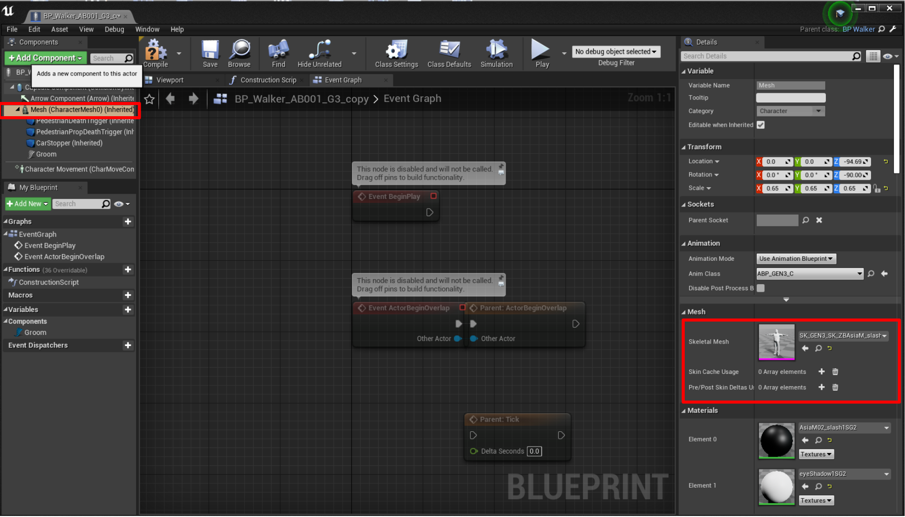

# Content authoring - pedestrians

CARLA provides a comprehensive set of pedestrians out of the box in the WalkerFactory blueprint. Users can expand upon this with custom pedestrians. Modelling human anatomy for 3D animation is highly complex and beyond the scope of this document. We therefore refer the user to alternative resources to learn how to model a human in a 3D modelling application. This guide deals with importing and configuring a completed 3D model of a human for use as a pedestrian in CARLA. 

* __[Modeling](#modeling)__
	* [Naming conventions](#naming-conventions)
* __[Rigging](#rigging-the-vehicle-using-an-armature)__
	* [Import](#import)
	* [Armature](#add-an-armature)
    * [Parenting](#parenting)
    * [Assignment](#assigning-car-parts-to-bones)
	* [Blender add-on](#blender-ue4-vehicle-rigging-add-on)
    * [Export](#export)
* __[Import into Unreal Engine](#importing-into-unreal-engine)__
	* [Physics asset](#setting-the-physics-asset)
	* [Animation](#creating-the-animation)
    * [Blueprint](#creating-the-blueprint)
* __[Materials](#materials)__
	* [Applying materials](#applying-a-material-to-your-vehicle)
		* [Color](#color)
		* [Clear coat](#clear-coat)
		* [Orange peel](#orange-peel)
		* [Flakes](#flakes)
		* [Dust](#dust)
* __[Glass](#glass)__
	* [Glass meshes](#glass-meshes)
	* [Glass material](#glass-material)
	* [Single layer glass](#single-layer-glass)
* __[Wheels](#wheels)__
	* [Wheel blueprint](#wheel-blueprint)
	* [Collision mesh](#collision-mesh)
	* [Tire configuration](#tire-configuration)
	* [Wheel dimensions](#wheel-dimensions)
* __[Lights](#lights)__
	* [UV map](#uv-map)
	* [Importing](#importing)

## Modeling

Pedestrians are a combination of geometry bound to a skeletal hierarchy of joints and bones. They should be imported into Unreal Engine as **skeletal meshes**. The mesh will be bound to a skeletal definition. The information about the skeletal definition can be encapsulated in the FBX file exported from your 3D application. 

* __Geometry__  

	Pedestrians should have between 30,000 and 50,000 faces. This should include all anatomy and clothing. Ideally, models should have human dimensions, this can be rescaled after import if necessary. 

	!!! note
		Pay careful attention to the units of your 3D application. Some applications work in meters while others work in centimeters or arbitrary units. 

* __Skeletal hierarchy__  

	The skeletal hierarchy should follow CARLA's GEN3 skeletal hierarchy, [download the template](https://drive.google.com/file/d/1SYUvH096VxoD_qEMafL9Y4qR5Zhz3IPH/view?usp=sharing) to use with your own model. You may delete the human geometry and replace it with your own. This will match with CARLA's pre-generated skeletal definition in UE. 

	

* __Skinning and weight painting__  

	Part of preparing the 3D model to move properly is to ensure the various vertices of the model are influenced in the correct way by each of the bones of the skeleton. For example, the bone to control the wrist of the 3D character should control the vertices of the hand and the wrist. It should mildly influence the vertices slightly further up the forearm, but it should not influence anything close to the elbow. Therefore you should use the weight painting tools of your 3D application to fine tune the influence of each bone on the mesh. This is an involved process and we refer the user to other sources to learn more about skinning and weight painting a human character.

	

## Importing your pedestrian into CARLA

Once you have completed the geometry of your mesh and bound it to the skeleton, you should export it from your 3D application in FBX format. After completing the export, find an appropriate folder location in the CARLA content library and drag and drop the FBX into the content browser. You may wish to place your custom pedestrians alongside the existing pedestrians in `Content > Carla > Static > Pedestrians`. 

In the import options pop-up dialogue, ensure that *Skeletal Mesh* and *Import Mesh* are chosen and that the *Import Content Type* is set to *Geometry and Skinning Weights*. In the *Skeleton* section, select CARLA's pregenerated skeletal definition *Skel_GEN3*. Then press *Import All*.

The *Skel_GEN3* definition already has pedestrian animation assigned. 

## Making your new pedestrian accessible through the Python API

After successfully importing your pedestrian into CARLA's content library, you must now make the pedestrian available through the API.

Navigate to `Content > Carla > Blueprints > Walkers` where you will find the existing pedestrian blueprints. Duplicate a GEN3 blueprint, for example BP_Walker_AB001_G3 and rename it. 

Double click on the duplicated blueprint to open it in the editor. You need to change the *Mesh* component of the blueprint to your new pedestrian model. Drag and drop the skeletal mesh that you just imported from the content browser into the *Skeletal Mesh* slot.

