# 콘텐츠 저작 - 차량

CARLA는 블루프린트 라이브러리에 다양한 차량 세트를 기본적으로 제공합니다. CARLA는 사용자가 최대한의 확장성을 위해 커스텀 차량으로 이를 확장할 수 있도록 합니다.

상세한 차량의 3D 모델링은 매우 복잡하며 상당한 수준의 기술이 필요합니다. 따라서 이 가이드의 범위를 벗어나는 3D 모델링에 대해서는 다른 문서를 참조하시기 바랍니다. 하지만 무료와 유료 온라인 저장소 모두에서 수많은 차량 모델 소스를 찾을 수 있습니다. 따라서 사용자는 CARLA에서 사용할 커스텀 차량을 만드는 데 많은 옵션을 가지고 있습니다.

CARLA용 커스텀 차량을 준비하는 데 있어 핵심 요소는 차량 아마추어를 리깅하고 언리얼 엔진으로 가져오는 것입니다. 리깅과 가져오기 후에는 차량과 바퀴를 위한 블루프린트를 설정해야 합니다. 그런 다음 재질을 적용하고 차량의 유리 부분을 추가합니다. 다음 가이드에서 이러한 단계들을 다룰 것입니다.

* __[모델링](#모델링)__
  * [명명 규칙](#명명-규칙)
* __[리깅](#아마추어를-사용한-차량-리깅)__
  * [가져오기](#가져오기)
  * [아마추어](#아마추어-추가)
  * [페어런팅](#페어런팅)
  * [할당](#차량-부품을-뼈에-할당)
  * [블렌더 애드온](#블렌더-ue4-차량-리깅-애드온)
  * [내보내기](#내보내기)
* __[언리얼 엔진으로 가져오기](#언리얼-엔진으로-가져오기)__
  * [물리 에셋](#물리-에셋-설정)
  * [애니메이션](#애니메이션-생성)
  * [블루프린트](#블루프린트-생성)
* __[재질](#재질)__
  * [재질 적용](#차량에-재질-적용)
    * [색상](#색상)
    * [클리어 코트](#클리어-코트)
    * [오렌지 필](#오렌지-필)
    * [플레이크](#플레이크)
    * [먼지](#먼지)
* __[유리](#유리)__
  * [유리 메시](#유리-메시)
  * [유리 재질](#유리-재질)
  * [단일 레이어 유리](#단일-레이어-유리)
* __[바퀴](#바퀴)__
  * [바퀴 블루프린트](#바퀴-블루프린트)
  * [충돌 메시](#충돌-메시)
  * [타이어 구성](#타이어-구성)
  * [바퀴 치수](#바퀴-치수)
* __[조명](#조명)__
  * [UV 맵](#uv-맵)
  * [가져오기](#가져오기-1)

## 모델링

차량은 50,000에서 100,000개의 면을 가져야 합니다. 모범 사례로서 내보내기 전에 모델을 삼각화하는 것을 권장합니다. CARLA 차량은 실제 자동차의 크기와 비율을 참조하여 모델링됩니다. 3D 애플리케이션의 단위에 신중한 주의를 기울이세요. 일부는 센티미터 단위로 작업하고 다른 일부는 미터 단위로 작업합니다.

### 명명 규칙

편의성과 일관성을 위해 차량을 다음 부분으로 나누고 그에 따라 이름을 지정할 것을 권장합니다. 유리와 조명에 대한 구체적인 내용은 후반부에서 다룰 것입니다:

>1. __Bodywork__: 차량의 금속 부분. 이 재질은 언리얼 엔진 재질로 변경됩니다. 로고와 세부 사항을 추가할 수 있지만, 보이게 하려면 언리얼 엔진 에디터의 알파 채널을 사용하여 다른 색상으로 칠해야 합니다.
- __Glass_Ext__: 차량 외부에서 내부를 볼 수 있게 하는 유리층.
- __Glass_Int__: 차량 내부에서 외부를 볼 수 있게 하는 유리층.
- __Lights__: 헤드라이트, 방향 지시등 등.
- __LightGlass_Ext__: 조명 외부에서 내부를 볼 수 있게 하는 유리층.
- __LightGlass_Int__: 조명 내부에서 외부를 볼 수 있게 하는 유리층.
- __LicensePlate__: 29x12 cm의 직사각형 평면. 최상의 결과를 위해 [여기](https://carla-assets.s3.us-east-005.backblazeb2.com/fbx/LicensePlate.rar)에서 CARLA에서 제공하는 `.fbx`를 사용할 수 있습니다. 텍스처는 언리얼 엔진에서 자동으로 할당됩니다.
- __Interior__: 위 섹션에 맞지 않는 다른 세부 사항들은 _Interior_에 포함될 수 있습니다.

재질은 `M_CarPart_CarName` 형식으로 이름을 지정해야 합니다(예: `M_Bodywork_Mustang`).

텍스처는 `T_CarPart_CarName` 형식으로 이름을 지정해야 합니다(예: `T_Bodywork_Mustang`). 텍스처 크기는 2048x2048이어야 합니다.
## 아마추어를 사용한 차량 리깅

시뮬레이션에서 현실적으로 보이기 위해, 차량은 회전하는 바퀴가 있어야 하며, 앞쪽 한 쌍은 조향 입력에 따라 회전할 수 있어야 합니다. 따라서 CARLA용 차량을 준비하기 위해서는 바퀴를 식별하고 움직임을 허용하기 위해 차량에 아마추어를 리깅해야 합니다.

### 가져오기

3D 모델링 애플리케이션에서 차량 모델 메시를 가져오거나 모델링합니다. 이 가이드에서는 Blender 3D를 사용할 것입니다. 바퀴가 본체와 분리될 수 있는지 확인하세요. 각 바퀴는 개별 객체로 접근할 수 있어야 합니다.

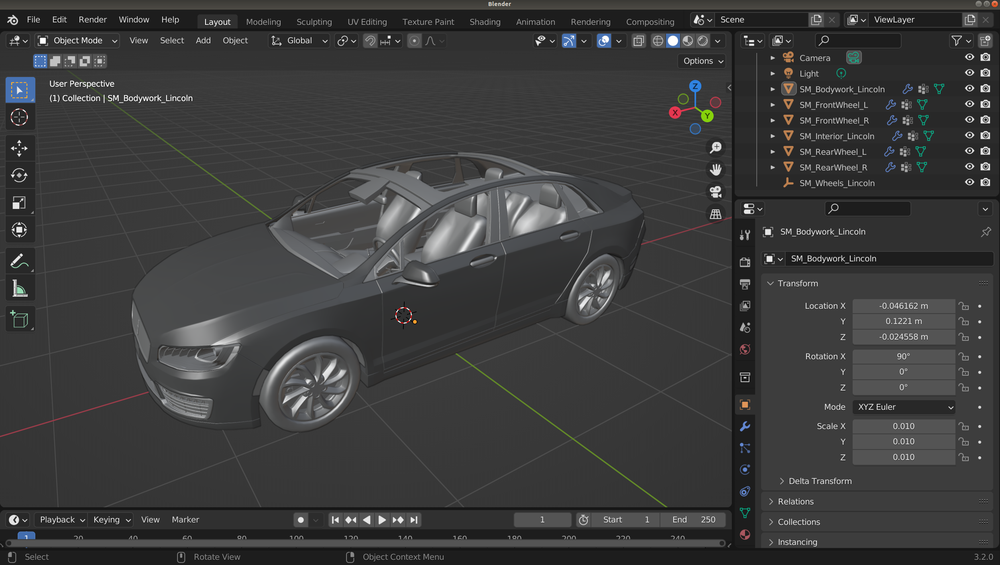

차량이 양의 X 방향을 향하도록 하는 것이 중요합니다. 따라서 후드와 앞유리는 양의 X를 향해야 합니다. 또한 차량은 바닥에서 지붕 방향이 양의 Z 방향이 되도록 방향이 설정되어야 합니다. 바퀴는 X-Y 평면에 살짝 닿아야 하며, 원점은 X-Y 평면에서 차량의 무게중심이 있을 것으로 예상되는 위치에 있어야 합니다(Z 평면에서는 제외).

### 아마추어 추가

이제 차량 중심에 아마추어를 추가합니다. 객체가 제대로 중심에 있는지 확인하고, 아마추어 뼈의 루트는 원점에 위치해야 합니다. 편집 모드로 전환하고 아마추어를 x축 기준으로 90도 회전합니다.

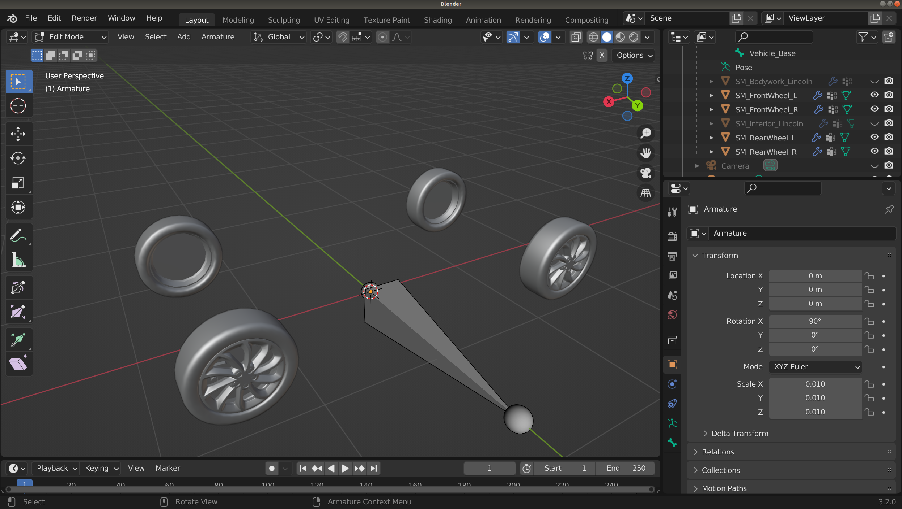

이제 아마추어를 선택하고 4개의 뼈를 더 추가합니다. 각 뼈의 루트는 각 바퀴의 중심과 일치해야 합니다. 이는 편집 모드에서 3D 커서를 각 바퀴의 중심에 위치시켜 달성할 수 있습니다. 객체 모드에서 바퀴 하나를 선택하고, 정점을 선택한 다음 `A`를 눌러 모든 정점을 선택한 후 `Shift+S`를 누르고 `Cursor to selected`를 선택합니다. 이렇게 하면 커서가 바퀴의 중심에 위치하게 됩니다. 그런 다음 객체 모드에서 아마추어를 선택하고 편집 모드로 전환한 후, 뼈를 선택하고 `Selection to cursor`를 선택합니다. 이제 뼈가 바퀴와 일치하게 됩니다. 각 뼈를 회전하여 아마추어의 베이스와 정렬시킵니다.

각 바퀴에 대해, 나중에 각 뼈에 정점 그룹을 할당할 때 식별하는 데 도움이 되도록 뼈를 연결될 바퀴에 따라 이름을 지정하는 것이 좋습니다.

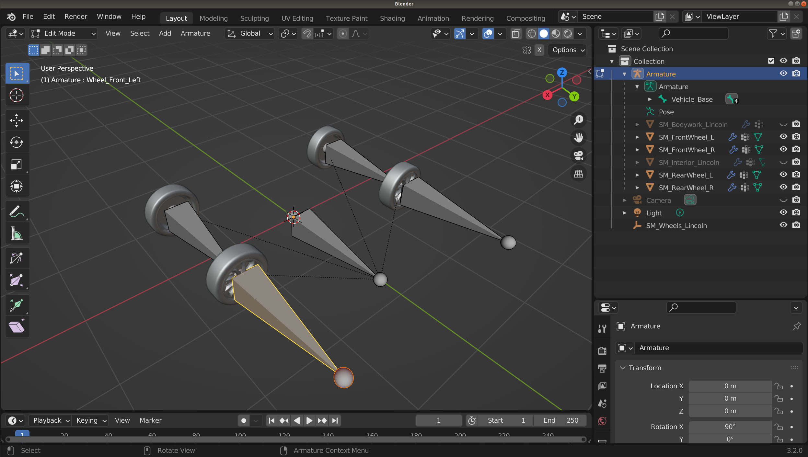

### 페어런팅

이제 프로젝트 아웃라이너에서 shift나 control을 사용하여 본체의 모든 부분과 4개의 바퀴를 모두 선택한 다음, 생성한 아마추어를 control 선택합니다(이 순서가 중요합니다. 역순으로 선택하면 작동하지 않습니다). `Ctrl+p`를 누르고 `With empty groups`를 선택하여 메시를 아마추어에 바인딩합니다.


이제 메시를 아마추어에 페어런팅했으므로, 각 바퀴를 해당 뼈에 할당해야 합니다. 아웃라이너나 에디터에서 바퀴를 선택합니다. 편집 모드로 전환하고 바퀴의 모든 정점을 선택합니다(단축키 - `a`).

### 차량 부품을 뼈에 할당

속성의 메시 탭(녹색 삼각형)을 선택합니다. 메시 속성 패널의 정점 그룹 탭 안에서 아마추어의 뼈들이 보일 것입니다. 편집 중인 바퀴에 해당하는 뼈를 선택하고 `Assign`을 선택합니다. 바퀴를 모두 리깅한 후에는 차량의 다른 모든 부분을 베이스 뼈에 리깅합니다.

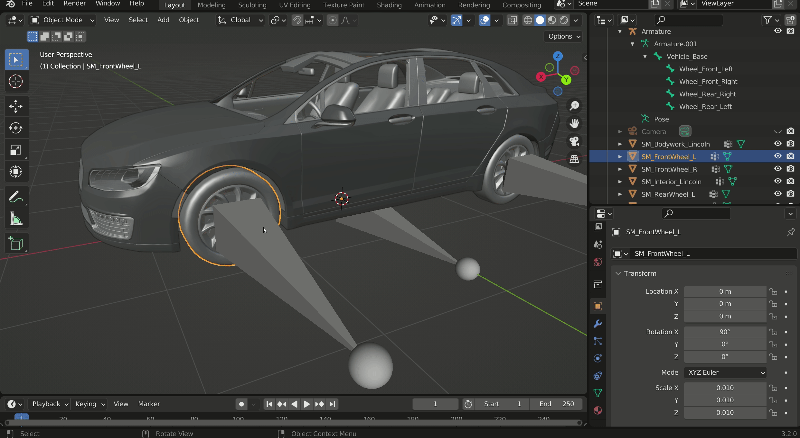

메시의 모든 부분을 아마추어에 할당한 후에는 아마추어를 선택하고 포즈 모드로 이동하여 관련 뼈를 움직여 작동하는지 테스트할 수 있습니다. 차량 베이스 뼈는 차량 전체를 움직여야 하고, 바퀴 뼈는 각각 해당 바퀴를 움직이고 회전시켜야 합니다. `Ctrl+Z`로 테스트한 포즈를 되돌리세요.


### 블렌더 UE4 차량 리깅 애드온

위 단계들을 간소화하는 데 도움이 되는 CARLA로 가져오기 위한 차량 리깅용 블렌더 애드온이 있습니다. 지침은 [__애드온 웹페이지__](https://continuebreak.com/creations/ue4-vehicle-rigging-addon-blender/)를 참조하세요.

### 내보내기

이제 리깅된 모델을 언리얼 엔진으로 가져오기 위해 FBX 형식으로 내보내겠습니다. 파일 메뉴에서 `Export > FBX (.fbx)`를 선택합니다. `Include` 패널의 `Object Types` 섹션에서 shift를 누른 채 `Armature`와 `Mesh` 옵션을 선택합니다.

`Transform` 패널에서 `Forward`를 `X Forward`로 변경하고 `Up`을 `Z Up`으로 변경합니다. 이는 차량이 언리얼 엔진에서 올바른 방향을 갖도록 하는 데 중요합니다.

`Armature` 섹션에서 `Add Leaf Bones`를 체크 해제하고 `Bake Animation`을 체크 해제합니다.


## 언리얼 엔진으로 가져오기

CARLA 루트 디렉토리(소스에서 CARLA를 빌드한 디렉토리)에서 `make launch` 명령으로 언리얼 에디터를 실행합니다. 콘텐츠 브라우저를 열고, 적절한 디렉토리를 설정한 다음 우클릭하여 `Import to ....`를 선택합니다. 이전에 블렌더(또는 다른 3D 모델링 애플리케이션)에서 내보낸 FBX 파일을 선택합니다. 기본 설정으로 가져옵니다.

### 물리 에셋 설정

이제 콘텐츠 브라우저 디렉토리에 메시, 스켈레톤, 물리 에셋 세 가지가 있을 것입니다. 물리 에셋을 더블 클릭하여 조정합니다.

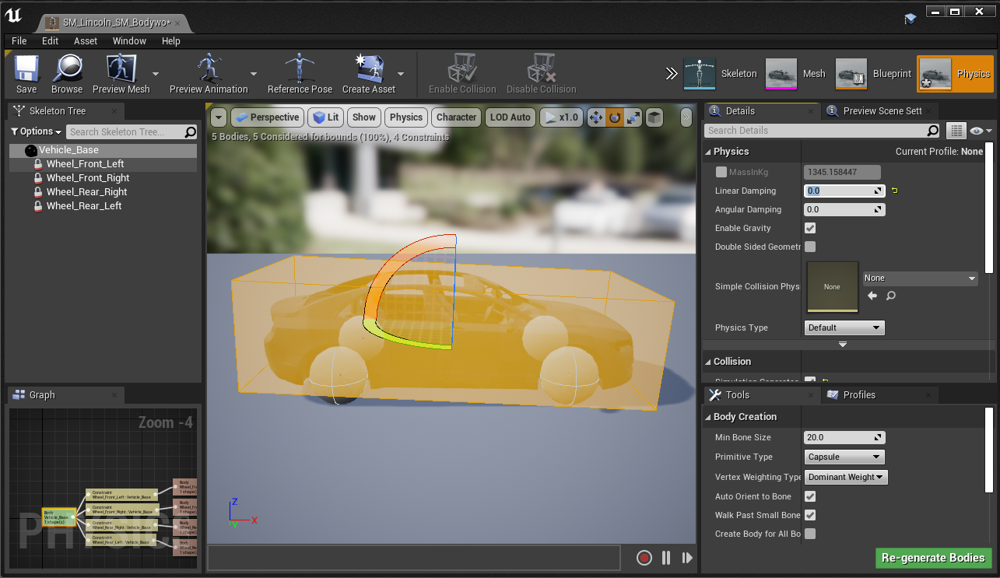

먼저, 메인 바디를 선택하고 오른쪽의 `Details` 메뉴에서 `Physics` 섹션의 `Linear Damping`을 0.0으로 변경하고, `Collision` 섹션에서 `Simulation Generates Hit Events`를 체크하며, `Body Creation` 섹션의 `Primitive Type`을 `Capsule`에서 `Box`로 변경합니다. 그런 다음 `Regenerate bodies`를 누릅니다. 캡슐이 이제 직사각형 상자로 변경될 것입니다. 그런 다음 바퀴를 선택합니다.

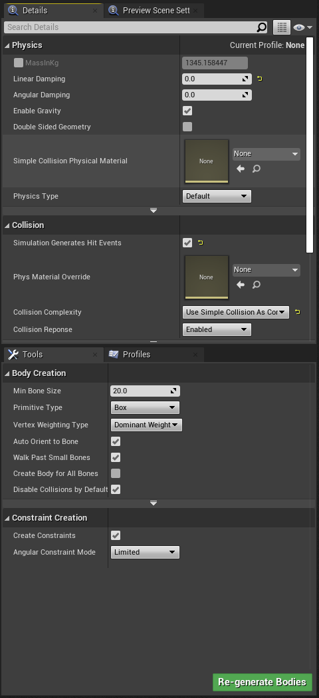

이제 모든 바퀴를 선택합니다(왼쪽의 `Skeleton Tree` 섹션에서).

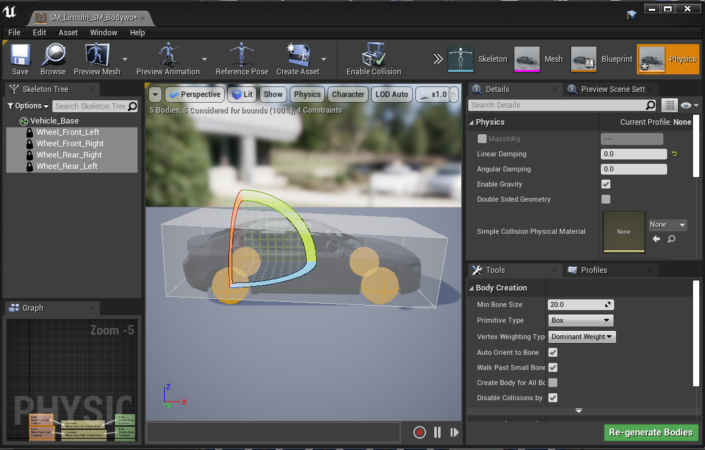

`Linear Damping`을 0.0으로 변경하고, `Physics Type`을 `Kinematic`으로 설정하며, `Collision Response`를 `Disabled`로 설정하고 `Primitive Type`을 `Sphere`로 선택합니다. 다시 `Re-generate Bodies`를 누릅니다.

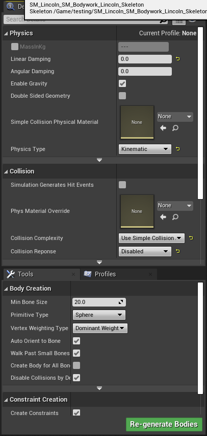

### 애니메이션 생성

새 차량 에셋이 있는 콘텐츠 브라우저 디렉토리에서 우클릭하고 `Animation > Animation Blueprint`를 선택합니다. 팝업이 열리면 `Parent Class` 섹션에서 `VehicleAnimInstance`를 검색하고 `Target Skeleton`에서는 새 차량에 해당하는 스켈레톤을 검색합니다. 콘텐츠 브라우저에서 이름을 볼 수 있어야 합니다. 이 두 가지를 선택한 후 OK를 누릅니다. 이렇게 하면 차량을 위한 새로운 애니메이션 블루프린트가 생성됩니다.


간단히 하기 위해 다른 차량의 애니메이션을 복사할 수 있습니다. 두 번째 콘텐츠 브라우저에서 `Content > Carla > Static > Vehicles > 4Wheeled`를 열고 아무 차량이나 선택합니다. 선택한 차량의 애니메이션 블루프린트를 열고 `Output pose` 노드가 아닌 모든 노드를 새 애니메이션 블루프린트로 복사합니다. 최종 노드에서 출력 노드로 새 연결을 드래그하여 노드들을 연결합니다. 컴파일을 누르면 애니메이션 블루프린트가 설정됩니다.


### 블루프린트 생성

콘텐츠 브라우저에서 `Content > Carla > Blueprints > Vehicles > LincolnMKZ2017` 또는 비슷한 차량으로 이동합니다. 여기에서 4개의 바퀴에 대해 설정된 블루프린트 세트를 찾을 수 있습니다. 이를 자신의 차량이 포함된 디렉토리로 복사하고 나중에 구분할 수 있도록 이름을 변경합니다. 원한다면 자신의 커스텀 바퀴를 설정할 수 있습니다. 자세한 내용은 뒷부분의 [__바퀴 섹션__](#바퀴)을 참조하세요.


새 차량 에셋이 있는 콘텐츠 브라우저 디렉토리에서 우클릭하고 `Blueprint Class`를 선택합니다. `All Classes` 메뉴에서 `BaseVehiclePawn`을 검색하고 이 클래스를 선택합니다. 블루프린트의 이름을 지정하고 엽니다. 왼쪽의 `Components` 탭에서 `Mesh`를 선택하고 오른쪽의 Mesh 섹션으로 차량 메시를 드래그합니다.


`Anim Class`에서 이전 단계에서 설정한 새 차량에 해당하는 애니메이션을 검색합니다.

다음으로, 블루프린트 클래스의 `Components` 메뉴에서 `Vehicle Movement`를 선택하고 오른쪽 `Details` 메뉴의 `Vehicle Setup` 섹션으로 이동합니다. 이제 각 바퀴에 대해 `Wheel Class` 속성에 이전에 복사하고 이름을 변경한 관련 바퀴 블루프린트를 찾습니다. 각 바퀴에 대해 동일한 작업을 수행합니다. 컴파일하고 저장합니다.


이제 `Content > Carla > Blueprints > Vehicles > VehicleFactory`로 이동하여 더블 클릭하여 Vehicle Factory를 엽니다.

`Vehicles` 노드를 선택하고 오른쪽의 `Default value` 섹션에서 `Vehicles` 항목을 확장합니다.

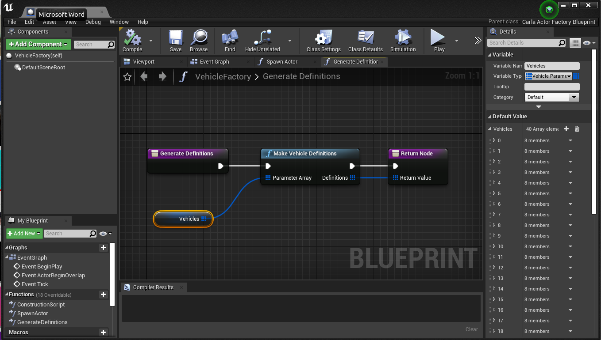

플러스 아이콘을 눌러 새 차량을 추가합니다. 마지막 항목으로 스크롤하여 확장하면 비어 있어야 합니다. 차량의 제조사와 모델 이름을 지정하고 클래스 섹션에서 이전 섹션에서 생성한 블루프린트 클래스를 찾습니다. 바퀴 수는 4로 두고 세대는 2로 설정합니다. 컴파일하고 저장합니다. 안전을 위해 전역 저장을 수행하면 이제 시뮬레이션에서 차량을 실행할 준비가 되었습니다.

언리얼 툴바에서 재생을 눌러 시뮬레이션을 실행합니다. 실행되면 터미널을 열고 filter 옵션을 사용하여 새 차량 모델을 지정하여 `manual_control.py` 스크립트를 실행합니다:

```sh
python manual_control.py --filter my_vehicle_make
```


현재 상태에서는 차량에 텍스처나 색상이 적용되어 있지 않습니다. 다음 단계는 실제 도로 차량과 같은 마감을 차량에 적용하기 위해 재질을 적용하는 것입니다.
## 재질

기본 에셋으로 메시와 블루프린트를 설정하여 차량을 가져온 후에는, 언리얼 엔진에서 사실적인 렌더링을 위한 재질을 차량에 추가하여 머신 러닝 학습 데이터의 최대 충실도를 달성해야 합니다.

언리얼 에디터는 매우 사실적인 재질을 만들 수 있는 포괄적인 재질 워크플로우를 자랑합니다. 하지만 이는 프로세스에 상당한 복잡성을 더합니다. 이러한 이유로, CARLA는 처음부터 시작할 필요 없이 사용할 수 있는 대규모 재질 프로토타입 라이브러리를 제공합니다.

### 차량에 재질 적용

CARLA는 다양한 종류의 차량 도장과 기능을 모방할 수 있는 광택 있는 마감을 복제하기 위한 프로토타입 재질을 제공합니다. 언리얼 에디터를 열고 콘텐츠 브라우저에서 `Content > Carla > Static > GenericMaterials > 00_MastersOpt`에 있는 재질을 찾습니다. 기본 재질은 `M_CarPaint_Master`라고 합니다. 이 재질을 우클릭하고 컨텍스트 메뉴에서 `Create Material Instance`를 선택합니다. 이름을 지정하고 새 차량 콘텐츠가 저장된 폴더로 이동합니다.

언리얼 에디터에서 관찰자를 바닥 근처의 지점으로 이동하고 콘텐츠 브라우저에서 차량의 스켈레탈 메시를 장면으로 드래그합니다. 차량의 본체가 이제 거기에 나타날 것입니다.


이제 오른쪽의 details 패널에서 새로운 재질 인스턴스를 `Materials` 섹션의 `Element 0` 위치로 드래그합니다. 차체가 새로운 회색의 광택 있는 재질 속성을 가지게 되는 것을 볼 수 있습니다.


콘텐츠 브라우저에서 재질을 더블 클릭하면 매개변수 편집을 시작할 수 있습니다. 여기에는 실제 자동차 도장을 모방하는 데 중요한 다양한 속성을 변경하는 수많은 매개변수가 있습니다. 가장 중요한 매개변수는 다음과 같습니다:

#### __색상__

색상 설정은 자동차의 전체적인 색상을 결정합니다. 기본 색상은 단순히 자동차의 기본 색상이며 전체적인 색상을 결정합니다:


#### __클리어 코트__

클리어 코트 설정은 마감의 외관과 빛에 반응하는 방식을 결정합니다. 거칠기는 텍스처를 사용하여 차량 표면에 불완전함을 적용하고, 높은 값에서는 빛을 더 많이 산란시켜 매트한 외관을 만듭니다. 사실적인 외관을 위해서는 미묘한 조정과 낮은 값이 권장됩니다. 일반적으로 자동차 도장은 부드럽고 반사적이지만, 이 효과는 커스텀 도장의 특수 매트 마감을 모델링하는 데 더 많이 사용될 수 있습니다.


자동차의 "반짝임" 또는 "광택"을 결정하는 중요한 매개변수는 `Clear Coat Intensity`입니다. 1에 가까운 높은 값은 코팅을 반짝이고 광택이 나게 만듭니다.

#### __오렌지 필__

실제 자동차의 마감(특히 일반 시장용 대량 생산 자동차)은 도장에 약간의 물결처럼 보이는 불완전함이 있는 경향이 있습니다. 오렌지 필 효과는 이를 모방하여 자동차를 더 사실적으로 보이게 만듭니다.


#### __플레이크__

일부 자동차는 빛에 반응하여 매력적인 방식으로 추가적인 반짝임과 반사를 주는 금속이나 세라믹의 플레이크를 포함하는 도장을 가지고 있습니다. 플레이크 매개변수를 사용하면 CARLA가 이를 모방할 수 있습니다.


#### __먼지__

자동차는 종종 도장에 기름과 먼지가 쌓여 빛을 반사하는 방식에 영향을 주는 추가적인 텍스처가 생깁니다. 먼지 매개변수를 사용하면 도장에 외부 물질이 달라붙는 것을 모방하기 위해 코팅에 패치 형태의 교란을 추가할 수 있습니다.


## 유리

CARLA에서 사실적인 유리를 만들기 위해서는 자동차에 사용되는 유리의 실제 굴절 및 반사 동작을 포착하기 위한 몇 가지 기술이 필요합니다. CARLA 차고의 차량들은 서로 다른 재질을 가진 4개의 유리 레이어를 가지고 있습니다. 레이어들은 몇 밀리미터 간격으로 분리되어 있으며, 차량 내부와 외부에서 모두 유리가 사실적으로 보이도록 하기 위해 내부와 외부를 향하는 유리 레이어에 대해 서로 다른 재질이 사용됩니다.

차량 외부에서의 외관을 위한 2개의 유리 레이어와 차량 내부에서의 유리 외관을 위한 2개의 레이어가 있습니다. 유리가 유리처럼 보이게 만드는 것은 유리의 양면에서 오는 반사로, 반사의 매우 미묘한 이중화를 만듭니다.

### 유리 메시

여기서는 Lincoln의 메인 차체(도어나 다른 움직이는 부품이 아닌)에 부착된 유리 부분을 볼 수 있습니다.


구성 메시 부분을 분리하면 유리 프로필이 4개의 서로 다른 레이어로 분리되어 있는 것을 볼 수 있습니다.

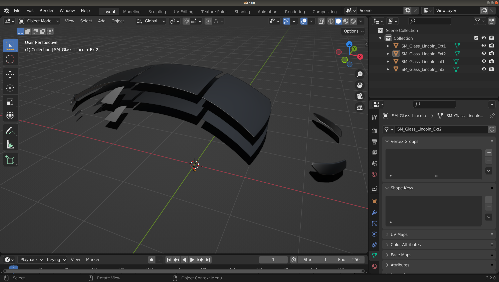

4개의 레이어는 2개의 그룹으로 나뉩니다. 노멀이 차량 외부를 향하는 외부 레이어와 노멀이 차량 내부를 향하는 내부 레이어입니다. 다음 다이어그램이 이를 보여줍니다.


메시 레이어를 생성한 후에는 언리얼 에디터의 콘텐츠 브라우저에서 차량을 저장한 폴더로 가져옵니다.

4개의 유리 레이어를 shift로 선택하고 맵으로 드래그하여 볼 수 있게 합니다.


### 유리 재질

외부 유리 레이어를 더블 클릭한 다음, 두 번째 콘텐츠 브라우저 창에서 `Content > Carla > Static > Vehicles > GeneralMaterials`로 이동하여 `Glass` 재질을 찾습니다. 유리 재질을 메시 항목의 재질 슬롯으로 드래그합니다. 각 유리 레이어에 대해 이 과정을 반복합니다.

이제 유리가 투명해지고, 주변 객체와 광원을 반사하는 반사도를 가지게 됩니다. 내부 유리도 확인하여 적절한 유리 효과가 있는지 확인해야 합니다.


### 단일 레이어 유리

차량의 유리 부분을 더 빠르게 제작하는 방법으로, 가장 바깥쪽 유리 레이어만이 중요합니다. 언리얼 에디터에서 이 레이어에 유리 재질을 적용하면 필요에 맞는 결과를 얻을 수 있습니다. 하지만 차량 내부에서의 시야(예: 대시보드나 운전대 뒤에 카메라를 설치하는 경우)에서는 유리가 없는 것처럼 보일 것입니다(굴절이나 반사가 없음). 최대한 사실적인 유리를 만들기 위해서는 위의 과정을 권장합니다.

이제 블루프린트를 생성하고, 메시를 추가하고, 리깅을 완료하고, 도장 마감과 유리를 위한 재질을 생성했으므로, 매우 사실적으로 보이는 차량이 있어야 합니다.


## 바퀴

[블루프린트 생성하기](#블루프린트-생성)에서 바퀴를 복사했다면, 차량이 CARLA 라이브러리의 기존 차량과 매우 유사한 경우 이것으로 충분할 수 있습니다. 하지만 차량이 표준이 아닌 바퀴 치수나 그립 특성을 가지고 있다면, 이 섹션을 따라 차량의 물리적 특성에 가장 잘 맞도록 바퀴 블루프린트를 설정해야 합니다.

CARLA 차량의 바퀴를 위해서는 역학과 충돌 속성을 다루기 위한 각 바퀴에 대한 블루프린트 클래스를 설정해야 합니다. 4개의 블루프린트 클래스를 설정하게 되며, 바퀴를 식별하기 위해 다음과 같은 접두사나 접미사를 권장합니다:

- __RRW__ - **R**ear **R**ight **W**heel (후방 우측 바퀴)
- __RLW__ - **R**ear **L**eft **W**heel (후방 좌측 바퀴)
- __FRW__ - **F**ront **R**ight **W**heel (전방 우측 바퀴)
- __FLW__ - **F**ront **L**eft **W**heel (전방 좌측 바퀴)

### 바퀴 블루프린트

새 차량이 있는 폴더 내에서 우클릭하고 새 블루프린트 클래스 생성을 선택합니다.


블루프린트를 더블 클릭하여 조정합니다:


### 충돌 메시

먼저, 충돌 메시에 사용되는 기본 실린더는 폴리곤 수가 많으므로, 이를 저폴리곤 버전으로 교체해야 합니다. 콘텐츠 브라우저에서 `Content > Carla > Blueprints > Vehicles` 내부의 `CollisionWheel` 메시를 찾습니다. 이를 블루프린트의 details 패널에 있는 `Collision Mesh` 슬롯으로 드래그합니다. 이렇게 하면 물리 시뮬레이션에 눈에 띄는 결함 없이 성능이 향상됩니다.

### 타이어 구성

다음으로, 타이어 구성을 설정합니다. `Content > Carla > Blueprints > Vehicles` 내부에서 `CommonTireConfig` 구성을 찾아 블루프린트의 `Tire Config` 섹션으로 드래그합니다. 블루프린트에서 Tire Config를 더블 클릭하면 Friction Scale을 조정할 수 있으며, 이를 통해 차량의 도로 주행 동작을 수정할 수 있습니다. 기본적으로 3.5로 설정되어 있으며, 이는 대부분의 차량 사용 사례에 적합한 값입니다. 하지만 예를 들어 슬릭 타이어가 장착된 레이싱 차량을 모델링하고 싶다면, 이 매개변수를 조정하는 것이 적절할 것입니다.

### 바퀴 치수

다음으로, 3D 애플리케이션에서 바퀴의 직경을 측정합니다. 블렌더에서는 객체 모드에서 `n`을 눌러 열 수 있는 properties 패널에서 치수를 볼 수 있습니다.

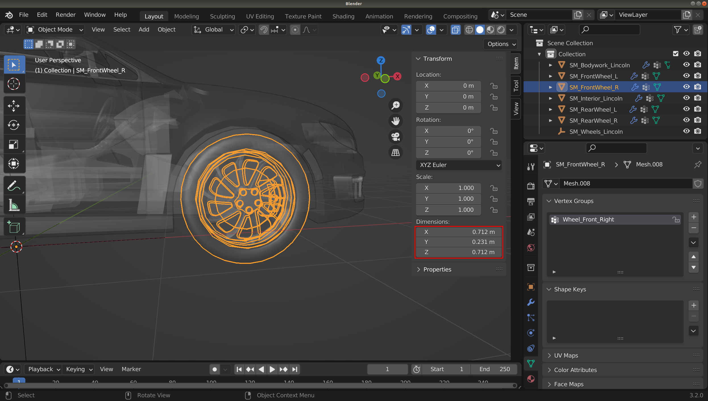

이제 이 숫자들을 블루프린트의 `Wheel` 섹션에 입력합니다. 반경을 위해 직경을 반으로 나누는 것을 잊지 말고, 또한 언리얼 에디터가 센티미터 단위로 작동한다는 점도 기억하세요. 바퀴 질량의 경우, 인터넷에서 사양을 찾아보고 올바른 타이어 모델이나 비슷한 것을 찾아 올바른 질량(킬로그램 단위)을 추정하는 것을 권장합니다.


`Affected by handbrake`는 두 후방 바퀴 모두에 대해 체크되어야 합니다.

`Steer angle`은 두 전방 바퀴에 대해 의도된 최대 조향 각도로 설정되어야 하며, 두 후방 바퀴에 대해서는 0으로 설정되어야 합니다.

### __서스펜션 특성__

기본값들은 합리적인 시작점을 제공합니다. 차량 유형에 맞는 서스펜션 특성을 설정하려면 [__이 가이드__](tuto_D_customize_vehicle_suspension.md)를 참조하세요.

## 조명

CARLA를 위한 사실적인 차량을 완성하는 마지막 요소는 조명, 즉 헤드라이트, 브레이크등, 방향지시등 등입니다. 3D 모델링 애플리케이션에서 복제하려는 차량의 조명과 비슷한 형태를 모델링해야 합니다. 대부분의 헤드라이트는 평평한 원판이나 평평한 직육면체 구조가 될 것입니다. 일부 차량은 LED 스트립도 있을 수 있습니다.


### UV 맵

서로 다른 종류의 조명(헤드라이트, 방향지시등, 브레이크등 등)은 텍스처를 사용하여 구분됩니다. 3D 모델링 애플리케이션에서 UV 맵을 생성하고 조명을 텍스처의 관련 영역과 일치하도록 위치시켜야 합니다.


### 가져오기

조명 메시를 언리얼 에디터로 가져옵니다. 조명 메시를 가져온 후:

- 메시 항목을 **_Components_** 패널의 **_Mesh (VehicleMesh) (Inherited)_** 계층 구조로 드래그합니다.
- 계층 구조에서 추가 메시를 선택하고 **_Details_** 패널에서 `Collision`을 검색합니다.
- **_Collision Presets_**를 `NoCollision`으로 설정합니다.
- 계층 구조에서 조명 메시를 선택합니다. **_Details_** 패널에서 `Tag`를 검색하고 `emissive` 태그를 추가합니다.