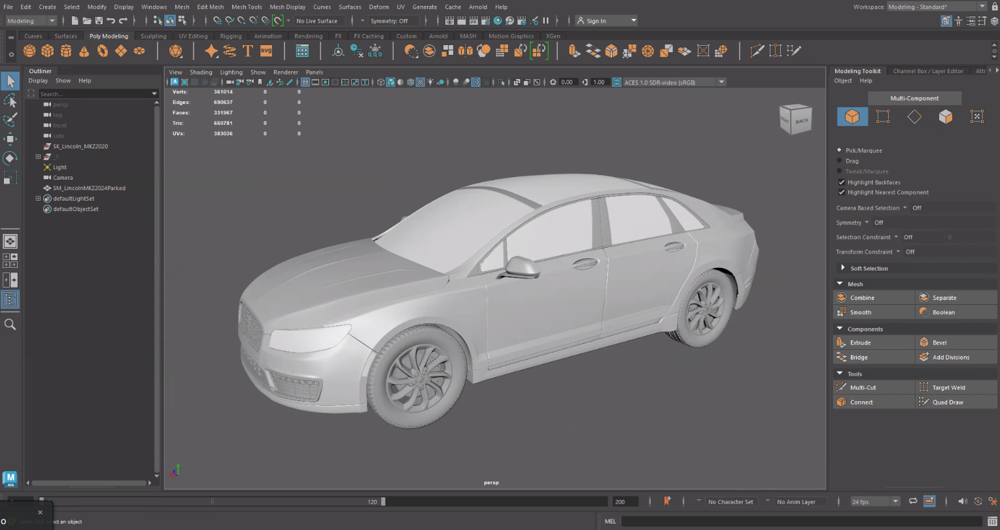
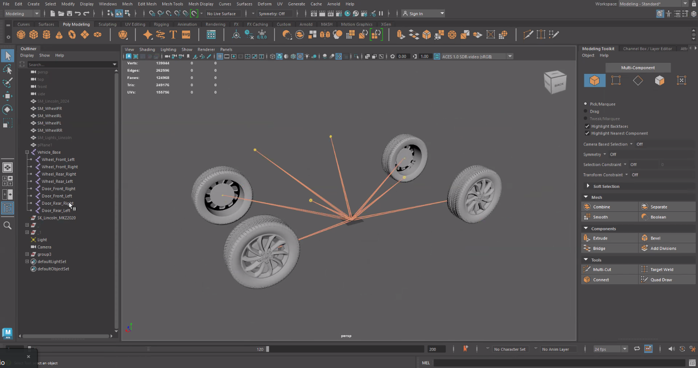
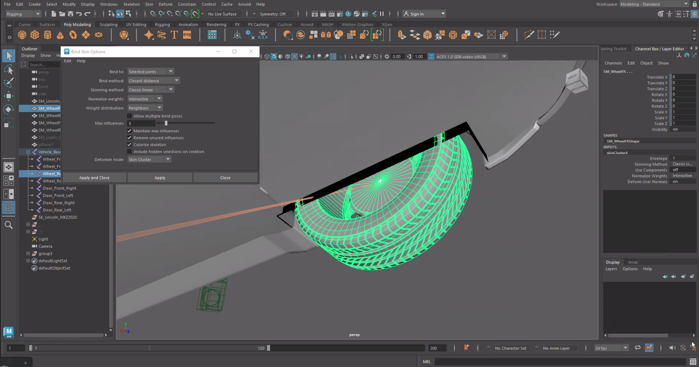
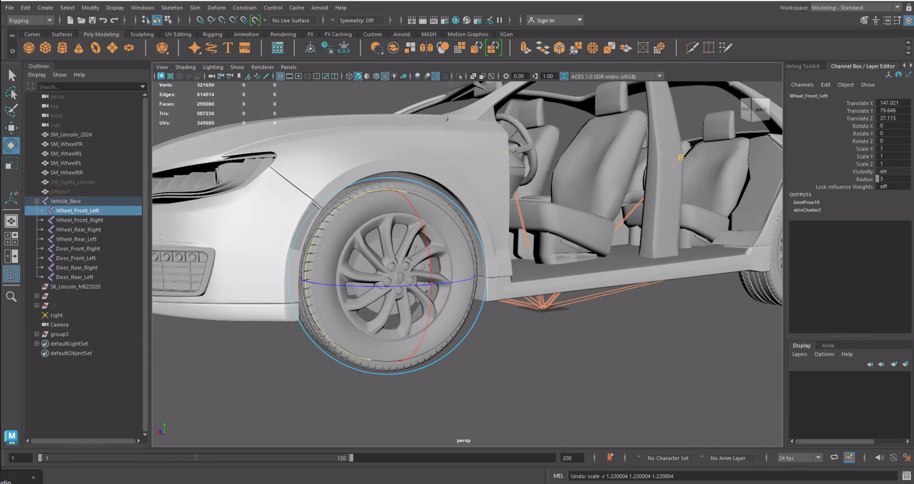
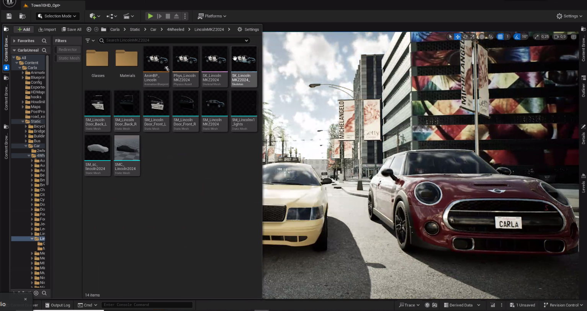
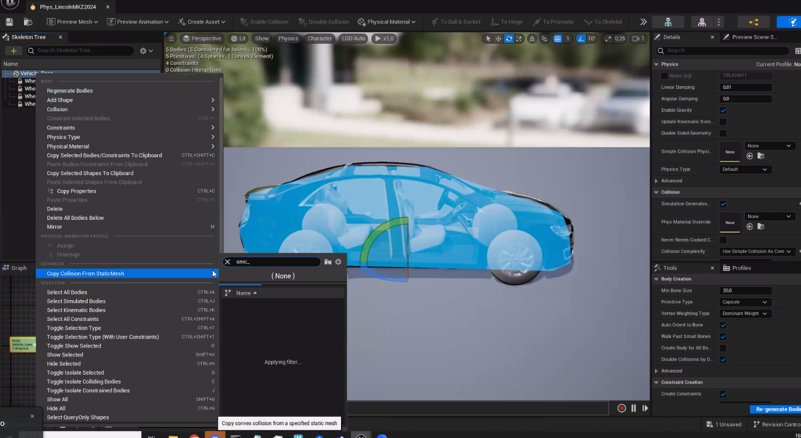
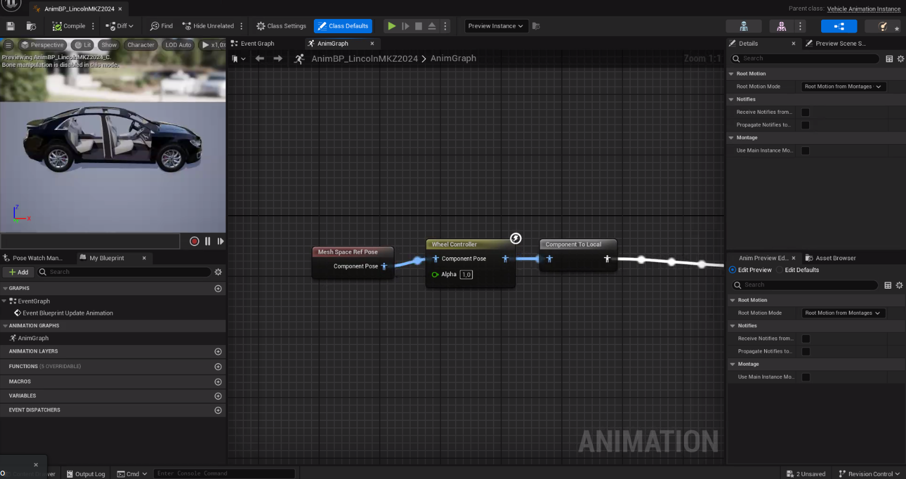
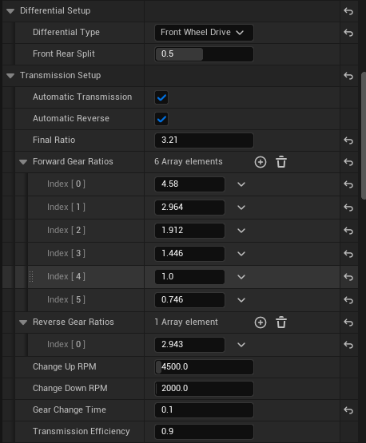

# Content authoring - vehicles

CARLA provides a comprehensive set of vehicles out of the box in the blueprint library. CARLA allows the user to expand upon this with custom vehicles for maximum extensibility. 

3D modelling of detailed vehicles is highly complex and requires a significant degree of skill. We therefore refer the reader to alternative sources of documentation on 3D modelling, since this is beyond the scope of this guide. There are, however, numerous sources of vehicle models in both free and proprietary online repositories. Hence the user has many options to turn to for creating custom vehicles for use in CARLA.

The key factors in preparing a custom vehicle for CARLA lie in rigging the vehicle armature and then importing into the Unreal Engine. After rigging and importing, blueprints need to be set for the car and the wheels. Then apply materials and add the glass parts of the vehicle. We will cover these steps in the following guide.

* __[Modeling](#modeling)__   
	* [Naming conventions](#naming-conventions)  
* __[Rigging](#rigging-the-vehicle-using-an-armature)__   
	* [Import](#import)  
	* [Armature](#add-an-armature)
    * [Parenting](#parenting)
    * [Assignment](#assigning-car-parts-to-bones) 
	* [Blender add-on](#blender-ue4-vehicle-rigging-add-on)
    * [Export](#export)  
* __[Import into Unreal Engine](#importing-into-unreal-engine)__   
	* [Physics asset](#setting-the-physics-asset)  
	* [Animation](#creating-the-animation)
    * [Blueprint](#creating-the-blueprint)
* __[Materials](#materials)__   
	* [Applying materials](#applying-a-material-to-your-vehicle)
		* [Color](#color)
		* [Clear coat](#clear-coat)
		* [Orange peel](#orange-peel)
		* [Flakes](#flakes)
		* [Dust](#dust)
* __[Glass](#glass)__   
	* [Glass meshes](#glass-meshes)
	* [Glass material](#glass-material)
	* [Single layer glass](#single-layer-glass)
* __[Wheels](#wheels)__   
	* [Wheel blueprint](#wheel-blueprint)
	* [Collision mesh](#collision-mesh)
	* [Tire configuration](#tire-configuration)
	* [Wheel dimensions](#wheel-dimensions)
* __[Lights](#lights)__
	* [UV map](#uv-map)
	* [Importing](#importing)

## Modeling

Vehicles should have between 50,000 and 100,000 faces. We recommend triangulating the model prior to export as best practice. CARLA vehicles are modeled using the size and scale of real-world vehicles as reference. Please ensure you pay careful attention to the units of your 3D application. Some work in centimeters while others work in meters. 

### Vehicle parts

There are several parts of the vehicle that should be modelled as separate objects in the scene in Maya:

- Chassis, bodywork and interior: these should all be part of the same object
- Wheels: each wheel should be its own object
- Glass: all glass parts of the vehicle, including windows and light enclosure glass should be part of the same object
- Lights: all lights including brake lights, headlights, foglights and blinkers should be part of the same object

#### Naming conventions

We recommend the following naming convention for the various parts for organization:

- __Bodywork__: The exterior metallic part of the vehicle and the interior such as the seats and dashboard. This material is changed to Unreal Engine material. Logos and details can be added but, to be visible, they must be painted in a different color by using the alpha channels in the Unreal Engine editor.
- __Glass_Ext__: A layer of glass that allows visibility from the outside to the inside of the vehicle.
- __Glass_Int__: A layer of glass that allows visibility from the inside to the outside of the vehicle.
- __Lights__: Headlights, indicator lights, etc.
- __LightGlass_Ext__: A layer of glass that allows visibility from the outside to the inside of the light.
- __LightGlass_Int__: A layer of glass that allows visibility from the inside to the outside of the light.
- __LicensePlate__: A rectangular plane of 29x12 cm. You can use the CARLA provided `.fbx` for best results, download it [here](https://carla-assets.s3.eu-west-3.amazonaws.com/fbx/LicensePlate.rar). The texture will be assigned automatically in Unreal Engine.

Materials can be named using the format `M_CarPart_CarName`, e.g, `M_Bodywork_Mustang`.

Textures can be named using the format `T_CarPart_CarName`, e.g, `T_Bodywork_Mustang`. Textures should be sized as 2048x2048.

## Rigging the vehicle using an armature

To look realistic within the simulation, the car needs to have rotating and wheels, the front pair of which can turn with steering inputs. Therefore to prepare a vehicle for CARLA, an armature needs to be rigged to the car to identify the wheels and allow their movement. 

### Import 

Import or model the vehicle model mesh in your 3D modelling application. In this guide we will use Autodesk Maya. Ensure that the wheels are separable from the main body. Each wheel must be accessible as a distinct object in the scene. 



It is important to ensure that the vehicle faces in the positive X direction, so the hood and windshield should be facing towards positive X. The car should also be oriented such that the floor to roof direction is in the positive Z direction. The wheels should be just grazing the X-Y plane and the origin should be situated where you would expect the vehicle's center of mass to be in the X-Y plane (not in the Z plane).

### Add an armature

Firstly add a bone to the center of the vehicle, ensure the object is properly centered, the root of the bone should be set at the origin. Name the bone `Vehicle_Base`. 



From the vehicle base bone and add 4 more child bones (drag the child bones into the vehicle base in the outliner). Each of these bones needs to be located such that the root of the bone coincides with the centre of the each wheel. 

For each wheel, it is recommended to name the bone according to the wheel it needs to be coupled to, this will help in identification later when you need to assign vertex groups to each bone:

- Wheel_Front_Left
- Wheel_Front_Right
- Wheel_Back_Left
- Wheel_Back_Right

### Assigning vehicle parts to bones

Change to rigging mode. In the skin section, select *Bind skin* then select the relevant wheel bone (e.g. Wheel_Front_Right) and then shift click on the geometry you want to parent to that bone (e.g. the front right wheel). Repeat this with each wheel. 



Finally, repeat this process with the vehicle base bone and the chassis and bodywork geometry.

Select the Vehicle_Base bone in the outliner and ensure that all Translate and Rotate fields are zero in the Channel Box / Layer Editor and all the scale fields are set to 1.

Select the bone for each wheel, press E to activate the rotation widget, rotate the the bone around the axis of the wheel and ensure that the wheel geometry turns with the bone, this shows that the geometry is properly bound to the bone. 



### Export

Each vehicle part should be exported separately, you should have separate geometry objects for the following parts:

- the bodywork/chassis
- 4 wheels
- glass
- lights
- 4 doors (optional)
- collision mesh
- raycast mesh

For each part select the object and go to *File > Export selection*. Leave the default export options and select FBX format.

## Importing into unreal engine

Launch the Unreal Editor from the CARLA root directory using the following command:

```sh
cmake --build Build --target launch
```

Open the content browser and create a new folder for your vehicle, for example `Carla > Static > Car > 4Wheeled > MyVehicle`. Note that the chosen directory will affect the semantic label of the vehicle in the semantic camera and LIDAR sensors. If you are modelling a truck, you should create your directory in `Carla > Static > Truck`. Drag all the FBX files you exported from Maya into the new directory in the content browser. Keep the default import options.  



Open the *Skeleton* file of the vehicle and switch to the skeleton edit mode. Select *File > Save As* to save a *SkeletalMesh* file, which you will need later.


### Setting up the physics asset

You should have a *Physics Asset* file in the directory which was created on import. Double click on the physics asset to open the editor. Select the default cuboid collision mesh and delete it, then right click on the *VehicleBase* in the *SkeletonTree* panel and select *Copy Collision From StaticMesh*. Search for the collision mesh that you imported in the dialogue and select it. You should see the outline of the collision mesh in the viewport with a blue hue. 



- Select all the wheels:
	- Go to the *Tools* panel and change the *Primitive Type* to *Sphere*.
	- Go to the *Details* panel and change *Physics Type* to *Kinematic*.
	- Set the *Collision Response* to *Disabled*.
	- Set *Linear Damping* to 0. This will eliminate any extra friction on the wheels.

- Enable *Simulation Generates Hit Event* for all meshes.
- Click *Re-generate Bodies*.
- Adjust the wheel sphere to the size of the wheel.
- Save and close the window.

### Creating the animation blueprint

In the content browser directory where you have your new vehicle asset, right click and choose `Animation > Animation Blueprint`. In the popup that opens, search for `VehicleAnimationInstance` for the *Parent Class* and in the *Specific Skeleton* field search for the *Skeletal Mesh* of your vehicle. Name the blueprint and then click *Create*.


In the content browser search for an existing, completed CARLA vehicle animation blueprint from the library, open the animation blueprint and copy the nodes from it. Go back to your vehicle's animation blueprint and paste the nodes.



Save the animation blueprint. 

### Wheel blueprints

Navigate with your content browser to `Content > Carla > Blueprints > Vehicles`, create a new folder for your vehicle.

Inside this folder create the one blueprint for each of the 4 wheels. Right-click and select *Blueprint class. Search for the *ChaosVehicleWheel* class and select it. Name each wheel blueprint similar to the following examples:

- BP_MyVehicle_FRW
- BP_MyVehicle_FLW
- BP_MyVehicle_RRW
- BP_MyVehicle_RLW

Open each blueprint individually and repeat the following configuration steps:

- Set the *Collision Mesh* to *Wheel_Shape*
- Set the *Axle Type* according to the wheel position (front or rear)
- Set the *Wheel Radius*, *Wheel Width* and *Wheel mass* according to the dimensions and specifications of your vehicle model, you may need to measure these dimensions in your 3D application
- Set the *Friction Force Multiplier* to 3.5
- Set the *Brake*, *Handbrake*, *Engine*, *ABS* and *Traction control*, *Front wheel drive*, *Rear wheel drive*, *Four wheel drive* settings according to the specification of your vehicle

Adjust the max steer angle as needed, the default value of 50 will suit most applications. Most vehicles have a max steering angle between 30 and 50.

For both front wheels enable *Affected By Steering*, ensure this parameter is disabled for the rear wheels.

Leave *MaxBrakeTorque* and *MaxHandBrakeTorque* at the default values unless you have alternative figures from a vehicle specification. 

## Vehicle blueprint

Right click inside the vehicle's content directory and choose *Blueprint CLass*. In the dialogue, search for *BaseVehiclePawn* and press *Select*. Rename the blueprint as BP_<vehicle_name>.

Click on the mesh in the component's panel:

- Set *EnablePhysics* to true
- Assign the vehicle skeletal mesh and AnimClass
- Set the *Center Of Mass Override* to be within the body of the vehicle, for example 50cm for a normal car. You may need to adjust this parameter if the vehicle behaves strangely, for example if it rolls easily on corners.
- In the components panel, select *Custom Collision (Inherited)* search for the raycast sensor mesh that you imported
- Modify the *Physics Constraints* components of the blueprint adding the respective components names

### Vehicle movement component configuration

- Open the VehicleMovementComponent in the details panel
- Fill the *Wheel setups* variable with the Chaos vehicle wheels and respective bone names


- Add points to the torque curve in the **Engine Setup** according to a reference or model
- Set the *Steering Curve* according to a reference or model
- Set the number of gears and gear ratios in the *Transmission setup



- In the *Steering Setup*, set the *Steering Type* to *Ackermann*
- Modify the mass, chassis width and height according to reference