# Content authoring - vehicles

CARLA provides a comprehensive set of vehicles out of the box in the blueprint library. CARLA allows the user to expand upon this with custom vehicles for maximum extensibility. 

3D modelling of detailed vehicles is highly complex and requires a significant degree of skill. We therefore refer the reader to alternative sources of documentation on 3D modelling, since this is beyond the scope of this guide. There are, however, numerous sources of vehicle models in both free and proprietary online repositories. Hence the user has many options to turn to for creating custom vehicles for use in CARLA.

The key factors in preparing a custom vehicle for CARLA lie in rigging the vehicle armature and then importing into the Unreal Engine. After rigging and importing, blueprints need to be set for the car and the wheels. Then apply materials and add the glass parts of the vehicle. We will cover these steps in the following guide.

* __[Modeling](#modeling)__   
	* [Naming conventions](#naming-conventions)  
* __[Rigging](#rigging-the-vehicle-using-an-armature)__   
	* [Import](#import)  
	* [Armature](#add-an-armature)
    * [Parenting](#parenting)
    * [Assignment](#assigning-car-parts-to-bones) 
	* [Blender add-on](#blender-ue4-vehicle-rigging-add-on)
    * [Export](#export)  
* __[Import into Unreal Engine](#importing-into-unreal-engine)__   
	* [Physics asset](#setting-the-physics-asset)  
	* [Animation](#creating-the-animation)
    * [Blueprint](#creating-the-blueprint)
* __[Materials](#materials)__   
	* [Applying materials](#applying-a-material-to-your-vehicle)
		* [Color](#color)
		* [Clear coat](#clear-coat)
		* [Orange peel](#orange-peel)
		* [Flakes](#flakes)
		* [Dust](#dust)
* __[Glass](#glass)__   
	* [Glass meshes](#glass-meshes)
	* [Glass material](#glass-material)
	* [Single layer glass](#single-layer-glass)
* __[Wheels](#wheels)__   
	* [Wheel blueprint](#wheel-blueprint)
	* [Collision mesh](#collision-mesh)
	* [Tire configuration](#tire-configuration)
	* [Wheel dimensions](#wheel-dimensions)
* __[Lights](#lights)__
	* [UV map](#uv-map)
	* [Importing](#importing)

## Modeling

Vehicles should have between 50,000 and 100,000 faces. We recommend triangulating the model prior to export as best practice. CARLA vehicles are modeled using the size and scale of actual cars as reference. Please ensure you pay careful attention to the units of your 3D application. Some work in centimeters while others work in meters. 

### Naming conventions

For ease and consistency we recommend that you divide the vehicle into the following parts and name them accordingly. Details specific to glass and lights will be covered in later sections:

>1. __Bodywork__: The metallic part of the vehicle. This material is changed to Unreal Engine material. Logos and details can be added but, to be visible, they must be painted in a different color by using the alpha channels in the Unreal Engine editor.
- __Glass_Ext__: A layer of glass that allows visibility from the outside to the inside of the vehicle.
- __Glass_Int__: A layer of glass that allows visibility from the inside to the outside of the vehicle.
- __Lights__: Headlights, indicator lights, etc.
- __LightGlass_Ext__: A layer of glass that allows visibility from the outside to the inside of the light.
- __LightGlass_Int__: A layer of glass that allows visibility from the inside to the outside of the light.
- __LicensePlate__: A rectangular plane of 29x12 cm. You can use the CARLA provided `.fbx` for best results, download it [here](https://carla-assets.s3.eu-west-3.amazonaws.com/fbx/LicensePlate.rar). The texture will be assigned automatically in Unreal Engine.
- __Interior__: Any other details that don't fit in the above sections can go into _Interior_.

Materials should be named using the format `M_CarPart_CarName`, e.g, `M_Bodywork_Mustang`.

Textures should be named using the format `T_CarPart_CarName`, e.g, `T_Bodywork_Mustang`. Textures should be sized as 2048x2048.

## Rigging the vehicle using an armature

To look realistic within the simulation, the car needs to have rotating and wheels, the front pair of which can turn with steering inputs. Therefore to prepare a vehicle for CARLA, an armature needs to be rigged to the car to identify the wheels and allow their movement. 

### Import 

Import or model the vehicle model mesh in your 3D modelling application. In this guide we will use Blender 3D. Ensure that the wheels are separable from the main body. Each wheel must be accessible as a distinct object. 


It is important to ensure that the vehicle faces in the positive X direction, so the hood and windshield should be facing towards positive X. The car should also be oriented such that the floor to roof direction is in the positive Z direction. The wheels should be just grazing the X-Y plane and the origin should be situated where you would expect the vehicle's center of mass to be in the X-Y plane (not in the Z plane though).

### Add an armature

Now add an armature to the center of the vehicle, ensure the object is properly centered, the root of the armature bone should be set at the origin. Switch to edit mode and rotate the armature 90 around the x axis. 

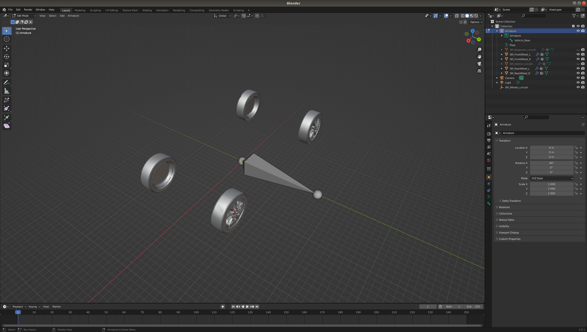

Now select the armature and add 4 more bones. Each of these bones needs to be located such that the root of the bone coincides with the centre of the each wheel. This can be achieved by locating the 3D cursor at the center of each wheel in edit mode. Select one of the wheels in object mode, select a vertex, press A to select all vertices then `Shift+S` and select `Cursor to selected`. This will locate the cursor in the center of the wheel. Then, in object mode, select the armature, switch to edit mode, select a bone and choose `Selection to cursor`. Your bone will now coincide with the wheel. Rotate each bone such that it lines up with the base of the armature. 

For each wheel, it is recommended to name the bone according to the wheel it needs to be coupled to, this will help in identification later when you need to assign vertex groups to each bone. 

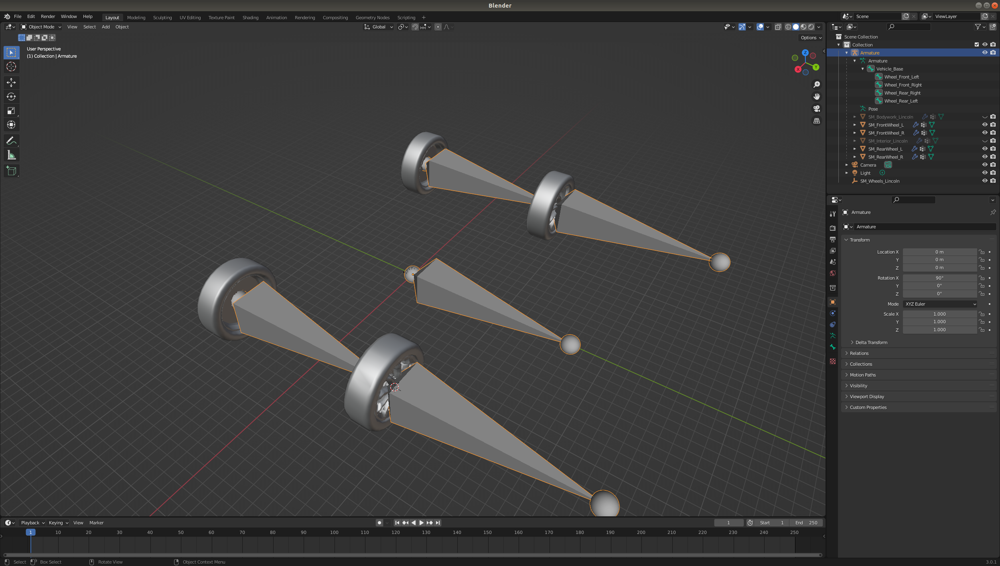

### Parenting 

Now select all the parts of the body and all 4 wheels using shift or control in the project outliner,  then control select the armature you have created (this order is important, it won't work if you select these in reverse order). Press `Ctrl+p` and select `With empty groups` to bind the mesh to the armature.  


Now you have parented the mesh to the armature, you now need to assign each wheel to its respective bone. Select a wheel either in the outliner or the editor. Switch to edit mode, and select all the vertices of the wheel (shortcut - `a`). 

### Assigning car parts to bones

Select the mesh tab of the properties (the green triangle). Inside the vertex groups tab of the mesh properties panel, you should now see the bones of your armature. Select the bone corresponding to the wheel you are editing and select `Assign`. Once you have rigged the wheels, rig all other parts of the vehicle to the base bone.

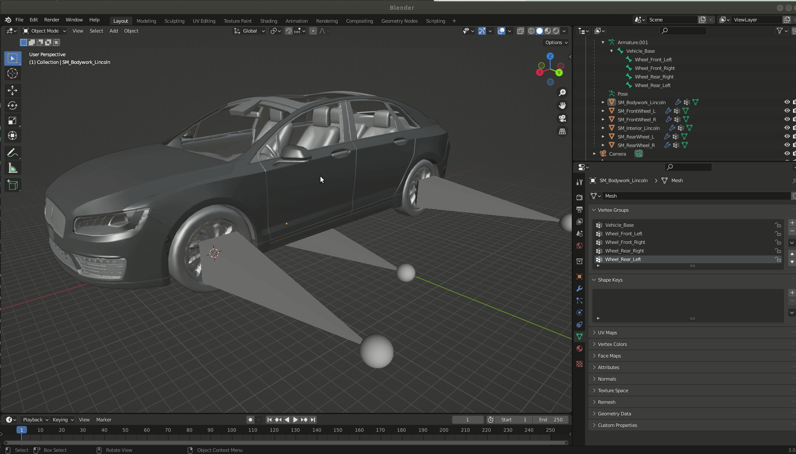

Once you have assigned all of the mesh parts to the armature you can test if it works by selecting the armature and moving to pose mode and moving the relevant bones. The vehicle base bone should move the whole vehicle, while the wheel bones should each move and rotate their respective wheels. Ensure to undo any posing you might do with `Ctrl+Z`.


### Blender UE4 vehicle rigging add-on

There is a very useful add on for blender for rigging a vehicle for import into CARLA that helps streamline the above steps. Please see the [__add-on webpage__](https://continuebreak.com/creations/ue4-vehicle-rigging-addon-blender/) for instructions.

### Export

Now we will export our rigged model into FBX format for import into Unreal Engine. Select `Export > FBX (.fbx)` from the File menu. In the `Object Types` section of the `Include` panel, shift select the `Armature` and `Mesh` options. 

In the `Transform` panel. Change `Forward` to `X Forward` and change `Up` to `Z Up`. This is important to ensure the vehicle is oriented correctly in the Unreal Engine. 

In the `Armature` section uncheck `Add Leaf Bones` and uncheck `Bake Animation`.

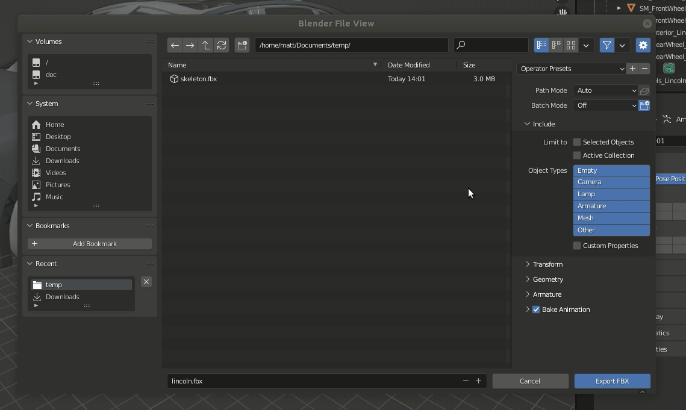

## Importing into unreal engine

Launch the Unreal Editor with the `make launch` command from the CARLA root directory (the one where you have built CARLA from source). Open a content browser, set up an appropriate directory and right click and select `Import to ....`. Choose the FBX file that you previously exported from Blender (or another 3D modelling application). Import with default settings. 

### Setting the physics asset

You will now have 3 things in your content browser directory, the mesh, the skeleton and the physics asset. Double click on the physics asset to adjust it.

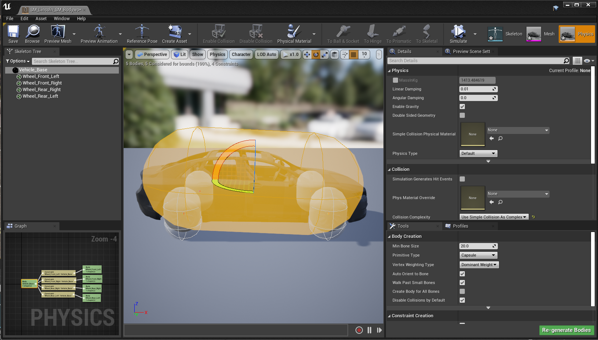

First, select the main body, in the `Details` menu on the right, change the `Linear Damping` to 0.0 in the `Physics` section, check `Simulation Generates Hit Events` in the `Collision` section and change the `Primitive Type` from `Capsule` to `Box` in the `Body Creation` section. Then press `Regenterate bodies`. The capsule will now change to a rectangular box. Then select the wheels. 

Now select the wheels (in the `Skeleton Tree` section on the left). Change `Linear Damping` to 0.0, set `Physics Type` to `Kinematic`, set `Collision Response` toe `Disabled` and select the `Primitive Type` as `Sphere`. Press `Re-generate Bodies` once more.

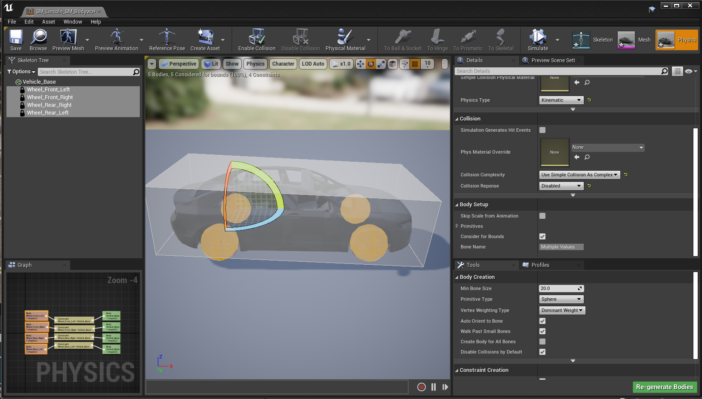

### Creating the animation

In the content browser directory where you have your new vehicle asset, right click and choose `Animation > Animation Blueprint`. In the popup that opens, search for `VehicleAnimInstance` in the `Parent Class` section and for the `Target Skeleton` search for the skeleton corresponding to your new vehicle, you should be able to see the name in your content browser. After selecting these two things press OK. This will create a new animation blueprint for your vehicle.

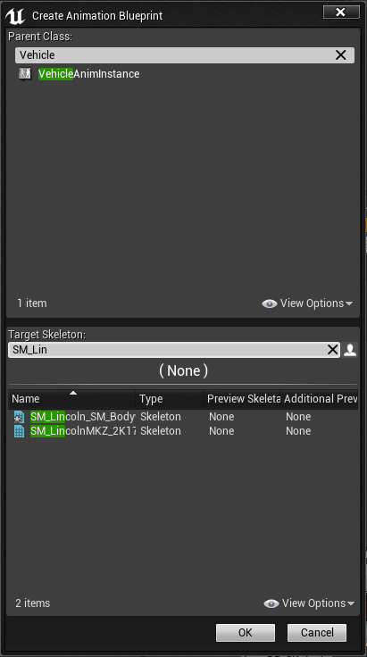

To simplify things, we can copy the animation from another vehicle. In a second content browser, open `Content > Carla > Static > Vehicles > 4Wheeled` and choose any vehicle. Open the animation blueprint of your chosen vehicle and then copy all nodes that are not the `Output pose` node from this into your new animation blueprint. Connect the nodes by dragging a new connection between the final node to the output node. Press compile and the animation blueprint is now set.


### Creating the blueprint

Navigate with your content browser into `Content > Carla > Blueprints > Vehicles > LincolnMKZ2017` or a similar vehicle. In here you will find a set of blueprints set up for the 4 wheels. Copy these into the directory containing your own vehicle and rename them to ensure you can distinguish them later. You can set up your own custom wheels if you prefer, please refer to the later [__wheels section__](#wheels)

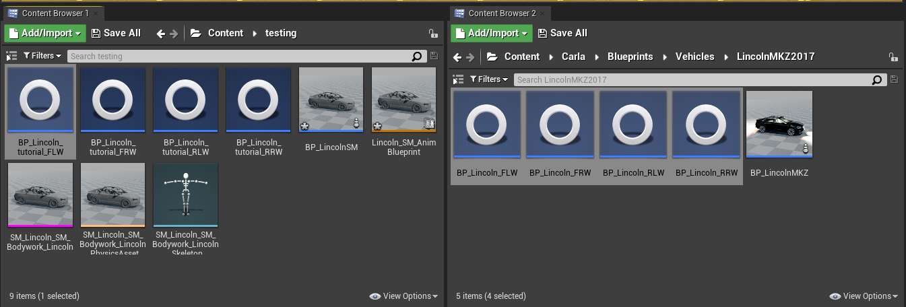

Right click in the content browser directory where your new vehicle assets are and chose `Blueprint Class`. search in the `All Classes` menu for `BaseVehiclePawn` and choose this class. Name the blueprint and open it. Select `Mesh` in the `Components` tab on the left and then drag the vehicle mesh into the Mesh section on the right hand side.

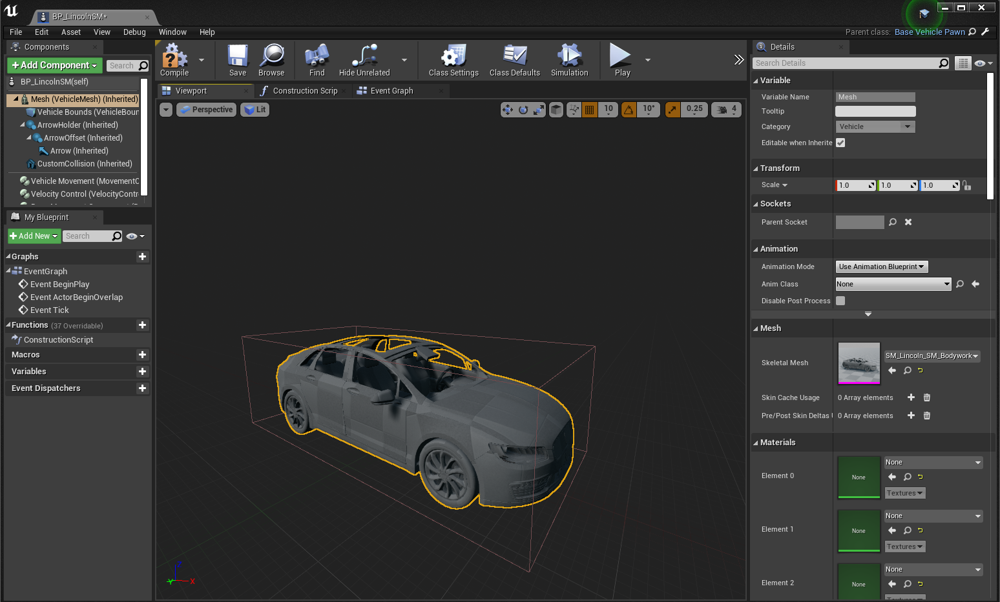

In `Anim Class` search for the animation corresponding to your new vehicle that you set up in the previous step.

Next, select `Vehicle Movement` in the `Components` menu of the blueprint class and in the right `Details` menu navigate to the `Vehicle Setup` section. Now for each wheel, find the relevant wheel blueprint that you previously copied and renamed for the `Wheel Class` attribute. Do the same for each wheel. Compile and save.


Now navigate to `Content > Carla > Blueprints > Vehicles > VehicleFactory` and double click this to open the Vehicle Factory.

Select the `Vehicles` node and expand the `Vehicles` item in the `Default value` section on the right hand side.

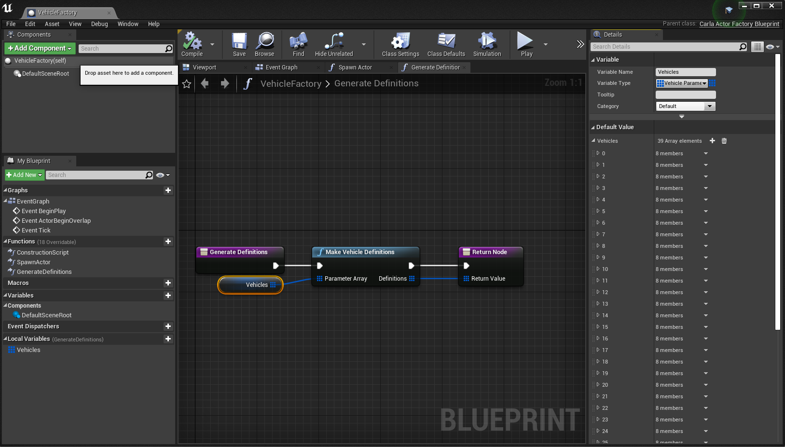

Press the plus icon to add your new vehicle. Scroll down to the last entry and expand it, it should be empty. Name the make and model of your vehicle and under the class section find your blueprint class that you created in the previous section. Leave the number of wheels as 4 and put the generation as 2. Compile and save. Do a global save for safety and you are now..ready to run your vehicle in a simulation. 

Press play in the unreal toolbar to run the simulation. Once it is running, open a terminal and run the `manual_control.py` script with the filter option to specify your new vehicle model:

```sh
python manual_control.py --filter my_vehicle_make
```


As it is, the vehicle currently has no textures or colors applied. The next step is to apply materials to give your vehicle a finish like a real road vehicle.

## Materials

Once you have your vehicle imported as a basic asset with the mesh and blueprints laid out, you now want to add materials to your vehicle to facilitate photorealistic rendering in the Unreal Engine, for maximum fidelity in your machine learning training data.

The Unreal Editor boasts a comprehensive materials workflow that facilitates the creation of highly realistic materials. This does, however, add a significant degree of complexity to the process. For this reason, CARLA is provided with a large library of material prototypes for you to use without having to start from scratch. 

### Applying a material to your vehicle

CARLA provides a prototype material for replicating the glossy finish of vehicles that can mimic numerous different types of vehicle paint jobs and features. Open Unreal editor and in the content browser, locate the material in `Content > Carla > Static > GenericMaterials > 00_MastersOpt`. The basic material is called `M_CarPaint_Master`. Right click on this material and choose `Create Material Instance` from the context material. Name it and move it into the folder where your new vehicle content is stored.

In the Unreal Editor, move the spectator to a point near the floor and drag the skeletal mesh of the vehicle from the content browser into the scene, the body of your vehicle will now appear there. 


Now, in the details panel on the right hand side, drag your new material instance into the `Element 0` position of the `Materials` section. You will see the bodywork take on a new grey, glossy material property.


Double click on the material in the content browser and we can start editing the parameters. There are a numerous parameters here that alter various properties that are important to mimic real world car paint jobs. The most important parameters are the following:

#### __Color__

The color settings govern the overall color of the car. The base color is simply the primary color of the car this will govern the overall color:


#### __Clear coat__ 

The clear coat settings govern the appearance of the finish and how it reacts to light. The roughness uses a texture to apply imperfections to the vehicle surface, scattering light more with higher values to create a matte look. Subtle adjustments and low values are recommended for a realistic look. Generally, car paint jobs are smooth and reflective, however, this effect might be used more generously to model specialist matte finishes of custom paint jobs.


An important parameter to govern the "shininess" or "glossiness" of your car is the `Clear Coat Intensity`. High values close to 1 will make the coat shiny and glossy.

#### __Orange peel__ 

Finishes on real cars (particularly on mass produced cars for the general market) tend to have imperfections that appear as slight ripples in the paint. The orange peel effect mimics this and makes cars look more realistic.


#### __Flakes__

Some cars have paint jobs that include flakes of other material, such as metals or ceramics, to give the car a `metallic` or `pearlescant` appearance, adding extra glints and reflections that react in an attractive way to light. The flakes parameters allows CARLA to mimic this. To mimic metallic finishes, it would be 


#### __Dust__

Cars often accumulate grease and dust on the body that adds additional texture to the paint, affecting the way it reflects the light. The dust parameters allow you to add patches of disruption to the coat to mimic foreign materials sticking to the paint. 


## Glass

Creating realistic glass in CARLA requires some tricks to capture the real refractive and reflective behavior of glass used in motor vehicles. The CARLA garage vehicles have 4 layers of meshes for the glass, with 2 different materials. The layers are separated by a few millimeters and there are separate materials for the interior and exterior facing glass layers to ensure that the glass looks realistic from both inside and outside the vehicle.

There are 2 layers of glass for the appearance of the vehicle from outside and 2 layers for the appearance of glass from the interior of the vehicle. What makes glass look like glass is the reflections coming from both surfaces of the glass that makes a very subtle doubling of the reflection.

### Glass meshes

Here we see the glass parts attached to the main bodywork (not the doors or other moving parts) of the Lincoln.

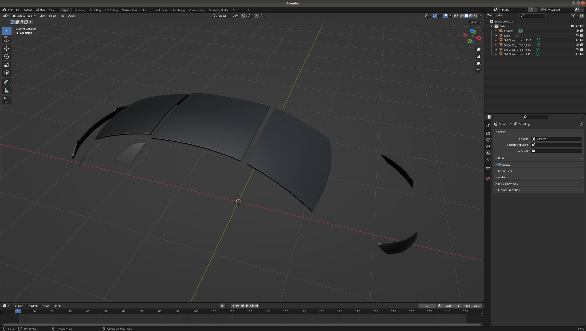

If we separate the constituent mesh parts, we can see that the glass profile is separated into 4 different layers. 

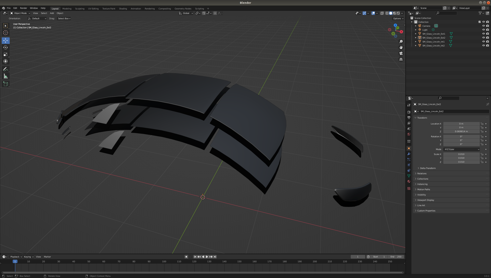

The 4 layers are separated into 2 groups, the exterior layers, with normals facing out of the vehicle and the interior layers, with mesh normals facing into the vehicle interior. The following diagram demonstrates 

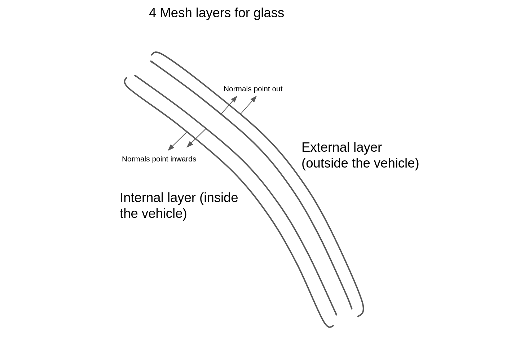

Once you have created your mesh layers, import them in the content browser into the Unreal Editor in the folder where you have stored your vehicle. 

Shift select the 4 glass layers and drag them into the map so you can see them.


### Glass material

Double click the external layer of the glass, then navigate in a second content browser window to `Content > Carla > Static > Vehicles > GeneralMaterials` and find the `Glass` material. Drag the glass material to the material slot of the mesh item. Repeat this process for each layer of the glass.

The glass will now be transparent, but with reflectivity that reflects nearby objects and light sources. You should also check the interior glass, ensure there is a proper glass effect there.


### Single layer glass

For a quicker way to produce the glass parts of vehicles, the only critical part is the outermost glass layer. You can apply the glass material to this in Unreal Editor and get a result that might be suitable to your needs, however, views from inside the vehicle (i.e. if you instantiate a camera on the dashboard or behind the steering wheel) will seem to have no glass (no refraction or reflection). We recommend the above process to produce maximally realistic glass.

Now you have created the blueprint, added meshes, completed rigging, created materials for the paint finish and the glass, you should have a very realistic looking vehicle.

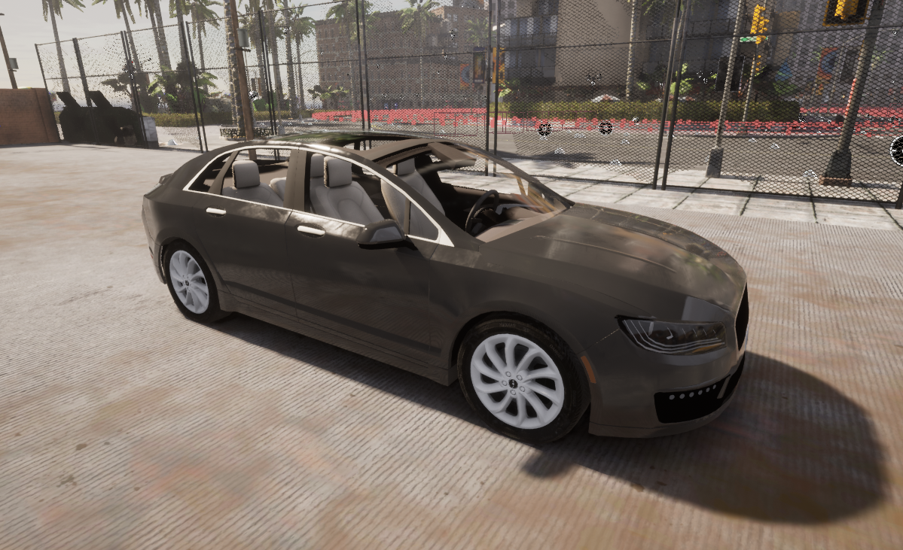

## Wheels

If you copied the wheels when you were [creating the blueprint](#creating-the-blueprint), this might suit your purposes if your vehicle is very similar to vehicles that are already in the CARLA library. However, if your vehicle has non-standard wheel dimensions or grip characteristics, you should follow this section to set up your wheel blueprints to best match the physical characteristics of your vehicle's wheels.

For the wheels of CARLA vehicles, we need to set up a blueprint class for each wheel to deal with the mechanics and collision properties. You will set up 4 blueprint classes, we recommend the following prefixes or suffixes to identify the wheels:

- __RRW__ - **R**ear **R**ight **W**heel
- __RLW__ - **R**ear **L**eft **W**heel
- __FRW__ - **F**ront **R**ight **W**heel
- __FLW__ - **F**ront **L**eft **W**heel

### Wheel blueprint

Inside the folder where you have your new vehicle, right click and choose to create a new blueprint class. Search for 

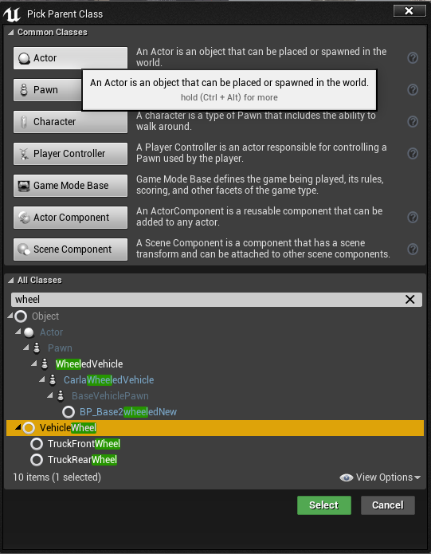

Double click on the blueprint to adjust it:


### Collision mesh

Firstly, the default cylinder used for the collision mesh has a high polygon count, so we should replace this with a low polygon version. In the content browser locate the `CollisionWheel` mesh inside `Content > Carla > Blueprints > Vehicles`. Drag it onto the 
`Collision Mesh` slot in the details panel of the blueprint. This will improve performance without any noticable deficit to physics simulation.

### Tire configuration

Next, we  set the tire configuration. Inside `Content > Carla > Blueprints > Vehicles` locate the `CommonTireConfig` configuration and drag it onto the `Tire Config` section of the blueprint. If you double click on the Tire Config in the blueprint, you can adjust the Friction Scale, you can modify the behavior of the vehicle's road handling. By default it is set at 3.5, a value suitable for most vehicle use cases. However, if you wish to model for example a racing vehicle with slick tires, this would be the appropriate parameter to adjust. 

### Wheel dimensions

Next, in your 3D application, measure the diameter of your wheel. In Blender, the dimensions can be viewed in the properties panel opened by pressing `n` in object mode.

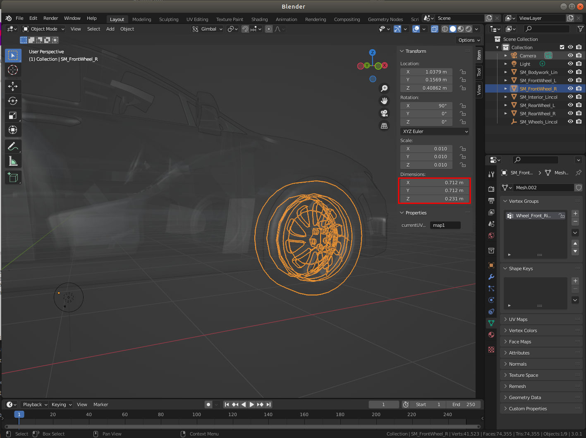

Now plug these numbers into the `Wheel` section of the blueprint.Take care to remember to half the diameter for the radius and also that Unreal Editor works in units of centimeters. For the wheel mass, we recommend looking for specifications on the internet, find the right tire model or a similar one to estimate the correct mass (in kilograms).

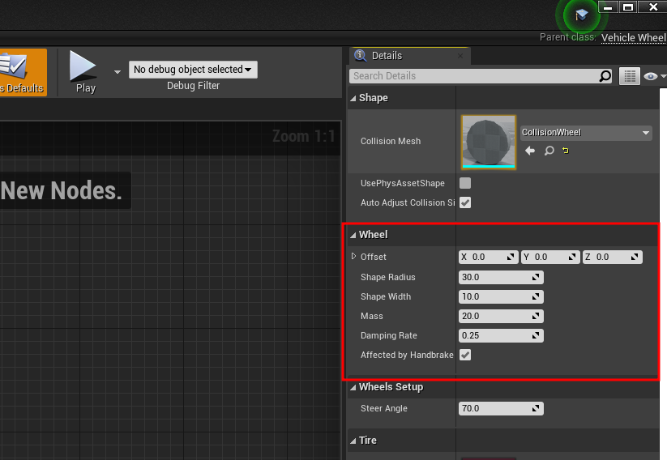


`Affected by handbrake` should be checked for both rear wheels. 

`Steer angle` should be set to the maximum intended steer angle for both front wheels and set to zero for both rear wheels.

### __Suspension characteristics__

The default values here provide a reasonable starting point. View [__this guide__](tuto_D_customize_vehicle_suspension.md) to set suspension characteristics appropriate to your vehicle type. 


## Lights

The last element to complete a realistic vehicle for CARLA is the lights, headlights, brake lights, blinkers etc. In your 3D modelling application, you should model some shapes that resemble the lights of the vehicle you are replicating. This would be flat discs or flat cuboid structures for most headlights. Some vehicles may also have strips of LEDs. 

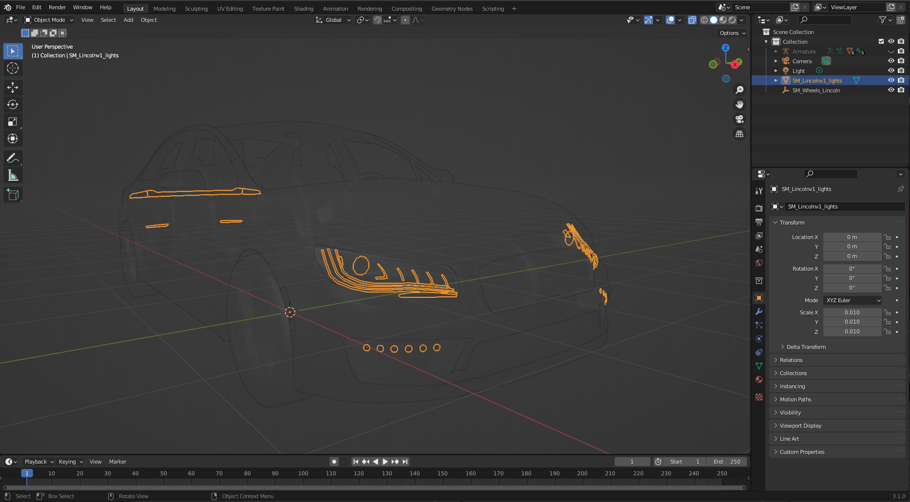

### UV map

The different types of lights (headlights, blinkers, brake lights, etc.) are distinguished using a texture. You need to create a UV map in your 3D modelling application and position the lights to match up with the relevant region of the texture. 

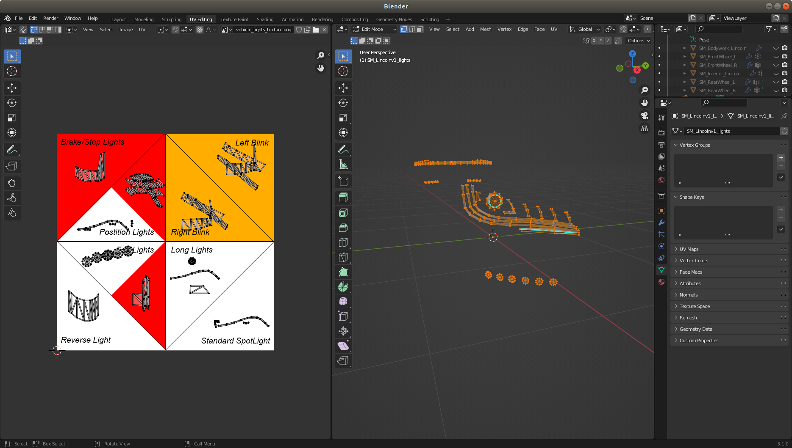

### Importing

Import the light mesh into the Unreal Editor- After importing the light mesh:

- Drag the mesh item(s) into the **_Mesh (VehicleMesh) (Inherited)_** hierarchy in the **_Components_** panel.
- Select the extra meshes in the hierarchy and search for `Collision` in the **_Details_** panel.
- Set **_Collision Presets_** to `NoCollision`.
- Select any lights meshes in the hierarchy. Search for `Tag` in the **_Details_** panel and add the tag `emissive`.