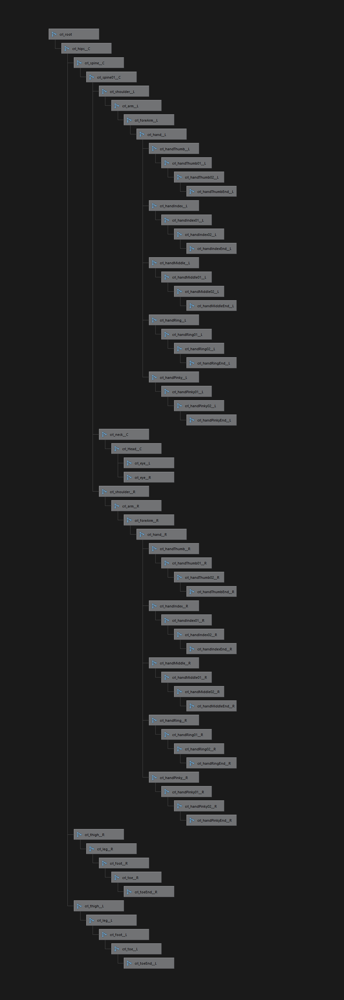

<h1>Walker Bone Control</h1>

In this tutorial we describe how to manually control and animate the
skeletons of walkers from the CARLA Python API. The reference of
all classes and methods available can be found at
[Python API reference](python_api.md).

!!! note
    **This document assumes the user is familiar with the Python API**. <br>
    The user should read the Python API tutorial before reading this document.
    [Python API tutorial](python_api_tutorial.md).


### Walker skeleton structure
All walkers have the same skeleton hierarchy and bone names. Below is an image of the skeleton
hierarchy.




### How to manually control a walker's bones

Following is a detailed step-by-step example of how to change the bone transforms of a walker
from the CARLA Python API

#### Connecting to the simulator

Import neccessary libraries used in this example

```py
import carla
import random
```

Initialize the carla client

```py
client = carla.Client('127.0.0.1', 2000)
client.set_timeout(2.0)
```

#### Spawning a walker
Spawn a random walker at one of the map's spawn points

```py
world = client.get_world()
blueprint = random.choice(self.world.get_blueprint_library().filter('walker.*'))
spawn_points = world.get_map().get_spawn_points()
spawn_point = random.choice(spawn_points) if spawn_points else carla.Transform()
world.try_spawn_actor(blueprint, spawn_point)
```

#### Controlling a walker's skeleton

A walker's skeleton can be modified by passing an instance of the WalkerBoneControl class
to the walker's apply_control function. The WalkerBoneControl class contains the transforms
of the bones to be modified. Its bone_transforms member is a list of tuples of value pairs
where the first value is the bone name and the second value is the bone transform. The
apply_control function can be called on every tick to animate a walker's skeleton. The
location and rotation of each transform is relative to its parent. Therefore when a
parent bone's transform is modified, the transforms of the child bones in model space
will also be changed relatively.

In the example below, the rotations of the walker's hands are set to be 90 degrees around
the forward axis and the locations are set to the origin.

```py
control = carla.WalkerBoneControl()
first_tuple = ('crl_hand__R', carla.Transform(rotation=carla.Rotation(roll=90)))
second_tuple = ('crl_hand__L', carla.Transform(rotation=carla.Rotation(roll=90)))
control.bone_transforms = [first_tuple, second_tuple]
world.player.apply_control(control)
```


