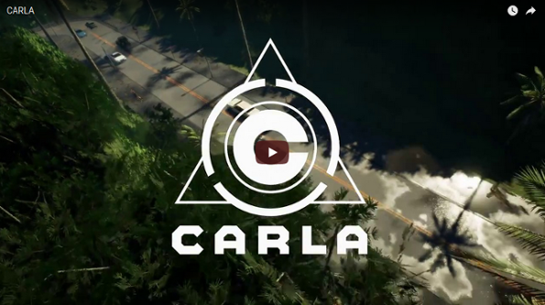

CARLA Simulator
===============

[](https://travis-ci.org/carla-simulator/carla)
[](http://carla.readthedocs.io)

[](http://carla.org)
[](https://github.com/carla-simulator/carla/blob/master/Docs/download.md)
[](http://carla.readthedocs.io)
[](https://forum.carla.org)
[](https://discord.gg/8kqACuC)

CARLA is an open-source simulator for autonomous driving research. CARLA has
been developed from the ground up to support development, training, and
validation of autonomous driving systems. In addition to open-source code
and protocols, CARLA provides open digital assets (urban layouts, buildings,
vehicles) that were created for this purpose and can be used freely. The
simulation platform supports flexible specification of sensor suites and
environmental conditions.

[](https://www.youtube.com/watch?v=TOojcifcRBA)

If you want to benchmark your model in the same conditions as in our CoRL’17
paper, check out
[Benchmarking](https://github.com/carla-simulator/driving-benchmarks).

[**Get CARLA overnight build**](http://carla-releases.s3.amazonaws.com/Linux/Dev/CARLA_Latest.tar.gz)

## CARLA Ecosystem
Repositories associated to the CARLA simulation platform:

* [**Scenario_Runner**](https://github.com/carla-simulator/scenario_runner): Engine to execute traffic scenarios in CARLA 0.9.X
* [**ROS-bridge**](https://github.com/carla-simulator/ros-bridge): Interface to connect CARLA 0.9.X to ROS
* [**Driving-benchmarks**](https://github.com/carla-simulator/driving-benchmarks): Benchmark tools for Autonomous Driving tasks
* [**Conditional Imitation-Learning**](https://github.com/felipecode/coiltraine): Training and testing Conditional Imitation Learning models in CARLA
* [**AutoWare AV stack**](https://github.com/carla-simulator/carla-autoware): Bridge to connect AutoWare AV stack to CARLA
* [**Reinforcement-Learning**](https://github.com/carla-simulator/reinforcement-learning): Code for running Conditional Reinforcement Learning models in CARLA
* [**Map Editor**](https://github.com/carla-simulator/carla-map-editor): Standalone GUI application to enhance RoadRunner maps with traffic lights and traffic signs information

**Like what you see? Star us on GitHub to support the project!**

Paper
-----

If you use CARLA, please cite our CoRL’17 paper.

_CARLA: An Open Urban Driving Simulator_<br>Alexey Dosovitskiy, German Ros,
Felipe Codevilla, Antonio Lopez, Vladlen Koltun; PMLR 78:1-16
[[PDF](http://proceedings.mlr.press/v78/dosovitskiy17a/dosovitskiy17a.pdf)]
[[talk](https://www.youtube.com/watch?v=xfyK03MEZ9Q&feature=youtu.be&t=2h44m30s)]


```
@inproceedings{Dosovitskiy17,
  title = {{CARLA}: {An} Open Urban Driving Simulator},
  author = {Alexey Dosovitskiy and German Ros and Felipe Codevilla and Antonio Lopez and Vladlen Koltun},
  booktitle = {Proceedings of the 1st Annual Conference on Robot Learning},
  pages = {1--16},
  year = {2017}
}
```

Building CARLA
--------------

Use `git clone` or download the project from this page. Note that the master
branch contains the latest fixes and features, for the latest stable code may be
best to switch to the `stable` branch.

Then follow the instruction at [How to build on Linux][buildlinuxlink] or
[How to build on Windows][buildwindowslink].

Unfortunately we don't have official instructions to build on Mac yet, please
check the progress at [issue #150][issue150].

[buildlinuxlink]: http://carla.readthedocs.io/en/latest/how_to_build_on_linux
[buildwindowslink]: http://carla.readthedocs.io/en/latest/how_to_build_on_windows
[issue150]: https://github.com/carla-simulator/carla/issues/150

Contributing
------------

Please take a look at our [Contribution guidelines][contriblink].

[contriblink]: http://carla.readthedocs.io/en/latest/CONTRIBUTING

F.A.Q.
------

If you run into problems, check our
[FAQ](http://carla.readthedocs.io/en/latest/faq/).

License
-------

CARLA specific code is distributed under MIT License.

CARLA specific assets are distributed under CC-BY License.

The ad-rss-lib library compiled and linked by the [RSS Integration build variant](Docs/rss_lib_integration.md) introduces LGPL-2.1-only License.

Note that UE4 itself follows its own license terms.
