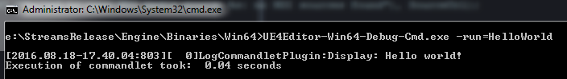

# CommandletPlugin

Unreal Engine 4 plug-in that that demonstrates how to implement a commandlet.

## Supported Platforms

This plug-in was last built against **Unreal Engine 4.19**. It works on all
platforms.

## Dependencies

This plug-in requires Visual Studio and either a C++ code project or the full
Unreal Engine 4 source code from GitHub. If you are new to programming in UE4,
please see the official [Programming Guide](https://docs.unrealengine.com/latest/INT/Programming/index.html)! 

## Usage

You can use this plug-in as a project plug-in, or an Engine plug-in.

If you use it as a project plug-in, clone this repository into your project's
*/Plugins* directory and compile your game in Visual Studio. A C++ code project
is required for this to work.

If you use it as an Engine plug-in, clone this repository into the
*/Engine/Plugins/Media* directory and compile your game. Full Unreal Engine 4
source code from GitHub is required for this.

After compiling the plug-in, you have to **enable it** in Unreal Editor's
plug-in browser.

Use the *-run* command line parameter to run one of the commandlets in this
plug-in, i.e. *YourGame.exe -run=HelloWorld*

## Support

Please [file an issue](https://github.com/ue4plugins/CommandletPlugin/issues),
submit a [pull request](https://github.com/ue4plugins/CommandletPlugin/pulls?q=is%3Aopen+is%3Apr)
or email us at info@headcrash.industries

## References

* [Introduction to UE4 Plugins](https://wiki.unrealengine.com/An_Introduction_to_UE4_Plugins)
