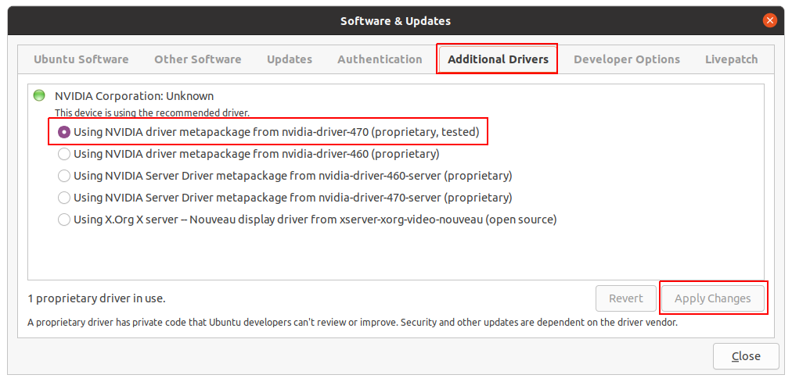

# Dockerized CARLA Build

## About
This tutorial shows how to build the CARLA simulator with Docker.

## Prerequisites

### Machine Setup and Requirements

| Requirement | Description |
| ----------- | ----------- |
| Free Disk Space: | ~ 200-300 GB (yes, it's no joke) |
| Available RAM:   | 16 GB (clang runs out of memory with only 8 GB) |
| CPU:             | as many cores as possible, you'll need them |
| Suggested OS:    | Ubuntu 18.04 (because of Python 3.6) |

### Unreal Engine GitHub Access
1) Register as Unreal developer to access the Unreal Engine GitHub repositories, see this [official EPIC tutorial](https://www.unrealengine.com/en-US/ue-on-github)
2) Create a GitHub personal access token for login (pull the Unreal Engine repo),
see [official GitHub docs](https://docs.github.com/en/authentication/keeping-your-account-and-data-secure/creating-a-personal-access-token)

### OS Setup
Install the latest updates.

```sh
sudo apt-get update && sudo apt-get upgrade -y
reboot
```

### Install Docker with NVIDIA GPU Support

1) Choose a **proprietary** NVIDIA driver (don't waste time with the open source one!!!)



2) Execute following commands to install Docker with GPU support

```sh
# install cURL, Docker and Docker-Compose
sudo apt-get update && sudo apt-get install -y curl docker.io docker-compose

# register the NVIDIA Docker PPA as apt source
distribution=$(. /etc/os-release;echo $ID$VERSION_ID) \
    && curl -s -L https://nvidia.github.io/nvidia-docker/gpgkey | sudo apt-key add - \
    && curl -s -L https://nvidia.github.io/nvidia-docker/$distribution/nvidia-docker.list \
        | sudo tee /etc/apt/sources.list.d/nvidia-docker.list

# install NVIDIA Docker from the official NVIDIA PPA
sudo apt-get update && sudo apt-get install -y nvidia-docker2

# disable the swap partition. be smart, don't kill your disk :)
sudo sed -i '/ swap / s/^\(.*\)$/#\1/g' /etc/fstab && sudo mount -a

# allow non-root users to work with Docker (requires a reboot)
sudo usermod -aG docker $USER && reboot
```

## Build Steps
This section shows how to build the CARLA repository with Docker.

### Clone the CARLA Source Code

```sh
CARLA_REPO=https://github.com/carla-simulator/carla
CARLA_BRANCH=master

git clone $CARLA_REPO --depth=1 -b $CARLA_BRANCH
cd carla
```

### Docker Image Build
Run following commands to build the CARLA simulator.
The build will take several hours, even on powerful machines.

```sh
GITHUB_USERNAME=....
GITHUB_ACCESS_TOKEN=....

docker build -t carla-prerequisites \
    --build-arg EPIC_USER=$GITHUB_USERNAME \
    --build-arg EPIC_PASS=$GITHUB_ACCESS_TOKEN \
    -f Util/Docker/Prerequisites.Dockerfile .

docker build -t carla:latest -f Util/Docker/Carla.Dockerfile .
```

Check if the carla:latest image exists (should be an image of ~ 16GB size)

```sh
docker image ls | grep 'carla'
```

## Example Usage

### Launch Simulator
Now that the build completed, you can launch the CARLA simulator
as headless, GPU-empowered backend service.

```sh
docker run --privileged --gpus all \
    --net=host -e 2000-2002 \
    -v /tmp/.X11-unix:/tmp/.X11-unix:rw \
    --name carla_sim carla:latest
```

### Spawn + Remote-Control a Vehicle via PythonAPI

Copy the PythonAPI from the simulator instance onto the host machine.

```sh
mkdir temp
docker cp carla_sim:/home/carla/PythonAPI ./temp/
cd temp
```

Register the _carla_ package in the _PYTHONPATH_ and make sure it can be imported.

```sh
export PYTHONPATH=$PWD/PythonAPI/carla:$PWD/PythonAPI/carla/dist/carla-0.9.13-py3.6-linux-x86_64.egg

python3 -c 'import carla'
if [ $? -eq 0 ]; then echo 'carla import successful!'; fi
```

Install _pygame_ to remote-control a vehicle via _PythonAPI/examples/manual_control.py_.

```sh
sudo apt-get update && sudo apt-get install -y python3-pip
python3 -m pip install pip --upgrade
python3 -m pip install numpy pygame
```

List all available vehicles.

```py
import carla

client = carla.Client('localhost', 2000)
world = client.get_world()

vehicle_blueprints = world.get_blueprint_library().filter('*vehicle*')
print('all vehicles:', vehicle_blueprints)
```

Spawn a new vehicle and control it via the keyboard.

```sh
python3 PythonAPI/examples/manual_control.py [--filter <vehicle_to_spawn>]
```

### Shut Down Simulator

```sh
docker stop carla_sim'
```

## Other Useful Commands
Delete all dangling images and containers to free up your disk again.

```sh
docker container prune
docker image prune
```
