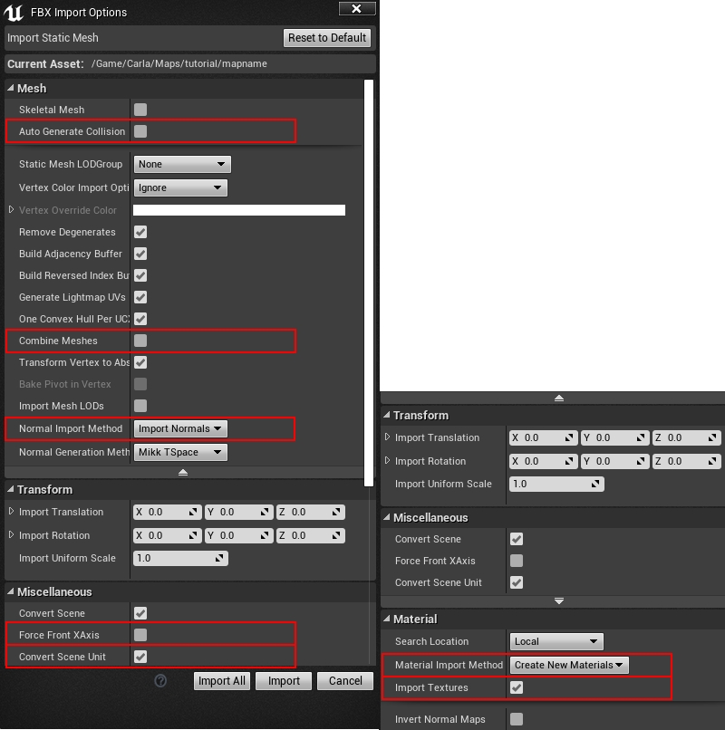
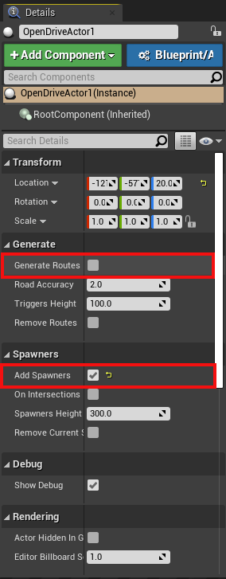

# Alternative methods to import maps

This guide describes alternative methods to import maps into CARLA. These methods involve more manual steps than the processes described in the [package](tuto_M_add_map_package.md) and [source](tuto_M_add_map_source.md) import guides. First we will describe the RoadRuner plugin and then the manual import method.

- [__RoadRunner plugin import__](#roadrunner-plugin-import)
- [__Manual import__](#manual-import)

---

## RoadRunner plugin import

The RoadRunner software from MathWorks provides plugins for Unreal Engine to help ease the import process of maps into CARLA. 

#### Plugin installation

__1.__ The plugins are available for download from the [MathWorks website](https://www.mathworks.com/help/roadrunner/ug/Downloading-Plugins.html). MathWorks also has a [full tutorial](https://www.mathworks.com/help/roadrunner/ug/Exporting-to-CARLA.html), similar to this one, on how to import maps to CARLA using the plugins.

__2.__ Extract the contents of the downloaded folder and move the folders `RoadRunnerImporter`, `RoadRunnerCarlaIntegration` and `RoadRunnerMaterials` to `<carla>/Unreal/CarlaUE4/Plugins/`.

__3.__ Rebuild the plugin following the instructions below:  

*   __On Windows.__  
	* Right-click the `.uproject` file in `<carla>/Unreal/CarlaUE4` and select `Generate Visual Studio project files`.  
	* In the root folder of CARLA, run the command:

```sh
make launch
```

*   __On Linux.__  
	* Run the following command:  
```sh
UE4_ROOT/GenerateProjectFiles.sh -project="carla/Unreal/CarlaUE4/CarlaUE4.uproject" -game -engine
```

__4.__ In the Unreal Engine window, make sure the checkbox is selected for both plugins `Edit > Plugins`. 


### Import map

__1.__ Import the `<mapName>.fbx` file to a new folder under `/Content/Carla/Maps` with the `Import` button.  


__2.__ Set `Scene > Hierarchy Type` to _Create One Blueprint Asset_ (selected by default).  
__3.__ Set `Static Meshes > Normal Import Method` to _Import Normals_.  


__4.__ Click `Import`.  
__5.__ Save the current level `File` -> `Save Current As...` -> `<mapname>`.  

The new map should now appear next to the others in the Unreal Engine _Content Browser_.


</details>

!!! Note
    The tags for semantic segmentation will be assigned according to the name of the asset. The asset will be moved to the corresponding folder in `Content/Carla/PackageName/Static`. To change these, move them manually after importing. 

---

## Manual import 

This method of importing maps can be used with generic `.fbx` and `.xodr` files. If you are using RoadRunner, you should use the export method `Firebox (.fbx)`, `OpenDRIVE (.xodr)` or `Unreal (.fbx + .xml)`. Do not use the `Carla Exporter` option because you will run into compatibility issues with the `.fbx` file. 

To import a map manually to Unreal Engine:

__1.__ In your system's file explorer, copy the `.xodr` file to `<carla-root>/Unreal/CarlaUE4/Content/Carla/Maps/OpenDrive`.

__2.__ Open the Unreal Engine editor by running `make launch` in the carla root directory. In the _Content Browser_ of the editor, navigate to `Content/Carla/Maps/BaseMap` and duplicate the `BaseMap`. This will provide a blank map with the default sky and lighting objects.

>>

__3.__ Create a new folder with the name of your map package in the `Content/Carla/Maps` directory and save the duplicated map there with the same name as your `.fbx` and `.xodr` files.

__4.__ In the _Content Browser_ of the Unreal Engine editor, navigate back to `Content/Carla/Maps`. Right click in the grey area and select `Import to /Game/Carla/Maps...` under the heading _Import Asset_.

>>

__5.__ In the configuration window that pops up, make sure:

>- These options are unchecked:
    *   Auto Generate Collision  
    *   Combine Meshes  
    *   Force Front xAxis
- In the following drop downs, the corresponding options are selected:
    *   Normal Import Method - _Import Normals_  
    *   Material Import Method - _Create New Materials_
- These options are checked:
    *   Convert Scene Unit
    *   Import Textures

>>

__6.__ Click `Import`.

__7.__ The meshes will appear in the _Content Browser_. Select the meshes and drag them into the scene.

>>

__8.__ Center the meshes at 0,0,0.

>>

__9.__ In the _Content Browser_, select all the meshes that need to have colliders. This refers to any meshes that will interact with pedestrians or vehicles. The colliders prevent them from falling into the abyss. Right-click the selected meshes and select `Asset Actions > Bulk Edit via Property Matrix...`.

>>

__10.__ Search for _collision_ in the search box.

__11.__ Change `Collision Complexity` from `Project Default` to `Use Complex Collision As Simple` and close the window.

>>

__12.__ Confirm the collision setting has been applied correctly by pressing `Alt + c`. You will see a black web over the meshes.

__13.__ To create the ground truth for the semantic segmentation sensor, move the static meshes to the corresponding `Carla/Static/<segment>` folder following the structure below:

        Content
        └── Carla
            ├── Blueprints
            ├── Config
            ├── Exported Maps
            ├── HDMaps
            ├── Maps
            └── Static
                ├── Terrain
                │   └── mapname
                │       └── Static Meshes
                │
                ├── Road
                │   └── mapname
                │       └── Static Meshes
                │
                ├── RoadLines  
                |   └── mapname
                |       └── Static Meshes
                └── Sidewalks  
                    └── mapname
                        └── Static Meshes

__14.__ In the _Modes_ panel, search for the __Open Drive Actor__ and drag it into the scene.

>>

__15.__ In the _Details_ panel, check `Add Spawners` and then click on the box beside `Generate Routes`. This will find the `.xodr` file with the same map name in the `<carla-root>/Unreal/CarlaUE4/Content/Carla/Maps/OpenDrive` directory and use it to generate a series of _RoutePlanner_ and _VehicleSpawnPoint_ actors.

>>

---

## Next steps

You will now be able to open your map in the Unreal Editor and run simulations. From here, you will be able to customize the map and generate the pedestrian navigation data. We recommend generating the pedestrian navigation after all customization has finished, so there is no chance of obstacles blocking the pedestrian paths.

CARLA provides several tools and guides to help with the customization of your maps:

- [Implement sub-levels in your map.](tuto_M_custom_layers.md)
- [Add and configure traffic lights and signs.](tuto_M_custom_add_tl.md)
- [Add buildings with the procedural building tool.](tuto_M_custom_buildings.md)
- [Customize the road with the road painter tool.](tuto_M_custom_road_painter.md)
- [Customize the weather](tuto_M_custom_weather_landscape.md#weather-customization)
- [Customize the landscape with serial meshes.](tuto_M_custom_weather_landscape.md#add-serial-meshes)

Once you have finished with the customization, you can [generate the pedestrian navigation information](tuto_M_generate_pedestrian_navigation.md).

---

It is recommended to use the automated processes for importing maps detailed in the guides for [CARLA packages](tuto_M_add_map_package.md) and [CARLA source build](tuto_M_add_map_source.md), however the methods listed in this section can be used if required. If you encounter any issues with the alternative methods, feel free to post in the [forum](https://github.com/carla-simulator/carla/discussions).
